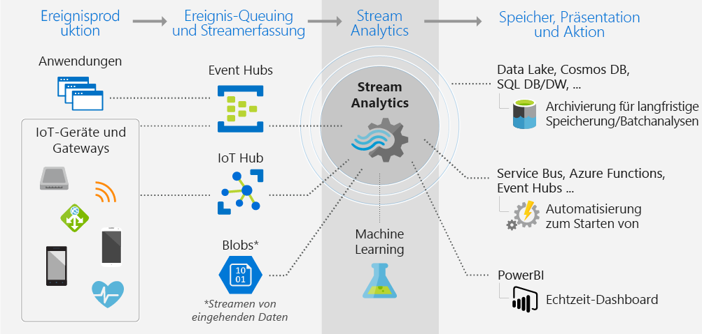
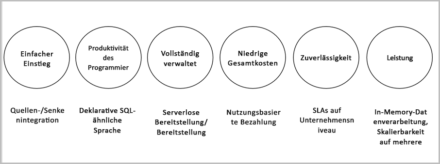

# Was ist Azure Stream Analytics?

Azure Stream Analytics ist ein Ereignisverarbeitungsmodul, mit dem Sie große Datenmengen untersuchen können, die von Geräten gestreamt werden. Eingehende Daten können von Geräten, Sensoren, Websites, Feeds sozialer Medien, Anwendungen und anderen Quellen stammen. Außerdem werden das Extrahieren der Informationen aus Datenströmen, das Identifizieren von Mustern sowie Beziehungen unterstützt. Sie können diese Muster dann verwenden, um für den weiteren Verlauf andere Aktionen auszulösen, z.B. das Erstellen von Warnungen, Senden von Informationen per Feed an ein Berichterstellungstool oder Speichern der Daten zur späteren Verwendung.

Unten sind einige Beispiele für die Verwendungsmöglichkeiten von Azure Stream Analytics angegeben: 

* Sensorfusion für das Internet der Dinge (Internet of Things, IoT) und Echtzeitanalysen für die Gerätetelemetrie
* Analyse von Webprotokollen/Clickstreams
* Geoanalysen für das Flottenmanagement und fahrerlose Fahrzeuge
* Remoteüberwachung und Predictive Maintenance für Objekte mit hohem Wert
* Echtzeitanalysen von POS-Daten (Point of Sale) für die Bestandskontrolle und Anomalieerkennung

## Funktionsweise von Stream Analytics

Bei Azure Stream Analytics wird mit einer Quelle mit Streamingdaten begonnen, die in einem Azure Event Hub oder Azure IoT Hub oder aus einem Datenspeicher wie Azure Blob Storage erfasst werden. Zum Untersuchen der Datenströme erstellen Sie einen Stream Analytics-Auftrag, der die Eingabequelle für das Streamen von Daten angibt. Im Auftrag ist auch eine Transformationsabfrage angegeben, mit der definiert wird, wie nach Daten, Mustern oder Beziehungen gesucht werden soll. Für die Transformationsabfrage wird SQL-Abfragesprache verwendet, damit Streamingdaten für einen bestimmten Zeitraum leicht gefiltert, sortiert, aggregiert und eingebunden werden können. Beim Ausführen des Auftrags können Sie die Optionen für die Ereignissortierung und beim Durchführen von Aggregationsvorgängen die Dauer der Zeitfenster anpassen.

Nach der Analyse der eingehenden Daten geben Sie eine Ausgabe für die transformierten Daten an und können steuern, was als Reaktion auf die analysierten Informationen erfolgen soll. Beispielsweise können Sie folgende Aktionen durchführen:

* Senden von Daten an eine überwachte Warteschlange, um nachgeschaltete Warnungen oder benutzerdefinierte Workflows auszulösen
* Senden von Daten an das Power BI-Dashboard für die Echtzeitvisualisierung
* Speichern von Daten unter anderen Azure-Speicherdiensten, damit Sie ein Machine Learning-Modell basierend auf Verlaufsdaten trainieren oder Batchanalysen durchführen können

In der folgenden Abbildung ist die Stream Analytics-Pipeline dargestellt. Sie können für Ihren Stream Analytics-Auftrag alle oder nur bestimmte Ein- und Ausgaben verwenden. In dieser Abbildung ist zu sehen, wie Daten an Stream Analytics gesendet, analysiert und zur Durchführung von anderen Aktionen, z.B. Speicherung oder Darstellung, weitergeleitet werden:

## Wichtige Funktionen und Vorteile

Azure Stream Analytics ist benutzerfreundlich, flexibel, zuverlässig und auf jede Auftragsgröße skalierbar. Dieses Modul steht übergreifend für mehrere Azure-Regionen zur Verfügung. In der folgenden Abbildung sind die wichtigsten Funktionen von Azure Stream Analytics dargestellt:

## Einfacher Einstieg

Der Einstieg in Azure Stream Analytics ist einfach. Es sind nur wenige Klicks erforderlich, um eine Verbindung mit mehreren Quellen oder Senken herzustellen und eine End-to-End-Pipeline zu erstellen. Stream Analytics kann eine Verbindung mit [Azure Event Hubs](https://docs.microsoft.com/azure/event-hubs/) und [Azure IoT Hub](https://docs.microsoft.com/azure/iot-hub/) herstellen, um Streamingdaten zu erfassen. Außerdem kann eine Verbindung mit dem Dienst [Azure Blob Storage](https://docs.microsoft.com/azure/storage/storage-introduction) hergestellt werden, um Verlaufsdaten zu erfassen. Daten von Event Hubs können mit anderen Datenquellen und Verarbeitungsmodulen kombiniert werden. Die Auftragseingabe kann auch Referenzdaten enthalten, bei denen es sich um statische oder sich langsam ändernde Daten handelt, und Sie können Streamingdaten mit diesen Referenzdaten verknüpfen, um Nachschlagevorgänge durchzuführen.

Stream Analytics kann Auftragsausgaben an viele Speichersysteme leiten, z.B. [Azure-Blobs](https://docs.microsoft.com/azure/storage/storage-introduction), [Azure SQL-Datenbank](https://docs.microsoft.com/azure/sql-database/), [Azure Data Lake Stores](https://docs.microsoft.com/azure/data-lake-store/) oder [Azure Cosmos DB](https://docs.microsoft.com/azure/cosmos-db/introduction). Nach dem Speichern können Sie die Batchanalyse mit Azure HDInsight ausführen oder die Ausgabe an einen anderen Dienst senden, z.B. an Event Hubs zur Nutzung oder an [Power BI](https://docs.microsoft.com/power-bi/) zur Durchführung von Echtzeitvisualisierungen per Power BI-Streaming-API.

## Produktivität der Programmierer

Für Azure Stream Analytics wird eine einfache SQL-basierte Abfragesprache verwendet, die mit leistungsstarken temporalen Einschränkungen versehen wurde, um Daten während der Übertragung zu analysieren. Zum Definieren von Auftragstransformationen verwenden Sie eine einfache, deklarative [Stream Analytics-Abfragesprache](https://msdn.microsoft.com/library/azure/dn834998.aspx), mit der Sie komplexe temporale Abfragen und Analysen mithilfe von einfachen SQL-Konstrukten erstellen können. Die Stream Analytics-Abfragesprache basiert auf der SQL-Sprache, sodass Sie mit dem Erstellen von Aufträgen beginnen können, wenn Sie mit der SQL-Sprache vertraut sind. Sie können Aufträge auch erstellen, indem Sie Entwicklertools wie Azure PowerShell, [Stream Analytics Visual Studio-Tools](stream-analytics-tools-for-visual-studio-install.md) oder Azure Resource Manager-Vorlagen verwenden. Die Nutzung von Entwicklertools ermöglicht Ihnen die Offlineentwicklung von Transformationsabfragen und die Verwendung der [CI/CD-Pipeline](stream-analytics-tools-for-visual-studio-cicd.md) zum Übermitteln von Aufträgen an Azure. 

Die Stream Analytics-Abfragesprache verfügt über viele verschiedene Funktionen zum Analysieren und Verarbeiten der Streamingdaten. Diese Abfragesprache unterstützt die einfache Datenbearbeitung und Aggregationsfunktionen für komplexe geografische Funktionen. Sie können Abfragen im Portal bearbeiten und anhand von Stichprobendaten testen, die aus dem Livestream extrahiert werden.

Sie können die Funktionen der Abfragesprache erweitern, indem Sie zusätzliche Funktionen definieren und aufrufen. Sie können Funktionsaufrufe im Azure Machine Learning-Dienst definieren, um Azure Machine Learning-Lösungen zu nutzen, und benutzerdefinierte JavaScript-Funktionen oder benutzerdefinierte Aggregate integrieren, um im Rahmen einer Stream Analytics-Abfrage komplexe Berechnungen durchzuführen.

## Vollständige Verwaltung 

Azure Stream Analytics ist ein vollständig verwaltetes serverloses Angebot (PaaS) in Azure. Dies bedeutet, dass Sie zum Ausführen Ihrer Aufträge keine Hardware bereitstellen und keine Cluster verwalten müssen. Azure Stream Analytics übernimmt die gesamte Verwaltung Ihres Auftrags, indem komplexe Computecluster in der Cloud eingerichtet werden und die erforderliche Leistungsoptimierung für die Ausführung des Auftrags durchgeführt wird. Die Integration von Azure Event Hubs und Azure IoT Hub macht es für Aufträge möglich, Millionen von Ereignissen pro Sekunde zu erfassen, die von verbundenen Geräten, aus Klickstreams, aus Protokolldateien usw. stammen. Indem Sie die Partitionierungsfunktion von Event Hubs verwenden, können Sie Berechnungen in logische Schritte partitionieren, die bei Bedarf jeweils weiter partitioniert werden können, um die Skalierbarkeit zu erhöhen.

## Ausführung in der Cloud oder im Intelligent Edge-Bereich

Für umfangreiche Analysen kann Azure Stream Analytics in der Cloud ausgeführt werden, und für Analysen mit sehr niedriger Latenz ist die Ausführung im Intelligent Edge-Bereich möglich.
Für Azure Stream Analytics wird für die Cloud und den Intelligent Edge-Bereich die gleiche Abfragesprache genutzt, sodass Entwickler echte Hybridarchitekturen für die Datenstromverarbeitung erstellen können.

## Niedrige Gesamtbetriebskosten

Stream Analytics ist ein kostenoptimierter Clouddienst. Es fallen keine Anfangskosten an. Sie zahlen nur für die [verbrauchten Streamingeinheiten](stream-analytics-streaming-unit-consumption.md) und die verarbeitete Datenmenge. Es sind keine verpflichtenden Maßnahmen oder Clusterbereitstellungen erforderlich. Sie können Ihre Streamingaufträge je nach Ihren geschäftlichen Anforderungen vertikal hoch- oder herunterskalieren. 

## Geeignet für unternehmenskritische Workloads
Azure Stream Analytics ist in mehreren Regionen auf der ganzen Welt verfügbar und dank seiner Zuverlässigkeit, Sicherheit und Compliance für die Ausführung unternehmenskritischer Workloads geeignet.
### Zuverlässigkeit
Für Azure Stream Analytics wird die Exactly-Once-Ereignisverarbeitung (genau einmal) und die At-Least-Once-Zustellung (mindestens einmal) von Ereignissen garantiert, sodass Ereignisse niemals verloren gehen. Die Exacty-Once-Verarbeitung wird mit ausgewählter Ausgabe garantiert, wie unter [Event Delivery Guarantees (Azure Stream Analytics)](https://docs.microsoft.com/en-us/stream-analytics-query/event-delivery-guarantees-azure-stream-analytics) (Garantien zur Ereignisbereitstellung (Azure Stream Analytics)) beschrieben. Azure Stream Analytics verfügt über integrierte Wiederherstellungsfunktionen für den Fall, dass für ein Ereignis ein Fehler auftritt. Darüber hinaus verfügt Stream Analytics über eine integrierte Prüfpunktausführung, um den korrekten Zustand Ihres Auftrags sicherzustellen, und Sie erhalten wiederholbare Ergebnisse.

Als verwalteter Dienst wird für Stream Analytics eine Ereignisverarbeitung mit einer Verfügbarkeit von 99,9 Prozent (minutengenau) garantiert. Weitere Informationen finden Sie auf der Seite [SLA für Stream Analytics](https://azure.microsoft.com/support/legal/sla/stream-analytics/v1_0/). 

### Sicherheit
Azure Stream Analytics verschlüsselt jegliche ein- und ausgehende Kommunikation und unterstützt TLS 1.2. Integrierte Prüfpunkte werden ebenfalls verschlüsselt. Die eingehenden Daten werden von Stream Analytics nicht gespeichert, da die gesamte Verarbeitung im Arbeitsspeicher stattfindet. 

### Compliance
Azure Stream Analytics erfüllt die Anforderungen mehrerer Compliancezertifizierungen, wie in der [Übersicht über die Azure-Compliance](https://gallery.technet.microsoft.com/Overview-of-Azure-c1be3942) beschrieben. 

## Leistung

Stream Analytics kann pro Sekunde Millionen von Ereignissen verarbeiten und Ergebnisse mit kurzer Wartezeit liefern.
Sie können vertikal und horizontal hochskalieren, um große Echtzeitanwendungen und komplexe Anwendungen für die Ereignisverarbeitung zu nutzen. Stream Analytics unterstützt die Leistung durch eine Partitionierung, damit komplexe Abfragen parallelisiert und auf mehreren Streamingknoten ausgeführt werden können.
Azure Stream Analytics basiert auf [Trill](https://github.com/Microsoft/Trill), einem Hochleistungsanalysemodul für In-Memory-Streaming, das in Zusammenarbeit mit der Forschungsabteilung von Microsoft entwickelt wurde. 

## Nächste Schritte

Sie haben einen Überblick über Azure Stream Analytics erhalten. Nun können Sie tiefer einsteigen und Ihren ersten Stream Analytics-Auftrag erstellen:

* [Erstellen eines Stream Analytics-Auftrags mithilfe des Azure-Portals](stream-analytics-quick-create-portal.md)
* [Erstellen eines Stream Analytics-Auftrags mithilfe von Azure PowerShell](stream-analytics-quick-create-powershell.md)
* [Erstellen eines Stream Analytics-Auftrags mithilfe von Visual Studio](stream-analytics-quick-create-vs.md)

