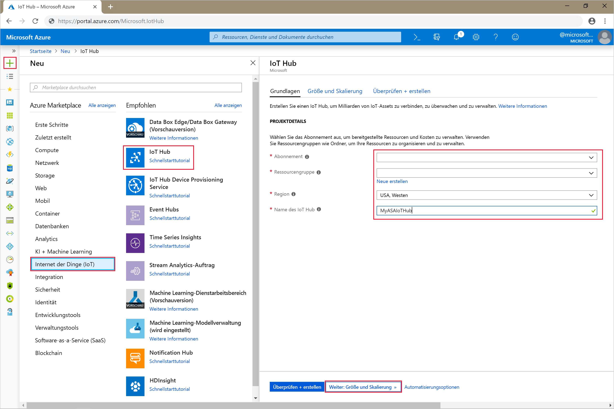
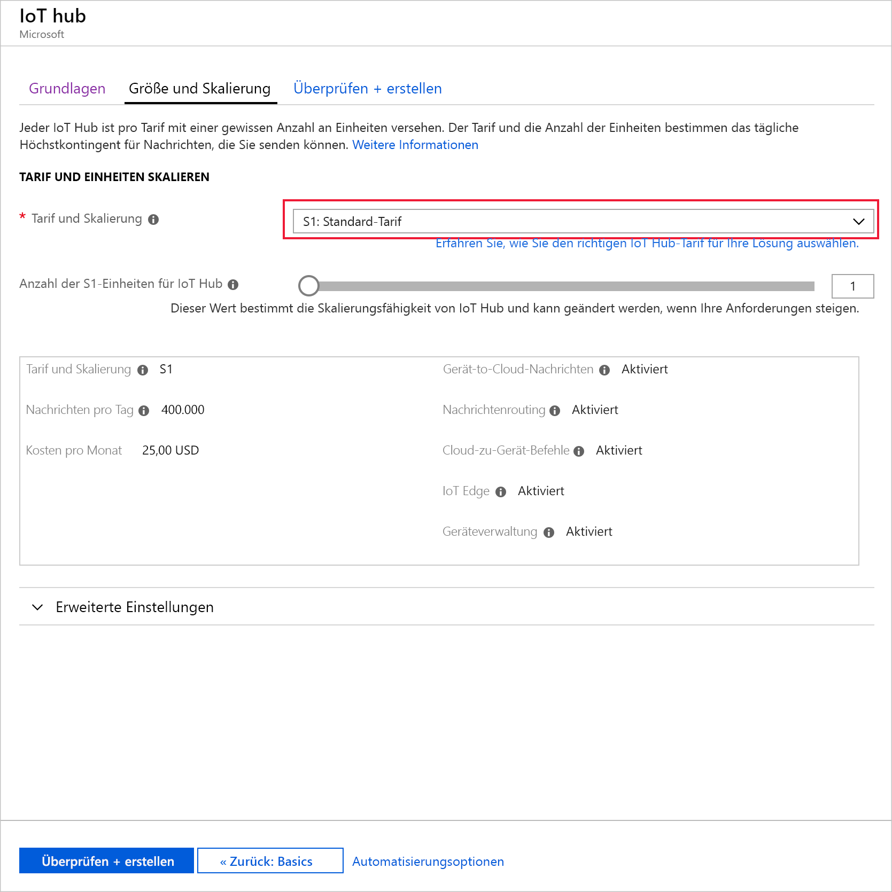
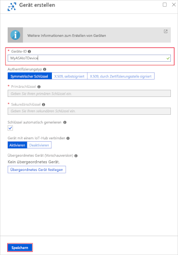
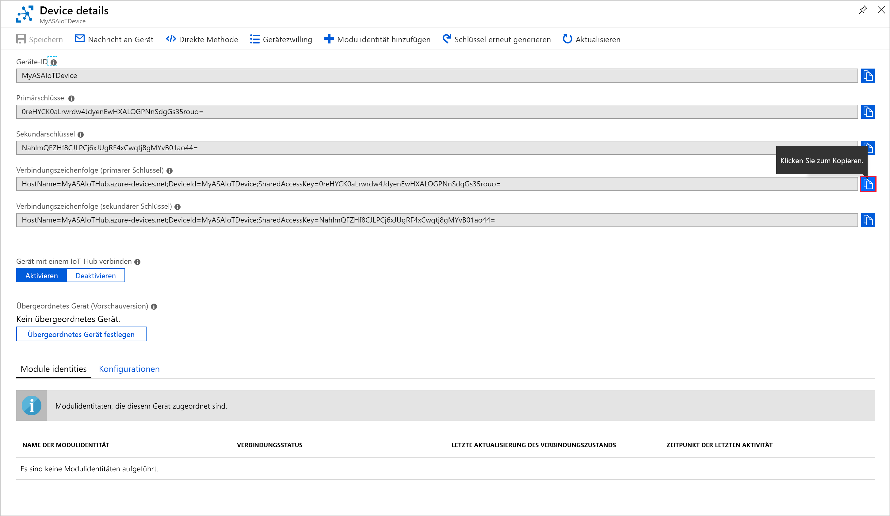
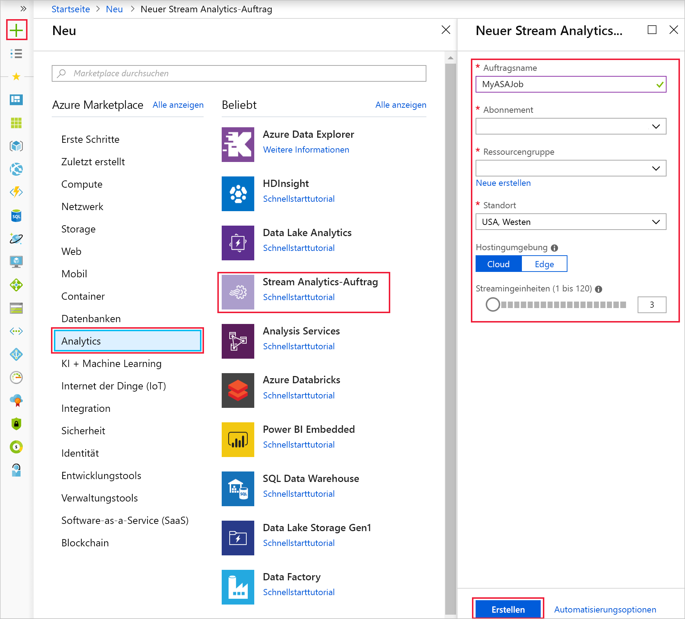
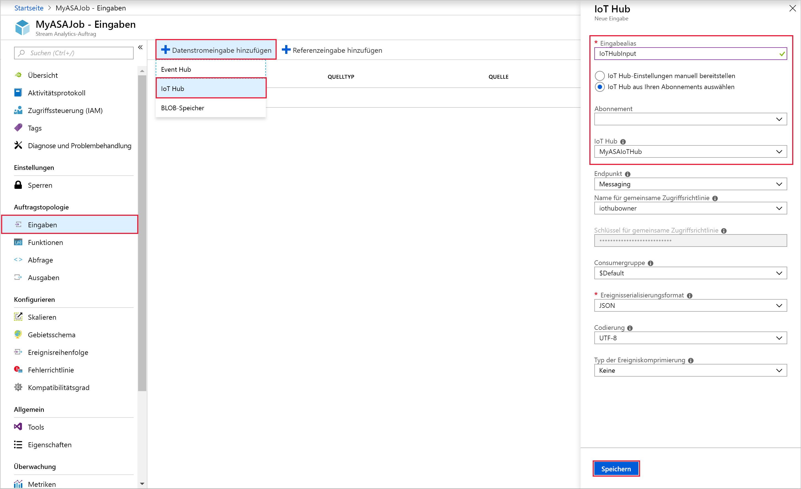
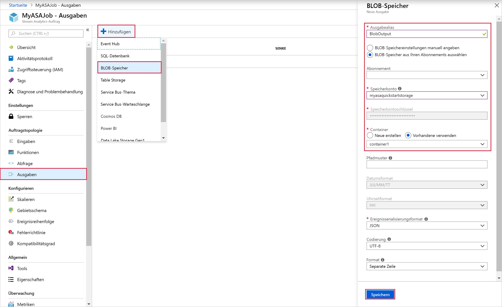
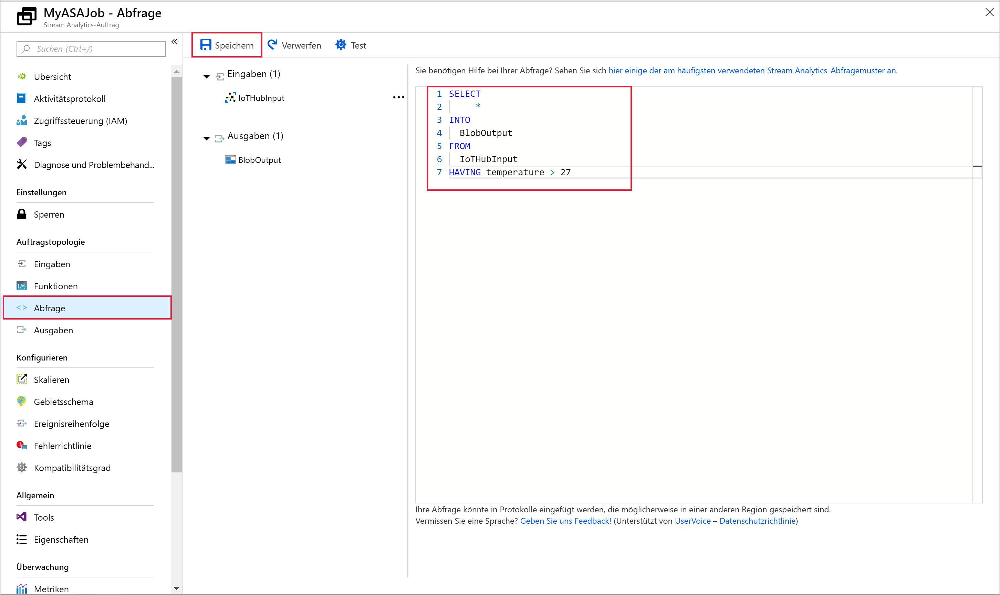
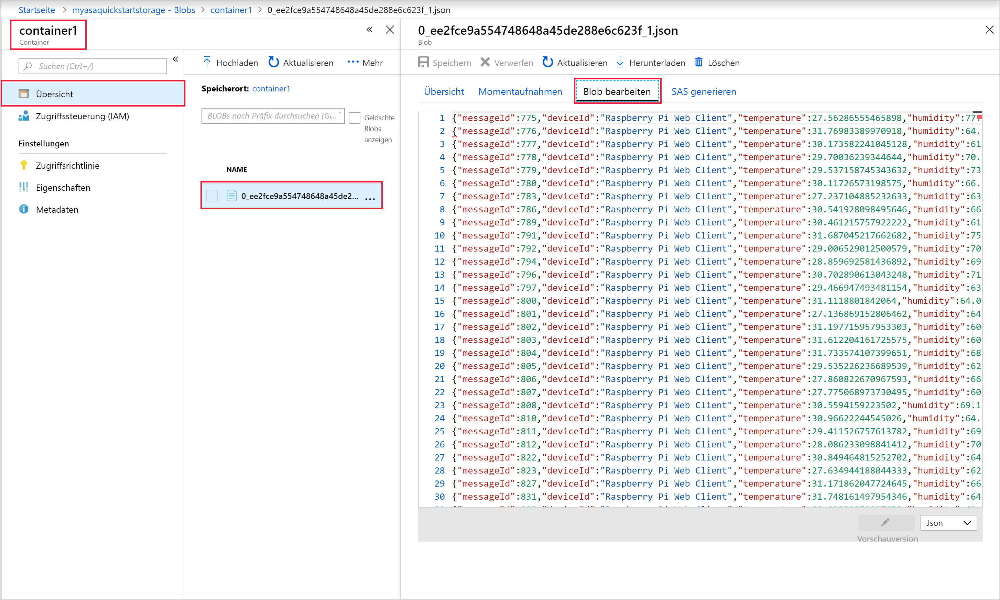

# <a name="quickstart-create-a-stream-analytics-job-by-using-the-azure-portal"></a>Schnellstart: Erstellen eines Stream Analytics-Auftrags mithilfe des Azure-Portals

Dieser Schnellstart veranschaulicht die ersten Schritte beim Erstellen eines Stream Analytics-Auftrags. In dieser Schnellstartanleitung definieren Sie einen Stream Analytics-Auftrag, der Echtzeit-Streamingdaten liest und Nachrichten filtert, bei denen die Temperatur über 27 liegt. Ihr Stream Analytics-Auftrag liest Daten von einem IoT Hub-Gerät, transformiert die Daten und schreibt sie zurück in einen Container im Blobspeicher. Die in dieser Schnellstartanleitung verwendeten Eingabedaten werden von einem Raspberry Pi-Onlinesimulator generiert. 

## <a name="before-you-begin"></a>Voraussetzungen

* Wenn Sie kein Azure-Abonnement besitzen, können Sie ein [kostenloses Konto](https://azure.microsoft.com/free/) erstellen.

* Melden Sie sich beim [Azure-Portal](https://portal.azure.com/) an.

## <a name="prepare-the-input-data"></a>Vorbereiten der Eingabedaten

Vor dem Definieren des Stream Analytics-Auftrags sollten Sie die Daten vorbereiten, die später als Auftragseingabe konfiguriert werden. Führen Sie die folgenden Schritte aus, um die für den Auftrag erforderlichen Eingabedaten vorzubereiten:

1. Melden Sie sich beim [Azure-Portal](https://portal.azure.com/) an.

2. Wählen Sie **Ressource erstellen** > **Internet der Dinge (IoT)** > **IoT Hub** aus.

3. Geben Sie im Bereich **IoT Hub** die folgenden Informationen ein:
   
   |**Einstellung**  |**Empfohlener Wert**  |**Beschreibung**  |
   |---------|---------|---------|
   |Abonnement  | \<Ihr Abonnement\> |  Wählen Sie das gewünschte Azure-Abonnement aus. |
   |Ressourcengruppe   |   asaquickstart-resourcegroup  |   Wählen Sie **Neu erstellen** aus, und geben Sie einen neuen Ressourcengruppennamen für Ihr Konto ein. |
   |Region  |  \<Die Region, die Ihren Benutzern am nächsten liegt\> | Wählen Sie einen geografischen Standort aus, an dem Sie Ihre IoT Hub-Instanz hosten können. Verwenden Sie den Standort, der Ihren Benutzern am nächsten ist. |
   |IoT Hub-Name  | MyASAIoTHub  |   Wählen Sie einen Namen für Ihre IoT Hub-Instanz aus.   |

   

4. Wählen Sie **Next: Set size and scale** (Nächster Schritt: Größe festlegen und skalieren) aus.

5. Wählen Sie eine Option für **Tarif und Skalierung** aus. Legen Sie für diese Schnellstartanleitung den Tarif **F1 – Free** fest, wenn er für Ihr Abonnement noch verfügbar ist. Weitere Informationen finden Sie unter [IoT Hub – Preise](https://azure.microsoft.com/pricing/details/iot-hub/).

   

6. Klicken Sie auf **Überprüfen + erstellen**. Überprüfen Sie die Informationen zu IoT Hub, und klicken Sie auf **Erstellen**. Die Erstellung der IoT Hub-Instanz kann mehrere Minuten dauern. Sie können den Fortschritt im Bereich **Benachrichtigungen** überwachen.

7. Klicken Sie in Ihrem IoT Hub-Navigationsmenü unter **IoT-Geräte** auf **Hinzufügen**. Fügen Sie eine **Geräte-ID** hinzu, und klicken Sie auf **Speichern**.

   

8. Öffnen Sie das Gerät nach der Erstellung in der Liste **IoT-Geräte**. Kopieren Sie **Verbindungszeichenfolge – Primärschlüssel** zur späteren Verwendung in einen Editor.

   

## <a name="create-blob-storage"></a>Erstellen eines Blobspeichers

1. Klicken Sie in der linken oberen Ecke des Azure-Portals auf **Ressource erstellen** > **Speicher** > **Speicherkonto**.

2. Geben Sie im Bereich **Speicherkonto erstellen** einen Speicherkontonamen, den Standort und die Ressourcengruppe ein. Wählen Sie den gleichen Standort und die gleiche Ressourcengruppe wie für die von Ihnen erstellte IoT Hub-Instanz. Klicken Sie dann zum Erstellen des Kontos auf **Überprüfen + erstellen**.

   

3. Wählen Sie nach der Erstellung des Speicherkontos im Bereich **Übersicht** die Kachel**Blobs** aus.

   

4. Wählen Sie auf der Seite **Blob-Dienst** die Option **Container** aus, und geben Sie einen Namen für Ihren Container (etwa *container1*) ein. Übernehmen Sie für **Öffentliche Zugriffsebene** die Option **Private (no anonymous access)** (Privat (kein anonymer Zugriff)), und wählen Sie **OK** aus.

   

## <a name="create-a-stream-analytics-job"></a>Erstellen eines Stream Analytics-Auftrags

1. Melden Sie sich beim Azure-Portal an.

2. Klicken Sie im Azure-Portal links oben auf **Ressource erstellen**.  

3. Klicken Sie in der Ergebnisliste auf **Daten + Analysen** > **Stream Analytics-Auftrag**.  

4. Geben Sie auf der Seite für den Stream Analytics-Auftrag die folgenden Informationen ein:

   |**Einstellung**  |**Empfohlener Wert**  |**Beschreibung**  |
   |---------|---------|---------|
   |Auftragsname   |  MyASAJob   |   Geben Sie einen Namen zur Identifizierung des Stream Analytics-Auftrags ein. Der Stream Analytics-Auftragsname darf nur alphanumerische Zeichen, Bindestriche und Unterstriche enthalten und muss zwischen 3 und 63 Zeichen lang sein. |
   |Abonnement  | \<Ihr Abonnement\> |  Wählen Sie das Azure-Abonnement aus, das Sie für diesen Auftrag verwenden möchten. |
   |Ressourcengruppe   |   asaquickstart-resourcegroup  |   Wählen Sie die gleiche Ressourcengruppe für Ihre IoT Hub-Instanz aus. |
   |Standort  |  \<Die Region, die Ihren Benutzern am nächsten liegt\> | Wählen Sie den geografischen Standort aus, in dem Sie Ihren Stream Analytics-Auftrag hosten können. Verwenden Sie den Standort, der Ihren Benutzern am nächsten liegt, um die Leistung zu steigern und die Datenübertragungskosten zu senken. |
   |Streamingeinheiten  | 1  |   Streamingeinheiten sind die Computingressourcen, die für die Ausführung eines Auftrags erforderlich sind. Standardmäßig ist dieser Wert auf 1 festgelegt. Informationen zum Skalieren von Streamingeinheiten finden Sie im Artikel [Überblick über Streamingeinheiten und Informationen zu Anpassungen](stream-analytics-streaming-unit-consumption.md).   |
   |Hosting-Umgebung  |  Cloud  |   Für Stream Analytics-Aufträge ist eine Cloud- oder Edge-Bereitstellung möglich. Die Aufträge können mit der Option „Cloud“ in Azure Cloud und mit der Option „Edge“ auf einem IoT Edge-Gerät bereitgestellt werden. |

   

5. Aktivieren Sie das Kontrollkästchen **An Dashboard anheften**, um den Auftrag auf Ihrem Dashboard zu platzieren, und klicken Sie dann auf **Erstellen**.  

6. Oben rechts im Browserfenster sollte die Benachrichtigung *Die Bereitstellung wird ausgeführt.* angezeigt werden. 

## <a name="configure-job-input"></a>Konfigurieren einer Auftragseingabe

In diesem Abschnitt konfigurieren Sie eine IoT Hub-Geräteeingabe für den Stream Analytics-Auftrag. Verwenden Sie die im vorherigen Abschnitt der Schnellstartanleitung erstellte IoT Hub-Instanz.

1. Navigieren Sie zum Stream Analytics-Auftrag.  

2. Klicken Sie auf **Eingaben** > **Datenstromeingabe hinzufügen** > **IoT Hub**.  

3. Fügen Sie auf der Seite **IoT Hub** die folgenden Werte ein:

   |**Einstellung**  |**Empfohlener Wert**  |**Beschreibung**  |
   |---------|---------|---------|
   |Eingabealias  |  IoTHubInput   |  Geben Sie einen Namen zur Identifizierung der Auftragseingabe ein.   |
   |Abonnement   |  \<Ihr Abonnement\> |  Wählen Sie das Azure-Abonnement mit dem von Ihnen erstellten Speicherkonto aus. Das Speicherkonto kann sich im gleichen oder in einem anderen Abonnement befinden. In diesem Beispiel wird davon ausgegangen, dass Sie ein Speicherkonto im gleichen Abonnement erstellt haben. |
   |IoT Hub  |  MyASAIoTHub |  Geben Sie den Namen der IoT Hub-Instanz ein, die Sie im vorherigen Abschnitt erstellt haben. |

4. Übernehmen Sie für die anderen Optionen die Standardwerte, und klicken Sie zum Speichern der Einstellungen auf **Speichern**.  

   
 
## <a name="configure-job-output"></a>Konfigurieren der Auftragsausgabe

1. Navigieren Sie zum zuvor erstellten Stream Analytics-Auftrag.  

2. Wählen Sie **Ausgaben** > **Hinzufügen** > **Blobspeicher** aus.  

3. Fügen Sie auf der Seite **Blobspeicher** die folgenden Werte ein:

   |**Einstellung**  |**Empfohlener Wert**  |**Beschreibung**  |
   |---------|---------|---------|
   |Ausgabealias |   BlobOutput   |   Geben Sie einen Namen zur Identifizierung der Auftragsausgabe ein. |
   |Abonnement  |  \<Ihr Abonnement\>  |  Wählen Sie das Azure-Abonnement mit dem von Ihnen erstellten Speicherkonto aus. Das Speicherkonto kann sich im gleichen oder in einem anderen Abonnement befinden. In diesem Beispiel wird davon ausgegangen, dass Sie ein Speicherkonto im gleichen Abonnement erstellt haben. |
   |Speicherkonto |  asaquickstartstorage |   Wählen Sie den Namen des Speicherkontos aus, oder geben Sie ihn ein. Speicherkontonamen werden automatisch erkannt, wenn sie im gleichen Abonnement erstellt werden.       |
   |Container |   container1  |  Wählen Sie den vorhandenen Container aus, den Sie in Ihrem Speicherkonto erstellt haben.   |

4. Übernehmen Sie für die anderen Optionen die Standardwerte, und klicken Sie zum Speichern der Einstellungen auf **Speichern**.  

   
 
## <a name="define-the-transformation-query"></a>Definieren der Transformationsabfrage

1. Navigieren Sie zum zuvor erstellten Stream Analytics-Auftrag.  

2. Klicken Sie auf **Abfrage**, und aktualisieren Sie die Abfrage wie folgt:  

   ```sql
   SELECT *
   INTO BlobOutput
   FROM IoTHubInput
   HAVING Temperature > 27
   ```

3. In diesem Beispiel liest die Abfrage die Daten aus IoT Hub und kopiert sie in eine neue Datei im Blob. Wählen Sie **Speichern**aus.  

   

## <a name="run-the-iot-simulator"></a>Ausführen des IoT-Simulators

1. Öffnen Sie den [Raspberry Pi-Azure IoT-Onlinesimulator](https://azure-samples.github.io/raspberry-pi-web-simulator/).

2. Ersetzen Sie den Platzhalter in Zeile 15 durch die zuvor gespeicherte Verbindungszeichenfolge für das Azure IoT Hub-Gerät.

3. Klicken Sie auf **Ausführen**. In der Ausgabe sollten nun die Sensordaten und -nachrichten angezeigt werden, die an Ihre IoT Hub-Instanz gesendet werden.

   

## <a name="start-the-stream-analytics-job-and-check-the-output"></a>Starten des Stream Analytics-Auftrags und Überprüfen der Ausgabe

1. Wechseln Sie zurück zur Seite mit der Auftragsübersicht, und klicken Sie auf **Starten**.

2. Wählen Sie unter **Auftrag starten** im Feld **Startzeit der Auftragsausgabe** die Option **Jetzt** aus. Wählen Sie dann **Starten**, um Ihren Auftrag zu starten.

3. Navigieren Sie nach einigen Minuten im Portal zu dem Speicherkonto und dem Container, die Sie als Ausgabe für den Auftrag konfiguriert haben. Sie sehen nun die Ausgabedatei im Container. Beim ersten Mal dauert es einige Minuten, bis der Auftrag gestartet wird. Nach dem Start wird er weiterhin ausgeführt, während die Daten eingehen.  

   

## <a name="clean-up-resources"></a>Bereinigen von Ressourcen

Löschen Sie die Ressourcengruppe, den Streamingauftrag und alle dazugehörigen Ressourcen, wenn Sie sie nicht mehr benötigen. Durch das Löschen des Auftrags verhindern Sie, dass Kosten für die vom Auftrag verbrauchten Streamingeinheiten anfallen. Wenn Sie den Auftrag in Zukunft verwenden möchten, können Sie ihn beenden und später bei Bedarf neu starten. Wenn Sie diesen Auftrag nicht weiter verwenden möchten, löschen Sie alle von diesem Schnellstart erstellten Ressourcen. Führen Sie dazu folgende Schritte aus:

1. Klicken Sie im Azure-Portal im Menü auf der linken Seite auf **Ressourcengruppen** und dann auf den Namen der erstellten Ressource.  

2. Klicken Sie auf der Seite mit Ihrer Ressourcengruppe auf **Löschen**, geben Sie im Textfeld den Namen der zu löschenden Ressource ein, und klicken Sie dann auf **Löschen**.

## <a name="next-steps"></a>Nächste Schritte

In dieser Schnellstartanleitung haben Sie einen einfachen Stream Analytics-Auftrag mit dem Azure-Portal bereitgestellt. Stream Analytics-Aufträge können auch mit [PowerShell](stream-analytics-quick-create-powershell.md) und [Visual Studio](stream-analytics-quick-create-vs.md) bereitgestellt werden.

Wenn Sie Informationen zum Konfigurieren anderer Eingabequellen sowie zum Ausführen der Echtzeiterkennung benötigen, lesen Sie den folgenden Artikel:

> [!div class="nextstepaction"]
> [Erste Schritte mit Azure Stream Analytics: Betrugserkennung in Echtzeit](stream-analytics-real-time-fraud-detection.md)

