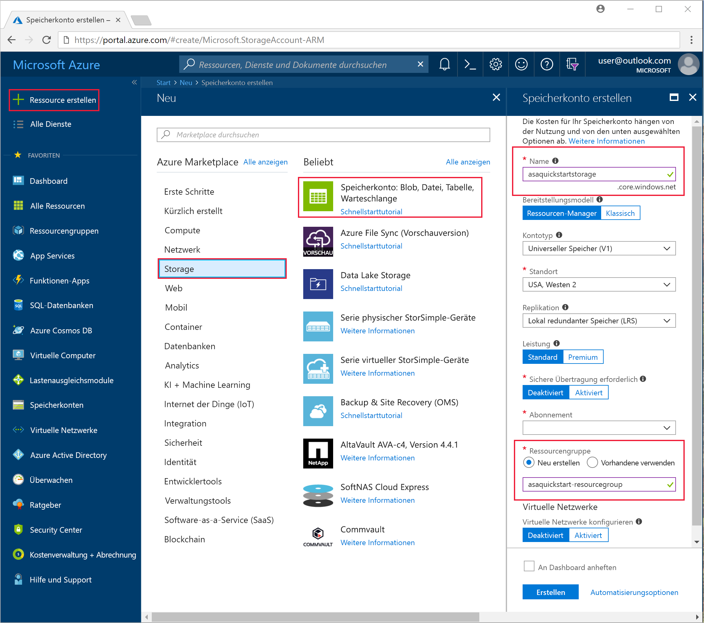
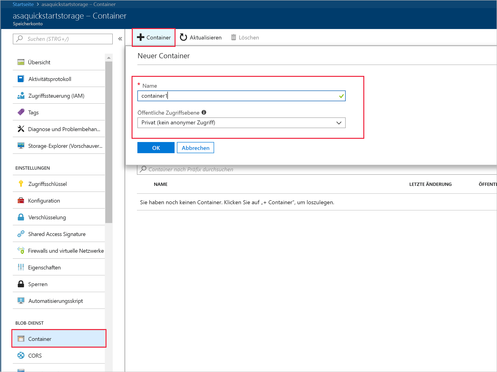
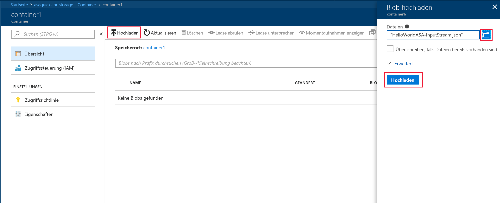
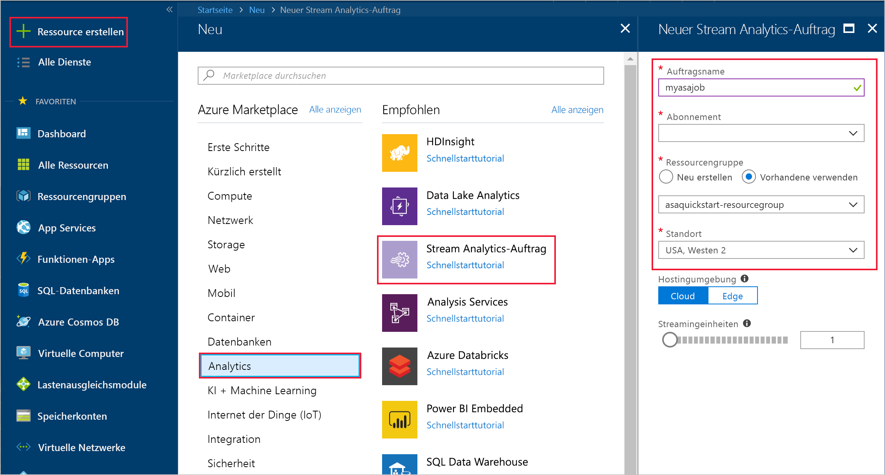
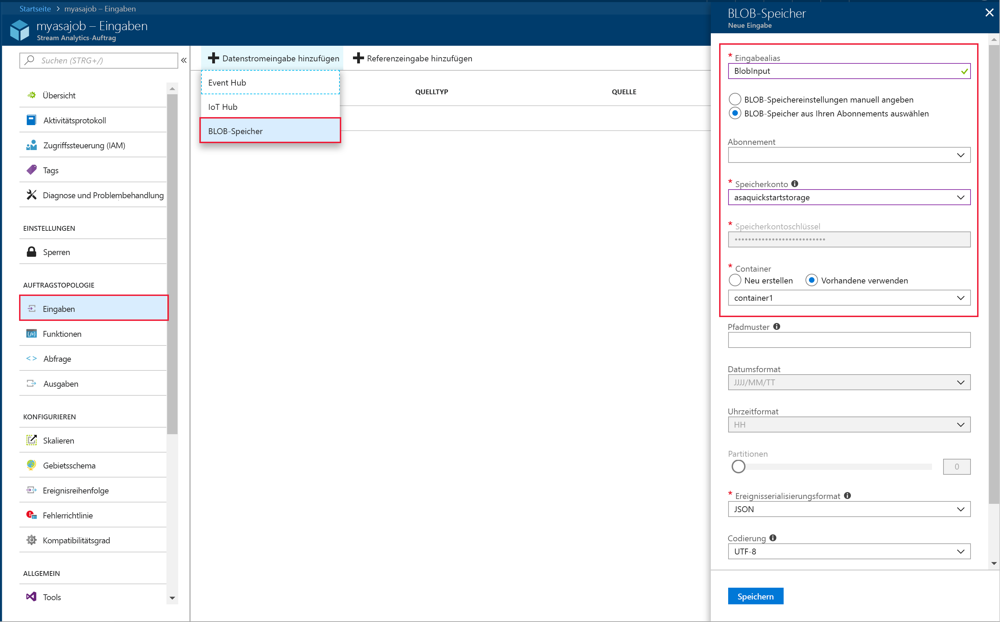
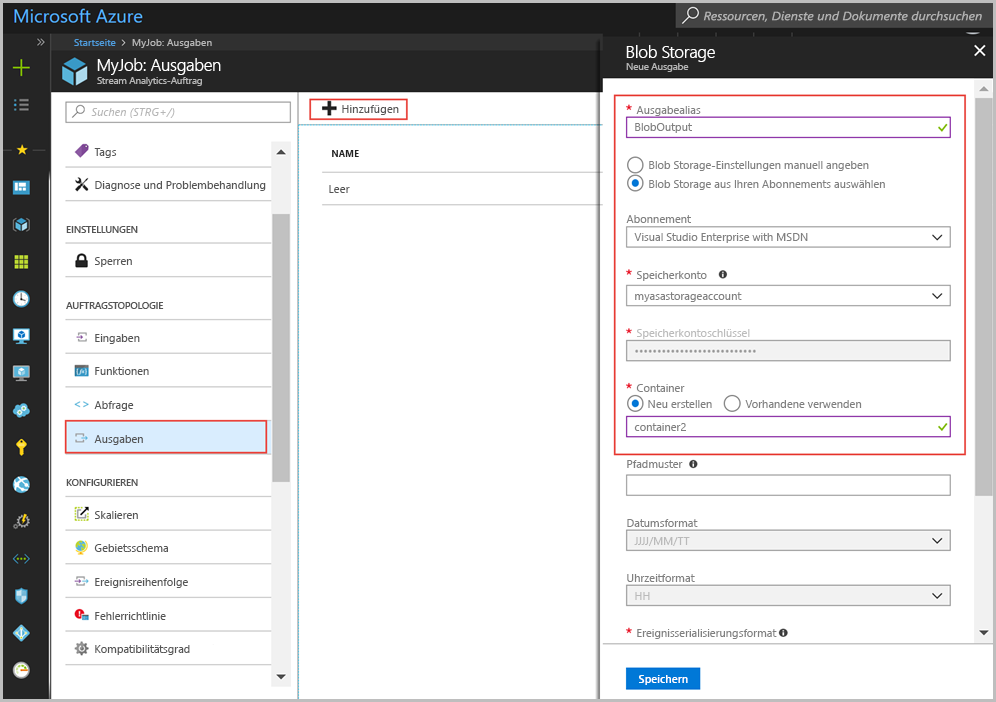
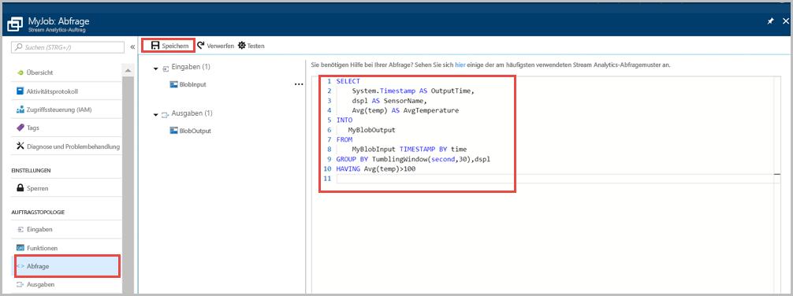
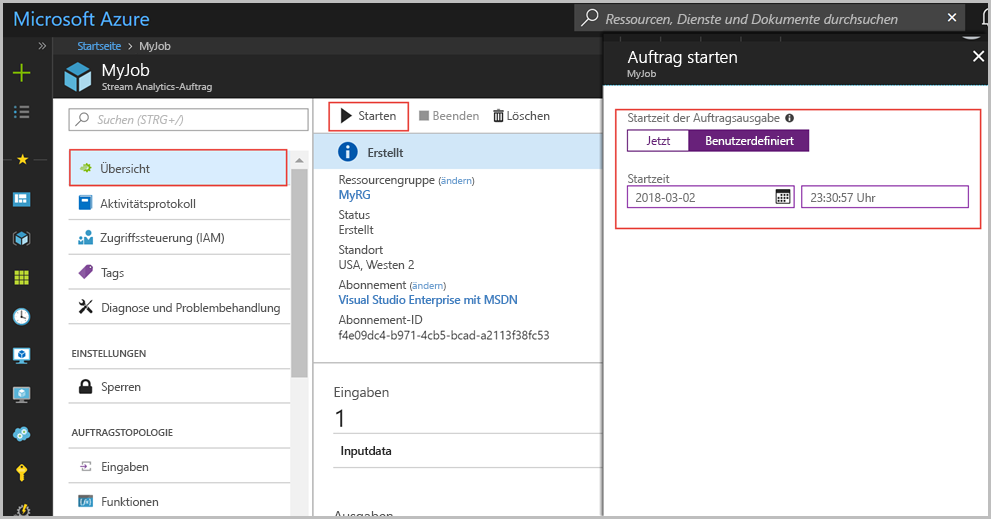
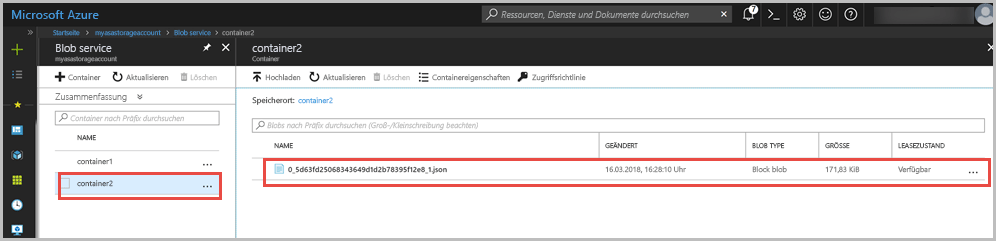

# <a name="quickstart-create-a-stream-analytics-job-by-using-the-azure-portal"></a>Schnellstart: Erstellen eines Stream Analytics-Auftrags mithilfe des Azure-Portals

Dieser Schnellstart veranschaulicht die ersten Schritte beim Erstellen eines Stream Analytics-Auftrags. In dieser Schnellstartanleitung definieren Sie einen Stream Analytics-Auftrag, der Sensorbeispieldaten liest und Zeilen filtert, bei denen die Durchschnittstemperatur 30 Sekunden lang über 100 liegt. In diesem Artikel lesen Sie Daten aus dem Blobspeicher, transformieren die Daten und schreiben die Daten zurück in einen anderen Container im gleichen Blobspeicher. Die in diesem Schnellstart verwendete Eingabedatendatei enthält statische Daten, die lediglich der Veranschaulichung dienen. In der Praxis verwenden Sie später Streamingeingabedaten für einen Stream Analytics-Auftrag.

## <a name="before-you-begin"></a>Voraussetzungen

* Wenn Sie kein Azure-Abonnement besitzen, können Sie ein [kostenloses Konto](https://azure.microsoft.com/free/) erstellen.

* Melden Sie sich beim [Azure-Portal](https://portal.azure.com/) an.

## <a name="prepare-the-input-data"></a>Vorbereiten der Eingabedaten

Vor dem Definieren des Stream Analytics-Auftrags sollten Sie die Daten vorbereiten, die als Eingabe für den Auftrag konfiguriert werden. Führen Sie die folgenden Schritte aus, um die für den Auftrag erforderlichen Eingabedaten vorzubereiten:

1. Laden Sie die [Sensorbeispieldaten](https://raw.githubusercontent.com/Azure/azure-stream-analytics/master/Samples/GettingStarted/HelloWorldASA-InputStream.json) von GitHub herunter. Die Beispieldaten enthalten Sensorinformationen im folgenden JSON-Format:  

   ```json
   {
     "time": "2018-01-26T21:18:52.0000000",
     "dspl": "sensorC",
     "temp": 87,
     "hmdt": 44
   }
   ```
2. Melden Sie sich beim Azure-Portal an.  

3. Klicken Sie in der linken oberen Ecke des Azure-Portals auf **Ressource erstellen** > **Speicher** > **Speicherkonto**. Füllen Sie die Seite für den Speicherkontoauftrag aus: Geben Sie für **Name** den Namen „asaquickstartstorage“ ein, und legen Sie **Standort** auf „USA, Westen 2“ und **Ressourcengruppe** auf „asaquickstart-resourcegroup“ fest. (Hosten Sie das Speicherkonto in der gleichen Ressourcengruppe wie den Streamingauftrag, um die Leistung zu verbessern.) Bei den übrigen Einstellungen können Sie die Standardwerte übernehmen.  

   

4. Navigieren Sie auf der Seite **Alle Ressourcen** zu dem im vorherigen Schritt erstellten Speicherkonto. Öffnen Sie die Seite **Übersicht**, und klicken Sie auf die Kachel **Blobs**.  

5. Klicken Sie auf der Seite **Blob-Dienst** auf **Container**, geben Sie im Feld **Name** einen Namen für den Container ein (etwa *container1*), und ändern Sie die Angabe für **Öffentliche Zugriffsebene** in „Blob (Anonymer Lesezugriff nur für Blobs)“. Klicken Sie dann auf **OK**.  

   

6. Wechseln Sie zu dem Container, den Sie im vorherigen Schritt erstellt haben. Wählen Sie **Hochladen** aus, und laden Sie die Sensordaten hoch, die Sie im ersten Schritt abgerufen haben.  

   

## <a name="create-a-stream-analytics-job"></a>Erstellen eines Stream Analytics-Auftrags

1. Melden Sie sich beim Azure-Portal an.

2. Klicken Sie im Azure-Portal links oben auf **Ressource erstellen**.  

3. Klicken Sie in der Ergebnisliste auf **Daten + Analysen** > **Stream Analytics-Auftrag**.  

4. Geben Sie auf der Seite für den Stream Analytics-Auftrag die folgenden Informationen ein:

   |**Einstellung**  |**Empfohlener Wert**  |**Beschreibung**  |
   |---------|---------|---------|
   |Auftragsname   |  myasajob   |   Geben Sie einen Namen zur Identifizierung des Stream Analytics-Auftrags ein. Der Stream Analytics-Auftragsname darf nur alphanumerische Zeichen, Bindestriche und Unterstriche enthalten und muss zwischen 3 und 63 Zeichen lang sein. |
   |Abonnement  | \<Ihr Abonnement\> |  Wählen Sie das Azure-Abonnement aus, das Sie für diesen Auftrag verwenden möchten. |
   |Ressourcengruppe   |   asaquickstart-resourcegroup  |   Wählen Sie **Neu erstellen** aus, und geben Sie einen neuen Ressourcengruppennamen für Ihr Konto ein. |
   |Speicherort  |  \<Die Region, die Ihren Benutzern am nächsten liegt\> | Wählen Sie den geografischen Standort aus, in dem Sie Ihren Stream Analytics-Auftrag hosten können. Verwenden Sie den Standort, der Ihren Benutzern am nächsten liegt, um die Leistung zu steigern und die Datenübertragungskosten zu senken. |
   |Streamingeinheiten  | 1  |   Streamingeinheiten sind die Computingressourcen, die für die Ausführung eines Auftrags erforderlich sind. Standardmäßig ist dieser Wert auf 1 festgelegt. Informationen zum Skalieren von Streamingeinheiten finden Sie im Artikel [Überblick über Streamingeinheiten und Informationen zu Anpassungen](stream-analytics-streaming-unit-consumption.md).   |
   |Hosting-Umgebung  |  Cloud  |   Für Stream Analytics-Aufträge ist eine Cloud- oder Edge-Bereitstellung möglich. Die Aufträge können mit der Option „Cloud“ in Azure Cloud und mit der Option „Edge“ auf einem IoT Edge-Gerät bereitgestellt werden. |

   

5. Aktivieren Sie das Kontrollkästchen **An Dashboard anheften**, um den Auftrag auf Ihrem Dashboard zu platzieren, und klicken Sie dann auf **Erstellen**.  

6. Oben rechts im Browserfenster sollte „Die Bereitstellung wird ausgeführt.“ angezeigt werden. 

## <a name="configure-input-to-the-job"></a>Konfigurieren einer Eingabe für den Auftrag

In diesem Abschnitt konfigurieren Sie Blobspeicher als Eingabe für den Stream Analytics-Auftrag. Erstellen Sie vor dem Konfigurieren der Eingabe ein Blobspeicherkonto.  

### <a name="add-the-input"></a>Hinzufügen der Eingabe 

1. Navigieren Sie zum Stream Analytics-Auftrag.  

2. Klicken Sie auf **Eingaben** > **Datenstromeingabe hinzufügen** > **Blobspeicher**.  

3. Fügen Sie auf der Seite **Blobspeicher** die folgenden Werte ein:

   |**Einstellung**  |**Empfohlener Wert**  |**Beschreibung**  |
   |---------|---------|---------|
   |Eingabealias  |  BlobInput   |  Geben Sie einen Namen zur Identifizierung der Auftragseingabe ein.   |
   |Abonnement   |  \<Ihr Abonnement\> |  Wählen Sie das Azure-Abonnement mit dem von Ihnen erstellten Speicherkonto aus. Das Speicherkonto kann sich im gleichen oder in einem anderen Abonnement befinden. In diesem Beispiel wird davon ausgegangen, dass Sie ein Speicherkonto im gleichen Abonnement erstellt haben. |
   |Speicherkonto  |  myasastorageaccount |  Wählen Sie den Namen des Speicherkontos aus, oder geben Sie ihn ein. Speicherkontonamen werden automatisch erkannt, wenn sie im gleichen Abonnement erstellt werden. |
   |Container  | container1 | Wählen Sie den Namen des Containers aus, der Beispieldaten enthält. Containernamen werden automatisch erkannt, wenn sie im gleichen Abonnement erstellt werden. |

4. Übernehmen Sie für die anderen Optionen die Standardwerte, und klicken Sie zum Speichern der Einstellungen auf **Speichern**.  

   
 
## <a name="configure-output-to-the-job"></a>Konfigurieren einer Ausgabe für den Auftrag

1. Navigieren Sie zum zuvor erstellten Stream Analytics-Auftrag.  

2. Klicken Sie auf **Ausgaben > Hinzufügen > Blobspeicher**.  

3. Fügen Sie auf der Seite **Blobspeicher** die folgenden Werte ein:

   |**Einstellung**  |**Empfohlener Wert**  |**Beschreibung**  |
   |---------|---------|---------|
   |Ausgabealias |   BlobOutput   |   Geben Sie einen Namen zur Identifizierung der Auftragsausgabe ein. |
   |Abonnement  |  \<Ihr Abonnement\>  |  Wählen Sie das Azure-Abonnement mit dem von Ihnen erstellten Speicherkonto aus. Das Speicherkonto kann sich im gleichen oder in einem anderen Abonnement befinden. In diesem Beispiel wird davon ausgegangen, dass Sie ein Speicherkonto im gleichen Abonnement erstellt haben. |
   |Speicherkonto |  myasastorageaccount |   Wählen Sie den Namen des Speicherkontos aus, oder geben Sie ihn ein. Speicherkontonamen werden automatisch erkannt, wenn sie im gleichen Abonnement erstellt werden.       |
   |Container |   container1  |  Wählen Sie den vorhandenen Container aus, den Sie in Ihrem Speicherkonto erstellt haben.   |
   |Pfadmuster |   output  |  Geben Sie einen Namen ein, der innerhalb Ihres vorhandenen Containers als Pfad für die Ausgabe fungiert.   |

4. Übernehmen Sie für die anderen Optionen die Standardwerte, und klicken Sie zum Speichern der Einstellungen auf **Speichern**.  

   
 
## <a name="define-the-transformation-query"></a>Definieren der Transformationsabfrage

1. Navigieren Sie zum zuvor erstellten Stream Analytics-Auftrag.  

2. Klicken Sie auf **Abfrage**, und aktualisieren Sie die Abfrage wie folgt:  

   ```sql
   SELECT 
   System.Timestamp AS OutputTime,
   dspl AS SensorName,
   Avg(temp) AS AvgTemperature
   INTO
     BlobOutput
   FROM
     BlobInput TIMESTAMP BY time
   GROUP BY TumblingWindow(second,30),dspl
   HAVING Avg(temp)>100
   ```

3. In diesem Beispiel liest die Abfrage die Daten aus dem Blob und kopiert sie in eine neue Datei im Blob. Klicken Sie auf **Speichern**.  

   

## <a name="start-the-stream-analytics-job-and-check-the-output"></a>Starten des Stream Analytics-Auftrags und Überprüfen der Ausgabe

1. Wechseln Sie zurück zur Seite mit der Auftragsübersicht, und klicken Sie auf **Starten**.

2. Klicken Sie unter **Auftrag starten** für das Feld **Startzeit** auf **Benutzerdefiniert**. Wählen Sie `2018-01-24` als Startdatum, aber ändern Sie nicht die Uhrzeit. Dieses Startdatum wird gewählt, weil es dem Ereigniszeitstempel aus den Beispieldaten vorangestellt ist. Klicken Sie auf **Starten**, wenn Sie fertig sind.

   

3. Navigieren Sie nach einigen Minuten im Portal zu dem Speicherkonto und dem Container, die Sie als Ausgabe für den Auftrag konfiguriert haben. Wählen Sie den Ausgabepfad aus. Sie sehen nun die Ausgabedatei im Container. Beim ersten Mal dauert es einige Minuten, bis der Auftrag gestartet wird. Nach dem Start wird er weiterhin ausgeführt, während die Daten eingehen.  

   

## <a name="clean-up-resources"></a>Bereinigen von Ressourcen

Löschen Sie die Ressourcengruppe, den Streamingauftrag und alle dazugehörigen Ressourcen, wenn Sie sie nicht mehr benötigen. Durch das Löschen des Auftrags verhindern Sie, dass Kosten für die vom Auftrag verbrauchten Streamingeinheiten anfallen. Wenn Sie den Auftrag in Zukunft verwenden möchten, können Sie ihn beenden und später bei Bedarf neu starten. Wenn Sie diesen Auftrag nicht weiter verwenden möchten, löschen Sie alle von diesem Schnellstart erstellten Ressourcen. Führen Sie dazu folgende Schritte aus:

1. Klicken Sie im Azure-Portal im Menü auf der linken Seite auf **Ressourcengruppen** und dann auf den Namen der erstellten Ressource.  

2. Klicken Sie auf der Seite mit Ihrer Ressourcengruppe auf **Löschen**, geben Sie im Textfeld den Namen der zu löschenden Ressource ein, und klicken Sie dann auf **Löschen**.

## <a name="next-steps"></a>Nächste Schritte

In diesem Schnellstart haben Sie einen einfachen Stream Analytics-Auftrag bereitgestellt. Wenn Sie Informationen zum Konfigurieren anderer Eingabequellen sowie zum Ausführen der Echtzeiterkennung benötigen, lesen Sie den folgenden Artikel:

> [!div class="nextstepaction"]
> [Erste Schritte mit Azure Stream Analytics: Betrugserkennung in Echtzeit](stream-analytics-real-time-fraud-detection.md)

