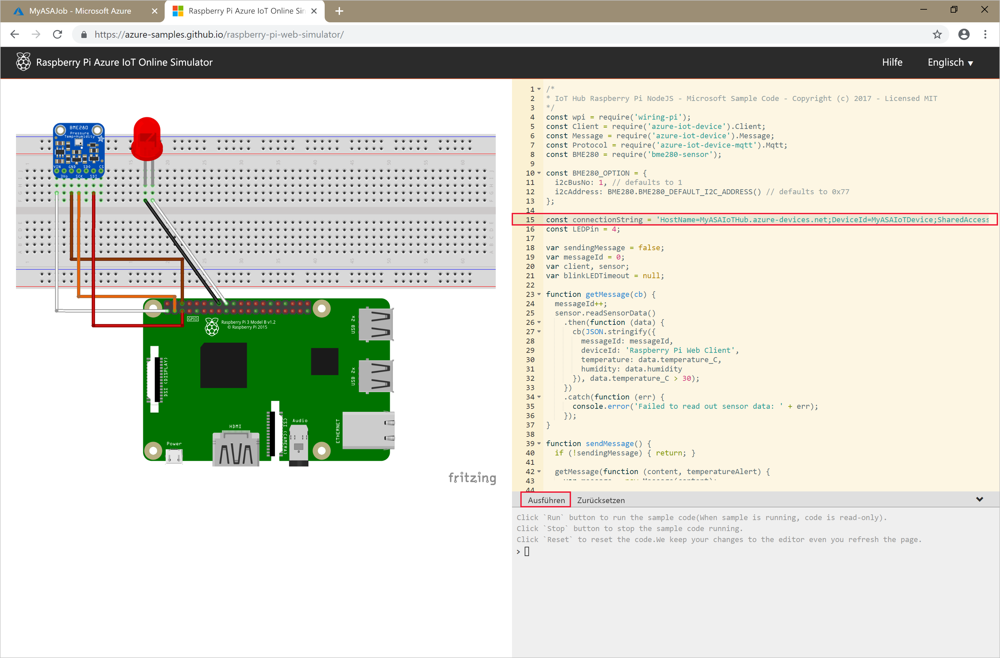

# <a name="quickstart-create-a-stream-analytics-job-using-azure-powershell"></a>Schnellstart: Erstellen eines Stream Analytics-Auftrags mit Azure PowerShell

Das Azure PowerShell-Modul dient zum Erstellen und Verwalten von Azure-Ressourcen mithilfe von PowerShell-Cmdlets oder -Skripts. In dieser Schnellstartanleitung wird ausführlich die Bereitstellung und Ausführung eines Azure Stream Analytics-Auftrags mithilfe des Azure PowerShell-Moduls beschrieben.

Der Beispielauftrag liest Streamingdaten von einem IoT Hub-Gerät. Die Eingabedaten werden von einem Raspberry Pi-Onlinesimulator generiert. Anschließend transformiert der Stream Analytics-Auftrag die Daten mithilfe der Stream Analytics-Abfragesprache, um Nachrichten mit einer Temperatur über 27 ° herauszufiltern. Zum Schluss werden die resultierenden Ausgabeereignisse in eine Datei in Blobspeicher geschrieben.

## <a name="before-you-begin"></a>Voraussetzungen

[!INCLUDE [updated-for-az](../../includes/updated-for-az.md)]

* Wenn Sie kein Azure-Abonnement besitzen, können Sie ein [kostenloses Konto](https://azure.microsoft.com/free/) erstellen.

* Für diesen Schnellstart ist das Azure PowerShell-Modul erforderlich. Führen Sie `Get-Module -ListAvailable Az` aus, um die Version zu ermitteln, die auf Ihrem lokalen Computer installiert ist. Wenn Sie eine Installation oder ein Upgrade ausführen müssen, finden Sie unter [Install and configure Azure PowerShell](https://docs.microsoft.com/powershell/azure/install-Az-ps) (Installieren des Azure PowerShell-Moduls) Informationen dazu.

* Einige IoT Hub-Aktionen werden nicht von Azure PowerShell unterstützt und müssen mit Version 2.0.24 oder höher der Azure-Befehlszeilenschnittstelle (Azure CLI) und der IoT-Erweiterung für die Azure CLI ausgeführt werden. [Installieren Sie die Azure CLI](https://docs.microsoft.com/cli/azure/install-azure-cli?view=azure-cli-latest) und verwenden Sie `az extension add --name azure-cli-iot-ext` zum Installieren der IoT-Erweiterung.


## <a name="sign-in-to-azure"></a>Anmelden bei Azure

Melden Sie sich mit dem Befehl `Connect-AzAccount` bei Ihrem Azure-Abonnement an, und geben Sie im Popupbrowserfenster Ihre Azure-Anmeldeinformationen ein:

```powershell
# Connect to your Azure account
Connect-AzAccount
```

Falls Sie mehrere Abonnements haben, führen Sie die folgenden Cmdlets aus, um das Abonnement auszuwählen, das Sie für diesen Schnellstart verwenden möchten. Ersetzen Sie `<your subscription name>` durch den Namen Ihres Abonnements:

```powershell
# List all available subscriptions.
Get-AzSubscription

# Select the Azure subscription you want to use to create the resource group and resources.
Get-AzSubscription -SubscriptionName "<your subscription name>" | Select-AzSubscription
```

## <a name="create-a-resource-group"></a>Erstellen einer Ressourcengruppe

Erstellen Sie mit [New-AzResourceGroup](https://docs.microsoft.com/powershell/module/az.resources/new-azresourcegroup) eine Azure-Ressourcengruppe. Eine Ressourcengruppe ist ein logischer Container, in dem Azure-Ressourcen bereitgestellt und verwaltet werden.

```powershell
$resourceGroup = "StreamAnalyticsRG"
$location = "WestUS2"
New-AzResourceGroup `
    -Name $resourceGroup `
    -Location $location
```

## <a name="prepare-the-input-data"></a>Vorbereiten der Eingabedaten

Bereiten Sie vor dem Definieren des Stream Analytics-Auftrags die Daten vor, die als Eingabe für den Auftrag konfiguriert werden.

Der folgende Azure CLI-Codeblock führt viele Befehle aus, um die erforderlichen Eingabedaten für den Auftrag vorzubereiten. Sehen Sie sich die Abschnitte an, um den Code zu verstehen.

1. Führen Sie im PowerShell-Fenster den Befehl [az login](https://docs.microsoft.com/cli/azure/authenticate-azure-cli?view=azure-cli-latest) aus, um sich bei Ihrem Azure-Konto anzumelden.

    Wenn Sie sich erfolgreich angemeldet haben, gibt die Azure CLI eine Liste Ihrer Abonnements zurück. Kopieren Sie das Abonnement, das Sie für diesen Schnellstart verwenden möchten, und führen Sie den Befehl [az account set](https://docs.microsoft.com/cli/azure/manage-azure-subscriptions-azure-cli?view=azure-cli-latest#change-the-active-subscription) aus, um dieses Abonnement auszuwählen. Wählen Sie das gleiche Abonnement aus, das Sie im vorherigen Abschnitt mit PowerShell ausgewählt haben. Ersetzen Sie `<your subscription name>` durch den Namen Ihres Abonnements.

    ```azurecli
    az login

    az account set --subscription "<your subscription>"
    ```

2. Erstellen Sie mithilfe des Befehls [az iot hub create](../iot-hub/iot-hub-create-using-cli.md#create-an-iot-hub) eine IoT Hub-Instanz. In diesem Beispiel wird eine IoT Hub-Instanz mit dem Namen **MyASAIoTHub** erstellt. Da IoT Hub-Namen eindeutig sind, müssen Sie einen eigenen IoT Hub-Namen festlegen. Legen Sie die SKU auf F1 fest, um den Free-Tarif zu nutzen, sofern dieser für Ihr Abonnement verfügbar ist. Wählen Sie andernfalls den niedrigsten verfügbaren Tarif aus.

    ```azurecli
    az iot hub create --name "<your IoT Hub name>" --resource-group $resourceGroup --sku S1
    ```

    Nachdem der IoT-Hub erstellt wurde, rufen Sie die IoT Hub-Verbindungszeichenfolge mit dem Befehl [az iot hub show-connection-string](https://docs.microsoft.com/cli/azure/iot/hub?view=azure-cli-latest) ab. Kopieren Sie die komplette Verbindungszeichenfolge, und speichern Sie sie (Sie benötigen sie, wenn Sie die IoT Hub-Instanz als Eingabe für den Stream Analytics-Auftrag hinzufügen).

    ```azurecli
    az iot hub show-connection-string --hub-name "MyASAIoTHub"
    ```

3. Fügen Sie IoT Hub mit dem Befehl [az iothub device-identity create](../iot-hub/quickstart-send-telemetry-c.md#register-a-device) ein Gerät hinzu. In diesem Beispiel wird ein Gerät namens **MyASAIoTDevice** erstellt.

    ```azurecli
    az iot hub device-identity create --hub-name "MyASAIoTHub" --device-id "MyASAIoTDevice"
    ```

4. Rufen Sie die Geräteverbindungszeichenfolge mithilfe des Befehls [az iot hub device-identity show-connection-string](/cli/azure/ext/azure-cli-iot-ext/iot/hub/device-identity#ext-azure-cli-iot-ext-az-iot-hub-device-identity-show-connection-string) ab. Kopieren Sie die komplette Verbindungszeichenfolge, und speichern Sie sie (Sie benötigen sie, wenn Sie den Raspberry Pi-Simulator erstellen).

    ```azurecli
    az iot hub device-identity show-connection-string --hub-name "MyASAIoTHub" --device-id "MyASAIoTDevice" --output table
    ```

    **Ausgabebeispiel:**

    ```azurecli
    HostName=MyASAIoTHub.azure-devices.net;DeviceId=MyASAIoTDevice;SharedAccessKey=a2mnUsg52+NIgYudxYYUNXI67r0JmNubmfVafojG8=
    ```

## <a name="create-blob-storage"></a>Erstellen eines Blobspeichers

Im folgenden Azure PowerShell-Codeblock werden Befehle zum Erstellen von Blobspeicher für die Ausgabe des Auftrags verwendet. Sehen Sie sich die Abschnitte an, um den Code zu verstehen.

1. Erstellen Sie mit dem Cmdlet [New-AzStorageAccount](https://docs.microsoft.com/powershell/module/az.storage/New-azStorageAccount) ein allgemeines Standardspeicherkonto.  In diesem Beispiel wird ein Speicherkonto namens **myasaquickstartstorage** mit lokal redundantem Speicher (LRS) und Blobverschlüsselung (standardmäßig aktiviert) erstellt.

2. Rufen Sie den Kontext des Speicherkontos (`$storageAccount.Context`) ab, der das zu verwendende Speicherkonto definiert. Beim Arbeiten mit Speicherkonten verweisen Sie auf den Kontext, statt die Anmeldeinformationen wiederholt anzugeben.

3. Erstellen Sie mithilfe von [New-AzStorageContainer](https://docs.microsoft.com/powershell/module/az.storage/new-azstoragecontainer) einen Container.

4. Kopieren Sie den vom Code ausgegebenen Speicherschlüssel, und speichern Sie ihn (Sie benötigen ihn später zum Erstellen der Ausgabe des Streamingauftrags).

    ```powershell
    $storageAccountName = "myasaquickstartstorage"
    $storageAccount = New-AzStorageAccount `
      -ResourceGroupName $resourceGroup `
      -Name $storageAccountName `
      -Location $location `
      -SkuName Standard_LRS `
      -Kind Storage

    $ctx = $storageAccount.Context
    $containerName = "container1"

    New-AzStorageContainer `
      -Name $containerName `
      -Context $ctx

    $storageAccountKey = (Get-AzStorageAccountKey `
      -ResourceGroupName $resourceGroup `
      -Name $storageAccountName).Value[0]

    Write-Host "The <storage account key> placeholder needs to be replaced in your output json files with this key value:"
    Write-Host $storageAccountKey -ForegroundColor Cyan
    ```

## <a name="create-a-stream-analytics-job"></a>Erstellen eines Stream Analytics-Auftrags

Erstellen Sie mit dem Cmdlet [New-AzStreamAnalyticsJob](https://docs.microsoft.com/powershell/module/az.streamanalytics/new-azstreamanalyticsjob) einen Stream Analytics-Auftrag. Dieses Cmdlet akzeptiert den Auftragsnamen, den Ressourcengruppennamen und die Auftragsdefinition als Parameter. Beim Auftragsnamen kann es sich um einen beliebigen Anzeigenamen handeln, der Ihren Auftrag identifiziert. Er darf nur alphanumerische Zeichen, Bindestriche und Unterstriche enthalten und muss zwischen 3 und 63 Zeichen lang sein. Bei der Auftragsdefinition handelt es sich um eine JSON-Datei mit den Eigenschaften, die zum Erstellen eines Auftrags erforderlich sind. Erstellen Sie auf Ihrem lokalen Computer eine Datei mit dem Namen `JobDefinition.json`, und fügen Sie ihr die folgenden JSON-Daten hinzu:

```json
{
  "location":"WestUS2",
  "properties":{
    "sku":{
      "name":"standard"
    },
    "eventsOutOfOrderPolicy":"adjust",
    "eventsOutOfOrderMaxDelayInSeconds":10,
    "compatibilityLevel": 1.1
  }
}
```

Führen Sie anschließend das Cmdlet `New-AzStreamAnalyticsJob` aus. Ersetzen Sie dabei den Wert der Variablen `jobDefinitionFile` durch den Pfad, an dem Sie die JSON-Datei mit der Auftragsdefinition gespeichert haben.

```powershell
$jobName = "MyStreamingJob"
$jobDefinitionFile = "C:\JobDefinition.json"
New-AzStreamAnalyticsJob `
  -ResourceGroupName $resourceGroup `
  -File $jobDefinitionFile `
  -Name $jobName `
  -Force
```

## <a name="configure-input-to-the-job"></a>Konfigurieren einer Eingabe für den Auftrag

Fügen Sie mit dem Cmdlet [New-AzStreamAnalyticsInput](https://docs.microsoft.com/powershell/module/az.streamanalytics/new-azstreamanalyticsinput) eine Eingabe zu Ihrem Auftrag hinzu. Dieses Cmdlet übernimmt den Auftragsnamen, den Auftragseingabenamen, den Ressourcengruppennamen und die Auftragseingabedefinition als Parameter. Bei der Auftragseingabedefinition handelt es sich um eine JSON-Datei mit den Eigenschaften, die zum Konfigurieren der Eingabe eines Auftrags erforderlich sind. In diesem Beispiel erstellen Sie einen Blobspeicher als Eingabe.

Erstellen Sie auf Ihrem lokalen Computer eine Datei mit dem Namen `JobInputDefinition.json`, und fügen Sie ihr die folgenden JSON-Daten hinzu. Ersetzen Sie den Wert für `accesspolicykey` durch den `SharedAccessKey`-Teil der IoT Hub-Verbindungszeichenfolge, die Sie zuvor gespeichert haben.

```json
{
    "properties": {
        "type": "Stream",
        "datasource": {
            "type": "Microsoft.Devices/IotHubs",
            "properties": {
                "iotHubNamespace": "MyASAIoTHub",
                "sharedAccessPolicyName": "iothubowner",
                "sharedAccessPolicyKey": "accesspolicykey",
                "endpoint": "messages/events",
                "consumerGroupName": "$Default"
                }
        },
        "compression": {
            "type": "None"
        },
        "serialization": {
            "type": "Json",
            "properties": {
                "encoding": "UTF8"
            }
        }
    },
    "name": "IoTHubInput",
    "type": "Microsoft.StreamAnalytics/streamingjobs/inputs"
}
```

Führen Sie als Nächstes das Cmdlet `New-AzStreamAnalyticsInput` aus. Ersetzen Sie dabei den Wert der Variablen `jobDefinitionFile` durch den Pfad, an dem Sie die JSON-Datei mit der Auftragseingabedefinition gespeichert haben.

```powershell
$jobInputName = "IoTHubInput"
$jobInputDefinitionFile = "C:\JobInputDefinition.json"
New-AzStreamAnalyticsInput `
  -ResourceGroupName $resourceGroup `
  -JobName $jobName `
  -File $jobInputDefinitionFile `
  -Name $jobInputName
```

## <a name="configure-output-to-the-job"></a>Konfigurieren einer Ausgabe für den Auftrag

Fügen Sie mit dem Cmdlet [New-AzStreamAnalyticsOutput](https://docs.microsoft.com/powershell/module/az.streamanalytics/new-azstreamanalyticsoutput) eine Ausgabe zu Ihrem Auftrag hinzu. Dieses Cmdlet übernimmt den Auftragsnamen, den Auftragsausgabenamen, den Ressourcengruppennamen und die Auftragsausgabedefinition als Parameter. Bei der Auftragsausgabedefinition handelt es sich um eine JSON-Datei mit den Eigenschaften, die zum Konfigurieren der Ausgabe eines Auftrags erforderlich sind. In diesem Beispiel wird der Blobspeicher als Ausgabe verwendet.

Erstellen Sie auf Ihrem lokalen Computer eine Datei mit dem Namen `JobOutputDefinition.json`, und fügen Sie ihr die folgenden JSON-Daten hinzu. Ersetzen Sie den Wert für `accountKey` durch den Zugriffsschlüssel Ihres Speicherkontos. Dieser Wert ist in „$storageAccountKey“ gespeichert.

```json
{
    "properties": {
        "datasource": {
            "type": "Microsoft.Storage/Blob",
            "properties": {
                "storageAccounts": [
                    {
                      "accountName": "asaquickstartstorage",
                      "accountKey": "<storage account key>"
                    }
                ],
                "container": "container1",
                "pathPattern": "output/",
                "dateFormat": "yyyy/MM/dd",
                "timeFormat": "HH"
            }
        },
        "serialization": {
            "type": "Json",
            "properties": {
                "encoding": "UTF8",
                "format": "LineSeparated"
            }
        }
    },
    "name": "BlobOutput",
    "type": "Microsoft.StreamAnalytics/streamingjobs/outputs"
}
```

Führen Sie anschließend das Cmdlet `New-AzStreamAnalyticsOutput` aus. Ersetzen Sie den Wert der Variablen `jobOutputDefinitionFile` durch den Pfad, an dem Sie die JSON-Datei der Auftragsausgabedefinition gespeichert haben.

```powershell
$jobOutputName = "BlobOutput"
$jobOutputDefinitionFile = "C:\JobOutputDefinition.json"
New-AzStreamAnalyticsOutput `
  -ResourceGroupName $resourceGroup `
  -JobName $jobName `
  -File $jobOutputDefinitionFile `
  -Name $jobOutputName -Force
```

## <a name="define-the-transformation-query"></a>Definieren der Transformationsabfrage

Fügen Sie Ihrem Auftrag mithilfe des Cmdlets [New-AzStreamAnalyticsTransformation](https://docs.microsoft.com/powershell/module/az.streamanalytics/new-azstreamanalyticstransformation) eine Transformation hinzu. Dieses Cmdlet übernimmt den Auftragsnamen, den Auftragstransformationsnamen, den Ressourcengruppennamen und die Auftragstransformationsdefinition als Parameter. Erstellen Sie auf Ihrem lokalen Computer eine Datei mit dem Namen `JobTransformationDefinition.json`, und fügen Sie ihr die folgenden JSON-Daten hinzu. Die JSON-Datei enthält einen Abfrageparameter, der die Transformationsabfrage definiert:

```json
{
    "name":"MyTransformation",
    "type":"Microsoft.StreamAnalytics/streamingjobs/transformations",
    "properties":{
        "streamingUnits":1,
        "script":null,
        "query":" SELECT * INTO BlobOutput FROM IoTHubInput HAVING Temperature > 27"
    }
}
```

Führen Sie anschließend das Cmdlet `New-AzStreamAnalyticsTransformation` aus. Ersetzen Sie dabei den Wert der Variablen `jobTransformationDefinitionFile` durch den Pfad, an dem Sie die JSON-Datei mit der Auftragstransformationsdefinition gespeichert haben.

```powershell
$jobTransformationName = "MyJobTransformation"
$jobTransformationDefinitionFile = "C:\JobTransformationDefinition.json"
New-AzStreamAnalyticsTransformation `
  -ResourceGroupName $resourceGroup `
  -JobName $jobName `
  -File $jobTransformationDefinitionFile `
  -Name $jobTransformationName -Force
```
## <a name="run-the-iot-simulator"></a>Ausführen des IoT-Simulators

1. Öffnen Sie den [Raspberry Pi-Azure IoT-Onlinesimulator](https://azure-samples.github.io/raspberry-pi-web-simulator/).

2. Ersetzen Sie den Platzhalter in Zeile 15 durch die gesamte zuvor gespeicherte Verbindungszeichenfolge für das Azure IoT Hub-Gerät.

3. Klicken Sie auf **Ausführen**. In der Ausgabe sollten nun die Sensordaten und -nachrichten angezeigt werden, die an Ihre IoT Hub-Instanz gesendet werden.

    

## <a name="start-the-stream-analytics-job-and-check-the-output"></a>Starten des Stream Analytics-Auftrags und Überprüfen der Ausgabe

Starten Sie den Auftrag mit dem Cmdlet [Start-AzStreamAnalyticsJob](https://docs.microsoft.com/powershell/module/az.streamanalytics/start-azstreamanalyticsjob). Dieses Cmdlet übernimmt den Auftragsnamen, den Ressourcengruppennamen, den Ausgabestartmodus und die Startzeit als Parameter. `OutputStartMode` akzeptiert die Werte `JobStartTime`, `CustomTime` und `LastOutputEventTime`. Weitere Informationen zur Bedeutung dieser Werte finden Sie in der PowerShell-Dokumentation im Abschnitt [Parameter](https://docs.microsoft.com/powershell/module/az.streamanalytics/start-azstreamanalyticsjob).

Nach der Ausführung des folgenden Cmdlets wird als Ausgabe `True` zurückgegeben, wenn der Auftrag gestartet wird. Im Speichercontainer wird ein Ausgabeordner mit den transformierten Daten erstellt.

```powershell
Start-AzStreamAnalyticsJob `
  -ResourceGroupName $resourceGroup `
  -Name $jobName `
  -OutputStartMode 'JobStartTime'
```

## <a name="clean-up-resources"></a>Bereinigen von Ressourcen

Löschen Sie die Ressourcengruppe, den Streamingauftrag und alle dazugehörigen Ressourcen, wenn Sie sie nicht mehr benötigen. Durch das Löschen des Auftrags verhindern Sie, dass Kosten für die vom Auftrag verbrauchten Streamingeinheiten anfallen. Wenn Sie den Auftrag in Zukunft verwenden möchten, können Sie den Löschvorgang überspringen und Auftrag vorläufig beenden. Wenn Sie diesen Auftrag nicht weiter verwenden möchten, löschen Sie alle in diesem Schnellstart erstellten Ressourcen, indem Sie das folgende Cmdlet ausführen:

```powershell
Remove-AzResourceGroup `
  -Name $resourceGroup
```

## <a name="next-steps"></a>Nächste Schritte

In dieser Schnellstartanleitung haben Sie einen einfachen Stream Analytics-Auftrag mit PowerShell bereitgestellt. Stream Analytics-Aufträge können auch mit dem [Azure-Portal](stream-analytics-quick-create-portal.md) und [Visual Studio](stream-analytics-quick-create-vs.md) bereitgestellt werden.

Wenn Sie Informationen zum Konfigurieren anderer Eingabequellen sowie zum Ausführen der Echtzeiterkennung benötigen, lesen Sie den folgenden Artikel:

> [!div class="nextstepaction"]
> [Erste Schritte mit Azure Stream Analytics: Betrugserkennung in Echtzeit](stream-analytics-real-time-fraud-detection.md)
