# <a name="quickstart-create-a-stream-analytics-job-by-using-the-azure-stream-analytics-tools-for-visual-studio"></a>Schnellstart: Erstellen eines Stream Analytics-Auftrags mithilfe des Azure Stream Analytics-Tools für Visual Studio

In dieser Schnellstartanleitung wird gezeigt, wie Sie mithilfe der Azure Stream Analytics-Tools für Visual Studio einen Stream Analytics-Auftrag erstellen und ausführen. Der Beispielauftrag liest Streamingdaten aus Azure Blob Storage. Die in diesem Schnellstart verwendete Eingabedatendatei enthält statische Daten, die lediglich der Veranschaulichung dienen. In der Praxis verwenden Sie später Streamingeingabedaten für einen Stream Analytics-Auftrag. In dieser Schnellstartanleitung legen Sie einen Auftrag fest, der bei Überschreitung von 100° die Durchschnittstemperatur berechnet und die entsprechenden Ausgabeereignisse in eine neue Datei schreibt.

## <a name="before-you-begin"></a>Voraussetzungen

* Wenn Sie kein Azure-Abonnement besitzen, können Sie ein [kostenloses Konto](https://azure.microsoft.com/free/) erstellen.

* Melden Sie sich beim [Azure-Portal](https://portal.azure.com/) an.

* Installieren Sie Visual Studio 2017, Visual Studio 2015 oder Visual Studio 2013 Update 4. Die Editionen Enterprise (Ultimate/Premium), Professional und Community werden unterstützt. Die Express Edition wird nicht unterstützt.

* Befolgen Sie die [Installationsanweisungen](https://docs.microsoft.com/azure/stream-analytics/stream-analytics-tools-for-visual-studio-install) für die Stream Analytics-Tools für Visual Studio.

## <a name="prepare-the-input-data"></a>Vorbereiten der Eingabedaten

Vor dem Definieren des Stream Analytics-Auftrags sollten Sie die Daten vorbereiten, die als Eingabe für den Auftrag konfiguriert werden. Führen Sie die folgenden Schritte aus, um die für den Auftrag erforderlichen Eingabedaten vorzubereiten:

1. Laden Sie die [Sensorbeispieldaten](https://raw.githubusercontent.com/Azure/azure-stream-analytics/master/Samples/GettingStarted/HelloWorldASA-InputStream.json) von GitHub herunter. Die Beispieldaten enthalten Sensorinformationen im folgenden JSON-Format:  

   ```json
   {
     "time": "2018-01-26T21:18:52.0000000",
     "dspl": "sensorC",
     "temp": 87,
     "hmdt": 44
   }
   ```
2. Melden Sie sich beim [Azure-Portal](https://portal.azure.com/) an.

3. Klicken Sie in der linken oberen Ecke des Azure-Portals auf **Ressource erstellen** > **Speicher** > **Speicherkonto**. Füllen Sie die Seite für den Speicherkontoauftrag aus: Geben Sie für **Name** den Namen „asaquickstartstorage“ ein, und legen Sie **Standort** auf „USA, Westen“ und **Ressourcengruppe** auf „asaquickstart-resourcegroup“ fest. (Hosten Sie das Speicherkonto in der gleichen Ressourcengruppe wie den Streamingauftrag, um die Leistung zu verbessern.) Bei den übrigen Einstellungen können Sie die Standardwerte übernehmen.  

   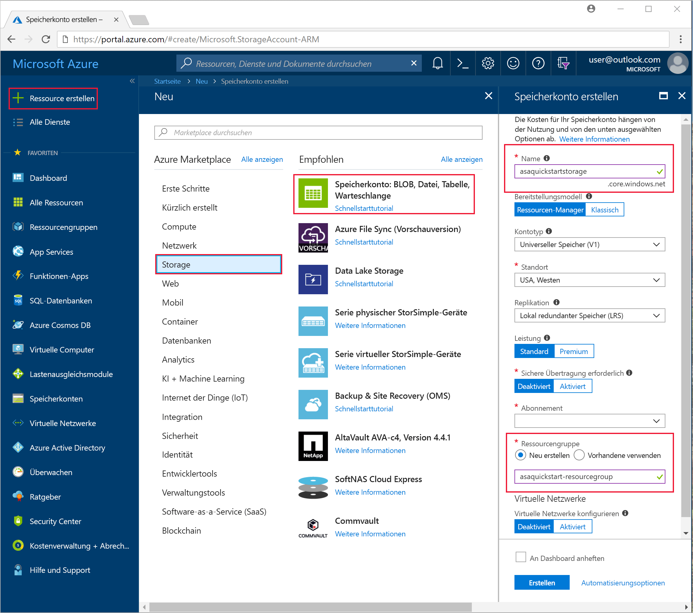

4. Navigieren Sie auf der Seite **Alle Ressourcen** zu dem im vorherigen Schritt erstellten Speicherkonto. Öffnen Sie die Seite **Übersicht**, und klicken Sie auf die Kachel **Blobs**.  

5. Wählen Sie auf der Seite **Blob-Dienst** die Option **Container** aus, geben Sie unter **Name** einen Namen für Ihren Container (etwa *container1*) ein, und klicken Sie auf **OK**.  

   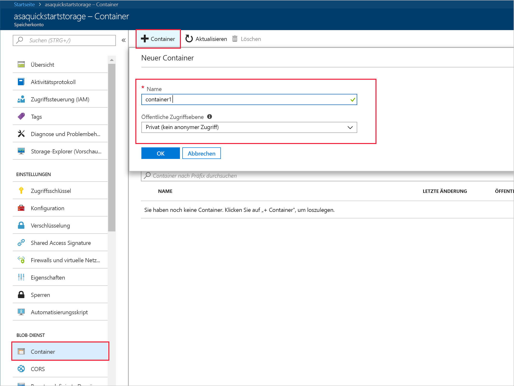

6. Wechseln Sie zu dem Container, den Sie im vorherigen Schritt erstellt haben. Wählen Sie **Hochladen** aus, und laden Sie die Sensordaten hoch, die Sie im ersten Schritt abgerufen haben.  

   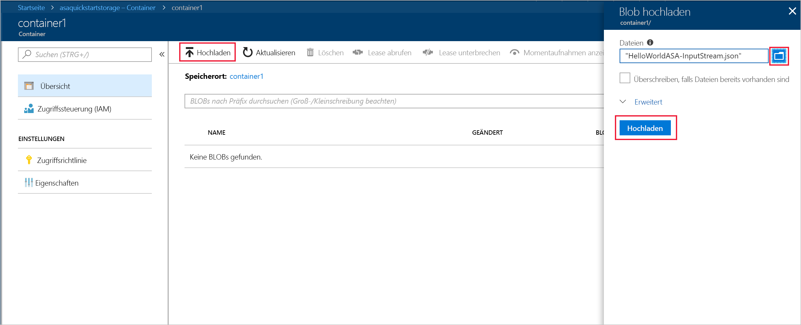

## <a name="create-a-stream-analytics-project"></a>Erstellen eines Stream Analytics-Projekts

1. Starten Sie Visual Studio.

2. Wählen Sie **Datei > Neues Projekt** aus.  

3. Wählen Sie in der Vorlagenliste links **Stream Analytics** und dann **Azure Stream Analytics Application** (Azure Stream Analytics-Anwendung) aus.  

4. Geben Sie **Name**, **Speicherort** und **Projektmappenname** für Ihr Projekt ein, und klicken Sie auf **OK**.

   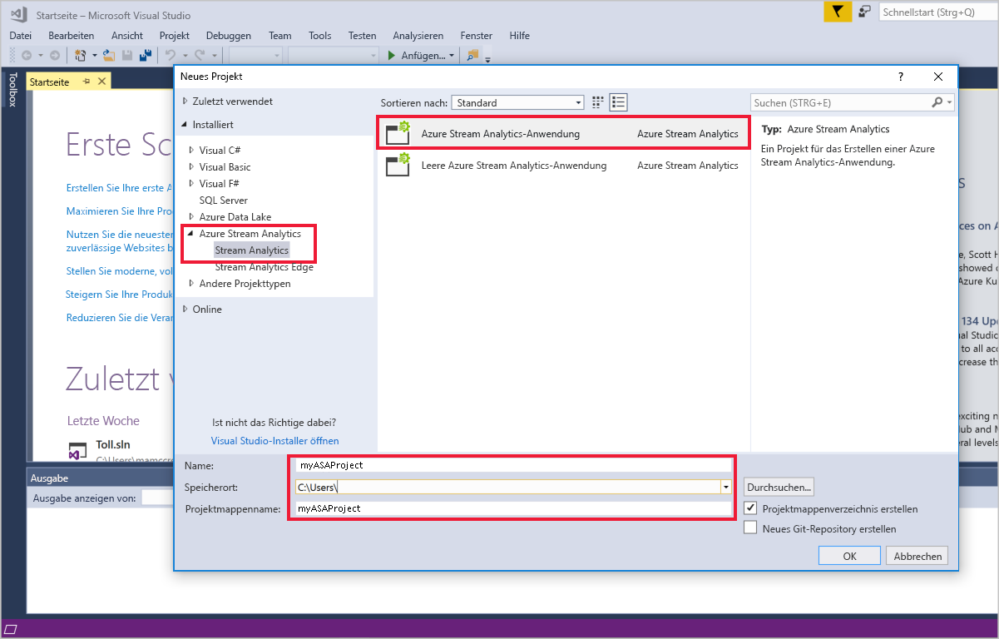

## <a name="choose-the-required-subscription"></a>Auswählen des erforderlichen Abonnements

1. Wählen Sie in Visual Studio im Menü **Ansicht** den **Server-Explorer** aus.

2. Klicken Sie mit der rechten Maustaste auf **Azure**, wählen Sie **Verbindung mit Microsoft Azure-Abonnement herstellen** aus, und melden Sie sich dann mit Ihrem Azure-Konto an.

## <a name="define-input"></a>Festlegen der Eingabe

1. Erweitern Sie im **Projektmappen-Explorer** den Knoten **Eingaben**, und doppelklicken Sie auf **Input.json**.

2. Fügen Sie unter **Stream Analytics Input Configuration** (Stream Analytics-Eingabekonfiguration) die folgenden Werte ein:

   |**Einstellung**  |**Empfohlener Wert**  |**Beschreibung**   |
   |---------|---------|---------|
   |Eingabealias  |  Eingabe   |  Geben Sie einen Namen zur Identifizierung der Auftragseingabe ein.   |
   |Quellentyp   |  Datenstrom |  Wählen Sie die entsprechende Eingabequelle aus: Datenstrom oder Verweisdaten.   |
   |Quelle  |  Blob Storage |  Wählen Sie die geeignete Eingabequelle aus.   |
   |Ressource  | Datenquelle aus aktuellem Konto wählen | Geben Sie Daten entweder manuell ein, oder wählen Sie ein vorhandenes Konto aus.   |
   |Abonnement  |  \<Ihr Abonnement\>   | Wählen Sie das Azure-Abonnement mit dem von Ihnen erstellten Speicherkonto aus. Das Speicherkonto kann sich im gleichen oder in einem anderen Abonnement befinden. In diesem Beispiel wird davon ausgegangen, dass Sie ein Speicherkonto im gleichen Abonnement erstellt haben.   |
   |Speicherkonto  |  asaquickstartstorage   |  Wählen Sie den Namen des Speicherkontos aus, oder geben Sie ihn ein. Speicherkontonamen werden automatisch erkannt, wenn sie im gleichen Abonnement erstellt werden.   |
   |Container  |  container1   |  Wählen Sie den vorhandenen Container aus, den Sie in Ihrem Speicherkonto erstellt haben.   |
   
3. Übernehmen Sie für die anderen Optionen die Standardwerte, und klicken Sie zum Speichern der Einstellungen auf **Speichern**.  

   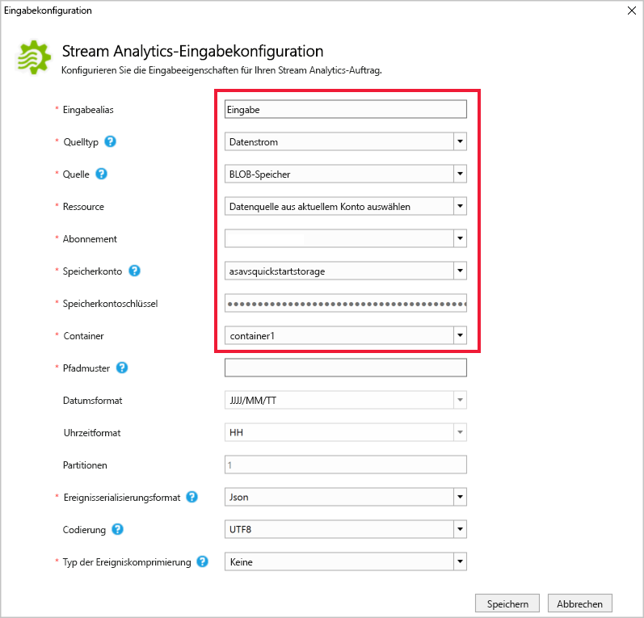

## <a name="define-output"></a>Definieren der Ausgabe

1. Erweitern Sie im **Projektmappen-Explorer** den Knoten **Ausgaben**, und doppelklicken Sie auf **Output.json**.

2. Fügen Sie unter **Stream Analytics Output Configuration** (Stream Analytics-Ausgabekonfiguration) die folgenden Werte ein:

   |**Einstellung**  |**Empfohlener Wert**  |**Beschreibung**   |
   |---------|---------|---------|
   |Ausgabealias  |  Output   |  Geben Sie einen Namen zur Identifizierung der Auftragsausgabe ein.   |
   |Senke   |  Blob Storage |  Wählen Sie die geeignete Senke aus.    |
   |Ressource  |  Geben Sie die Datenquelleneinstellungen manuell an. |  Geben Sie Daten entweder manuell ein, oder wählen Sie ein vorhandenes Konto aus.   |
   |Abonnement  |  \<Ihr Abonnement\>   | Wählen Sie das Azure-Abonnement mit dem von Ihnen erstellten Speicherkonto aus. Das Speicherkonto kann sich im gleichen oder in einem anderen Abonnement befinden. In diesem Beispiel wird davon ausgegangen, dass Sie ein Speicherkonto im gleichen Abonnement erstellt haben.   |
   |Speicherkonto  |  asaquickstartstorage   |  Wählen Sie den Namen des Speicherkontos aus, oder geben Sie ihn ein. Speicherkontonamen werden automatisch erkannt, wenn sie im gleichen Abonnement erstellt werden.   |
   |Container  |  container1   |  Wählen Sie den vorhandenen Container aus, den Sie in Ihrem Speicherkonto erstellt haben.   |
   |Pfadmuster  |  output   |  Geben Sie den Namen eines Dateipfads ein, der innerhalb des Containers erstellt werden soll.   |
   
3. Übernehmen Sie für die anderen Optionen die Standardwerte, und klicken Sie zum Speichern der Einstellungen auf **Speichern**.  

   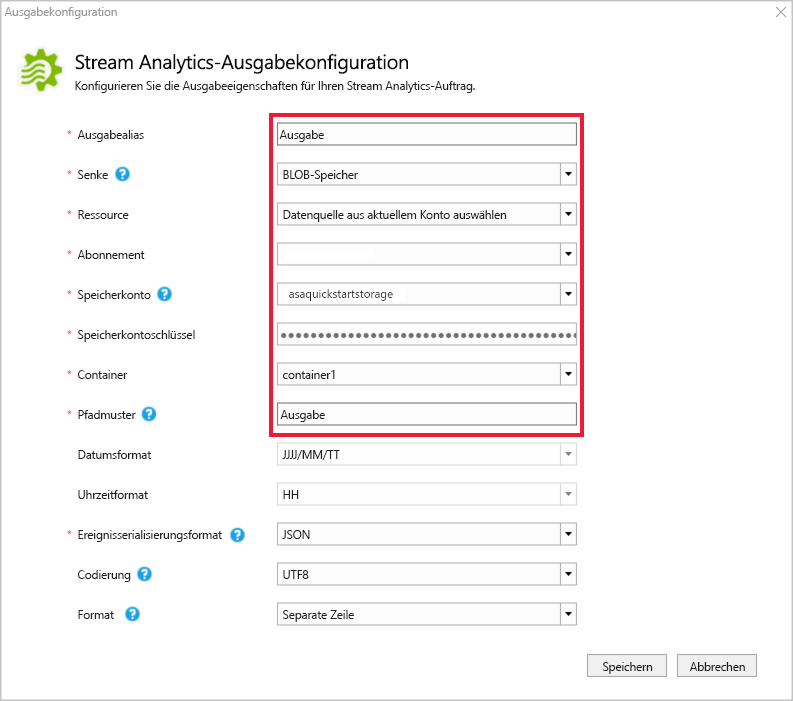

## <a name="define-the-transformation-query"></a>Definieren der Transformationsabfrage

1. Öffnen Sie im **Projektmappen-Explorer** von Visual Studio die Datei **Script.asaql**.

2. Fügen Sie die folgende Abfrage hinzu:

   ```sql
   SELECT 
   System.Timestamp AS OutputTime,
   dspl AS SensorName,
   Avg(temp) AS AvgTemperature
   INTO
     Output
   FROM
     Input TIMESTAMP BY time
   GROUP BY TumblingWindow(second,30),dspl
   HAVING Avg(temp)>100
   ```

## <a name="submit-a-stream-analytics-query-to-azure"></a>Übermitteln einer Stream Analytics-Abfrage an Azure

1. Wählen Sie im **Abfrage-Editor** im Skript-Editor die Option **An Azure übermitteln** aus.

2. Wählen Sie die Option **Neuen Azure Stream Analytics-Auftrag erstellen**, und geben Sie unter **Auftragsname** einen Namen ein. Wählen Sie die Werte für **Abonnement**, **Ressourcengruppe** und **Standort** aus, die Sie zu Beginn der Schnellstartanleitung verwendet haben.

   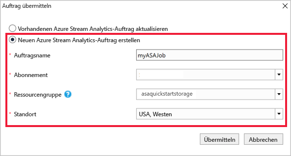

## <a name="start-the-stream-analytics-job-and-check-output"></a>Starten des Stream Analytics-Auftrags und Überprüfen der Ausgabe

1. Wenn Ihr Auftrag erstellt wird, wird die Auftragsansicht automatisch geöffnet. Klicken Sie zum Starten des Auftrags auf die Schaltfläche mit dem grünen Pfeil.

   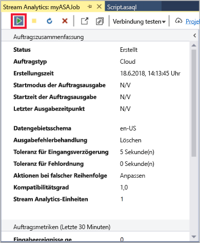

2. Ändern Sie das Datum unter **Benutzerdefinierte Zeit** in `2018-01-01`, und klicken Sie auf **Starten**.

   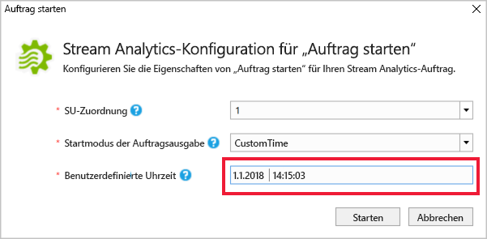

3. Beachten Sie, dass der Status des Auftrags in **Ausführen** geändert wurde, und Eingabe-/Ausgabeereignisse vorhanden sind. Dies kann einige Minuten dauern.

   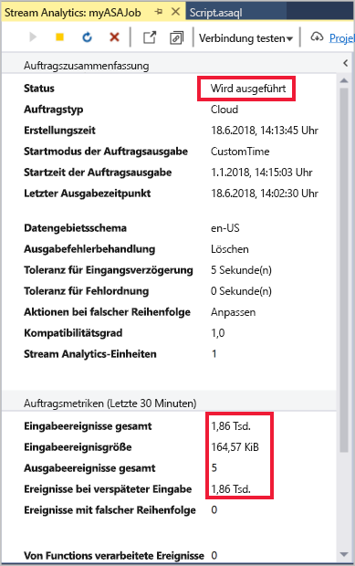

4. Klicken Sie zum Anzeigen der Ergebnisse im Menü **Ansicht** auf **Cloud-Explorer**, und navigieren Sie zum Speicherkonto in Ihrer Ressourcengruppe. Doppelklicken Sie unter **Blobcontainer** auf **container1** und dann auf den Dateipfad der **Ausgabe**.

   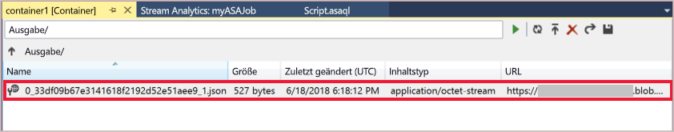

## <a name="clean-up-resources"></a>Bereinigen von Ressourcen

Löschen Sie die Ressourcengruppe, den Streamingauftrag und alle dazugehörigen Ressourcen, wenn Sie sie nicht mehr benötigen. Durch das Löschen des Auftrags verhindern Sie, dass Kosten für die vom Auftrag verbrauchten Streamingeinheiten anfallen. Wenn Sie den Auftrag in Zukunft verwenden möchten, können Sie ihn beenden und später bei Bedarf neu starten. Wenn Sie diesen Auftrag nicht weiter verwenden möchten, löschen Sie alle von diesem Schnellstart erstellten Ressourcen. Führen Sie dazu folgende Schritte aus:

1. Klicken Sie im Azure-Portal im Menü auf der linken Seite auf **Ressourcengruppen** und dann auf den Namen der erstellten Ressource.  

2. Klicken Sie auf der Seite mit Ihrer Ressourcengruppe auf **Löschen**, geben Sie im Textfeld den Namen der zu löschenden Ressource ein, und klicken Sie dann auf **Löschen**.

## <a name="next-steps"></a>Nächste Schritte

In diesem Schnellstart haben Sie einen einfachen Stream Analytics-Auftrag bereitgestellt. Wenn Sie Informationen zum Konfigurieren anderer Eingabequellen sowie zum Ausführen der Echtzeiterkennung benötigen, lesen Sie den folgenden Artikel:

> [!div class="nextstepaction"]
> [Erste Schritte mit Azure Stream Analytics: Betrugserkennung in Echtzeit](stream-analytics-real-time-fraud-detection.md)
