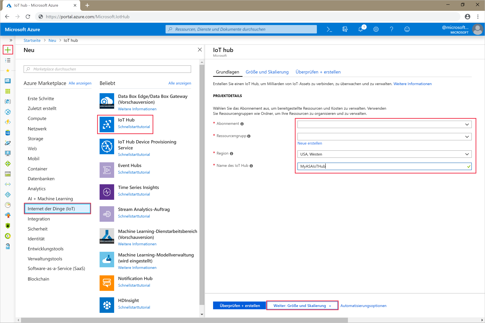
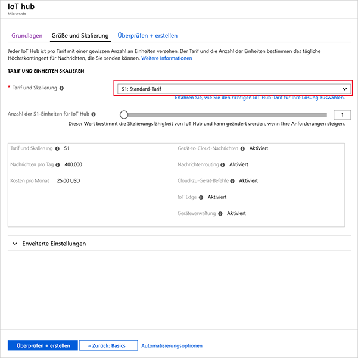
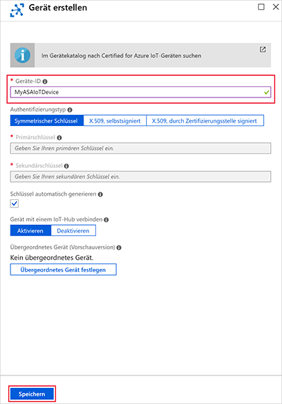
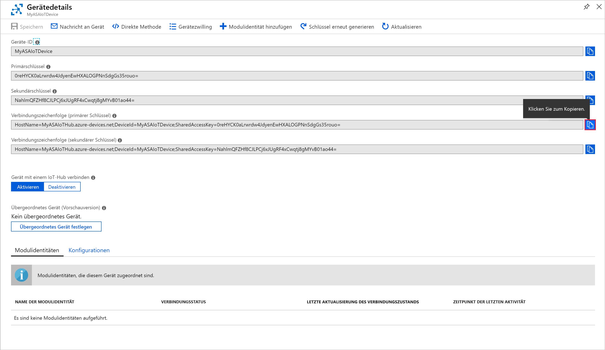
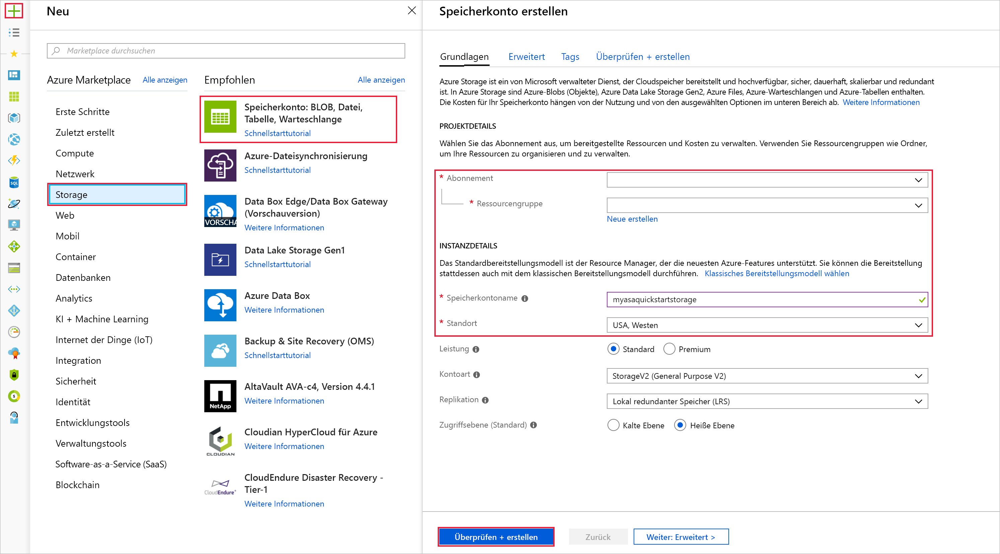
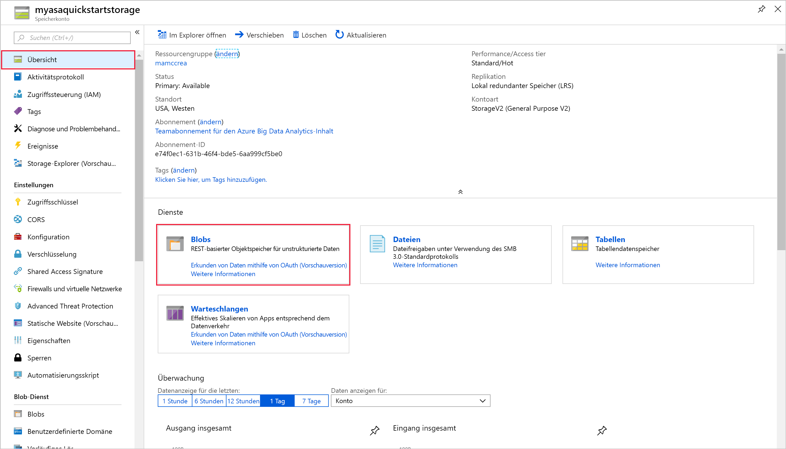
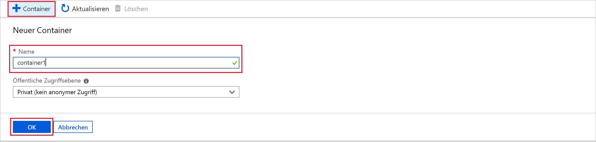
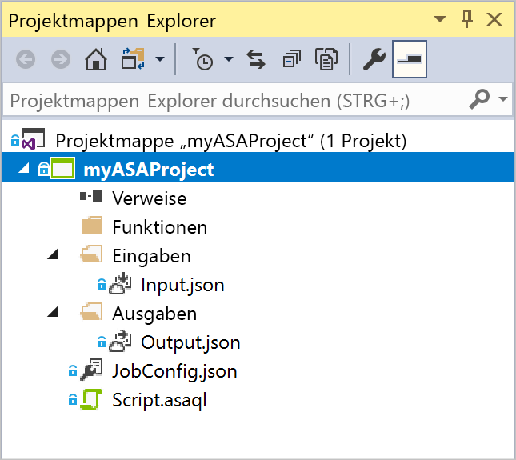
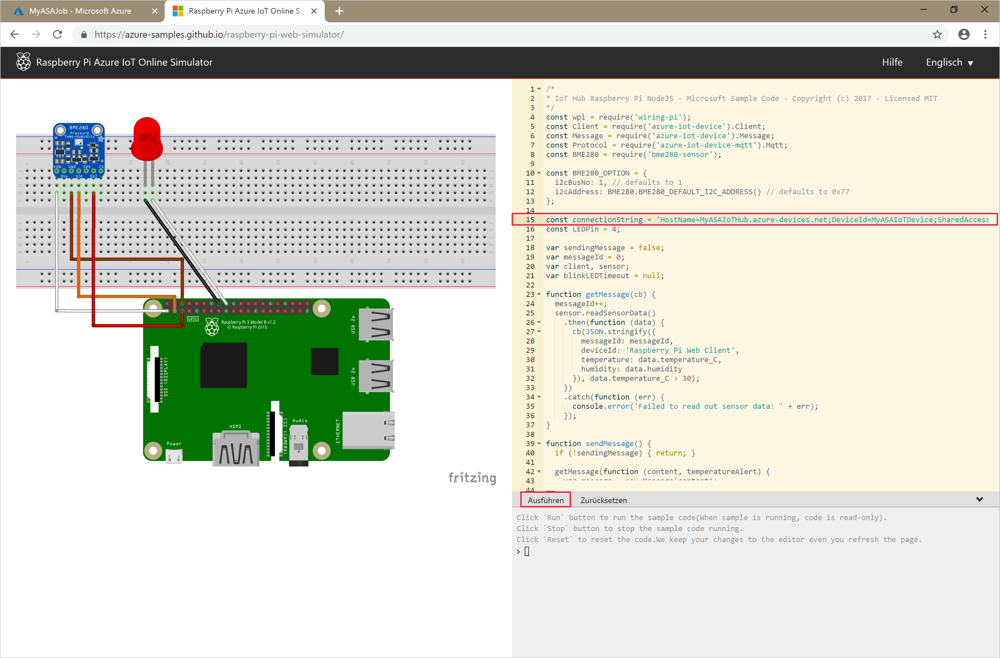

# <a name="quickstart-create-a-stream-analytics-job-by-using-the-azure-stream-analytics-tools-for-visual-studio"></a>Schnellstart: Erstellen eines Stream Analytics-Auftrags mithilfe des Azure Stream Analytics-Tools für Visual Studio

In dieser Schnellstartanleitung wird gezeigt, wie Sie mithilfe der Azure Stream Analytics-Tools für Visual Studio einen Stream Analytics-Auftrag erstellen und ausführen. Der Beispielauftrag liest Streamingdaten von einem IoT Hub-Gerät. Sie legen einen Auftrag fest, der bei Überschreitung von 27 Grad die Durchschnittstemperatur berechnet und die entsprechenden Ausgabeereignisse in eine neue Datei im Blobspeicher schreibt.

## <a name="before-you-begin"></a>Voraussetzungen

* Wenn Sie kein Azure-Abonnement besitzen, können Sie ein [kostenloses Konto](https://azure.microsoft.com/free/) erstellen.

* Melden Sie sich beim [Azure-Portal](https://portal.azure.com/) an.

* Installieren Sie Visual Studio 2017, Visual Studio 2015 oder Visual Studio 2013 Update 4. Die Editionen Enterprise (Ultimate/Premium), Professional und Community werden unterstützt. Die Express Edition wird nicht unterstützt.

* Befolgen Sie die [Installationsanweisungen](https://docs.microsoft.com/azure/stream-analytics/stream-analytics-tools-for-visual-studio-install) für die Stream Analytics-Tools für Visual Studio.

## <a name="prepare-the-input-data"></a>Vorbereiten der Eingabedaten

Vor dem Definieren des Stream Analytics-Auftrags sollten Sie die Daten vorbereiten, die später als Auftragseingabe konfiguriert werden. Führen Sie die folgenden Schritte aus, um die für den Auftrag erforderlichen Eingabedaten vorzubereiten:

1. Melden Sie sich beim [Azure-Portal](https://portal.azure.com/) an.

2. Wählen Sie **Ressource erstellen** > **Internet der Dinge (IoT)** > **IoT Hub** aus.

3. Geben Sie im Bereich **IoT Hub** die folgenden Informationen ein:
   
   |**Einstellung**  |**Empfohlener Wert**  |**Beschreibung**  |
   |---------|---------|---------|
   |Abonnement  | \<Ihr Abonnement\> |  Wählen Sie das gewünschte Azure-Abonnement aus. |
   |Ressourcengruppe   |   asaquickstart-resourcegroup  |   Wählen Sie **Neu erstellen** aus, und geben Sie einen neuen Ressourcengruppennamen für Ihr Konto ein. |
   |Region  |  \<Die Region, die Ihren Benutzern am nächsten liegt\> | Wählen Sie einen geografischen Standort aus, an dem Sie Ihre IoT Hub-Instanz hosten können. Verwenden Sie den Standort, der Ihren Benutzern am nächsten ist. |
   |IoT Hub-Name  | MyASAIoTHub  |   Wählen Sie einen Namen für Ihre IoT Hub-Instanz aus.   |

   

4. Klicken Sie auf **Weiter: Set size and scale** (Größe und Skalierung festlegen).

5. Wählen Sie eine Option für **Tarif und Skalierung** aus. Legen Sie für diese Schnellstartanleitung den Tarif **F1 – Free** fest, wenn er für Ihr Abonnement noch verfügbar ist. Falls der Tarif „Free“ nicht verfügbar ist, sollten Sie den niedrigsten verfügbaren Tarif wählen. Weitere Informationen finden Sie unter [IoT Hub – Preise](https://azure.microsoft.com/pricing/details/iot-hub/).

   

6. Klicken Sie auf **Überprüfen + erstellen**. Überprüfen Sie die Informationen zu IoT Hub, und klicken Sie auf **Erstellen**. Die Erstellung der IoT Hub-Instanz kann mehrere Minuten dauern. Sie können den Fortschritt im Bereich **Benachrichtigungen** überwachen.

7. Klicken Sie in Ihrem IoT Hub-Navigationsmenü unter **IoT-Geräte** auf **Hinzufügen**. Fügen Sie eine **Geräte-ID** hinzu, und klicken Sie auf **Speichern**.

   

8. Öffnen Sie das Gerät nach der Erstellung in der Liste **IoT-Geräte**. Kopieren Sie **Verbindungszeichenfolge – Primärschlüssel** zur späteren Verwendung in einen Editor.

   

## <a name="create-blob-storage"></a>Erstellen eines Blobspeichers

1. Klicken Sie in der linken oberen Ecke des Azure-Portals auf **Ressource erstellen** > **Speicher** > **Speicherkonto**.

2. Geben Sie im Bereich **Speicherkonto erstellen** einen Speicherkontonamen, den Standort und die Ressourcengruppe ein. Wählen Sie den gleichen Standort und die gleiche Ressourcengruppe wie für die von Ihnen erstellte IoT Hub-Instanz. Klicken Sie dann zum Erstellen des Kontos auf **Überprüfen + erstellen**.

   

3. Wählen Sie nach der Erstellung des Speicherkontos im Bereich **Übersicht** die Kachel**Blobs** aus.

   

4. Wählen Sie auf der Seite **Blob-Dienst** die Option **Container** aus, und geben Sie einen Namen für Ihren Container (etwa *container1*) ein. Übernehmen Sie für **Öffentliche Zugriffsebene** die Option **Private (no anonymous access)** (Privat (kein anonymer Zugriff)), und wählen Sie **OK** aus.

   

## <a name="create-a-stream-analytics-project"></a>Erstellen eines Stream Analytics-Projekts

1. Starten Sie Visual Studio.

2. Wählen Sie **Datei > Neues Projekt** aus.  

3. Wählen Sie in der Vorlagenliste links **Stream Analytics** und dann **Azure Stream Analytics Application** (Azure Stream Analytics-Anwendung) aus.  

4. Geben Sie **Name**, **Speicherort** und **Projektmappenname** für Ihr Projekt ein, und klicken Sie auf **OK**.

   

Sehen Sie sich die Elemente an, die in einem Azure Stream Analytics-Projekt enthalten sind.

   


## <a name="choose-the-required-subscription"></a>Auswählen des erforderlichen Abonnements

1. Wählen Sie in Visual Studio im Menü **Ansicht** den **Server-Explorer** aus.

2. Klicken Sie mit der rechten Maustaste auf **Azure**, wählen Sie **Verbindung mit Microsoft Azure-Abonnement herstellen** aus, und melden Sie sich dann mit Ihrem Azure-Konto an.

## <a name="define-input"></a>Festlegen der Eingabe

1. Erweitern Sie im **Projektmappen-Explorer** den Knoten **Eingaben**, und doppelklicken Sie auf **Input.json**.

2. Fügen Sie unter **Stream Analytics Input Configuration** (Stream Analytics-Eingabekonfiguration) die folgenden Werte ein:

   |**Einstellung**  |**Empfohlener Wert**  |**Beschreibung**   |
   |---------|---------|---------|
   |Eingabealias  |  Eingabe   |  Geben Sie einen Namen zur Identifizierung der Auftragseingabe ein.   |
   |Quellentyp   |  Datenstrom |  Wählen Sie die geeignete Eingabequelle aus: Datenstrom oder Referenzdaten.   |
   |Quelle  |  IoT Hub |  Wählen Sie die geeignete Eingabequelle aus.   |
   |Ressource  | Datenquelle aus aktuellem Konto wählen | Geben Sie Daten entweder manuell ein, oder wählen Sie ein vorhandenes Konto aus.   |
   |Abonnement  |  \<Ihr Abonnement\>   | Wählen Sie das Azure-Abonnement aus, in dem sich die erstellte IoT Hub-Instanz befindet.   |
   |IoT Hub  |  MyASAIoTHub   |  Wählen Sie den Namen Ihrer IoT Hub-Instanz aus, oder geben Sie ihn ein. IoT Hub-Namen werden automatisch erkannt, wenn sie unter demselben Abonnement erstellt werden.   |
   
3. Übernehmen Sie für die anderen Optionen die Standardwerte, und klicken Sie zum Speichern der Einstellungen auf **Speichern**.  

   

## <a name="define-output"></a>Definieren der Ausgabe

1. Erweitern Sie im **Projektmappen-Explorer** den Knoten **Ausgaben**, und doppelklicken Sie auf **Output.json**.

2. Fügen Sie unter **Stream Analytics Output Configuration** (Stream Analytics-Ausgabekonfiguration) die folgenden Werte ein:

   |**Einstellung**  |**Empfohlener Wert**  |**Beschreibung**   |
   |---------|---------|---------|
   |Ausgabealias  |  Output   |  Geben Sie einen Namen zur Identifizierung der Auftragsausgabe ein.   |
   |Senke   |  Blob Storage |  Wählen Sie die geeignete Senke aus.    |
   |Ressource  |  Geben Sie die Datenquelleneinstellungen manuell an. |  Geben Sie Daten entweder manuell ein, oder wählen Sie ein vorhandenes Konto aus.   |
   |Abonnement  |  \<Ihr Abonnement\>   | Wählen Sie das Azure-Abonnement mit dem von Ihnen erstellten Speicherkonto aus. Das Speicherkonto kann sich im gleichen oder in einem anderen Abonnement befinden. In diesem Beispiel wird davon ausgegangen, dass Sie ein Speicherkonto im gleichen Abonnement erstellt haben.   |
   |Speicherkonto  |  asaquickstartstorage   |  Wählen Sie den Namen des Speicherkontos aus, oder geben Sie ihn ein. Speicherkontonamen werden automatisch erkannt, wenn sie im gleichen Abonnement erstellt werden.   |
   |Container  |  container1   |  Wählen Sie den vorhandenen Container aus, den Sie in Ihrem Speicherkonto erstellt haben.   |
   |Pfadmuster  |  output   |  Geben Sie den Namen eines Dateipfads ein, der innerhalb des Containers erstellt werden soll.   |
   
3. Übernehmen Sie für die anderen Optionen die Standardwerte, und klicken Sie zum Speichern der Einstellungen auf **Speichern**.  

   

## <a name="define-the-transformation-query"></a>Definieren der Transformationsabfrage

1. Öffnen Sie im **Projektmappen-Explorer** von Visual Studio die Datei **Script.asaql**.

2. Fügen Sie die folgende Abfrage hinzu:

   ```sql
   SELECT *
   INTO BlobOutput
   FROM IoTHubInput
   HAVING Temperature > 27
   ```

## <a name="submit-a-stream-analytics-query-to-azure"></a>Übermitteln einer Stream Analytics-Abfrage an Azure

1. Wählen Sie im **Abfrage-Editor** im Skript-Editor die Option **An Azure übermitteln** aus.

2. Wählen Sie die Option **Neuen Azure Stream Analytics-Auftrag erstellen**, und geben Sie unter **Auftragsname** einen Namen ein. Wählen Sie die Werte für **Abonnement**, **Ressourcengruppe** und **Standort** aus, die Sie zu Beginn der Schnellstartanleitung verwendet haben.

   

## <a name="run-the-iot-simulator"></a>Ausführen des IoT-Simulators

1. Öffnen Sie den [Raspberry Pi Azure IoT Online Simulator](https://azure-samples.github.io/raspberry-pi-web-simulator/) über eine neue Browserregisterkarte oder ein neues Fenster.

2. Ersetzen Sie den Platzhalter in Zeile 15 durch die zuvor gespeicherte Verbindungszeichenfolge für das Azure IoT Hub-Gerät.

3. Klicken Sie auf **Ausführen**. In der Ausgabe sollten nun die Sensordaten und -nachrichten angezeigt werden, die an Ihre IoT Hub-Instanz gesendet werden.

   

## <a name="start-the-stream-analytics-job-and-check-output"></a>Starten des Stream Analytics-Auftrags und Überprüfen der Ausgabe

1. Wenn Ihr Auftrag erstellt wird, wird die Auftragsansicht automatisch geöffnet. Klicken Sie zum Starten des Auftrags auf die Schaltfläche mit dem grünen Pfeil.

   

2. Ändern Sie den **Startmodus der Auftragsausgabe** in **JobStartTime**, und wählen Sie **Start**.

   

3. Beachten Sie, dass der Status des Auftrags in **Ausführen** geändert wurde, und Eingabe-/Ausgabeereignisse vorhanden sind. Dies kann einige Minuten dauern.

   

4. Klicken Sie zum Anzeigen der Ergebnisse im Menü **Ansicht** auf **Cloud-Explorer**, und navigieren Sie zum Speicherkonto in Ihrer Ressourcengruppe. Doppelklicken Sie unter **Blobcontainer** auf **container1** und dann auf den Dateipfad der **Ausgabe**.

   

## <a name="clean-up-resources"></a>Bereinigen von Ressourcen

Löschen Sie die Ressourcengruppe, den Streamingauftrag und alle dazugehörigen Ressourcen, wenn Sie sie nicht mehr benötigen. Durch das Löschen des Auftrags verhindern Sie, dass Kosten für die vom Auftrag verbrauchten Streamingeinheiten anfallen. Wenn Sie den Auftrag in Zukunft verwenden möchten, können Sie ihn beenden und später bei Bedarf neu starten. Wenn Sie diesen Auftrag nicht weiter verwenden möchten, löschen Sie alle von diesem Schnellstart erstellten Ressourcen. Führen Sie dazu folgende Schritte aus:

1. Klicken Sie im Azure-Portal im Menü auf der linken Seite auf **Ressourcengruppen** und dann auf den Namen der erstellten Ressource.  

2. Klicken Sie auf der Seite mit Ihrer Ressourcengruppe auf **Löschen**, geben Sie im Textfeld den Namen der zu löschenden Ressource ein, und klicken Sie dann auf **Löschen**.

## <a name="next-steps"></a>Nächste Schritte

In dieser Schnellstartanleitung haben Sie einen einfachen Stream Analytics-Auftrag mit Visual Studio bereitgestellt. Stream Analytics-Aufträge können auch mit dem [Azure-Portal](stream-analytics-quick-create-portal.md) und [PowerShell](stream-analytics-quick-create-powershell.md) bereitgestellt werden. 

Informationen zu den Azure Stream Analytics-Tools für Visual Studio finden Sie im folgenden Artikel:

> [!div class="nextstepaction"]
> [Anzeigen von Azure Stream Analytics-Aufträgen mit Visual Studio](stream-analytics-vs-tools.md)
