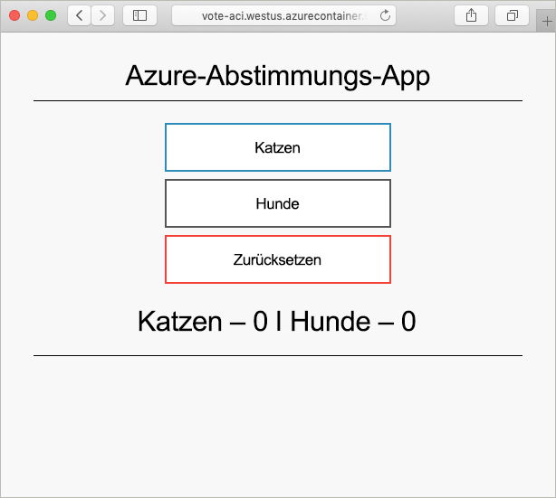

# <a name="create-a-terraform-configuration-for-azure"></a>Erstellen einer Terraform-Konfiguration für Azure

In diesem Beispiel erfahren Sie, wie Sie eine Terraform-Konfiguration erstellen und diese Konfiguration in Azure bereitstellen. Am Ende des Beispiels haben Sie eine Azure Cosmos DB-Instanz, eine Azure-Containerinstanz sowie eine Anwendung bereitgestellt, die mit diesen beiden Ressourcen verwendet werden kann. In diesem Dokument werden sämtliche Schritte in Azure Cloud Shell ausgeführt. (Die Terraform-Tools sind in Azure Cloud Shell vorinstalliert.) Wenn Sie das Beispiel auf Ihrem eigenen System durchgehen möchten, finden Sie [hier](../virtual-machines/linux/terraform-install-configure.md) eine Installationsanleitung für Terraform.

## <a name="create-first-configuration"></a>Erstellen der ersten Konfiguration

In diesem Abschnitt erstellen Sie die Konfiguration für eine Azure Cosmos DB-Instanz.

Wählen Sie **Jetzt ausprobieren** aus, um Azure Cloud Shell zu öffnen. Geben Sie anschließend `code .` ein, um den Cloud Shell-Code-Editor zu öffnen.

```azurecli-interactive
code .
```

Kopieren Sie die folgende Terraform-Konfiguration, und fügen Sie sie ein.

Diese Konfiguration modelliert eine Azure-Ressourcengruppe, eine zufällige ganze Zahl und eine Azure Cosmos DB-Instanz. Die zufällige ganze Zahl wird im Namen der Cosmos DB-Instanz verwendet. Außerdem werden mehrere Cosmos DB-Einstellungen konfiguriert. Eine vollständige Liste der Terraform-Konfigurationen für Cosmos DB finden Sie in der [Terraform-Referenz für Cosmos DB](https://www.terraform.io/docs/providers/azurerm/r/cosmosdb_account.html).

Speichern Sie die Datei als `main.tf`, wenn Sie fertig sind. Hierzu können Sie die Auslassungspunkte rechts oben im Code-Editor verwenden.

```azurecli-interactive
resource "azurerm_resource_group" "vote-resource-group" {
  name     = "vote-resource-group"
  location = "westus"
}

resource "random_integer" "ri" {
  min = 10000
  max = 99999
}

resource "azurerm_cosmosdb_account" "vote-cosmos-db" {
  name                = "tfex-cosmos-db-${random_integer.ri.result}"
  location            = "${azurerm_resource_group.vote-resource-group.location}"
  resource_group_name = "${azurerm_resource_group.vote-resource-group.name}"
  offer_type          = "Standard"
  kind                = "GlobalDocumentDB"

  consistency_policy {
    consistency_level       = "BoundedStaleness"
    max_interval_in_seconds = 10
    max_staleness_prefix    = 200
  }

  geo_location {
    location          = "westus"
    failover_priority = 0
  }
}
```

Der Befehl [terraform init](https://www.terraform.io/docs/commands/init.html) initialisiert das Arbeitsverzeichnis. Führen Sie `terraform init` im Cloud Shell-Terminal aus, um die Bereitstellung der neuen Konfiguration vorzubereiten.

```azurecli-interactive
terraform init
```

Mit dem Befehl [terraform plan](https://www.terraform.io/docs/commands/plan.html) können Sie überprüfen, ob die Konfiguration ordnungsgemäß formatiert ist, und sich ansehen, welche Ressourcen erstellt, aktualisiert oder gelöscht werden. Die Ergebnisse können in einer Datei gespeichert und später zum Anwenden der Konfiguration verwendet werden.

Führen Sie `terraform plan` aus, um die neue Terraform-Konfiguration zu testen.

```azurecli-interactive
terraform plan --out plan.out
```

Wenden Sie die Konfiguration mithilfe von [terraform apply](https://www.terraform.io/docs/commands/apply.html) an, und geben Sie dabei den Namen der Plandatei an. Dieser Befehl stellt die Ressourcen in Ihrem Azure-Abonnement bereit.

```azurecli-interactive
terraform apply plan.out
```

Nach Abschluss des Vorgangs sehen Sie, dass die Ressourcengruppe erstellt und eine Azure Cosmos DB-Instanz in der Ressourcengruppe platziert wurde.

## <a name="update-configuration"></a>Aktualisieren der Konfiguration

Aktualisieren Sie die Konfiguration, um eine Azure-Containerinstanz einzuschließen. In dem Container wird eine Anwendung ausgeführt, die Daten liest und in Cosmos DB schreibt.

Kopieren Sie die folgende Konfiguration, und fügen Sie sie am Ende der Datei `main.tf` ein. Speichern Sie die Datei, wenn Sie fertig sind.

Zwei Umgebungsvariablen werden festgelegt: `COSMOS_DB_ENDPOINT` und `COSMOS_DB_MASTERKEY`. Diese Variablen enthalten den Standort und den Schlüssel für den Datenbankzugriff. Die Werte für diese Variablen werden aus der Datenbankinstanz abgerufen, die im letzten Schritt erstellt wurde. Dieser Prozess wird als Interpolation bezeichnet. Weitere Informationen zur Terraform-Interpolation finden Sie unter [Interpolation Syntax](https://www.terraform.io/docs/configuration/interpolation.html) (Syntax für die Interpolation).


Die Konfiguration enthält auch einen Ausgabeblock, der den vollqualifizierten Domänennamen (Fully Qualified Domain Name, FQDN) der Containerinstanz zurückgibt.

```azurecli-interactive
resource "azurerm_container_group" "vote-aci" {
  name                = "vote-aci"
  location            = "${azurerm_resource_group.vote-resource-group.location}"
  resource_group_name = "${azurerm_resource_group.vote-resource-group.name}"
  ip_address_type     = "public"
  dns_name_label      = "vote-aci"
  os_type             = "linux"

  container {
    name   = "vote-aci"
    image  = "microsoft/azure-vote-front:cosmosdb"
    cpu    = "0.5"
    memory = "1.5"
    ports  = {
      port     = 80
      protocol = "TCP"
    }

    secure_environment_variables {
      "COSMOS_DB_ENDPOINT"  = "${azurerm_cosmosdb_account.vote-cosmos-db.endpoint}"
      "COSMOS_DB_MASTERKEY" = "${azurerm_cosmosdb_account.vote-cosmos-db.primary_master_key}"
      "TITLE"               = "Azure Voting App"
      "VOTE1VALUE"          = "Cats"
      "VOTE2VALUE"          = "Dogs"
    }
  }
}

output "dns" {
  value = "${azurerm_container_group.vote-aci.fqdn}"
}
```

Führen Sie `terraform plan` aus, um den aktualisierten Plan zu erstellen und die vorzunehmenden Änderungen anzuzeigen. Dort sollte zu sehen sein, dass der Konfiguration eine Azure-Containerinstanz hinzugefügt wurde.

```azurecli-interactive
terraform plan --out plan.out
```

Führen Sie abschließend `terraform apply` aus, um die Konfiguration anzuwenden.

```azurecli-interactive
terraform apply plan.out
```

Notieren Sie sich nach Abschluss dieses Vorgangs den FQDN der Containerinstanz.

## <a name="test-application"></a>Testen der Anwendung

Navigieren Sie zum FQDN der Containerinstanz. Wenn alles korrekt konfiguriert wurde, sollte die folgende Anwendung angezeigt werden:



## <a name="clean-up-resources"></a>Bereinigen von Ressourcen

Wenn Sie die Azure-Ressourcen und die Ressourcengruppe nicht mehr benötigen, können Sie sie mithilfe des Befehls [terraform destroy](https://www.terraform.io/docs/commands/destroy.html) entfernen.

```azurecli-interactive
terraform destroy -auto-approve
```

## <a name="next-steps"></a>Nächste Schritte

In diesem Beispiel haben Sie eine Terraform-Konfiguration erstellt, bereitgestellt und zerstört. Weitere Informationen zur Verwendung von Terraform in Azure finden Sie in der folgenden Terraform-Dokumentation:

> [!div class="nextstepaction"]
> [Azure Provider](https://www.terraform.io/docs/providers/azurerm/) (Azure-Anbieter)
