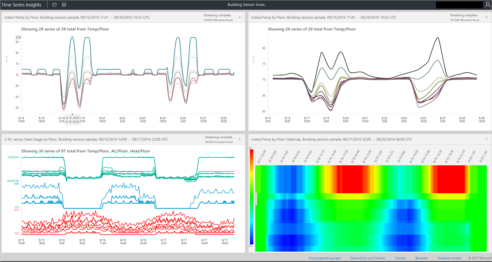

# Azure Time Series Insights-Explorer
In diesem Artikel werden die verschiedenen in der Web-App des Time Series Insights-Explorers verfügbaren Funktionen und Optionen vorgestellt. Sie verwenden den Time Series Insights-Explorer in Ihrem Webbrowser, um Visualisierungen Ihrer Daten zu erstellen.
 
Azure Time Series Insights ist ein vollständig verwalteter Analyse-, Speicher- und Visualisierungsdienst, der die simultane Untersuchung und Analyse von Milliarden von IoT-Ereignissen ermöglicht. Sie erhalten globale Einblicke in Ihre Daten und können basierend darauf Ihre IoT-Lösung schneller überprüfen und kostenintensive Ausfallzeiten unternehmenskritischer Geräte vermeiden. Sie können versteckte Trends aufdecken, Abweichungen erkennen und Ursachenanalysen nahezu in Echtzeit durchführen. Der Time Series Insights-Explorer ist derzeit als öffentliche Vorschau verfügbar.

## Voraussetzungen

Vor der Verwendung des Time Series Insights-Explorers müssen Sie folgende Schritte ausführen:
- Erstellen einer Time Series Insights-Umgebung
- Bereitstellen des Zugriffs auf Ihr Konto in der Umgebung
- Hinzufügen und Speichern einer Ereignisquelle zum Erfassen von Daten

## Untersuchen und Abfragen von Daten
Binnen weniger Minuten nach der Verbindung der Ereignisquelle mit der Time Series Insights-Umgebung können Sie Ihre Zeitreihendaten untersuchen und abfragen.

1. Öffnen Sie zunächst den [Time Series Insights-Explorer](https://insights.timeseries.azure.com/) in Ihrem Webbrowser, und wählen Sie links im Fenster eine Umgebung aus. Alle Umgebungen, auf die Sie Zugriff haben, sind in alphabetischer Reihenfolge aufgeführt.

2. Nachdem Sie eine Umgebung ausgewählt haben, verwenden Sie entweder die Konfigurationen **VON** und **BIS** im oberen Bereich, oder ziehen Sie die gewünschte Zeitspanne.  Klicken Sie auf die Lupe oben rechts, oder klicken Sie mit der rechten Maustaste auf die ausgewählte Zeitspanne, und wählen Sie **Suchen** aus.  

3. Sie können zudem die Verfügbarkeit automatisch einmal pro Minute aktualisieren, indem Sie die Schaltfläche **Auto On** (Automatisch ein) auswählen.

4. Beachten Sie, dass Sie über das Azure-Cloudsymbol zu Ihrer Umgebung im Azure-Portal gelangen.

   

5. Als Nächstes sehen Sie ein Diagramm, in dem die Anzahl aller Ereignisse in der ausgewählten Zeitspanne angezeigt wird.  Hier stehen mehrere Steuerelemente zur Verfügung:

    **Editor-Bereich für Begriffe:** Im Begriffsbereich führen Sie Abfragen in Ihrer Umgebung durch.  Er befindet sich auf der linken Seite des Bildschirms und umfasst folgende Optionen: 
      - **Measure:** In dieser Dropdownliste werden alle numerischen Spalten (Doubles) angezeigt.
      - **Split By** (Teilen nach): In dieser Dropdownliste werden Kategoriespalten (Strings) angezeigt.
      - Über die Systemsteuerung neben „Measure“ können Sie die Schrittinterpolation aktivieren, Mindest- und Höchstwerte anzeigen und die Y-Achse anpassen.  Zudem können Sie festlegen, ob die angezeigten Daten als Anzahl, Durchschnitt oder Summe der Daten angezeigt wird.
      - Sie können bis zu fünf Begriffe hinzufügen, die auf derselben X-Achse angezeigt werden.  Verwenden Sie die Schaltfläche **copy-down** (Kopieren), um einen zusätzlichen Begriff hinzuzufügen, oder klicken Sie auf **Hinzufügen**, um einen neuen Begriff hinzuzufügen.

      

      - **Prädikat:** Über das Prädikat können Sie die Ereignisse mithilfe der unten aufgeführten Operanden schnell filtern. Wenn Sie eine Suche durch Auswählen/Klicken durchführen, wird das Prädikat basierend auf dieser Suche automatisch aktualisiert.  Folgende Operandentypen werden unterstützt:

         |Vorgang  |Unterstützte Typen  |Hinweise  |
         |---------|---------|---------|
         |<, >, <=, >=     |  Double, DateTime, TimeSpan       |         |
         |=, !=, <>     | String, Bool, Double, DateTime, TimeSpan, NULL        |         |
         |IN     | String, Bool, Double, DateTime, TimeSpan, NULL        |  Alle Operanden müssen denselben Typ aufweisen oder eine NULL-Konstante sein.        |
         |HAS     | String        |  Im rechten Bereich sind nur konstante Zeichenfolgenliterale zulässig. Leere Zeichenfolgen und NULL sind nicht zulässig.       |

      - **Beispiele für Abfragen**
      
         

6. Mit dem Schieberegler für die **Intervallgröße** können Sie die Intervalle in einer Zeitspanne vergrößern und verkleinern.  Dies ermöglicht eine genauere Steuerung der Bewegung zwischen größeren Zeitabschnitten, die Trends gleichmäßig bis hin zu kleinsten Zeitabschnitten in Millisekunden anzeigen, sodass Sie präzise, hochauflösende Schnitte Ihrer Daten anzeigen können. Der Standardstartpunkt des Schiebereglers ist als optimierte Ansicht der Daten aus Ihrer Auswahl festgelegt und gleicht somit Auflösung, Abfragegeschwindigkeit und Granularität aus.

7. Mit dem Tool **Time Brush** können Sie problemlos zwischen den einzelnen Zeitspannen navigieren, sodass in der intuitiven Benutzeroberfläche eine nahtlose Bewegung zwischen Zeitspannen möglich ist.

8. Mit dem Befehl **Speichern** können Sie die aktuelle Abfrage speichern und zur Freigabe für andere Benutzer der Umgebung aktivieren. Über **Öffnen** können Sie alle Ihre gespeicherten Abfragen und alle für andere Benutzer in Umgebungen, auf die Sie Zugriff haben, freigegebenen Abfragen anzeigen. 

   

9. Das Tool **Perspektivische Ansicht** ermöglicht eine parallele Ansicht von bis zu vier eindeutigen Abfragen. Die Schaltfläche „Perspektivische Ansicht“ finden Sie oben rechts im Diagramm.  

   

10. Im **Diagramm** können Sie Ihre Daten visuell untersuchen. Folgende Diagrammtools sind verfügbar:

   - Auswählen/Klicken und dadurch Aktivieren einer Auswahl einer bestimmten Zeitspanne oder einer einzelnen Datenreihe.  
   - Innerhalb einer Zeitspannenauswahl können Sie Ereignisse vergrößern oder untersuchen.  
   - Innerhalb einer Datenreihe können Sie die Reihe nach einer anderen Spalte teilen, die Reihe als neuen Begriff hinzufügen, nur die ausgewählte Reihe anzeigen, die ausgewählte Reihe ausschließen, die Reihe anheften oder Ereignisse aus der ausgewählten Reihe untersuchen.
   - Im Filterbereich links neben dem Diagramm können Sie alle angezeigten Datenreihen sehen und diese nach Wert oder Namen neu anordnen sowie alle Datenreihen oder spezifische angeheftete oder getrennte Reihen anzeigen.  Sie können außerdem eine einzelne Datenreihe auswählen und nach einer anderen Spalte teilen, die Reihe als neuen Begriff hinzufügen, nur die ausgewählte Reihe anzeigen, die ausgewählte Reihe ausschließen, die Reihe anheften oder Ereignisse aus der ausgewählten Reihe untersuchen.
   - Beim gleichzeitigen Anzeigen von mehreren Begriffen können Sie über die Schaltflächen oben rechts im Diagramm Stapel bilden, die Stapelung aufheben, weitere Daten zu einer Datenreihe anzeigen und für alle Begriffe dieselbe Y-Achse verwenden.
 
    

11. Mithilfe des **Wärmebilds** können Sie schnell eindeutige oder ungewöhnliche Datenreihen in einer bestimmten Abfrage erkennen. Nur ein Suchbegriff kann als Wärmebild visualisiert werden.    

   

12. **Ereignisse:** Wenn Sie oben beim Auswählen oder Klicken mit der rechten Maustaste Ereignisse untersuchen möchten, wird der Ereignisbereich angezeigt.  Hier können Sie alle Ihre Rohereignisse anzeigen und die Ereignisse als JSON- oder CSV-Dateien exportieren. Beachten Sie, dass in Time Series Insights alle Rohdaten gespeichert werden.

   

13. Klicken Sie nach dem Untersuchen von Ereignissen auf die Registerkarte **STATISTIK**, um die Funktionen für Muster und Spaltenstatistik anzuzeigen.  

   - **Muster:** Mit diesem Feature werden die meisten statistisch signifikanten Muster in einer ausgewählten Datenregion angezeigt. So müssen Sie nicht Tausende von Ereignissen prüfen, um festzustellen, welche Muster am meisten Zeit und Energie rechtfertigen. Darüber hinaus können Sie in Time Series Insights direkt in diese statistisch signifikanten Muster springen und dann eine Analyse durchführen. Dieses Feature ist auch nützlich für nachträgliche Überprüfungen von Verlaufsdaten. 

   - **Column stats** (Spaltenstatistik): Mit dieser Funktion werden Diagramme und Tabellen angezeigt, in denen Daten aus den einzelnen Spalten der ausgewählten Datenreihe über die ausgewählte Zeitspanne unterteilt sind.  
 
       

Damit kennen Sie nun die verschiedenen in der Web-App des Time Series Insights-Explorers verfügbaren Funktionen und Optionen. 

## Nächste Schritte
[Diagnostizieren und Beheben von Problemen in der Time Series Insights-Umgebung](time-series-insights-diagnose-and-solve-problems.md)
