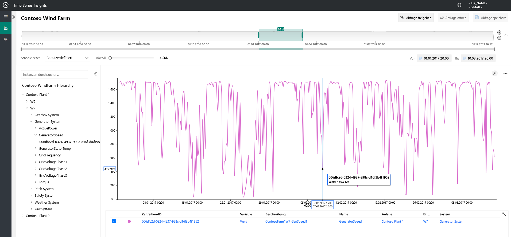
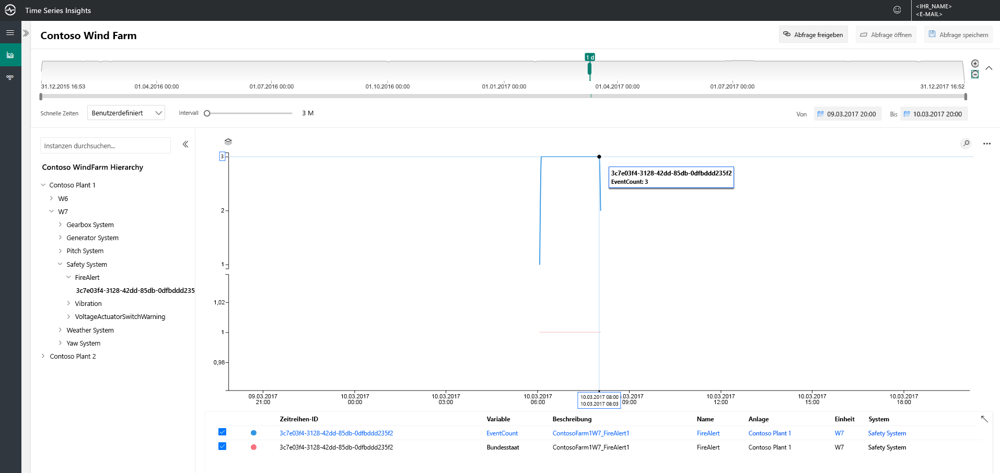
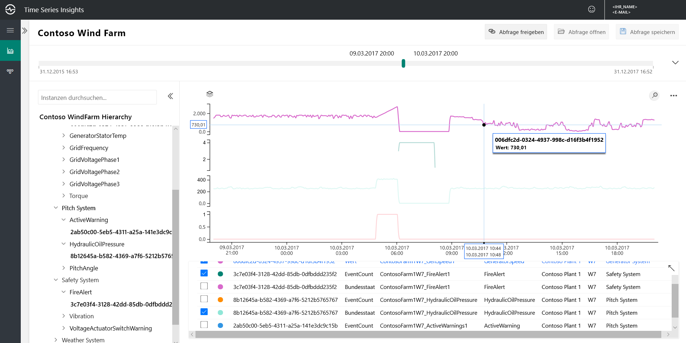
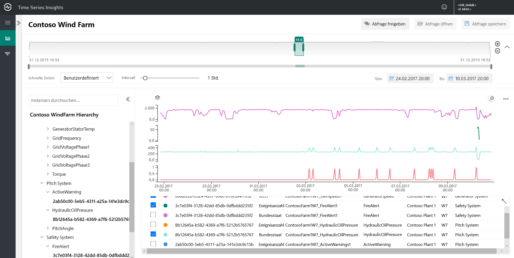
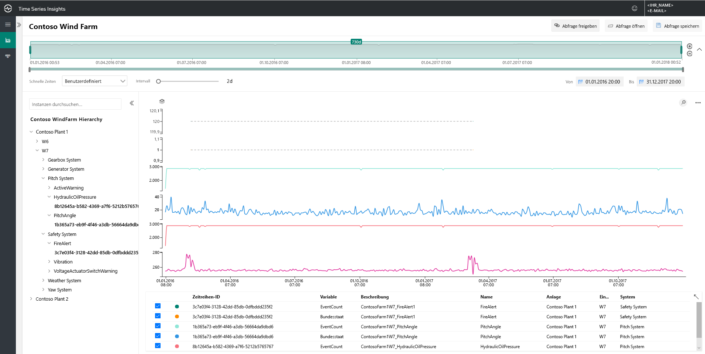
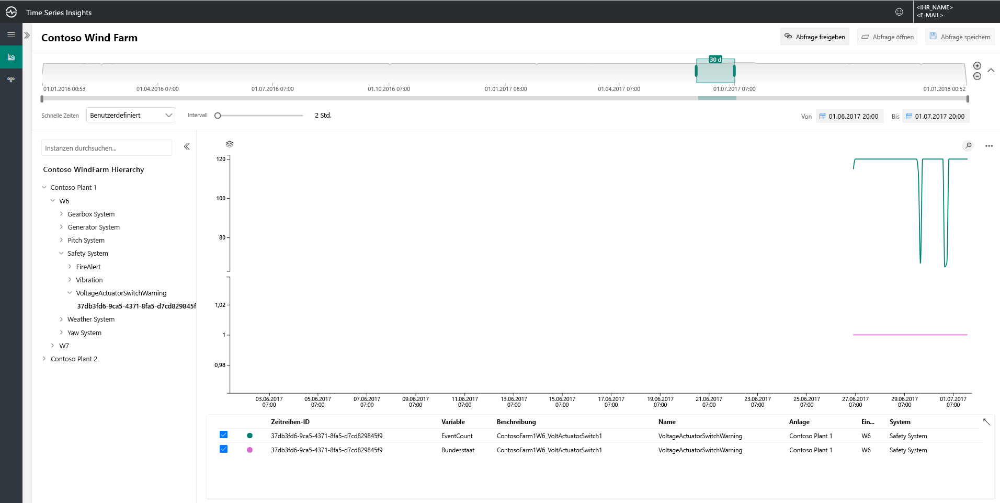
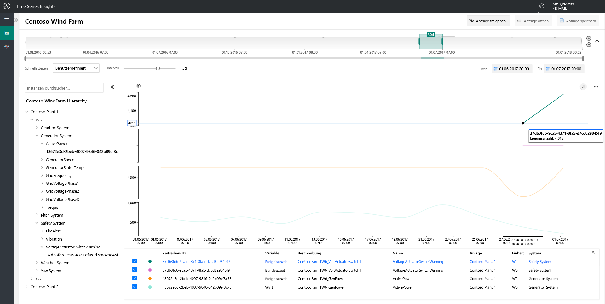
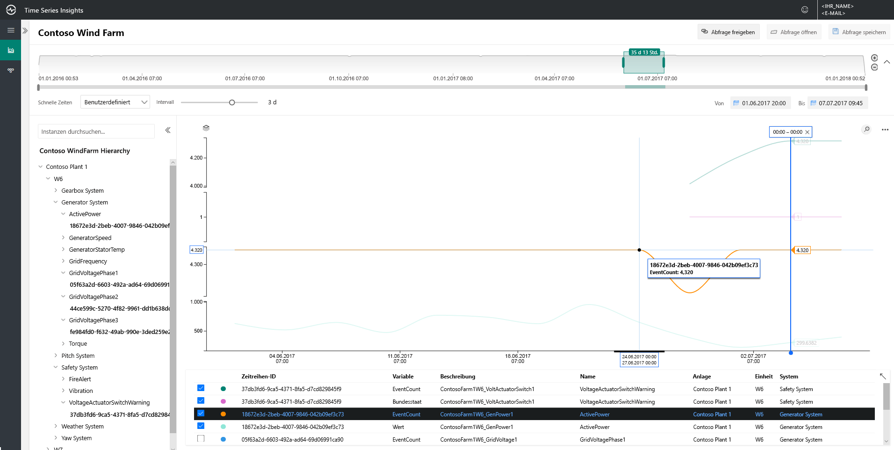
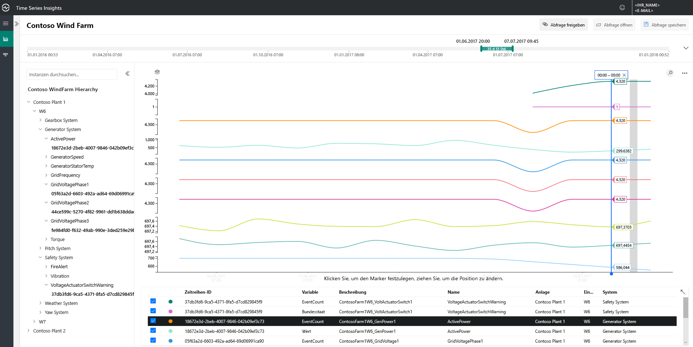

# Schnellstart: Erkunden der Azure Time Series Insights-Demoumgebung (Vorschauversion)

Dieser Schnellstart behandelt die ersten Schritte mit Azure Time Series Insights (Vorschauversion). In der kostenlosen Demoumgebung sehen Sie die wichtigsten Funktionen, die in der Vorschauversion von Time Series Insights hinzugefügt wurden.

Die Demoumgebung der Vorschauversion enthält das Szenariounternehmen Contoso, das zwei Windparks mit jeweils 10 Turbinen betreibt. Jede Turbine verfügt über 20 Sensoren, die jede Minute Daten an Azure IoT Hub melden. Die Sensoren erfassen Informationen zu Witterungsbedingungen, Schaufelteilung und Gierposition sowie Generatorleistung, Getriebeverhalten und Sicherheitsüberwachung.

 Sie erlernen die Verwendung von Time Series Insights, um verwertbare Erkenntnisse aus Contoso-Daten zu gewinnen. Sie führen auch eine kurze Ursachenanalyse durch, um kritische Ausfälle besser vorherzusagen und Wartungsarbeiten durchzuführen.

## Erkunden des Time Series Insights-Explorers in einer Demoumgebung

Der Time Series Insights-Explorer (Vorschauversion) zeigt Verlaufsdaten und Ursachenanalysen. Erste Schritte:

1. Erstellen Sie ein  [kostenloses Azure-Konto](https://azure.microsoft.com/free/?ref=microsoft.com&utm_source=microsoft.com&utm_medium=docs&utm_campaign=visualstudio) , falls noch keines erstellt wurde.

1. Navigieren Sie zur Demoumgebung  [Contoso Wind Farm](https://insights.timeseries.azure.com/preview/samples).  

1. Wenn Sie dazu aufgefordert werden, melden Sie sich mit Ihren Azure-Anmeldeinformationen beim Time Series Insights-Explorer an.

## Arbeiten mit Verlaufsdaten

1. Sehen Sie sich die Windturbine **W7** in **Contoso Plant 1** an.  

    * Aktualisieren Sie den Anzeigebereich in **1/1/17 20:00 bis 3/10/17 20:00 (UTC)**.
    * Wählen Sie den Sensor **Contoso Plant 1** > **W7** > **Generator System** > **GeneratorSpeed** aus. Überprüfen Sie dann die resultierenden Werte.

      

1. Vor Kurzem hat Contoso einen Brand in der Windturbine **W7** erkannt. Die Meinungen über die unmittelbare Brandursache gehen auseinander. Bei näherer Betrachtung sehen wir, dass der Feueralarmsensor während des Brandes aktiviert wurde.

    * Aktualisieren Sie den Anzeigebereich in **3/9/17 20:00 bis 3/10/17 20:00 (UTC)**.
    * Wählen Sie den Sensor **Safety System** > **FireAlert** aus.

      

1. Überprüfen Sie andere Ereignisse um den Zeitpunkt des Brandes, um zu verstehen, was passiert ist. Sowohl der Öldruck als auch die aktiven Warnungen stiegen kurz vor dem Brand an.

    * Wählen Sie den Sensor **Pitch System** > **HydraulicOilPressure** aus.
    * Wählen Sie den Sensor **Pitch System** > **ActiveWarning** aus.

      

1. Die Sensoren für Öldruck und aktive Warnungen stiegen direkt vor dem Brand stark an. Erweitern Sie die angezeigte Zeitreihe, um andere vorhandene Anzeichen im Vorfeld des Brands zu sehen. Beide Sensoren schwankten im Laufe der Zeit konstant und zeigten ein anhaltendes und besorgniserregendes Muster.

    * Aktualisieren Sie den Anzeigebereich in **2/24/17 20:00 bis 3/10/17 20:00 (UTC)**.

      

1. Die Untersuchung von Verlaufsdaten aus zwei Jahren ergab, dass schon einmal ein Brand mit den gleichen Sensorschwankungen aufgetreten ist.

    * Aktualisieren Sie den Anzeigebereich in **1/1/16 bis 12/31/17** (alle Daten).

      

Mithilfe von Azure Time Series Insights und unseren Sensortelemetriedaten haben wir einen langfristigen und problematischen Trend entdeckt, der sich in unseren Verlaufsdaten verbirgt. Mit diesen neuen Erkenntnissen haben wir folgende Möglichkeiten:

> [!div class="checklist"]
> * Erklären, was tatsächlich passiert ist
> * Beheben des Problems
> * Implementieren besserer Warnbenachrichtigungssysteme

## Analyse der Grundursache

1. Einige Szenarien erfordern eine anspruchsvolle Analyse, um subtile Hinweise in Daten aufzudecken. Wählen Sie Windmühle **W6** am **25.6.** aus.

    * Aktualisieren Sie den Anzeigebereich in **6/1/17 20:00 bis 7/1/17 20:00 (UTC)**.
    * Wählen Sie dann den Sensor **Contoso Plant 1** > **W6** > **Safety System** > **VoltageActuatorSwitchWarning** aus.

      

1. Mit der Warnung wird auf ein Problem mit der Ausgangsspannung des Generators hingewiesen. Die Gesamtleistung des Generators liegt im Rahmen der normalen Parameter unseres aktuellen Intervalls. Durch eine Erhöhung unseres Intervalls entsteht ein weiteres Muster: Es gibt einen deutlichen Rückgang.

    * Entfernen Sie den Sensor **VoltageActuatorSwitchWarning**.
    * Wählen Sie den Sensor **Generator System** > **ActivePower** aus.
    * Aktualisieren Sie das Intervall auf **3d**.

      

1. Durch die Erweiterung des Zeitbereichs können wir feststellen, ob das Problem behoben wurde oder ob es weiterhin besteht.

    * Erweitern Sie die Zeitspanne auf 60 Tage.

      

1. Weiter Sensordatenpunkte können hinzugefügt werden, um einen besseren Kontext zu schaffen. Je mehr Sensoren wir anzeigen können, desto besser ist unser Verständnis des Problems. Wir setzen einen Marker, um die tatsächlichen Werte anzuzeigen. 

    * Wählen Sie die Sensoren **Generator System** > **GridVoltagePhase1**, **GridVoltagePhase2** und **GridVoltagePhase3** aus.
    * Setzen Sie einen Marker für den letzten Datenpunkt im sichtbaren Bereich.

      

    Die drei Spannungssensoren arbeiten vergleichbar und innerhalb normaler Parameter. Es sieht so aus, als wäre Sensor **GridVoltagePhase3** die Ursache.

1. Mit den hinzugefügten, hochgradig kontextbezogenen Daten, ist es noch wahrscheinlicher, dass der Rückgang in Phase 3 das Problem ist. Jetzt können wir das Problem an unser Wartungsteam weiterleiten und nützliche Hinweise zur Ursache der Warnung bereitstellen.  

    * Aktualisieren Sie die Anzeige, um für alle Sensoren unter **Generator System** denselben Diagrammmaßstab zu verwenden.

       

## Nächste Schritte

Nun können Sie Ihre eigene Time Series Insights-Umgebung (Vorschauversion) erstellen:

> [!div class="nextstepaction"]
> [Plan your Time Series Insights Preview environment](time-series-insights-update-plan.md) (Planen Ihrer Time Series Insights-Umgebung (Vorschauversion))

Informationen zur Navigation der Demoumgebung und ihren Funktionen:

> [!div class="nextstepaction"]
> [Visualisieren von Daten in der Explorer Preview](time-series-insights-update-explorer.md)
