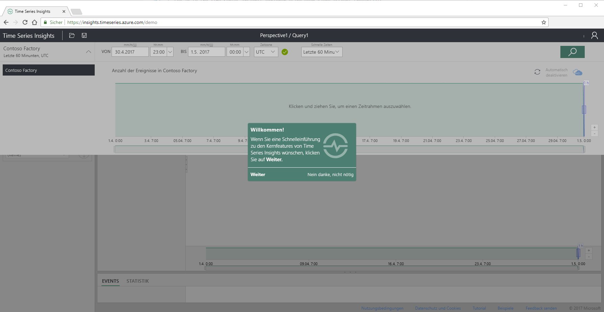
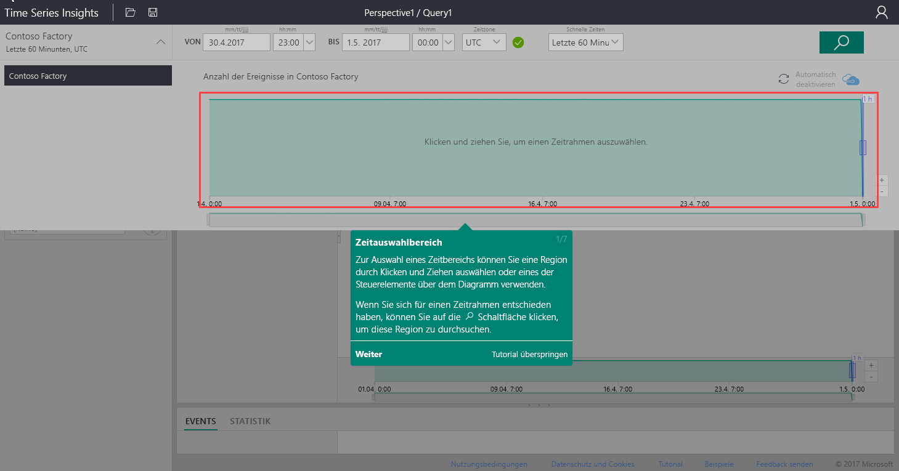
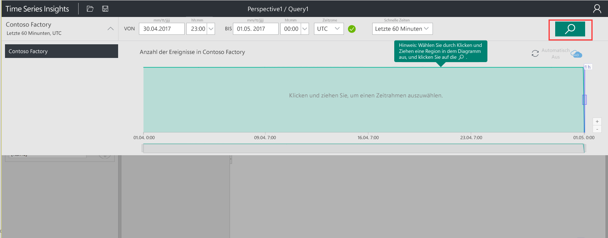
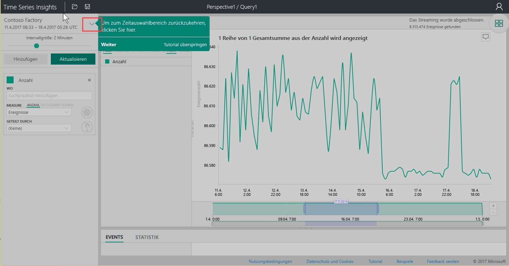
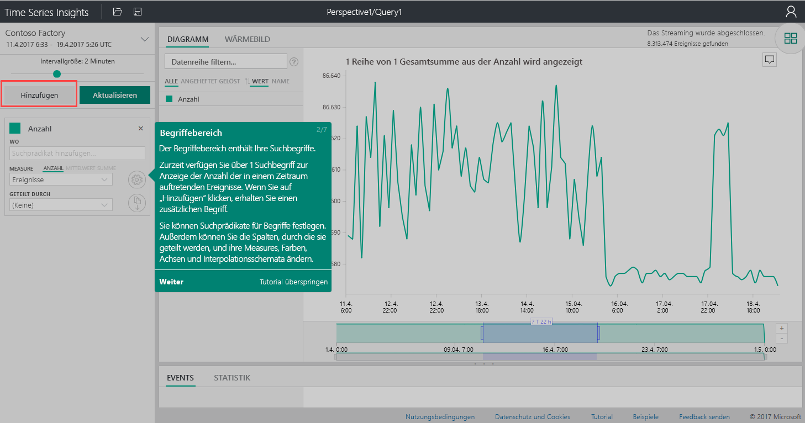
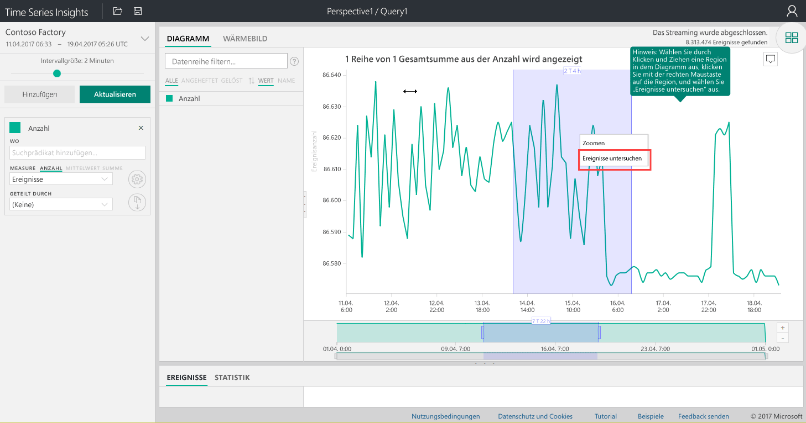
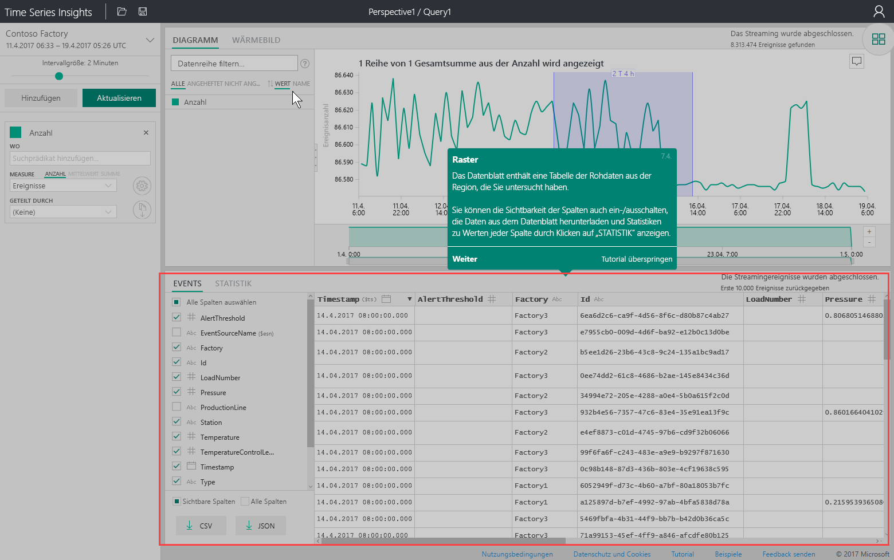
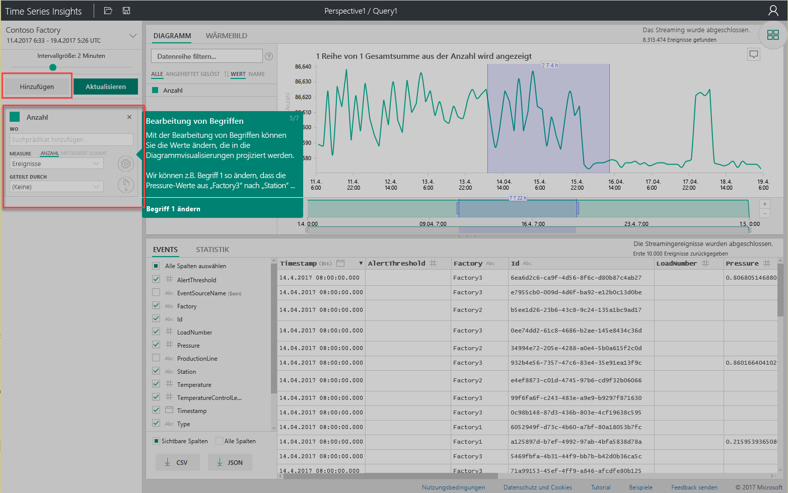
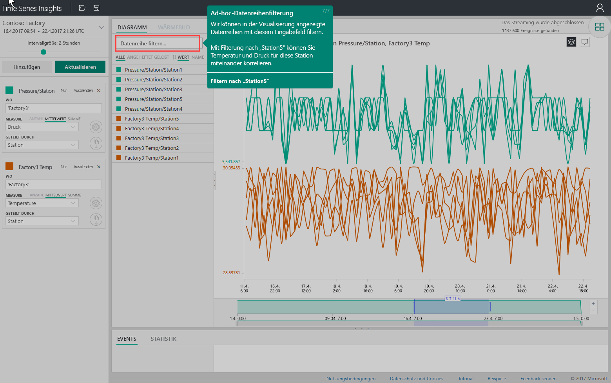

# Schnellstart: Erkunden von Azure Time Series Insights
Dieser Schnellstart veranschaulicht die ersten Schritte mit dem Azure Time Series Insights-Explorer in einer kostenlosen Demoumgebung. Sie erfahren, wie Sie große IoT-Datenmengen im Webbrowser visualisieren, und lernen die wichtigsten Features des Time Series Insights-Explorers kennen. 

Azure Time Series Insights ist ein vollständig verwalteter Analyse-, Speicher- und Visualisierungsdienst, der die simultane Untersuchung und Analyse von Milliarden von IoT-Ereignissen ermöglicht. Sie erhalten globale Einblicke in Ihre Daten und können basierend darauf Ihre IoT-Lösung schneller überprüfen sowie kostenintensive Ausfallzeiten unternehmenskritischer Geräte vermeiden, indem Sie wenig ersichtliche Trends aufdecken, Abweichungen erkennen und die Analyse zugrunde liegender Ursachen beinahe in Echtzeit durchführen können.  Wenn Sie eine Anwendung erstellen, in der Zeitreihendaten gespeichert oder abgefragt werden sollen, können Sie sie mit den REST-APIs von Time Series Insights entwickeln.

Wenn Sie über kein Azure-Abonnement verfügen, können Sie ein [kostenloses Azure-Konto](https://azure.microsoft.com/free/?ref=microsoft.com&utm_source=microsoft.com&utm_medium=docs&utm_campaign=visualstudio) erstellen, bevor Sie beginnen.

## Erkunden des Time Series Insights-Explorers in einer Demoumgebung

1. Navigieren Sie in Ihrem Browser zu [https://insights.timeseries.azure.com/demo](https://insights.timeseries.azure.com/demo). 

2. Melden Sie sich bei der entsprechenden Aufforderung beim Time Series Insights-Explorer mit den Anmeldeinformationen für Ihr Azure-Konto an. 
 
3. Die Seite zur Schnelleinführung in Time Series Insights wird angezeigt. Klicken Sie auf **Weiter**, um die Schnelleinführung zu starten.

   

4. Der **Zeitauswahlbereich** wird angezeigt. Wählen Sie in diesem Bereich den Zeitrahmen aus, der dargestellt werden soll.

   

5. Ziehen Sie die Region, und klicken Sie dann auf die Schaltfläche **Suchen**.
 
    

   In Time Series Insights wird eine Diagrammvisualisierung für den angegebenen Zeitrahmen angezeigt. In dem Liniendiagramm können Sie verschiedene Aktionen ausführen, z.B. Filtern, Anheften, Sortieren und Stapeln. 

   Um zum **Zeitauswahlbereich** zurückzukehren, klicken Sie wie dargestellt auf den Pfeil nach unten:

   

6. Klicken Sie im **Begriffsbereich** auf **Hinzufügen**, um einen neuen Suchbegriff hinzuzufügen.

   

7. Im Diagramm können Sie eine Region auswählen, mit der rechten Maustaste auf die Region klicken und **Explore Events** (Ereignisse durchsuchen) auswählen.
 
   

   Ein Raster der Rohdaten aus der durchsuchten Region wird angezeigt:

   

8. Bearbeiten Sie die Begriffe, um die Werte im Diagramm zu ändern, und fügen Sie einen weiteren Begriff hinzu, um verschiedene Werttypen übergreifend zu korrelieren:

   

9. Geben Sie im Feld **Datenreihe filtern** einen Filterbegriff zum Filtern von Ad-hoc-Reihen ein. Geben Sie für den Schnellstart **Station5** ein, um die Temperatur und den Druck für die Station übergreifend zu korrelieren.
 
   

Nach Abschluss des Schnellstarts können Sie das Beispiel-DataSet verwenden, um verschiedene Visualisierungen zu erstellen. 

### Nächste Schritte
Nun können Sie Ihre eigene Time Series Insights-Umgebung erstellen:
> [!div class="nextstepaction"]
> [Planen Ihrer Time Series Insights-Umgebung](time-series-insights-environment-planning.md)
