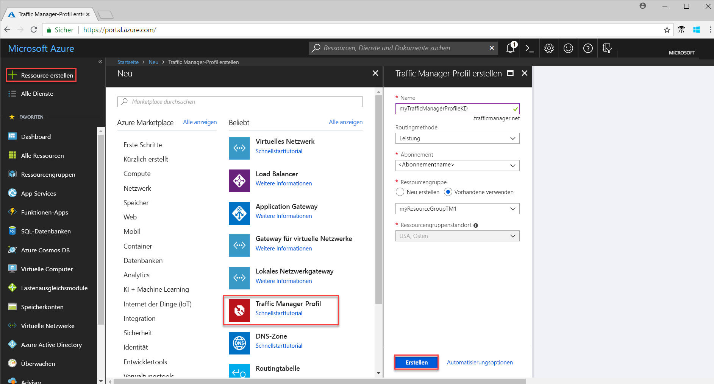
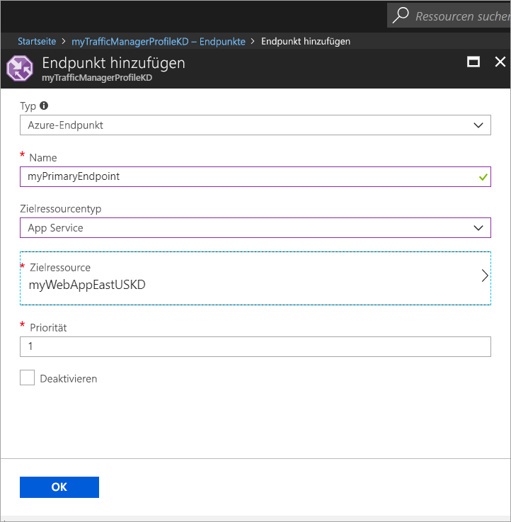
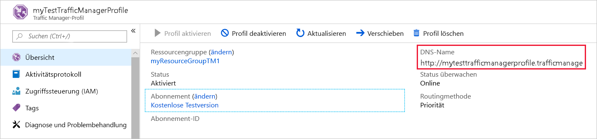
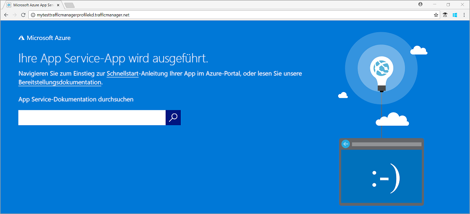

# Schnellstart: Erstellen eines Traffic Manager-Profils für eine hoch verfügbare Webanwendung

In dieser Schnellstartanleitung wird beschrieben, wie Sie ein Traffic Manager-Profil erstellen, das die Hochverfügbarkeit Ihrer Webanwendung sicherstellt. 

Das in dieser Schnellstartanleitung beschriebene Szenario umfasst zwei Instanzen einer Webanwendung, die in verschiedenen Azure-Regionen ausgeführt werden. Ein auf [Endpunktpriorität](traffic-manager-routing-methods.md#priority) basierendes Traffic Manager-Profil wird erstellt, über das Benutzerdatenverkehr an den primären Standort weitergeleitet werden kann, an dem die Anwendung ausgeführt wird. Traffic Manager überwacht kontinuierlich die Webanwendung und bietet automatisches Failover am Sicherungsstandort, wenn der primäre Standort nicht verfügbar ist.

Wenn Sie kein Azure-Abonnement besitzen, können Sie ein [kostenloses Konto](https://azure.microsoft.com/free/?WT.mc_id=A261C142F) erstellen, bevor Sie beginnen.

## Anmelden bei Azure 
Melden Sie sich unter https://portal.azure.com beim Azure-Portal an.

## Voraussetzungen
Für diese Schnellstartanleitung müssen Sie zwei Instanzen einer Webanwendung bereitstellen, die in verschiedenen Azure-Regionen (*USA, Osten* und *Europa, Westen*) ausgeführt werden. Die beiden Webanwendungsinstanzen dienen als primärer und sekundärer Endpunkt für Traffic Manager.

1. Klicken Sie links oben auf dem Bildschirm auf **Ressource erstellen** > **Web** > **Web-App** > **Erstellen**.
2. Geben Sie unter **Web-App** die folgenden Informationen ein, oder wählen Sie sie aus, und geben Sie Standardeinstellungen ein, wenn noch keine Angaben gemacht wurden:

     | Einstellung         | Wert     |
     | ---              | ---  |
     | NAME           | Geben Sie einen eindeutigen Namen für Ihre Web-App ein.  |
     | Ressourcengruppe          | Klicken Sie auf **Neu**, und geben Sie *myResourceGroupTM1* ein. |
     | App Service-Plan/Standort         | Wählen Sie **Neu**aus.  Geben Sie als App Service-Plan *myAppServicePlanEastUS* ein, und klicken Sie dann auf **OK**. 
     |      Standort  |   USA (Ost)        |
    |||

3. Klicken Sie auf **Erstellen**.
4. Eine Standardwebsite wird erstellt, wenn die Web-App erfolgreich bereitgestellt wurde.
5. Wiederholen Sie die Schritte 1 bis 3, um eine zweite Website in einer anderen Azure-Region mit den folgenden Einstellungen zu erstellen:

     | Einstellung         | Wert     |
     | ---              | ---  |
     | NAME           | Geben Sie einen eindeutigen Namen für Ihre Web-App ein.  |
     | Ressourcengruppe          | Klicken Sie auf **Neu**, und geben Sie *myResourceGroupTM2* ein. |
     | App Service-Plan/Standort         | Wählen Sie **Neu**aus.  Geben Sie als App Service-Plan *myAppServicePlanWestEurope* ein, und klicken Sie dann auf **OK**. 
     |      Standort  |   Europa, Westen      |
    |||

## Erstellen eines Traffic Manager-Profils
Erstellen Sie ein Traffic Manager-Profil, das Benutzerdatenverkehr basierend auf Endpunktpriorität weiterleitet.

1. Klicken Sie links oben auf dem Bildschirm auf **Ressource erstellen** > **Netzwerk** > **Traffic Manager-Profil** > **Erstellen**.
2. Geben Sie unter **Traffic Manager-Profil erstellen** die folgenden Informationen ein, oder wählen Sie sie aus, übernehmen Sie die Standardwerte für die übrigen Einstellungen, und klicken Sie auf **Erstellen**:
    
    | Einstellung                 | Wert                                              |
    | ---                     | ---                                                |
    | NAME                   | Dieser Name muss innerhalb der Zone „trafficmanager.net“ eindeutig sein und ergibt den DNS-Namen **trafficmanager.net**, der für den Zugriff auf Ihr Traffic Manager-Profil verwendet wird.|
    | Routingmethode          | Wählen Sie die Routingmethode **Priorität** aus.|
    | Abonnement            | Wählen Sie Ihr Abonnement aus.|
    | Ressourcengruppe          | Wählen Sie **Vorhandene** und dann *myResourceGroupTM1* aus.|
    |Standort |Diese Einstellung bezieht sich auf den Speicherort der Ressourcengruppe und hat keine Auswirkungen auf das Traffic Manager-Profil, das global bereitgestellt wird.|
    |||
    
    
   

## Hinzufügen von Traffic Manager-Endpunkten

Fügen Sie die Website in der Region *USA, Osten* als primären Endpunkt für das Routing des gesamten Benutzerdatenverkehrs hinzu. Fügen Sie die Website in *Europa, Westen* als Sicherungsendpunkt hinzu. Wenn der primäre Endpunkt nicht verfügbar ist, wird der Datenverkehr automatisch an den sekundären Endpunkt weitergeleitet.

1. Suchen Sie in der Suchleiste des Portals nach dem Namen des Traffic Manager-Profils, das Sie im vorhergehenden Abschnitt erstellt haben, und wählen Sie in den angezeigten Ergebnissen das Profil aus.
2. Klicken Sie unter **Traffic Manager-Profil** im Abschnitt **Einstellungen** auf **Endpunkte** und dann auf **Hinzufügen**.
3. Geben Sie die folgenden Informationen ein, oder wählen Sie sie aus, übernehmen Sie die Standardwerte für die übrigen Einstellungen, und klicken Sie auf **OK**:

    | Einstellung                 | Wert                                              |
    | ---                     | ---                                                |
    | Typ                    | Azure-Endpunkt                                   |
    | NAME           | myPrimaryEndpoint                                        |
    | Zielressourcentyp           | App Service                          |
    | Zielressource          | Klicken Sie auf **App Service auswählen**, um die Auflistung der Web-Apps im gleichen Abonnement anzuzeigen. Wählen Sie unter **Ressource** den App Service aus, den Sie als ersten Endpunkt hinzufügen möchten. |
    | Priorität               | Wählen Sie **1**. Dies bewirkt, dass der gesamte Datenverkehr an diesen Endpunkt geleitet wird, sofern sein Status intakt ist.    |
    
4. Wiederholen Sie die Schritte 2 und 3 für den nächsten Web-Apps-Endpunkt. Achten Sie darauf, ihn mit einem auf **2** festgelegten Wert für **Priorität** hinzuzufügen.
5.  Wenn Sie das Hinzufügen beider Endpunkte abgeschlossen haben, werden diese unter **Traffic Manager-Profil** zusammen mit ihrem Überwachungsstatus als **Online** angezeigt.

    

## Testen des Traffic Manager-Profils
In diesem Abschnitt ermitteln Sie zunächst den Domänennamen des Traffic Manager-Profils und zeigen dann an, wie für Traffic Manager ein Failover am sekundären Endpunkt ausgeführt wird, wenn der primäre Endpunkt nicht verfügbar ist.
### Ermitteln des DNS-Namens
1.  Suchen Sie in der Suchleiste des Portals nach dem Namen des **Traffic Manager-Profils**, das Sie im vorhergehenden Abschnitt erstellt haben. Klicken Sie in den angezeigten Ergebnissen auf das Traffic Manager-Profil.
2. Klicken Sie auf **Overview**.
3. Unter **Traffic Manager-Profil** wird der DNS-Name Ihres neu erstellten Traffic Manager-Profils angezeigt.
  
   

### Anzeigen von Traffic Manager in Aktion

1. Geben Sie in einem Webbrowser den DNS-Namen Ihres Traffic Manager-Profils an, um die Standardwebsite Ihrer Web-App anzuzeigen. In diesem Schnellstartszenario werden alle Anforderungen an den primären Endpunkt weitergeleitet, der auf **Priorität 1** festgelegt wird.

2. Wenn Sie das Traffic Manager-Failover ansehen möchten, deaktivieren Sie den primären Standort wie folgt:
    1. Wählen Sie auf der Seite des Traffic Manager-Profils **Einstellungen**>**Endpunkte**>*MyPrimaryEndpoint*.
    2. Klicken Sie unter *MyPrimaryEndpoint* auf **Deaktiviert**. 
    3. Der Status des primären Endpunkts *MyPrimaryEndpoint* wird nun als **Deaktiviert** angezeigt.
3. Kopieren Sie den DNS-Namen des Traffic Manager-Profils aus dem vorherigen Schritt, um die Website in einem Webbrowser anzuzeigen. Wenn der primäre Endpunkt deaktiviert ist, wird der Benutzerdatenverkehr an den sekundären Endpunkt weitergeleitet.

## Bereinigen von Ressourcen
Löschen Sie die Ressourcengruppen, Webanwendungen und alle dazugehörigen Ressourcen, wenn Sie sie nicht mehr benötigen. Wählen Sie dazu die Ressourcengruppen (*myResourceGroupTM1* und *myResourceGroupTM2*) aus, und klicken Sie auf **Löschen**.

## Nächste Schritte
In dieser Schnellstartanleitung haben Sie ein Traffic Manager-Profil erstellt, das die Weiterleitung des Benutzerdatenverkehrs für hoch verfügbare Webanwendungen ermöglicht. Weitere Informationen zum Weiterleiten des Datenverkehrs finden Sie in den Tutorials zu Traffic Manager.

> [!div class="nextstepaction"]
> [Traffic Manager-Tutorials](traffic-manager-configure-performance-routing-method.md)

