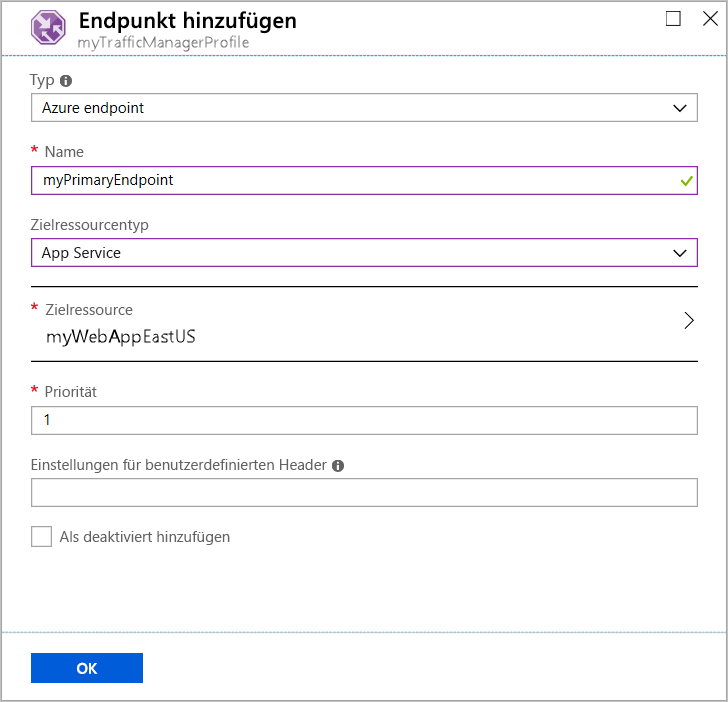

# Schnellstart: Erstellen eines Traffic Manager-Profils für eine hochverfügbare Webanwendung

In dieser Schnellstartanleitung wird beschrieben, wie Sie ein Traffic Manager-Profil erstellen, mit dem die Hochverfügbarkeit für Ihre Webanwendung sichergestellt wird.

In dieser Schnellstartanleitung werden zwei Instanzen einer Webanwendung beschrieben. Jede Instanz wird in einer anderen Azure-Region ausgeführt. Sie erstellen ein Traffic Manager-Profil basierend auf der [Endpunktpriorität](traffic-manager-routing-methods.md#priority). Das Profil leitet den Benutzerdatenverkehr an den primären Standort, an dem die Webanwendung ausgeführt wird. Die Webanwendung wird von Traffic Manager ständig überwacht. Wenn der primäre Standort nicht verfügbar ist, erfolgt automatisch ein Failover zum Sicherungsstandort.

Wenn Sie kein Azure-Abonnement besitzen, können Sie jetzt ein [kostenloses Konto](https://azure.microsoft.com/free/?WT.mc_id=A261C142F) erstellen.

## Anmelden bei Azure

Melden Sie sich beim [Azure-Portal](https://portal.azure.com) an.

## Voraussetzungen

Für diese Schnellstartanleitung benötigen Sie zwei Instanzen einer Webanwendung, die in zwei unterschiedlichen Azure-Regionen bereitgestellt werden (*USA, Osten* und *Europa, Westen*). Jede dient jeweils als primärer bzw. Failoverendpunkt für Traffic Manager.

1. Wählen Sie oben links auf dem Bildschirm die Option **Ressource erstellen** > **Web** > **Web-App**.
2. Geben Sie unter **Web-App** die folgenden Einstellungen ein (bzw. wählen Sie sie aus):

    | Einstellung | Wert |
    | ------- | ----- |
    | App-Name | Geben Sie einen eindeutigen Namen für Ihre Web-App ein.  |
    | Abonnement | Wählen Sie das Abonnement aus, auf das die Web-App angewendet werden soll. |
    | Ressourcengruppe | Klicken Sie auf **Neu erstellen**, und geben Sie *myResourceGroupTM1* ein. |
    | Betriebssystem | Wählen Sie **Windows** als Betriebssystem aus. |
    | Veröffentlichen | Wählen Sie **Code** als Format für die Veröffentlichung aus. |

3. Wählen Sie **App Service-Plan/Standort**.
4. Wählen Sie unter **App Service-Plan** die Option **Neu erstellen**.
5. Geben Sie unter **Neuer App Service-Plan** die folgenden Einstellungen ein (bzw. wählen Sie sie aus):

    | Einstellung | Wert |
    | ------- | ----- |
    | App Service-Plan | Geben Sie *myAppServicePlanEastUS* ein. |
    | Standort | USA (Ost) |
    | Tarif | S1 Standard |

6. Klicken Sie auf **OK**.

7. Wählen Sie unter **Web-App** die Option **Erstellen**. Wenn die Bereitstellung der Web-App erfolgreich war, wird eine Standardwebsite erstellt.

8. Wiederholen Sie die Schritte 1 bis 7 mit diesen Einstellungen, um eine zweite Website in einer anderen Azure-Region zu erstellen:

    | Einstellung | Wert |
    | --------| ----- |
    | NAME | Geben Sie einen eindeutigen Namen für Ihre Web-App ein. |
    | Abonnement | Wählen Sie das Abonnement aus, auf das die Web-App angewendet werden soll. |
    | Ressourcengruppe | Wählen Sie **Neu erstellen**, und geben Sie *myResourceGroupTM2* ein. |
    | Betriebssystem | Wählen Sie **Windows** als Betriebssystem aus. |
    | Veröffentlichen | Wählen Sie **Code** als Format für die Veröffentlichung aus. |
    | App Service-Plan/Standort | Geben Sie *myAppServicePlanWestEurope* ein. |
    | Standort | Europa, Westen |
    | Tarif | S1 Standard |

## Erstellen eines Traffic Manager-Profils

Erstellen Sie ein Traffic Manager-Profil, das Benutzerdatenverkehr basierend auf der Endpunktpriorität weiterleitet.

1. Wählen Sie oben links auf dem Bildschirm **Ressource erstellen** > **Netzwerk** > **Traffic Manager-Profil**.
2. Geben Sie unter **Traffic Manager-Profil erstellen** die folgenden Einstellungen ein (bzw. wählen Sie sie aus):

    | Einstellung | Wert |
    | --------| ----- |
    | NAME | Geben Sie einen eindeutigen Namen für Ihr Traffic Manager-Profil ein.|
    | Routingmethode | Wählen Sie **Priorität**.|
    | Abonnement | Wählen Sie das Abonnement aus, auf das das Traffic Manager-Profil angewendet werden soll. |
    | Ressourcengruppe | Wählen Sie *myResourceGroupTM1* aus.|
    | Standort |Diese Einstellung bezieht sich auf den Standort der Ressourcengruppe. Sie wirkt sich nicht auf das Traffic Manager-Profil aus, das global bereitgestellt wird.|

3. Klicken Sie auf **Erstellen**.

## Hinzufügen von Traffic Manager-Endpunkten

Fügen Sie die Website in der Region *USA, Osten* als primären Endpunkt für das Routing des gesamten Benutzerdatenverkehrs hinzu. Fügen Sie die Website in *Europa, Westen* als Failoverendpunkt hinzu. Wenn der primäre Endpunkt nicht verfügbar ist, wird der Datenverkehr automatisch an den Failoverendpunkt weitergeleitet.

1. Geben Sie in der Suchleiste des Portals den Namen des Traffic Manager-Profils ein, das Sie im vorherigen Abschnitt erstellt haben.
2. Wählen Sie das Profil in den Suchergebnissen aus.
3. Wählen Sie im **Traffic Manager-Profil** im Abschnitt **Einstellungen** die Option **Endpunkte** und dann **Hinzufügen**.
4. Geben Sie die folgenden Einstellungen ein (bzw. wählen Sie sie aus):

    | Einstellung | Wert |
    | ------- | ------|
    | Typ | Wählen Sie **Azure-Endpunkt**. |
    | NAME | Geben Sie *myPrimaryEndpoint* ein. |
    | Zielressourcentyp | Wählen Sie **App Service**. |
    | Zielressource | Wählen Sie **App Service auswählen** > **USA, Osten**. |
    | Priorität | Wählen Sie **1**. Der gesamte Datenverkehr wird an diesen Endpunkt gesendet, wenn er fehlerfrei ist. |

    

5. Klicken Sie auf **OK**.
6. Wiederholen Sie die Schritte 3 und 4 mit den folgenden Einstellungen, um einen Failoverendpunkt für Ihre zweite Azure-Region zu erstellen:

    | Einstellung | Wert |
    | ------- | ------|
    | Typ | Wählen Sie **Azure-Endpunkt**. |
    | NAME | Geben Sie *myFailoverEndpoint* ein. |
    | Zielressourcentyp | Wählen Sie **App Service**. |
    | Zielressource | Wählen Sie **App Service auswählen** > **Europa, Westen**. |
    | Priorität | Wählen Sie **2**. Der gesamte Datenverkehr wird an diesen Failoverendpunkt geleitet, wenn der primäre Endpunkt fehlerhaft ist. |

7. Klicken Sie auf **OK**.

Wenn Sie das Hinzufügen der beiden Endpunkte abgeschlossen haben, werden sie im **Traffic Manager-Profil** angezeigt. Beachten Sie, dass der Überwachungsstatus jetzt **Online** lautet.

## Testen des Traffic Manager-Profils

In diesem Abschnitt überprüfen Sie den Domänennamen Ihres Traffic Manager-Profils. Außerdem konfigurieren Sie den primären Endpunkt so, dass er nicht verfügbar ist. Abschließend können Sie sehen, dass die Web-App weiterhin verfügbar ist. Dies liegt daran, dass Traffic Manager den Datenverkehr an den Failoverendpunkt sendet.

### Überprüfen des DNS-Namens

1. Suchen Sie in der Suchleiste des Portals nach dem Namen des **Traffic Manager-Profils**, das Sie im vorhergehenden Abschnitt erstellt haben.
2. Wählen Sie das Traffic Manager-Profil aus. Die **Übersicht** wird angezeigt.
3. Unter **Traffic Manager-Profil** wird der DNS-Name Ihres neu erstellten Traffic Manager-Profils angezeigt.
  
   

### Anzeigen von Traffic Manager in Aktion

1. Geben Sie in einem Webbrowser den DNS-Namen Ihres Traffic Manager-Profils an, um die Standardwebsite Ihrer Web-App anzuzeigen.

    > [!NOTE]
    > In diesem Schnellstartszenario werden alle Anforderungen an den primären Endpunkt weitergeleitet. Es ist **Priorität 1** festgelegt.

    

2. Deaktivieren Sie Ihren primären Standort, wenn Sie das Traffic Manager-Failover in Aktion sehen möchten:
    1. Wählen Sie auf der Seite mit dem Traffic Manager-Profil im Abschnitt **Übersicht** die Option **myPrimaryEndpoint**.
    2. Wählen Sie unter *myPrimaryEndpoint* die Option **Deaktiviert** > **Speichern**.
    3. Schließen Sie **myPrimaryEndpoint**. Sie sehen, dass der Status jetzt **Deaktiviert** lautet.
3. Kopieren Sie den DNS-Namen des Traffic Manager-Profils aus dem vorherigen Schritt, um die Website in einer neuen Browsersitzung anzuzeigen.
4. Vergewissern Sie sich, dass die Web-App weiterhin verfügbar ist.

Da der primäre Endpunkt nicht verfügbar ist, wurden Sie an den Failoverendpunkt weitergeleitet.

## Bereinigen von Ressourcen

Löschen Sie die Ressourcengruppen, Webanwendungen und alle dazugehörigen Ressourcen, wenn Sie fertig sind. Wählen Sie hierzu jedes einzelne Element in Ihrem Dashboard aus, und klicken Sie dann oben auf der Seite auf die Option **Löschen**.

## Nächste Schritte

In dieser Schnellstartanleitung haben Sie ein Traffic Manager-Profil erstellt. Damit können Sie Benutzerdatenverkehr für Webanwendungen mit Hochverfügbarkeit weiterleiten. Weitere Informationen zum Weiterleiten des Datenverkehrs finden Sie in den Tutorials zu Traffic Manager.

> [!div class="nextstepaction"]
> [Traffic Manager-Tutorials](tutorial-traffic-manager-improve-website-response.md)