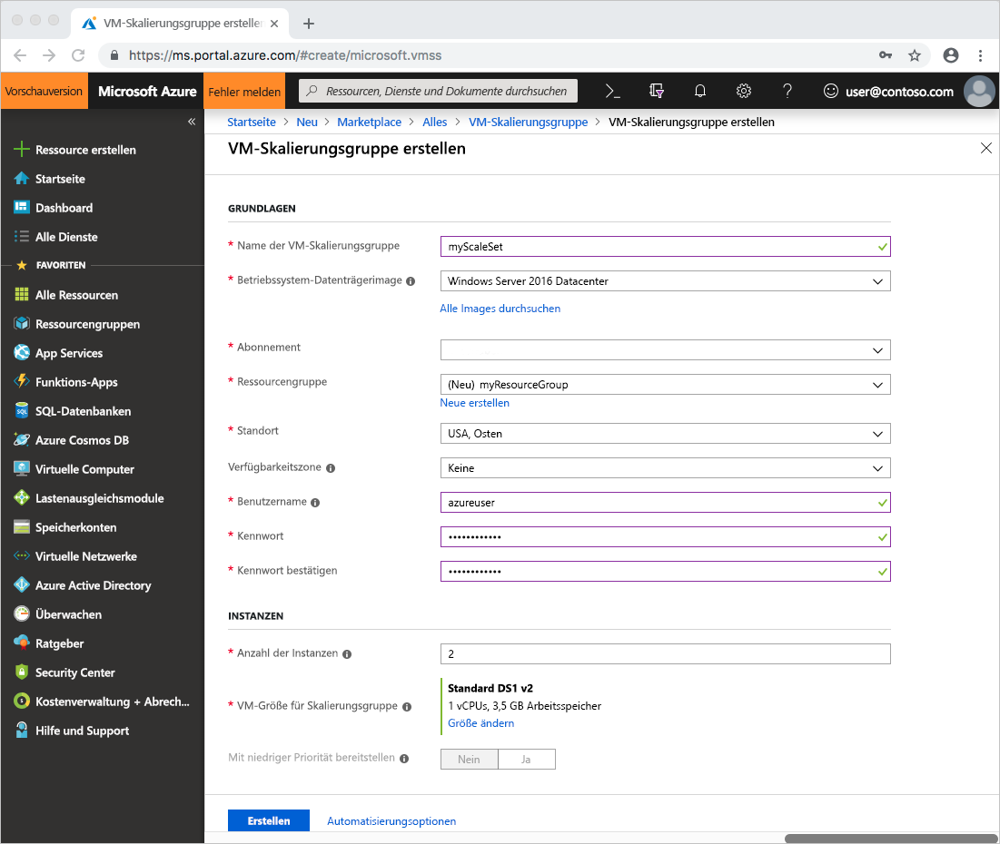
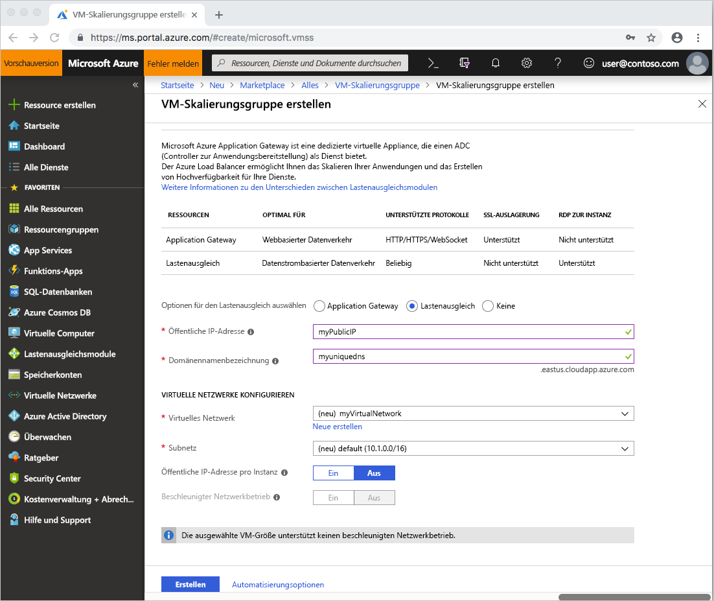

# Schnellstart: Erstellen einer VM-Skalierungsgruppe im Azure-Portal
Mit einer VM-Skalierungsgruppe können Sie eine Gruppe identischer, automatisch skalierender virtueller Computer bereitstellen und verwalten. Sie können die Anzahl virtueller Computer in der Skalierungsgruppe manuell skalieren oder basierend auf der Ressourcennutzung, z.B. CPU-Auslastung, Speicherbedarf oder Netzwerkdatenverkehr, Regeln für die automatische Skalierung definieren. Daraufhin wird der Datenverkehr durch einen Azure-Lastenausgleich auf die VM-Instanzen in der Skalierungsgruppe verteilt. In dieser Schnellstartanleitung erstellen Sie eine VM-Skalierungsgruppe über das Azure-Portal.

Wenn Sie kein Azure-Abonnement besitzen, können Sie ein [kostenloses Konto](https://azure.microsoft.com/free/?WT.mc_id=A261C142F) erstellen, bevor Sie beginnen.

## Anmelden an Azure
Melden Sie sich unter https://portal.azure.com beim Azure-Portal an.

## Erstellen einer VM-Skalierungsgruppe
Sie können eine Skalierungsgruppe mit einem Windows Server-Image oder Linux-Image wie RHEL, CentOS, Ubuntu oder SLES bereitstellen.

1. Klicken Sie im Azure-Portal links oben auf **Ressource erstellen**.
2. Suchen Sie nach *Skalierungsgruppe*, und wählen Sie **VM-Skalierungsgruppe** sowie **Erstellen** aus.
3. Geben Sie einen Namen für die Skalierungsgruppe ein (z.B. *myScaleSet*).
4. Wählen Sie den gewünschten Betriebssystemtyp aus, z.B. *Windows Server 2016 Datacenter*.
5. Geben Sie den gewünschten Ressourcengruppennamen (z.B. *myResourceGroup*) und den Standort (z.B. *USA, Osten*) ein.
6. Geben Sie den gewünschten Benutzernamen ein, und wählen Sie den bevorzugten Authentifizierungstyp aus.
   - Ein **Kennwort** muss 12 Zeichen lang sein und zur Erfüllung der Komplexitätsanforderungen drei der folgenden vier Elemente enthalten: einen Kleinbuchstaben, einen Großbuchstaben, eine Zahl und ein Sonderzeichen. Weitere Informationen finden Sie im Artikel zu den [Anforderungen an Benutzernamen und Kennwörter](../virtual-machines/windows/faq.md#what-are-the-username-requirements-when-creating-a-vm).
   - Wenn Sie ein Datenträgerimage für Linux-Betriebssysteme auswählen, können Sie stattdessen einen **öffentlichen SSH-Schlüssel** auswählen. Geben Sie nur Ihren öffentlichen Schlüssel an (z.B. *~/.ssh/id_rsa.pub*). Sie können Azure Cloud Shell aus dem Portal verwenden, um [SSH-Schlüssel zu erstellen und zu verwenden](../virtual-machines/linux/mac-create-ssh-keys.md).

     
1. Wählen Sie unter **Optionen für den Lastenausgleich auswählen** eine Lastenausgleichsoption aus (beispielsweise *Lastenausgleich*). Geben Sie die restlichen Details für Ihre Lastenausgleichsoption ein. Für *Lastenausgleich* müssen Sie beispielsweise einen Wert für **Öffentliche IP-Adresse** und **Domänennamenbezeichnung** eingeben.
1. Geben Sie unter **Virtuelle Netzwerke konfigurieren** Details zum virtuellen Netzwerk ein. Sie können beispielsweise ein neues virtuelles Netzwerk namens *myVirtualNetwork* und ein neues Subnetz namens *default* erstellen.
1. Wählen Sie zum Bestätigen der Skalierungsgruppenoptionen **Erstellen** aus.
    

## Herstellen einer Verbindung mit einem virtuellen Computer in der Skalierungsgruppe
Bei der Erstellung einer Skalierungsgruppe im Portal wird ein Lastenausgleich erstellt. NAT-Regeln (Network Address Translation) werden zum Verteilen von Datenverkehr an die Skalierungsgruppeninstanzen verwendet, um beispielsweise über RDP oder SSH Remotekonnektivität herzustellen.

Um diese NAT-Regeln und Verbindungsinformationen für die Skalierungsgruppeninstanzen anzuzeigen, gehen Sie wie folgt vor:

1. Wählen Sie die Ressourcengruppe aus, die Sie im vorherigen Schritt erstellt haben (z.B. *myResourceGroup*).
2. Wählen Sie in der Liste der Ressourcen Ihren **Lastenausgleich** aus (z.B. *myScaleSetLab*).
3. Wählen Sie auf der linken Seite des Fensters im Menü **NAT-Eingangsregeln** aus.

    

Mit diesen NAT-Regeln können Sie eine Verbindung mit einem beliebigen virtuellen Computer in der Skalierungsgruppe herstellen. Jede VM-Instanz gibt einen Wert für die Ziel-IP-Adresse und den TCP-Port an. Beispiel: Wenn die Ziel-IP-Adresse *104.42.1.19* und der TCP-Port *50001* lautet, stellen Sie wie folgt eine Verbindung mit der VM-Instanz her:

- Bei einer Windows-Skalierungsgruppe stellen Sie via RDP über `104.42.1.19:50001` eine Verbindung mit der VM-Instanz her.
- Bei einer Linux-Skalierungsgruppe stellen Sie via SSH über `ssh azureuser@104.42.1.19 -p 50001` eine Verbindung mit der VM-Instanz her.

Geben Sie bei Aufforderung die Anmeldeinformationen ein, die Sie im vorherigen Schritt beim Erstellen der Skalierungsgruppe angegeben haben. Bei den Skalierungsgruppeninstanzen handelt es sich um reguläre VMs, mit denen Sie wie gewohnt arbeiten können. Weitere Informationen zum Bereitstellen und Ausführen von Anwendungen auf Ihren Skalierungsgruppeninstanzen finden Sie unter [Bereitstellen der App in VM-Skalierungsgruppen](virtual-machine-scale-sets-deploy-app.md).

## Bereinigen von Ressourcen
Wenn Ressourcengruppe, Skalierungsgruppe und alle zugehörigen Ressourcen nicht mehr benötigt werden, löschen Sie sie. Wählen Sie hierzu die Ressourcengruppe für die VM aus, und klicken Sie auf **Löschen**.

## Nächste Schritte
In dieser Schnellstartanleitung haben Sie eine einfache Skalierungsgruppe über das Azure-Portal erstellt. Im nächsten Tutorial erfahren Sie mehr über die Erstellung und Verwaltung von Azure-VM-Skalierungsgruppen.

> [!div class="nextstepaction"]
> [Erstellen und Verwalten von Azure-VM-Skalierungsgruppen](tutorial-create-and-manage-powershell.md)
