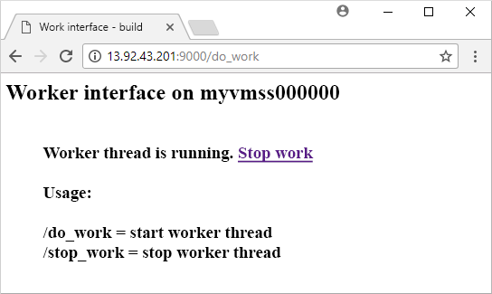

# <a name="create-a-linux-virtual-machine-scale-set-with-an-azure-template"></a>Erstellen einer Linux-VM-Skalierungsgruppe mit einer Azure-Vorlage
Mit einer VM-Skalierungsgruppe können Sie eine Gruppe identischer, automatisch skalierender virtueller Computer bereitstellen und verwalten. Sie können die Anzahl der virtuellen Computer in der Skalierungsgruppe manuell skalieren oder basierend auf der Ressourcennutzung gemäß CPU-Auslastung, Speicherbedarf oder Netzwerkdatenverkehr Regeln für die automatische Skalierung definieren. In diesem Artikel zu den ersten Schritten erstellen Sie mit einer Azure Resource Manager-Vorlage eine Linux-VM-Skalierungsgruppe. Sie können eine Skalierungsgruppe auch per [Azure CLI 2.0](virtual-machine-scale-sets-create-cli.md), [Azure PowerShell](virtual-machine-scale-sets-create-powershell.md) oder mit dem [Azure-Portal](virtual-machine-scale-sets-create-portal.md) erstellen.

Wenn Sie kein Azure-Abonnement besitzen, können Sie ein [kostenloses Konto](https://azure.microsoft.com/free/?WT.mc_id=A261C142F) erstellen, bevor Sie beginnen.

[!INCLUDE [cloud-shell-try-it.md](../../includes/cloud-shell-try-it.md)]

Wenn Sie die CLI lokal installieren und verwenden möchten, müssen Sie für dieses Tutorial die Azure CLI-Version 2.0.20 oder höher ausführen. Führen Sie `az --version` aus, um die Version zu finden. Wenn Sie eine Installation oder ein Upgrade ausführen müssen, finden Sie unter [Installieren von Azure CLI 2.0]( /cli/azure/install-azure-cli) Informationen dazu. 


## <a name="define-a-scale-set-in-a-template"></a>Definieren einer Skalierungsgruppe in einer Vorlage
Mit Azure Resource Manager-Vorlagen können Sie Gruppen mit verwandten Ressourcen bereitstellen. Vorlagen werden in JSON (JavaScript Object Notation) geschrieben und definieren die gesamte Azure-Infrastrukturumgebung für Ihre Anwendung. In einer einzelnen Vorlage können Sie die VM-Skalierungsgruppe erstellen, Anwendungen installieren und Regeln für die automatische Skalierung konfigurieren. Bei Nutzung von Variablen und Parametern kann diese Vorlage wiederverwendet werden, um vorhandene Skalierungsgruppen zu aktualisieren oder zusätzliche zu erstellen. Sie können Vorlagen über das Azure-Portal, Azure CLI 2.0 oder Azure PowerShell sowie über CI/CD-Pipelines (Continuous Integration/Continuous Delivery) bereitstellen.

Weitere Informationen zu Vorlagen finden Sie unter [Übersicht über den Azure Resource Manager](https://docs.microsoft.com/azure/azure-resource-manager/resource-group-overview#template-deployment).

Für die Erstellung einer Skalierungsgruppe mit einer Vorlage definieren Sie die entsprechenden Ressourcen. Dies sind die wichtigsten Bestandteile des Ressourcentyps einer VM-Skalierungsgruppe:

| Eigenschaft                     | Beschreibung der Eigenschaft                                  | Beispiel für Vorlagenwert                    |
|------------------------------|----------------------------------------------------------|-------------------------------------------|
| type                         | Zu erstellender Azure-Ressourcentyp                            | Microsoft.Compute/virtualMachineScaleSets |
| name                         | Name der Skalierungsgruppe                                       | myScaleSet                                |
| location                     | Standort für die Erstellung der Skalierungsgruppe                     | USA (Ost)                                   |
| sku.name                     | VM-Größe für die einzelnen Skalierungsgruppeninstanzen                  | Standard_A1                               |
| sku.capacity                 | Anzahl von VM-Instanzen für die anfängliche Erstellung           | 2                                         |
| upgradePolicy.mode           | Upgrademodus für VM-Instanz bei Auftreten von Änderungen              | Automatisch                                 |
| imageReference               | Plattform- oder benutzerdefiniertes Image für die VM-Instanzen | Canonical Ubuntu Server 16.04-LTS         |
| osProfile.computerNamePrefix | Namenspräfix für die einzelnen VM-Instanzen                     | myvmss                                    |
| osProfile.adminUsername      | Benutzername für die einzelnen VM-Instanzen                        | azureuser                                 |
| osProfile.adminPassword      | Kennwort für die einzelnen VM-Instanzen                        | P@ssw0rd!                                 |

 Im folgenden Beispiel wird die grundlegende Ressourcendefinition der Skalierungsgruppe veranschaulicht. Zu Anpassen einer Skalierungsgruppenvorlage können Sie die VM-Größe oder anfängliche Kapazität ändern oder ein anderes Plattformimage bzw. ein benutzerdefiniertes Image verwenden.

```json
{
  "type": "Microsoft.Compute/virtualMachineScaleSets",
  "name": "myScaleSet",
  "location": "East US",
  "apiVersion": "2017-12-01",
  "sku": {
    "name": "Standard_A1",
    "capacity": "2"
  },
  "properties": {
    "upgradePolicy": {
      "mode": "Automatic"
    },
    "virtualMachineProfile": {
      "storageProfile": {
        "osDisk": {
          "caching": "ReadWrite",
          "createOption": "FromImage"
        },
        "imageReference":  {
          "publisher": "Canonical",
          "offer": "UbuntuServer",
          "sku": "16.04-LTS",
          "version": "latest"
        }
      },
      "osProfile": {
        "computerNamePrefix": "myvmss",
        "adminUsername": "azureuser",
        "adminPassword": "P@ssw0rd!"
      }
    }
  }
}
```

 Die Konfiguration der virtuellen Netzwerkschnittstellenkarte (NIC) ist nicht angegeben, um das Beispiel möglichst kurz zu halten. Auch zusätzliche Komponenten, z.B. ein Lastenausgleichsmodul, werden nicht angezeigt. Eine vollständige Skalierungsgruppenvorlage ist [am Ende dieses Artikels](#deploy-the-template) angegeben.


## <a name="install-an-application"></a>Installieren einer Anwendung
Beim Bereitstellen einer Skalierungsgruppe können über VM-Erweiterungen Aufgaben für die Konfiguration und Automatisierung nach der Bereitstellung, z.B. das Installieren einer App, bereitgestellt werden. Skripts können aus Azure Storage oder GitHub heruntergeladen oder dem Azure-Portal zur Laufzeit für die Erweiterung bereitgestellt werden. Fügen Sie dem obigen Ressourcenbeispiel den Abschnitt *extensionProfile* hinzu, um eine Erweiterung auf Ihre Skalierungsgruppe anzuwenden. Im Erweiterungsprofil werden normalerweise die folgenden Eigenschaften definiert:

- Erweiterungstyp
- Erweiterungsherausgeber
- Erweiterungsversion
- Speicherort der Konfiguration bzw. der Installationsskripts
- Auf den VM-Instanzen auszuführende Befehle

Für die Vorlage vom Typ [Python-HTTP-Server unter Linux](https://github.com/Azure/azure-quickstart-templates/tree/master/201-vmss-bottle-autoscale) wird die benutzerdefinierte Skripterweiterung verwendet, um [Bottle](http://bottlepy.org/docs/dev/), ein Python-Webframework und einen einfachen HTTP-Server zu installieren. 

Zwei Skripts sind in **fileUris** - *installserver.sh* und *workserver.py* definiert. Diese Dateien werden von GitHub heruntergeladen, und anschließend wird von *commandToExecute* der Befehl `bash installserver.sh` ausgeführt, um die App zu installieren und zu konfigurieren:

```json
"extensionProfile": {
  "extensions": [
    {
      "name": "AppInstall",
      "properties": {
        "publisher": "Microsoft.Azure.Extensions",
        "type": "CustomScript",
        "typeHandlerVersion": "2.0",
        "autoUpgradeMinorVersion": true,
        "settings": {
          "fileUris": [
            "https://raw.githubusercontent.com/Azure/azure-quickstart-templates/master/201-vmss-bottle-autoscale/installserver.sh",
            "https://raw.githubusercontent.com/Azure/azure-quickstart-templates/master/201-vmss-bottle-autoscale/workserver.py"
          ],
          "commandToExecute": "bash installserver.sh"
        }
      }
    }
  ]
}
```


## <a name="deploy-the-template"></a>Bereitstellen der Vorlage
Sie können die Vorlage vom Typ [Python-HTTP-Server unter Linux](https://github.com/Azure/azure-quickstart-templates/tree/master/201-vmss-bottle-autoscale) bereitstellen, indem Sie die folgende Schaltfläche **In Azure bereitstellen** verwenden. Diese Schaltfläche bewirkt Folgendes: Das Azure-Portal wird geöffnet, die vollständige Vorlage wird geladen, und es werden einige Parameter abgefragt, z.B. der Name der Skalierungsgruppe, die Instanzanzahl und die Administratoranmeldeinformationen.

[](https://portal.azure.com/#create/Microsoft.Template/uri/https%3A%2F%2Fraw.githubusercontent.com%2FAzure%2Fazure-quickstart-templates%2Fmaster%2F201-vmss-bottle-autoscale%2Fazuredeploy.json)

Sie können auch Azure CLI 2.0 verwenden, um den Python-HTTP-Server unter Linux wie folgt mit dem Befehl [az group deployment create](/cli/azure/group/deployment#az_group_deployment_create) zu installieren:

```azurecli-interactive
# Create a resource group
az group create --name myResourceGroup --location EastUS

# Deploy template into resource group
az group deployment create \
    --resource-group myResourceGroup \
    --template-uri https://raw.githubusercontent.com/Azure/azure-quickstart-templates/master/201-vmss-bottle-autoscale/azuredeploy.json
```

Folgen Sie den Aufforderungen zum Angeben des Namens einer Skalierungsgruppe, der Instanzanzahl und der Administratoranmeldeinformationen für die VM-Instanzen. Es dauert einige Minuten, bis die Skalierungsgruppe und die unterstützenden Ressourcen erstellt werden.


## <a name="test-your-sample-application"></a>Testen der Beispielanwendung
Wenn Sie Ihre App in Aktion sehen möchten, können Sie die öffentliche IP-Adresse des Lastenausgleichsmoduls wie folgt mit dem Befehl [az network public-ip list](/cli/azure/network/public-ip#az_network_public_ip_show) abrufen:

```azurecli-interactive
az network public-ip list \
    --resource-group myResourceGroup \
    --query [*].ipAddress -o tsv
```

Geben Sie die öffentliche IP-Adresse des Lastenausgleichsmoduls in einem Webbrowser im Format *http://publicIpAddress:9000/do_work* ein. Das Lastenausgleichsmodul verteilt den Datenverkehr auf eine Ihrer VM-Instanzen. Dies ist im folgenden Beispiel dargestellt:




## <a name="clean-up-resources"></a>Bereinigen von Ressourcen
Wenn die Ressourcengruppe, die Skalierungsgruppe und alle zugehörigen Ressourcen nicht mehr benötigt werden, können Sie sie wie folgt mit dem Befehl [az group delete](/cli/azure/group#az_group_delete) entfernen:

```azurecli-interactive 
az group delete --name myResourceGroup
```


## <a name="next-steps"></a>Nächste Schritte
In diesem Artikel zu den ersten Schritten haben Sie eine Linux-Skalierungsgruppe mit einer Azure-Vorlage erstellt und die benutzerdefinierte Skripterweiterung verwendet, um einen einfachen Python-Webserver auf den VM-Instanzen zu installieren. Erweitern Sie Ihre Skalierungsgruppe, um die Möglichkeiten in Bezug auf die Skalierbarkeit und Automatisierung zu erhöhen, indem Sie die folgenden Anleitungen verwenden:

- [Bereitstellen der App in VM-Skalierungsgruppen](virtual-machine-scale-sets-deploy-app.md)
- Automatisches Skalieren per [Azure CLI](virtual-machine-scale-sets-autoscale-cli.md), [Azure PowerShell](virtual-machine-scale-sets-autoscale-powershell.md) oder [Azure-Portal](virtual-machine-scale-sets-autoscale-portal.md)
- [Automatische Betriebssystemupgrades für Azure-VM-Skalierungsgruppen](virtual-machine-scale-sets-automatic-upgrade.md)
