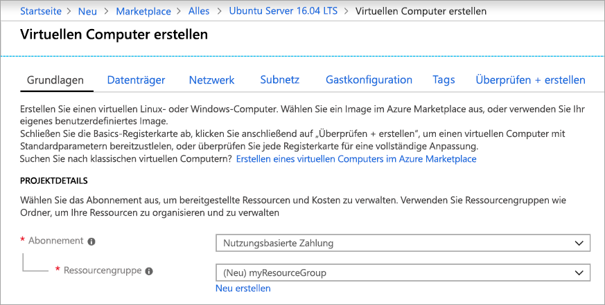
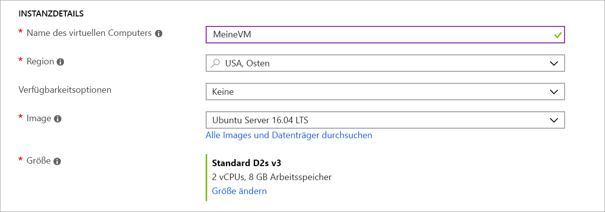
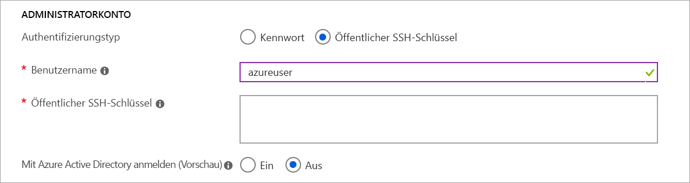
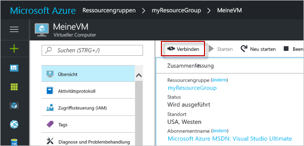

# <a name="quickstart-create-a-linux-virtual-machine-in-the-azure-portal"></a>Schnellstart: Erstellen eines virtuellen Linux-Computers im Azure-Portal

Virtuelle Azure-Computer (VMs) können über das Azure-Portal erstellt werden. Bei dieser Methode können Sie die browserbasierte Benutzeroberfläche nutzen, um virtuelle Computer und ihre dazugehörigen Ressourcen zu erstellen. In dieser Schnellstartanleitung wird gezeigt, wie Sie über das Azure-Portal einen virtuellen Linux-Computer unter Ubuntu in Azure bereitstellen. Wenn Sie den virtuellen Computer in Aktion sehen möchten, stellen Sie anschließend eine SSH-Verbindung mit dem virtuellen Computer her und installieren den NGINX-Webserver.

Wenn Sie kein Azure-Abonnement besitzen, können Sie ein [kostenloses Konto](https://azure.microsoft.com/free/?WT.mc_id=A261C142F) erstellen, bevor Sie beginnen.

## <a name="create-ssh-key-pair"></a>Erstellen eines SSH-Schlüsselpaars

Für diesen Schnellstart benötigen Sie ein SSH-Schlüsselpaar. Sie können diesen Schritt überspringen, wenn Sie bereits über ein vorhandenes SSH-Schlüsselpaar verfügen.

Wenn Sie ein SSH-Schlüsselpaar erstellen und sich bei virtuellen Linux-Computern anmelden möchten, führen Sie den folgenden Befehl über eine Bash-Shell aus, und befolgen Sie die Anweisungen auf dem Bildschirm. Sie können beispielsweise [Azure Cloud Shell](../../cloud-shell/overview.md) oder das [Windows-Subsystem für Linux](/windows/wsl/install-win10) verwenden. Die Ausgabe des Befehls enthält den Dateinamen der Datei mit dem öffentlichen Schlüssel. Kopieren Sie den Inhalt der Datei mit dem öffentlichen Schlüssel (`cat ~/.ssh/id_rsa.pub`) in die Zwischenablage:

```bash
ssh-keygen -t rsa -b 2048
```

Ausführlichere Informationen zum Erstellen von SSH-Schlüsselpaaren, u.a. zur Verwendung von PuTTy, finden Sie unter [Verwenden von SSH-Schlüsseln mit Windows in Azure](ssh-from-windows.md).

## <a name="log-in-to-azure"></a>Anmelden an Azure

Melden Sie sich unter http://portal.azure.com beim Azure-Portal an.

## <a name="create-virtual-machine"></a>Erstellen eines virtuellen Computers

1. Klicken Sie im Azure-Portal links oben auf **Ressource erstellen**.

1. Suchen Sie im Suchfeld oberhalb der Liste der Azure Marketplace-Ressourcen nach **Ubuntu Server 16.04 LTS** von Canonical, und klicken Sie auf **Erstellen**.

1. Stellen Sie auf der Registerkarte **Grundlagen** unter **Projektdetails** sicher, dass das richtige Abonnement ausgewählt ist, und wählen Sie dann **Neu erstellen** unter **Ressourcengruppe**  aus. Geben Sie in dem Popup *myResourceGroup* als Namen der Ressourcengruppe ein, und wählen Sie dann *OK* aus. 

    

1. Geben Sie unter **Instanzdetails** *myVM* als **Namen des virtuellen Computers** ein, und wählen Sie *USA, Osten* als Ihre **Region** aus. Behalten Sie die restlichen Standardwerte bei.

    

1. Wählen Sie unter **Administratorkonto** die Option **Öffentlicher SSH-Schlüssel** aus, geben Sie Ihren Benutzernamen ein, und fügen Sie Ihren öffentlichen Schlüssel in das Textfeld ein. Entfernen Sie in Ihrem öffentlichen Schlüssel alle führenden bzw. nachgestellten Leerzeichen.

    

1. Wählen Sie unter **Regeln für eingehende Ports** > **Öffentliche Eingangsports** die Option **Ausgewählte Ports zulassen** aus, und wählen Sie dann **SSH (22)** und **HTTP-(80)** aus der Dropdownliste aus. 

    

1. Belassen Sie die übrigen Standardeinstellungen, und wählen Sie dann die Schaltfläche **Überprüfen + erstellen** am unteren Rand der Seite aus.

    
## <a name="connect-to-virtual-machine"></a>Herstellen der Verbindung mit dem virtuellen Computer

Stellen Sie eine SSH-Verbindung mit dem virtuellen Computer her.

1. Klicken Sie auf der Seite „Übersicht“ des virtuellen Computers auf die Schaltfläche **Verbinden**. 

    

2. Übernehmen Sie auf der Seite zum **Herstellen der Verbindung mit dem virtuellen Computer** die Standardoptionen, um basierend auf dem DNS-Namen eine Verbindung über Port 22 herzustellen. Unter **Login using VM local account** (Anmelden mit einem lokalen VM-Konto) wird ein Verbindungsbefehl angezeigt. Klicken Sie auf die Schaltfläche, um den Befehl zu kopieren. Das folgende Beispiel zeigt den Befehl für die SSH-Verbindung:

    ```bash
    ssh azureuser@myvm-123abc.eastus.cloudapp.azure.com
    ```

3. Fügen Sie den Befehl für die SSH-Verbindung in eine Shell wie Azure Cloud Shell oder Bash unter Ubuntu oder Windows ein, um die Verbindung zu erstellen. 

## <a name="install-web-server"></a>Installieren des Webservers

Wenn Sie den virtuellen Computer in Aktion sehen möchten, installieren Sie den NGINX-Webserver. Führen Sie die folgenden Befehle in Ihrer SSH-Sitzung aus, um Paketquellen zu aktualisieren und das neueste NGINX-Paket zu installieren:

```bash
# update packages
sudo apt-get -y update

# install NGINX
sudo apt-get -y install nginx
```

Verwenden Sie nach Abschluss des Vorgangs `exit` zum Beenden der SSH-Sitzung, und wechseln Sie zurück zu den VM-Eigenschaften im Azure-Portal.


## <a name="view-the-web-server-in-action"></a>Anzeigen des Webservers in Aktion

Nachdem NGINX installiert und Port 80 für den virtuellen Computer geöffnet wurde, ist der Zugriff auf den Webserver über das Internet möglich. Öffnen Sie einen Webbrowser, und geben Sie die öffentliche IP-Adresse der VM ein. Die öffentliche IP-Adresse befindet sich auf der Übersichtsseite des virtuellen Computers oder oben auf der Seite *Netzwerk*, auf der Sie die Eingangsportregel hinzufügen.


## <a name="clean-up-resources"></a>Bereinigen von Ressourcen

Wenn Ressourcengruppe, virtueller Computer und alle zugehörigen Ressourcen nicht mehr benötigt werden, können Sie sie löschen. Wählen Sie dazu die Ressourcengruppe für den virtuellen Computer aus, klicken Sie auf **Löschen**, und bestätigen Sie den Namen der zu löschenden Ressourcengruppe.

## <a name="next-steps"></a>Nächste Schritte

In dieser Schnellstartanleitung haben Sie einen einfachen virtuellen Computer bereitgestellt, eine Netzwerksicherheitsgruppe und eine Regel erstellt sowie einen einfachen Webserver installiert. Fahren Sie mit dem Tutorial für virtuelle Linux-Computer fort, um weitere Informationen zu virtuellen Azure-Computern zu erhalten.

> [!div class="nextstepaction"]
> [Tutorials für virtuelle Azure Linux-Computer](./tutorial-manage-vm.md)
