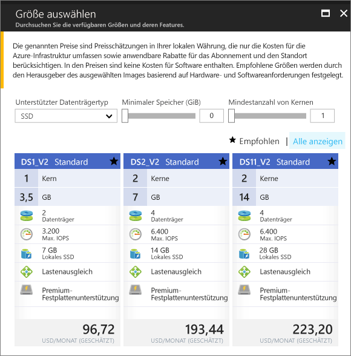

# <a name="create-a-windows-virtual-machine-in-an-availability-zone-with-the-azure-portal"></a>Erstellen eines virtuellen Windows-Computers in einer Verfügbarkeitszone mit dem Azure-Portal

In diesem Artikel werden die Schritte zum Erstellen eines virtuellen Computers in einer Azure-Verfügbarkeitszone mithilfe des Azure-Portals erläutert. Eine [Verfügbarkeitszone](../../availability-zones/az-overview.md) ist eine physisch separate Zone in einer Azure-Region. Verwenden Sie Verfügbarkeitszonen, um Ihre Apps und Daten vor einem unwahrscheinlichen Fehler oder Ausfall eines gesamten Datencenters zu schützen.

[!INCLUDE [availability-zones-preview-statement.md](../../../includes/availability-zones-preview-statement.md)]


## <a name="log-in-to-azure"></a>Anmelden an Azure 

Melden Sie sich unter „https://portal.azure.com“ am Azure-Portal an.

## <a name="create-virtual-machine"></a>Erstellen eines virtuellen Computers

1. Klicken Sie in der linken oberen Ecke des Azure-Portals auf die Schaltfläche **Neu**.

2. Wählen Sie **Compute** und dann **Windows Server 2016 Datacenter**. 

3. Geben Sie die Informationen zum virtuellen Computer ein. Der hier eingegebene Benutzername und das Kennwort werden zum Anmelden am virtuellen Computer verwendet. Klicken Sie zum Abschluss auf **OK**.

    

4. Wählen Sie eine Größe für den virtuellen Computer. Wählen Sie die Option **Alle anzeigen**, oder ändern Sie den Filter **Supported disk type** (Unterstützter Datenträgertyp), um weitere Größen anzuzeigen. Wählen Sie sorgfältig eine der unterstützten Größen in der Verfügbarkeitszonenvorschau aus, z. B. *DS1_v2 Standard*. 

      

5. Wählen Sie unter **Einstellungen** > **Hohe Verfügbarkeit** eine der nummerierten Zonen aus der Dropdownliste **Verfügbarkeitszone** aus, behalten Sie die restlichen Standardeinstellungen bei, und klicken Sie auf **OK**.

    

6. Klicken Sie auf der Zusammenfassungsseite auf **Kaufen**, um die Bereitstellung des virtuellen Computers zu starten.

7. Die VM wird im Dashboard des Azure-Portals angeheftet. Nach Abschluss der Bereitstellung wird automatisch die VM-Zusammenfassung geöffnet.


## <a name="zone-for-ip-address-and-managed-disk"></a>Zone für IP-Adresse und verwalteten Datenträger

Bei der Bereitstellung des virtuellen Computers in einer Verfügbarkeitszone werden die Ressourcen für IP-Adresse und verwaltete Datenträger in der gleichen Verfügbarkeitszone bereitgestellt. Sie können die Zoneneinstellungen mithilfe von Azure PowerShell bestätigen. Wenn Sie eine Installation oder ein Upgrade ausführen müssen, finden Sie unter [Install and configure Azure PowerShell](/powershell/azure/install-azurerm-ps) (Installieren des Azure PowerShell-Moduls) Informationen dazu.

In den folgenden Beispielen werden Informationen zu den Ressourcen in einer Ressourcengruppe mit dem Namen *MyResourceGroup* abgerufen. Ersetzen Sie den Namen durch den Namen der Ressourcengruppe, die Sie zum Erstellen des virtuellen Computers verwendet haben.

Sie können die Zone der öffentlichen IP-Adresse mit [Get-AzureRmPublicIPAddress](/en-us/powershell/module/azurerm.network/get-azurermpublicipaddress) abrufen:

```powershell
Get-AzureRmPublicIpAddress -ResourceGroupName myResourceGroup
```
Die Einstellung `Zones` in der Ausgabe zeigt, dass sich die öffentliche IP-Adresse in derselben Verfügbarkeitszone wie der virtuelle Computer befindet:

```powershell
Name                     : myVM-ip
ResourceGroupName        : myResourceGroup
Location                 : eastus2
Id                       : /subscriptions/e44f251c-c67e-4760-9ed6-bf99a306ecff/resourceGroups/danlep0911/providers/Micr
                           osoft.Network/publicIPAddresses/myVM-ip
Etag                     : W/"b67e14c0-7e8a-4d12-91c5-da2a5dfad132"
ResourceGuid             : 314bf57d-9b25-4474-9282-db3561d536aa
ProvisioningState        : Succeeded
Tags                     :
PublicIpAllocationMethod : Dynamic
IpAddress                : 13.68.16.25
PublicIpAddressVersion   : IPv4
IdleTimeoutInMinutes     : 4
IpConfiguration          : {
                             "Id": "/subscriptions/e44f251c-c67e-4760-9ed6-bf99a306ecff/resourceGroups/myResourceGroup/providers/Microsoft.Network/networkInterfaces/myVM11842/ipConfigurations/ipconfig1"
                           }
DnsSettings              : null
Zones                    : {2}
```


Die verwaltete Datenträgerressource für den virtuellen Computer wird ebenfalls in der gleichen Verfügbarkeitszone erstellt. Dies kann mit [Get-AzureRmDisk](/powershell/module/azurerm.compute/get-azurermdisk) überprüft werden:

```powershell
Get-AzureRmDisk -ResourceGroupName myResourceGroup
```

Die Ausgabe zeigt, dass sich der verwaltete Datenträger in der gleichen Verfügbarkeitszone befindet wie der virtuelle Computer:

```powershell
ResourceGroupName  : myResourceGroup
AccountType        : PremiumLRS
OwnerId            : /subscriptions/d5b9d4b7-6fc1-0000-0000-000000000000/resourceGroups/myResourceGroup/providers/Microsoft.
                     Compute/virtualMachines/myVM
ManagedBy          : /subscriptions/d5b9d4b7-6fc1-0000-0000-000000000000/resourceGroups/myResourceGroup/providers/Microsoft.
                     Compute/virtualMachines/myVM
Sku                : Microsoft.Azure.Management.Compute.Models.DiskSku
Zones              : {2}
TimeCreated        : 9/7/2017 6:57:26 PM
OsType             : Windows
CreationData       : Microsoft.Azure.Management.Compute.Models.CreationData
DiskSizeGB         : 127
EncryptionSettings :
ProvisioningState  : Succeeded
Id                 : /subscriptions/d5b9d4b7-6fc1-0000-0000-000000000000/resourceGroups/myResourceGroup/providers/Microsoft.
                     Compute/disks/myVM_OsDisk_1_bd921920bb0a4650becfc2d830000000
Name               : myVM_OsDisk_1_bd921920bb0a4650becfc2d830000000
Type               : Microsoft.Compute/disks
Location           : eastus2
Tags               : {}
```

## <a name="next-steps"></a>Nächste Schritte

In diesem Artikel haben Sie gelernt, wie Sie einen virtuellen Computer in einer Verfügbarkeitszone erstellen. Weitere Informationen zu Regionen und Verfügbarkeit für virtuelle Azure-Computer finden Sie [hier](regions-and-availability.md).
