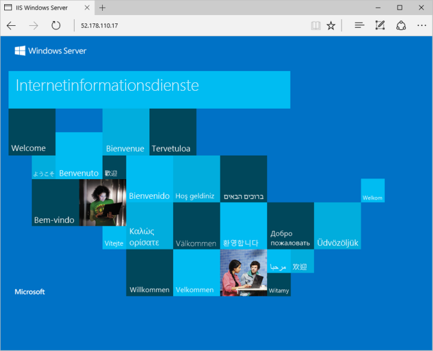

# <a name="create-a-windows-virtual-machine-with-powershell"></a>Erstellen eines virtuellen Windows-Computers mit PowerShell

Das Azure PowerShell-Modul dient zum Erstellen und Verwalten von Azure-Ressourcen über die PowerShell-Befehlszeile oder mit Skripts. In diesem Schnellstart wird das Erstellen eines virtuellen Azure-Computers mit Windows Server 2016 per PowerShell ausführlich beschrieben. Nach Abschluss der Bereitstellung stellen wir eine Verbindung mit dem Server her und installieren IIS.  

Wenn Sie kein Azure-Abonnement besitzen, können Sie ein [kostenloses Konto](https://azure.microsoft.com/free/?WT.mc_id=A261C142F) erstellen, bevor Sie beginnen.

[!INCLUDE [cloud-shell-powershell.md](../../../includes/cloud-shell-powershell.md)]

Wenn Sie PowerShell lokal installieren und verwenden möchten, müssen Sie für dieses Tutorial mindestens Version 3.6 des Azure PowerShell-Moduls verwenden. Führen Sie ` Get-Module -ListAvailable AzureRM` aus, um die Version zu finden. Wenn Sie ein Upgrade ausführen müssen, finden Sie unter [Installieren des Azure PowerShell-Moduls](/powershell/azure/install-azurerm-ps) Informationen dazu. Wenn Sie PowerShell lokal ausführen, müssen Sie auch `Login-AzureRmAccount` ausführen, um eine Verbindung mit Azure herzustellen.


## <a name="create-resource-group"></a>Ressourcengruppe erstellen

Erstellen Sie mit [New-AzureRmResourceGroup](/powershell/module/azurerm.resources/new-azurermresourcegroup) eine Azure-Ressourcengruppe. Eine Ressourcengruppe ist ein logischer Container, in dem Azure-Ressourcen bereitgestellt und verwaltet werden. 

```azurepowershell-interactive
New-AzureRmResourceGroup -Name myResourceGroup -Location EastUS
```

## <a name="create-networking-resources"></a>Erstellen von Netzwerkressourcen

### <a name="create-a-virtual-network-subnet-and-a-public-ip-address"></a>Erstellen Sie ein virtuelles Netzwerk, ein Subnetz und eine öffentliche IP-Adresse. 
Diese Ressourcen dienen dazu, dem virtuellen Computer Netzwerkkonnektivität bereitzustellen und ihn mit dem Internet zu verbinden.

```azurepowershell-interactive
# Create a subnet configuration
$subnetConfig = New-AzureRmVirtualNetworkSubnetConfig -Name mySubnet -AddressPrefix 192.168.1.0/24

# Create a virtual network
$vnet = New-AzureRmVirtualNetwork -ResourceGroupName myResourceGroup -Location EastUS `
    -Name MYvNET -AddressPrefix 192.168.0.0/16 -Subnet $subnetConfig

# Create a public IP address and specify a DNS name
$pip = New-AzureRmPublicIpAddress -ResourceGroupName myResourceGroup -Location EastUS `
    -AllocationMethod Static -IdleTimeoutInMinutes 4 -Name "mypublicdns$(Get-Random)"
```

### <a name="create-a-network-security-group-and-a-network-security-group-rule"></a>Erstellen Sie eine Netzwerksicherheitsgruppe und eine Netzwerksicherheitsgruppen-Regel. 
Die Netzwerksicherheitsgruppe sichert den virtuellen Computer mithilfe von Regeln für eingehenden und ausgehenden Datenverkehr. In diesem Fall wird eine Regel für eingehenden Datenverkehr für Port 3389 erstellt, die eingehende Remotedesktopverbindungen zulässt. Wir möchten auch eine Eingangsregel für Port 80 erstellen, um eingehenden Webdatenverkehr zuzulassen.

```azurepowershell-interactive
# Create an inbound network security group rule for port 3389
$nsgRuleRDP = New-AzureRmNetworkSecurityRuleConfig -Name myNetworkSecurityGroupRuleRDP  -Protocol Tcp `
    -Direction Inbound -Priority 1000 -SourceAddressPrefix * -SourcePortRange * -DestinationAddressPrefix * `
    -DestinationPortRange 3389 -Access Allow

# Create an inbound network security group rule for port 80
$nsgRuleWeb = New-AzureRmNetworkSecurityRuleConfig -Name myNetworkSecurityGroupRuleWWW  -Protocol Tcp `
    -Direction Inbound -Priority 1001 -SourceAddressPrefix * -SourcePortRange * -DestinationAddressPrefix * `
    -DestinationPortRange 80 -Access Allow

# Create a network security group
$nsg = New-AzureRmNetworkSecurityGroup -ResourceGroupName myResourceGroup -Location EastUS `
    -Name myNetworkSecurityGroup -SecurityRules $nsgRuleRDP,$nsgRuleWeb
```

### <a name="create-a-network-card-for-the-virtual-machine"></a>Erstellen Sie eine Netzwerkkarte für die VM. 
Erstellen Sie mit [New-AzureRmNetworkInterface](/powershell/module/azurerm.network/new-azurermnetworkinterface) eine Netzwerkkarte für den virtuellen Computer. Die Netzwerkkarte verbindet die VM mit einem Subnetz, einer Netzwerksicherheitsgruppe und einer öffentlichen IP-Adresse.

```azurepowershell-interactive
# Create a virtual network card and associate with public IP address and NSG
$nic = New-AzureRmNetworkInterface -Name myNic -ResourceGroupName myResourceGroup -Location EastUS `
    -SubnetId $vnet.Subnets[0].Id -PublicIpAddressId $pip.Id -NetworkSecurityGroupId $nsg.Id
```

## <a name="create-virtual-machine"></a>Erstellen eines virtuellen Computers

Erstellen Sie eine VM-Konfiguration. Diese Konfiguration umfasst die beim Bereitstellen der VM verwendeten Einstellungen, z.B. ein Image des virtuellen Computers, Größe und Authentifizierungskonfiguration. Wenn Sie diesen Schritt ausführen, werden Sie aufgefordert, Anmeldeinformationen einzugeben. Die Werte, die Sie eingeben, werden als Benutzername und Kennwort für den virtuellen Computer konfiguriert.

```azurepowershell-interactive
# Define a credential object
$cred = Get-Credential

# Create a virtual machine configuration
$vmConfig = New-AzureRmVMConfig -VMName myVM -VMSize Standard_DS2 | `
    Set-AzureRmVMOperatingSystem -Windows -ComputerName myVM -Credential $cred | `
    Set-AzureRmVMSourceImage -PublisherName MicrosoftWindowsServer -Offer WindowsServer `
    -Skus 2016-Datacenter -Version latest | Add-AzureRmVMNetworkInterface -Id $nic.Id
```

Erstellen Sie mit [New-AzureRmVM](/powershell/module/azurerm.compute/new-azurermvm) den virtuellen Computer.

```azurepowershell-interactive
New-AzureRmVM -ResourceGroupName myResourceGroup -Location EastUS -VM $vmConfig
```

## <a name="connect-to-virtual-machine"></a>Herstellen der Verbindung mit dem virtuellen Computer

Nachdem die Bereitstellung abgeschlossen ist, stellen Sie eine Remotedesktopverbindung mit dem virtuellen Computer her.

Geben Sie mit dem Befehl [Get-AzureRmPublicIPAddress](/powershell/module/azurerm.network/get-azurermpublicipaddress) die öffentliche IP-Adresse des virtuellen Computers zurück. Notieren Sie sich diese IP-Adresse. Sie wird in einem späteren Schritt über den Browser aufgerufen, um die Webkonnektivität zu testen.

```azurepowershell-interactive
Get-AzureRmPublicIpAddress -ResourceGroupName myResourceGroup | Select IpAddress
```

Führen Sie auf Ihrem lokalen Computer den folgenden Befehl aus, um eine Remotedesktopsitzung mit dem virtuellen Computer zu erstellen. Ersetzen Sie die IP-Adresse mit dem *publicIPAddress*-Wert des virtuellen Computers. Geben Sie nach Aufforderung die beim Erstellen des virtuellen Computers verwendeten Anmeldeinformationen ein.

```bash 
mstsc /v:<publicIpAddress>
```

## <a name="install-iis-via-powershell"></a>Installieren von IIS mithilfe von PowerShell

Nach der Anmeldung bei dem virtuellen Computer können Sie mit einer einzelnen PowerShell-Codezeile IIS installieren und die lokale Firewallregel aktivieren, um Webdatenverkehr zuzulassen. Öffnen Sie eine PowerShell-Eingabeaufforderung, und führen Sie den folgenden Befehl aus:

```azurepowershell
Install-WindowsFeature -name Web-Server -IncludeManagementTools
```

## <a name="view-the-iis-welcome-page"></a>Anzeigen der IIS-Willkommensseite

Nachdem Sie IIS installiert und Port 80 auf Ihrem virtuellen Computer für den Zugriff über das Internet geöffnet haben, können Sie nun mit einem Webbrowser Ihrer Wahl die IIS-Standardwillkommensseite anzeigen. Verwenden Sie dabei den weiter oben dokumentierten *publicIpAddress*-Wert, um die Standardseite zu besuchen. 

 

## <a name="clean-up-resources"></a>Bereinigen von Ressourcen

Wenn Ressourcengruppe, virtueller Computer und alle zugehörigen Ressourcen nicht mehr benötigt werden, können Sie sie mit dem Befehl [Remove-AzureRmResourceGroup](/powershell/module/azurerm.resources/remove-azurermresourcegroup) entfernen.

```azurepowershell-interactive
Remove-AzureRmResourceGroup -Name myResourceGroup
```

## <a name="next-steps"></a>Nächste Schritte

In diesem Schnellstart haben Sie einen einfachen virtuellen Computer und eine Netzwerksicherheitsgruppen-Regel bereitgestellt sowie einen Webserver installiert. Fahren Sie mit dem Tutorial für virtuelle Windows-Computer fort, um weitere Informationen zu virtuellen Azure-Computern zu erhalten.

> [!div class="nextstepaction"]
> [Azure-Tutorials zu virtuellen Windows-Computern](./tutorial-manage-vm.md)
