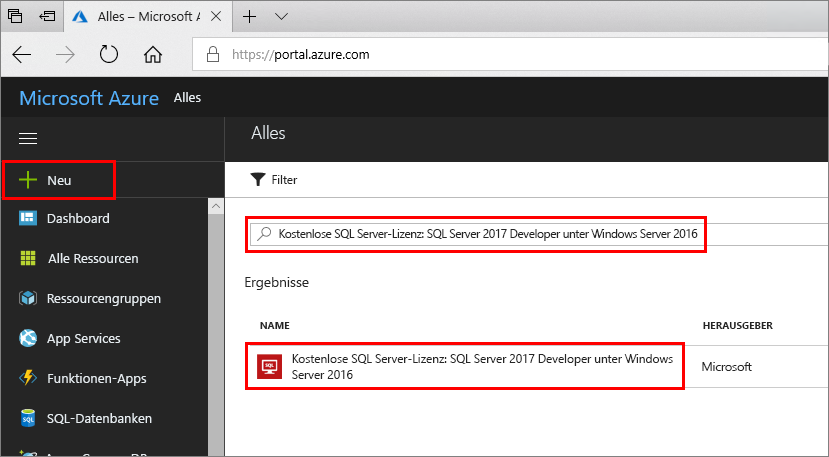
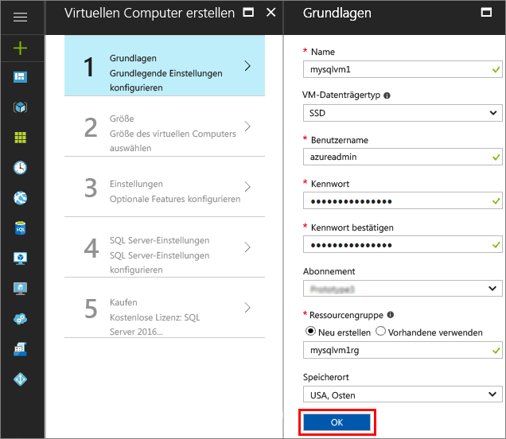
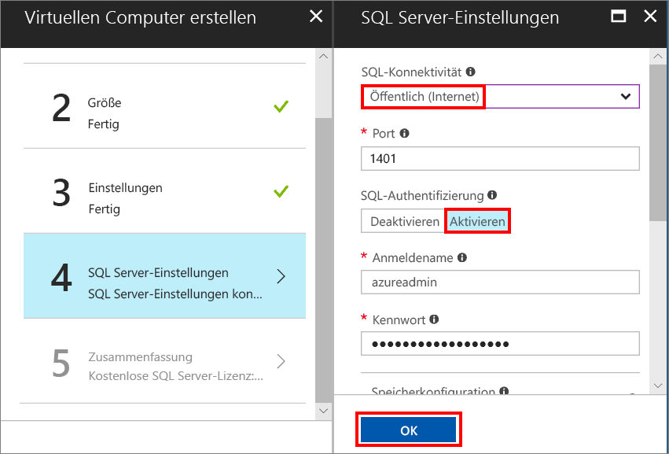
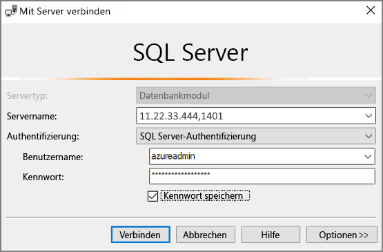

# Schnellstartanleitung: Erstellen eines virtuellen Windows-Computers mit SQL Server 2017 über das Azure-Portal

> [!div class="op_single_selector"]
> * [Windows](quickstart-sql-vm-create-portal.md)
> * [Linux](../../linux/sql/provision-sql-server-linux-virtual-machine.md)

In dieser Schnellstartanleitung wird beschrieben, wie Sie im Azure-Portal einen virtuellen SQL Server-Computer erstellen.

> [!TIP]
> Sie erfahren, wie Sie schnell einen virtuellen SQL-Computer bereitstellen und eine Verbindung damit herstellen. Weitere Informationen zu anderen Bereitstellungsoptionen für virtuelle SQL-Computer finden Sie im [Bereitstellungshandbuch für virtuelle Windows-Computer mit SQL Server im Azure-Portal](virtual-machines-windows-portal-sql-server-provision.md).

Wenn Sie kein Azure-Abonnement besitzen, können Sie ein [kostenloses Konto](https://azure.microsoft.com/free/?WT.mc_id=A261C142F) erstellen, bevor Sie beginnen.

##  Auswählen eines SQL Server-VM-Images

1. Melden Sie sich mit Ihrem Konto beim [Azure-Portal](https://portal.azure.com) an.

1. Klicken Sie im Azure-Portal auf **Ressource erstellen**. 

1. Geben Sie in das Suchfeld die Zeichenfolge **SQL Server 2017 Developer on Windows Server 2016** ein, und drücken Sie die EINGABETASTE.

1. Wählen Sie das Image **Free SQL Server License: SQL Server 2017 Developer on Windows Server 2016** aus.

   

   > [!TIP]
   > In diesem Tutorial wird die Developer Edition verwendet, weil es sich um eine Edition von SQL Server mit vollem Funktionsumfang handelt, die zu Testzwecken in der Entwicklung kostenlos ist. Sie zahlen nur für die Ausführung der VM. Umfassende Informationen zu Preisen finden Sie unter [Preisinformationen für virtuelle Azure-Computer mit SQL Server](virtual-machines-windows-sql-server-pricing-guidance.md).

1. Klicken Sie auf **Create**.

##  Angeben grundlegender Informationen

Geben Sie im Fenster **Grundeinstellungen** die folgenden Informationen an:

1. Geben Sie im Feld **Name** einen eindeutigen Namen für den virtuellen Computer ein. 

1. Geben Sie im Feld **Benutzername** einen Namen für das lokale Administratorkonto auf dem virtuellen Computer ein.

1. Geben Sie ein sicheres **Kennwort**an.

1. Geben Sie einen neuen Namen für die **Ressourcengruppe** ein. Mit dieser Gruppe können alle dem virtuellen Computer zugeordneten Ressourcen verwaltet werden.

1. Überprüfen Sie die anderen Standardeinstellungen, und klicken Sie auf **OK**, um den Vorgang fortzusetzen.

   

## VM-Größe auswählen

Wählen Sie beim Schritt **Größe** im Fenster **Größe auswählen** eine Größe für den virtuellen Computer aus. Im Fenster werden zuerst die empfohlenen Computergrößen angezeigt. Dies erfolgt basierend auf dem von Ihnen ausgewählten Image. 

1. Klicken Sie auf **Alle anzeigen**, um alle verfügbaren Computergrößen anzuzeigen.

1. Wählen Sie für diesen Schnellstart die Option **D2S_V3**. Im Portal werden die geschätzten monatlichen Computerkosten für die kontinuierliche Nutzung (ohne SQL Server-Lizenzierungskosten) angezeigt. Beachten Sie, dass für die Developer Edition keine zusätzlichen Lizenzierungskosten für SQL Server anfallen. Detailliertere Preisinformationen finden Sie in der [Preisübersicht](https://azure.microsoft.com/pricing/details/virtual-machines/windows/).

   > [!TIP]
   > Mit der Computergröße **D2S_V3** kann beim Testen Geld gespart werden. Bei Produktionsworkloads sollten Sie sich jedoch die Empfehlungen für die Computergröße und -konfiguration unter [Bewährte Methoden zur Leistung für SQL Server auf virtuellen Azure-Computern](virtual-machines-windows-sql-performance.md) ansehen.

1. Klicken Sie auf **Auswählen**, um fortzufahren.

## Optionale Features konfigurieren

Klicken Sie im Fenster **Einstellungen** auf **OK**, um die Standardeinstellungen auszuwählen.

## SQL Server-Einstellungen

Konfigurieren Sie im Fenster **SQL Server-Einstellungen** die folgenden Optionen:

1. Wählen Sie in der Dropdownliste **SQL-Konnektivität** die Option **Öffentlich (Internet)**. Dadurch werden SQL Server-Verbindungen über das Internet zugelassen.

1. Ändern Sie den **Port** in **1401**, um die Verwendung eines bekannten Portnamens im öffentlichen Szenario zu vermeiden.

1. Klicken Sie unter **SQL-Authentifizierung** auf **Aktivieren**. Für die SQL-Anmeldung werden der gleiche Benutzername und das gleiche Kennwort festgelegt, die Sie für den virtuellen Computer konfiguriert haben.

1. Ändern Sie ggf. weitere Einstellungen, und klicken Sie auf **OK**, um die Konfiguration des virtuellen SQL Server-Computers abzuschließen.

   

## Erstellen des virtuellen SQL Server-Computers

Überprüfen Sie im Fenster **Zusammenfassung** die angezeigten Informationen, und klicken Sie auf **Kaufen**, um SQL Server, die Ressourcengruppe und die für diesen virtuellen Computer angegebenen Ressourcen zu erstellen.

Sie können die Bereitstellung über das Azure-Portal überwachen. Auf der Schaltfläche **Benachrichtigungen** oben auf der Seite wird der grundlegende Status der Bereitstellung angezeigt.

> [!TIP]
> Die Bereitstellung eines virtuellen Windows-Computers mit SQL Server kann einige Minuten dauern.

## Herstellen einer Verbindung mit SQL Server

1. Suchen Sie im Portal im Abschnitt **Übersicht** der Eigenschaften Ihres virtuellen Computers den Wert für **Öffentliche IP-Adresse** Ihres virtuellen Computers.

1. Öffnen Sie SQL Server Management Studio (SSMS) auf einem anderen mit dem Internet verbundenen Computer.

   > [!TIP]
   > Falls Sie SQL Server Management Studio nicht haben, können Sie die Suite [hier](https://docs.microsoft.com/sql/ssms/download-sql-server-management-studio-ssms) herunterladen.

1. Bearbeiten Sie im Dialogfeld **Mit Server verbinden** oder **Verbindung mit Datenbank-Engine herstellen** den Wert **Servername**. Geben Sie die öffentliche IP-Adresse des virtuellen Computers ein. Fügen Sie dann ein Komma und den benutzerdefinierten Port **1401** hinzu, den wir beim Konfigurieren des neuen virtuellen Computers angegeben haben. Beispiel: `11.22.33.444,1401`.

1. Wählen Sie im Feld **Authentifizierung** den Eintrag **SQL Server-Authentifizierung**.

1. Geben Sie im Feld **Anmelden** einen gültigen SQL-Anmeldenamen ein.

1. Geben Sie im Feld **Kennwort** das Kennwort für die Anmeldung ein.

1. Klicken Sie auf **Verbinden**.

    

##  Remoteanmeldung beim virtuellen Computer

Führen Sie die folgenden Schritte aus, um mithilfe von Remotedesktop eine Verbindung mit dem virtuellen SQL Server-Computer herzustellen:

[!INCLUDE [Connect to SQL Server VM with remote desktop](../../../../includes/virtual-machines-sql-server-remote-desktop-connect.md)]

Nachdem Sie eine Verbindung mit dem virtuellen SQL Server-Computer hergestellt haben, können Sie SQL Server Management Studio starten und mit Ihren Anmeldeinformationen für den lokalen Administrator eine Verbindung mit der Windows-Authentifizierung herstellen. Wenn Sie die SQL Server-Authentifizierung aktiviert haben, können Sie die Verbindung auch per SQL-Authentifizierung herstellen, indem Sie den während der Bereitstellung konfigurierten SQL-Benutzernamen und das Kennwort verwenden.

Durch den Zugriff auf den Computer können Sie die Computer- und SQL Server-Einstellungen je nach Ihren Anforderungen direkt ändern. Beispielsweise können Sie die Firewalleinstellungen konfigurieren oder die SQL Server-Konfigurationseinstellungen ändern.

## Bereinigen von Ressourcen

Wenn der virtuelle SQL-Computer nicht kontinuierlich ausgeführt werden muss, können Sie unnötige Kosten vermeiden, indem Sie ihn anhalten, wenn er nicht verwendet wird. Sie können darüber hinaus alle dem virtuellen Computer zugeordneten Ressourcen endgültig entfernen, indem Sie die zugeordnete Ressourcengruppe im Portal löschen. Dadurch wird auch der virtuelle Computer endgültig gelöscht, lassen Sie daher bei Verwendung dieses Befehls Vorsicht walten. Weitere Informationen finden Sie unter [Verwalten von Azure-Ressourcen über das Portal](../../../azure-resource-manager/resource-group-portal.md).

## Nächste Schritte

In dieser Schnellstartanleitung haben Sie einen virtuellen SQL Server 2017-Computer im Azure-Portal erstellt. Weitere Informationen zum Migrieren Ihrer Daten zum neuen SQL Server-Computer finden Sie im folgenden Artikel:

> [!div class="nextstepaction"]
> [Migrieren einer SQL Server-Datenbank zu SQL Server auf einem virtuellen Azure-Computer](virtual-machines-windows-migrate-sql.md)
