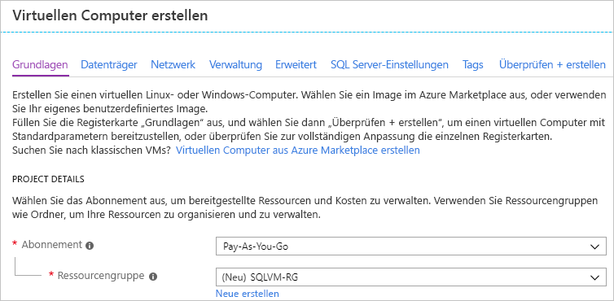
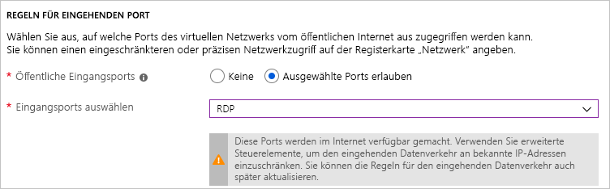

# Bereitstellen eines virtuellen Windows-Computers mit SQL Server im Azure-Portal

In diesem Leitfaden werden die verschiedenen Optionen erläutert, die beim Erstellen eines virtuellen Windows-Computers mit SQL Server im Azure-Portal zur Auswahl stehen. Dieser Artikel umfasst mehr Konfigurationsoptionen als der [Schnellstart für virtuelle SQL Server-Computer](quickstart-sql-vm-create-portal.md), der eher eine mögliche Bereitstellung abhandelt. 

Verwenden Sie diesen Leitfaden, um Ihre eigenen virtuellen SQL Server-Computer zu erstellen. Sie können ihn auch als Referenz für die verfügbaren Optionen im Azure-Portal verwenden.

> [!TIP]
> Falls Sie Fragen zu SQL Server-VMs haben, finden Sie in den [häufig gestellten Fragen](virtual-machines-windows-sql-server-iaas-faq.md) weitere Informationen.

Wenn Sie kein Azure-Abonnement besitzen, können Sie ein [kostenloses Konto](https://azure.microsoft.com/free/?WT.mc_id=A261C142F) erstellen, bevor Sie beginnen.

##  Images im SQL Server-VM-Katalog

Beim Erstellen eines virtuellen SQL Server-Computers können Sie eines von zahlreichen vorkonfigurierten Images aus dem VM-Katalog auswählen. Die folgenden Schritte veranschaulichen die Auswahl eines SQL Server 2017-Images.

1. Melden Sie sich mit Ihrem Konto beim [Azure-Portal](https://portal.azure.com) an.

1. Klicken Sie im Azure-Portal auf **Ressource erstellen**. Das Portal wird mit dem Fenster **Neu** geöffnet.

1. Klicken Sie im Fenster **Neu** auf **Compute** und anschließend auf **Alle anzeigen**.

1. Geben Sie in das Suchfeld die Zeichenfolge **SQL Server 2017** ein, und drücken Sie die EINGABETASTE.

1. Wählen Sie in den Filterdropdownlisten _Windows Server 2016_ als **Betriebssystem** und _Microsoft_ als **Herausgeber** aus. 

     

1. Überprüfen Sie die verfügbaren SQL Server-Images. Für jedes Image sind eine SQL Server-Version und ein Betriebssystem angegeben.

1. Wählen Sie das Image **Free SQL Server License: SQL Server 2017 Developer on Windows Server 2016** aus.

   > [!TIP]
   > In dieser exemplarischen Vorgehensweise wird die Developer Edition verwendet, da es sich um eine kostenlose Edition von SQL Server mit vollem Funktionsumfang zu Testzwecken in der Entwicklung handelt. Sie zahlen nur für die Ausführung der VM. Sie können für diese exemplarische Vorgehensweise jedoch ein beliebiges Image auswählen. Eine Beschreibung der verfügbaren Images finden Sie unter der [Übersicht über SQL Server-Windows-VMs](virtual-machines-windows-sql-server-iaas-overview.md#payasyougo).

   > [!TIP]
   > Die Lizenzierungskosten für SQL Server sind in den Preisen pro Sekunde des erstellten virtuellen Computers enthalten und variieren je nach Edition und Kernen. Die SQL Server Developer-Edition ist jedoch für die Entwicklung bzw. für Tests (nicht für die Produktion) kostenlos, und SQL Express ist für einfache Workloads (weniger als 1 GB Arbeitsspeicher, weniger als 10 GB Speicherplatz) kostenlos. Sie können auch Ihre eigene Lizenz nutzen (Bring Your Own License, BYOL) und nur für die VM zahlen. Diese Imagenamen haben das Präfix {BYOL}. 
   >
   > Weitere Informationen zu diesen Optionen finden Sie unter [Pricing guidance for SQL Server Azure VMs](virtual-machines-windows-sql-server-pricing-guidance.md) (Preisinformationen für virtuelle Azure-Computer unter SQL Server).

1. Stellen Sie unter **Bereitstellungsmodell auswählen** sicher, dass **Resource Manager** ausgewählt ist. Das Resource Manager-Bereitstellungsmodell ist das empfohlene Bereitstellungsmodell für neue virtuelle Computer. 

1. Klicken Sie auf **Erstellen**.

##  Konfigurationsoptionen

Es sind mehrere Registerkarten zum Konfigurieren eines virtuellen SQL Server-Computers vorhanden. In diesem Leitfaden liegt der Schwerpunkt auf Folgendem: 

| Schritt | BESCHREIBUNG |
| --- | --- |
| **Grundlagen** |[Grundeinstellungen konfigurieren](#1-configure-basic-settings) |
| **Optionale Features** |[Optionale Features konfigurieren](#2-configure-optional-features) |
| **SQL Server-Einstellungen** |[SQL Server-Einstellungen konfigurieren](#3-configure-sql-server-settings) |
| **Bewerten + erstellen** | [Zusammenfassung prüfen](#4-review--create) |

## 1. Grundeinstellungen konfigurieren

Geben Sie auf der Registerkarte **Grundeinstellungen** die folgenden Informationen an:

* Stellen Sie sicher, dass unter **Projektdetails** das richtige Abonnement ausgewählt ist. 
*  Wählen Sie im Abschnitt **Ressourcengruppe** entweder eine vorhandene Ressourcengruppe in der Liste aus, oder wählen Sie die Option **Neu erstellen** aus, um eine neue Ressourcengruppe zu erstellen. Bei einer Ressourcengruppe handelt es sich um eine Sammlung verwandter Ressourcen in Azure (virtuelle Computer, Speicherkonten, virtuelle Netzwerke usw.). 

    

  > [!NOTE]
  > Die Verwendung einer neuen Ressourcengruppe ist hilfreich, wenn Sie SQL Server-Bereitstellungen in Azure testen oder sich gerade damit vertraut machen. Löschen Sie nach Beendigung des Tests die Ressourcengruppe, um die VM und alle Ressourcen, die dieser Ressourcengruppe zugeordnet sind, automatisch zu löschen. Weitere Informationen zu Ressourcengruppen finden Sie unter [Azure Resource Manager – Übersicht](../../../azure-resource-manager/resource-group-overview.md).

* Gehen Sie unter **Instanzendetails** wie folgt vor:
    1. Geben Sie einen eindeutigen **Namen**für den virtuellen Computer ein.  
    1. Wählen Sie unter **Region** einen Standort aus. 
    1. Übernehmen Sie für diese Anleitung für **Verfügbarkeitsoptionen** die Einstellung _Keine Infrastrukturredundanz erforderlich_. Weitere Informationen zu Verfügbarkeitsoptionen finden Sie unter [Regionen und Verfügbarkeit für virtuelle Computer in Azure](../../windows/regions-and-availability.md). 
    1. Wählen Sie in der Liste unter **Image** die Option _Free SQL Server License: SQL Server 2017 Developer on Windows Server 2016_ aus.  
    1. Wählen Sie unter **Größe** die Option **Größe ändern** aus, um die Größe des virtuellen Computers anzupassen, und wählen Sie das Angebot **Basic A2** aus. Bereinigen Sie unbedingt die Ressourcen, wenn Sie fertig sind, um unerwartete Gebühren zu vermeiden. Informationen zu Produktionsworkloads finden Sie in den Empfehlungen für die Computergröße und -konfiguration unter [Optimale Verfahren für die Leistung für SQL Server auf virtuellen Computern in Azure](virtual-machines-windows-sql-performance.md).

    

> [!IMPORTANT]
> Bei den voraussichtlichen monatlichen Kosten im Fenster **Größe auswählen** sind SQL Server-Lizenzierungskosten nicht berücksichtigt. Bei dieser Schätzung handelt es sich ausschließlich um die Kosten für den virtuellen Computer. Bei der Express Edition und der Developer Edition von SQL Server umfasst die Schätzung die voraussichtlichen Gesamtkosten. Bei anderen Editionen können Sie auf der Seite [Virtuelle Windows-Computer – Preise](https://azure.microsoft.com/pricing/details/virtual-machines/windows/) Ihre Zieledition von SQL Server auswählen. Siehe auch die [Preisinformationen für virtuelle Azure-Computer unter SQL Server](virtual-machines-windows-sql-server-pricing-guidance.md) und [Größen für virtuelle Windows-Computer in Azure](../sizes.md?toc=%2fazure%2fvirtual-machines%2fwindows%2ftoc.json).

* Geben Sie unter **Administratorkonto** einen Benutzernamen und ein Kennwort an. Das Kennwort muss mindestens zwölf Zeichen lang sein und die [definierten Anforderungen an die Komplexität](../../windows/faq.md#what-are-the-password-requirements-when-creating-a-vm) erfüllen.

   

* Wählen Sie unter **Regeln für eingehende Ports** die Option **Ausgewählte Ports zulassen** aus, und wählen Sie dann **RDP (3389)** aus der Dropdownliste aus. 

   

## 2. Optionale Features konfigurieren

### Datenträger

Konfigurieren Sie auf der Registerkarte **Datenträger** die Datenträgeroptionen. 

* Wählen Sie unter **Betriebssystem-Datenträgertyp** den Typ des Datenträgers in der Dropdownliste aus, den Sie für Ihr Betriebssystem verwenden möchten. Premium wird für Produktionssysteme empfohlen, aber es ist nicht für einen einfachen virtuellen Computer verfügbar. Um SSD Premium nutzen zu können, ändern Sie die Größe des virtuellen Computers. 
* Wählen Sie unter **Erweitert** die Option **Ja** unter **Managed Disks verwenden** aus.

   > [!NOTE]
   > Microsoft empfiehlt Managed Disks für SQL Server. Managed Disks verwaltet den Speicher im Hintergrund. Wenn sich virtuelle Computer mit verwalteten Datenträgern in derselben Verfügbarkeitsgruppe befinden, verteilt Azure darüber hinaus die Speicherressourcen so, dass eine ausreichende Redundanz bereitgestellt wird. Weitere Informationen finden Sie in der [Übersicht über Azure Managed Disks][../managed-disks-overview.md). Genauere Informationen zu verwalteten Datenträgern in einer Verfügbarkeitsgruppe finden Sie unter „Verwenden von verwalteten Datenträgern für virtuelle Computer in einer Verfügbarkeitsgruppe“(../manage-availability.md).

  
  
### Netzwerk

Konfigurieren Sie auf der Registerkarte **Netzwerk** Ihre Netzwerkoptionen. 

* Erstellen Sie ein neues **virtuelles Netzwerk**, oder verwenden Sie ein bereits vorhandenes VNET für Ihre SQL Server-VM. Legen Sie ebenfalls ein **Subnetz** fest. 

* Wählen Sie unter **NIC-Sicherheitsgruppe** entweder eine grundlegende Sicherheitsgruppe oder die erweiterte Sicherheitsgruppe fest. Die Auswahl der grundlegenden Option ermöglicht Ihnen die Auswahl eingehender Ports für die SQL Server-VM (die gleichen Werte, die auf der Registerkarte **Standard** konfiguriert wurden). Die Auswahl der erweiterten Option ermöglicht Ihnen, eine vorhandene Netzwerksicherheitsgruppe auszuwählen oder eine neue zu erstellen. 

* Sie können andere Änderungen an den Netzwerkeinstellungen vornehmen oder die Standardwerte übernehmen.

#### Überwachung

Konfigurieren Sie auf der Registerkarte **Überwachung** Überwachung und automatisches Herunterfahren. 

* Azure ermöglicht standardmäßig **Startüberwachung** mit dem gleichen Speicherkonto, das für den virtuellen Computer festgelegt ist. Hier können Sie diese Einstellungen ändern und auch die **Diagnose des Gastbetriebssystems** aktivieren. 
* Sie können auf dieser Registerkarte auch **Systemseitig zugewiesene verwaltete Identität** und **Automatisches Herunterfahren** aktivieren. 

## 3. SQL Server-Einstellungen konfigurieren

Konfigurieren Sie auf der Registerkarte **SQL Server-Einstellungen** die speziellen Einstellungen und Optimierungen für SQL Server. Zu den Einstellungen, die Sie für SQL Server konfigurieren können, zählen die folgenden:

| Einstellung |
| --- |
| [Konnektivität](#connectivity) |
| [Authentication](#authentication) |
| [Azure Key Vault-Integration](#azure-key-vault-integration) |
| [Speicherkonfiguration](#storage-configuration) |
| [Automatisiertes Patchen](#automated-patching) |
| [Automatisierte Sicherung](#automated-backup) |
| [R Services (erweiterte Analyse)](#r-services-advanced-analytics) |

### Konnektivität

Geben Sie unter **SQL-Konnektivität**den Zugriffstyp an, den Sie für die SQL Server-Instanz auf dieser VM verwenden möchten. Wählen Sie für diese exemplarische Vorgehensweise die Option **Öffentlich (Internet)** aus, um für Computer oder Dienste im Internet Verbindungen mit SQL Server zuzulassen. Wenn diese Option aktiviert ist, konfiguriert Azure die Firewall und die Netzwerksicherheitsgruppe automatisch, um Datenverkehr über den ausgewählten Port zuzulassen.

> [!TIP]
> Standardmäßig lauscht SQL Server am bekannten Port **1433**. Ändern Sie den Port im vorherigen Dialogfeld, sodass an einem nicht standardmäßigen Port (beispielsweise 1401) gelauscht wird, um die Sicherheit zu erhöhen. Wenn Sie den Port ändern, muss die Verbindung in allen Clienttools (etwa SSMS) über diesen Port hergestellt werden.

Um über das Internet eine Verbindung mit SQL Server herzustellen, müssen Sie auch die SQL Server-Authentifizierung aktivieren. Dies ist im nächsten Abschnitt beschrieben.

Falls Sie Verbindungen mit der Datenbank-Engine über das Internet nicht aktivieren möchten, wählen Sie eine der folgenden Optionen:

* **Lokal (nur innerhalb der VM)** , um Verbindungen zu SQL Server nur von innerhalb des virtuellen Computers zuzulassen.
* **Privat (innerhalb des Virtual Network)** , um Verbindungen zu SQL Server von Computern oder Diensten in demselben virtuellen Netzwerk zuzulassen.

Generell sollten Sie die Sicherheit erhöhen, indem Sie die restriktivste Konnektivität wählen, die für Ihr Szenario zulässig ist. Bei allen Optionen können Sie aber Netzwerksicherheitsgruppen-Regeln und die SQL-/Windows-Authentifizierung verwenden, um für Sicherheit zu sorgen. Sie können die Netzwerksicherheitsgruppe bearbeiten, nachdem der virtuelle Computer erstellt wurde. Weitere Informationen finden Sie unter [Sicherheitsüberlegungen für SQL Server auf virtuellen Azure-Computern](virtual-machines-windows-sql-security.md).

### Authentication

Wenn Sie die SQL Server-Authentifizierung benötigen, klicken Sie unter **Aktivieren** under **Aktivieren**besuchen.

> [!NOTE]
> Wenn Sie über das Internet auf SQL Server zugreifen möchten (Konnektivitätsoption „Öffentlich“), müssen Sie die SQL-Authentifizierung hier aktivieren. Für den öffentlichen Zugriff auf SQL Server muss die SQL-Authentifizierung verwendet werden.

Geben Sie beim Aktivieren der SQL Server-Authentifizierung **Anmeldename** und **Kennwort** an. Dieser Anmeldename ist als Anmeldung für die SQL Server-Authentifizierung konfiguriert und ist Mitglied der festen Serverrolle **sysadmin**. Weitere Informationen zu Authentifizierungsmodi finden Sie unter [Auswählen eines Authentifizierungsmodus](https://docs.microsoft.com/sql/relational-databases/security/choose-an-authentication-mode).

Wenn Sie die SQL Server-Authentifizierung nicht aktivieren, können Sie das lokale Administratorkonto auf der VM verwenden, um die Verbindung mit der SQL Server-Instanz herzustellen.

### Azure-Schlüsseltresor-Integration

Klicken Sie zum Speichern von Sicherheitsgeheimnissen für die Verschlüsselung in Azure auf **Azure Key Vault-Integration** und dann auf **Aktivieren**.

In der folgenden Tabelle sind die Parameter aufgeführt, die zum Konfigurieren der Azure-Schlüsseltresor-Integration erforderlich sind.

| PARAMETER | Beschreibung | BEISPIEL |
| --- | --- | --- |
| **Schlüsseltresor-URL** |Gibt den Speicherort des Schlüsseltresors an. |https:\//contosokeyvault.vault.azure.net/ |
| **Prinzipalname** |Gibt den Namen des Azure Active Directory-Dienstprinzipals an. Dieser Name wird auch als Client-ID bezeichnet. |fde2b411-33d5-4e11-af04eb07b669ccf2 |
| **Geheimnis des Prinzipals** |Der geheime Schlüssel des Azure Active Directory-Dienstprinzipals. Dieser geheime Schlüssel wird auch als geheimer Clientschlüssel bezeichnet. |9VTJSQwzlFepD8XODnzy8n2V01Jd8dAjwm/azF1XDKM= |
| **Name der Anmeldeinformationen** |**Name der Anmeldeinformationen**: Die Azure-Schlüsseltresor-Integration erstellt Anmeldeinformationen in SQL Server, damit die virtuelle Maschine Zugriff auf den Schlüsseltresor hat. Wählen Sie einen Namen für diese Anmeldeinformation. |mycred1 |

Weitere Informationen finden Sie unter [Konfigurieren der Azure-Schlüsseltresor-Integration für SQL Server auf virtuellen Azure-Computern](virtual-machines-windows-ps-sql-keyvault.md).

### Speicherkonfiguration

Wählen Sie unter **Speicherkonfiguration** die Option **Konfiguration ändern** aus, um die Speicheranforderungen anzugeben.

> [!NOTE]
> Wenn Sie Ihren virtuellen Computer manuell für die Verwendung von Standardspeicher konfiguriert haben, ist diese Option nicht verfügbar. Die automatische Speicheroptimierung ist nur für Storage Premium verfügbar.

> [!TIP]
> Die Anzahl von Unterteilungen sowie die Obergrenze der einzelnen Schieberegler sind abhängig von der Größe des gewählten virtuellen Computers. Größere und leistungsfähigere virtuelle Computer können weiter zentral hochskaliert werden.

Sie können die Anforderungen als Eingabe-/Ausgabevorgänge pro Sekunde (IOPS), Durchsatz in MB/s und Gesamtspeichergröße angeben. Konfigurieren Sie diese Werte mit den Schiebereglern. Sie können diese Speichereinstellungen basierend auf der Workload ändern. Auf der Grundlage dieser Anforderungen berechnet das Portal automatisch die Anzahl anzufügender und zu konfigurierender Datenträger.

Wählen Sie unter **Speicher optimiert für**eine der folgenden Optionen:

* **Allgemein** ist die Standardeinstellung und bietet Unterstützung für die meisten Workloads.
* **Transaktional** wird der Speicher für herkömmliche OLTP-Datenbankworkloads optimiert.
* **Data Warehousing** wird der Speicher für Analyse- und Berichterstellungsworkloads optimiert.

### SQL Server-Lizenz
Wenn Sie ein Software Assurance-Kunde sind, können Sie den [Azure-Hybridvorteil](https://azure.microsoft.com/pricing/hybrid-benefit/) nutzen, um Ihre eigene SQL Server-Lizenz mitzubringen und auf Ressourcen zu speichern. 

### Automatisiertes Patchen

**Automatisiertes Patchen** ist standardmäßig aktiviert. Beim automatisierten Patchen kann Azure automatisch Patches für SQL Server und das Betriebssystem anwenden. Geben Sie einen Wochentag, eine Uhrzeit und eine Dauer für das Wartungsfenster an. Azure führt das Patchen in diesem Wartungsfenster durch. Für die Zeitplanung des Wartungsfensters wird die Uhrzeit des VM-Gebietsschemas verwendet. Wenn Sie nicht möchten, dass SQL Server und das Betriebssystem automatisch gepatcht werden, klicken Sie auf **Deaktivieren**.  

Weitere Informationen finden Sie unter [Automatisches Patchen für SQL Server auf virtuellen Azure-Computern](virtual-machines-windows-sql-automated-patching.md).

### Automatisierte Sicherung

Aktivieren Sie automatische Datenbanksicherungen für alle Datenbanken unter **Automatisierte Sicherung**. Die automatisierte Sicherung ist standardmäßig deaktiviert.

Wenn Sie die automatisierte SQL-Sicherung aktivieren, können Sie folgende Einstellungen konfigurieren:

* Aufbewahrungszeitraum (Tage) für Sicherungen
* Verwendetes Speicherkonto für Sicherungen
* Verschlüsselungsoption und Kennwort für Sicherungen
* Sichern von Systemdatenbanken
* Konfigurieren des Sicherungszeitplans

Klicken Sie auf **Aktivieren**, um die Sicherung zu verschlüsseln. Geben Sie dann das **Kennwort**an. Azure erstellt ein Zertifikat zum Verschlüsseln der Sicherungen und verwendet das angegebene Kennwort, um das Zertifikat zu schützen.

Weitere Informationen finden Sie unter [Automatisierte Sicherung für SQL Server in Azure Virtual Machines](virtual-machines-windows-sql-automated-backup.md).

### R Services (erweiterte Analyse)

Sie können auch [R Services in SQL Server 2016](/sql/advanced-analytics/r/sql-server-r-services/) aktivieren. Diese Option ermöglicht die Verwendung der erweiterten Analyse mit SQL Server 2017. Klicken Sie im Fenster **SQL Server-Einstellungen** auf **Aktivieren**.

## 4. Bewerten + erstellen

Überprüfen Sie auf der Registerkarte **Bewerten + erstellen** die Zusammenfassung, und wählen Sie **Erstellen** aus, um SQL Server, die Ressourcengruppe und die für diesen virtuellen Computer angegebenen Ressourcen zu erstellen.

Sie können die Bereitstellung über das Azure-Portal überwachen. Auf der Schaltfläche **Benachrichtigungen** oben auf der Seite wird der grundlegende Status der Bereitstellung angezeigt.

> [!NOTE]
> Damit Sie sich einen Eindruck von Bereitstellungszeiten verschaffen können, habe ich eine SQL-VM für die Region „USA, Osten“ mit Standardeinstellungen bereitgestellt. Die Durchführung dieser Testbereitstellung dauerte ungefähr 12 Minuten. Je nach Region und den gewählten Einstellungen kann es aber sein, dass die Bereitstellung bei Ihnen schneller oder langsamer geht.

## Öffnen der VM mit Remotedesktop

Führen Sie die folgenden Schritte aus, um mithilfe von Remotedesktop eine Verbindung mit dem virtuellen SQL Server-Computer herzustellen:

[!INCLUDE [Connect to SQL Server VM with remote desktop](../../../../includes/virtual-machines-sql-server-remote-desktop-connect.md)]

Nachdem Sie eine Verbindung mit dem virtuellen SQL Server-Computer hergestellt haben, können Sie SQL Server Management Studio starten und mit Ihren Anmeldeinformationen für den lokalen Administrator eine Verbindung mit der Windows-Authentifizierung herstellen. Wenn Sie die SQL Server-Authentifizierung aktiviert haben, können Sie die Verbindung auch per SQL-Authentifizierung herstellen, indem Sie den während der Bereitstellung konfigurierten SQL-Benutzernamen und das Kennwort verwenden.

Durch den Zugriff auf den Computer können Sie die Computer- und SQL Server-Einstellungen je nach Ihren Anforderungen direkt ändern. Beispielsweise können Sie die Firewalleinstellungen konfigurieren oder die SQL Server-Konfigurationseinstellungen ändern.

## Herstellen einer Remoteverbindung mit SQL Server

In dieser exemplarischen Vorgehensweise haben Sie den Zugriffstyp **Öffentlich** für den virtuellen Computer und die **SQL Server-Authentifizierung** ausgewählt. Mit diesen Einstellungen wurde der virtuelle Computer automatisch so konfiguriert, dass SQL Server-Verbindungen von jedem Client über das Internet zulässig sind (vorausgesetzt, diese verfügen über die richtige SQL-Anmeldung).

> [!NOTE]
> Wenn Sie während der Bereitstellung nicht „Öffentlich“ ausgewählt haben, können Sie die SQL-Konnektivitätseinstellungen nach der Bereitstellung über das Portal ändern. Weitere Informationen finden Sie unter [Verbinden mit SQL Server-Instanzen auf virtuellen Azure-Maschinen (Ressourcen-Manager)](virtual-machines-windows-sql-connect.md#change).

In den folgenden Abschnitten wird gezeigt, wie Sie über das Internet eine Verbindung mit Ihrer SQL Server-VM-Instanz herstellen.

[!INCLUDE [Connect to SQL Server in a VM Resource Manager](../../../../includes/virtual-machines-sql-server-connection-steps-resource-manager.md)]

  > [!NOTE]
  > Dieses Beispiel verwendet den gemeinsamen Port 1433. Allerdings muss dieser Wert geändert werden, wenn ein anderen Port (beispielsweise 1401) während der Bereitstellung der SQL Server-VM angegeben wurde. 

## Nächste Schritte

Weitere Informationen zur Verwendung von SQL Server in Azure finden Sie unter [SQL Server auf virtuellen Azure-Computern](virtual-machines-windows-sql-server-iaas-overview.md) und [Häufig gestellte Fragen](virtual-machines-windows-sql-server-iaas-faq.md).