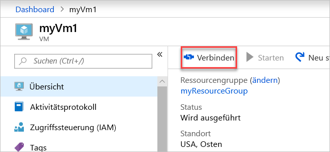

# <a name="quickstart-create-a-virtual-network-using-the-azure-portal"></a>Schnellstart: Erstellen eines virtuellen Netzwerks über das Azure-Portal

In einem virtuellen Netzwerk können Azure-Ressourcen wie virtuelle Computer privat miteinander und mit dem Internet kommunizieren. In dieser Schnellstartanleitung erfahren Sie, wie Sie ein virtuelles Netzwerk erstellen. Nach dem Erstellen eines virtuellen Netzwerks stellen Sie zwei virtuelle Computer im virtuellen Netzwerk bereit. Anschließend stellen Sie über das Internet eine Verbindung mit einem virtuellen Computer her und kommunizieren privat zwischen den beiden virtuellen Computern.

Wenn Sie kein Azure-Abonnement besitzen, können Sie ein [kostenloses Konto](https://azure.microsoft.com/free/?WT.mc_id=A261C142F) erstellen, bevor Sie beginnen.

## <a name="log-in-to-azure"></a>Anmelden an Azure 

Melden Sie sich unter https://portal.azure.com beim Azure-Portal an.

## <a name="create-a-virtual-network"></a>Erstellen eines virtuellen Netzwerks

1. Klicken Sie im Azure-Portal links oben auf **+ Ressource erstellen**.
2. Wählen Sie **Netzwerk** und anschließend **Virtuelles Netzwerk** aus.
3. Geben Sie die folgenden Informationen ein, oder wählen Sie sie aus, übernehmen Sie die Standardwerte für die übrigen Einstellungen, und klicken Sie auf **Erstellen**:

    |Einstellung|Wert|
    |---|---|
    |NAME|myVirtualNetwork|
    |Abonnement| Wählen Sie Ihr Abonnement aus.|
    |Ressourcengruppe| Klicken Sie auf **Neu erstellen**, und geben Sie *myResourceGroup* ein.|
    |Speicherort| Wählen Sie **USA, Osten** aus.|

    

## <a name="create-virtual-machines"></a>Erstellen von virtuellen Computern

Erstellen Sie zwei virtuelle Computer im virtuellen Netzwerk:

### <a name="create-the-first-vm"></a>Erstellen des ersten virtuellen Computers

1. Klicken Sie im Azure-Portal links oben auf **+ Ressource erstellen**.
2. Wählen Sie **Compute** und dann **Windows Server 2016 Datacenter**.
3. Geben Sie die folgenden Informationen ein, oder wählen Sie sie aus, übernehmen Sie die Standardwerte für die übrigen Einstellungen, und klicken Sie auf **OK**:

    |Einstellung|Wert|
    |---|---|
    |NAME|myVm1|
    |Benutzername| Geben Sie den gewünschten Benutzernamen ein.|
    |Password| Geben Sie das gewünschte Kennwort ein. Das Kennwort muss mindestens zwölf Zeichen lang sein und die [definierten Anforderungen an die Komplexität](../virtual-machines/windows/faq.md?toc=%2fazure%2fvirtual-network%2ftoc.json#what-are-the-password-requirements-when-creating-a-vm) erfüllen.|
    |Abonnement| Wählen Sie Ihr Abonnement aus.|
    |Ressourcengruppe| Wählen Sie **Vorhandene verwenden** und dann **myResourceGroup** aus.|
    |Speicherort| Wählen Sie **USA, Osten** aus.|

    

4. Wählen Sie eine Größe für den virtuellen Computer aus, und klicken Sie dann auf **Auswählen**.
5. Übernehmen Sie unter **Einstellungen** alle Standardwerte, und klicken Sie auf **OK**.

    

6. Wählen Sie auf der Seite **Zusammenfassung** unter **Erstellen** die Option **Erstellen**, um die Bereitstellung des virtuellen Computers zu starten. Die Bereitstellung des virtuellen Computers dauert einige Minuten. 

### <a name="create-the-second-vm"></a>Erstellen des zweiten virtuellen Computers

Führen Sie die Schritte 1 bis 6 erneut aus, geben Sie jedoch in Schritt 3 dem virtuellen Computer den Namen *myVm2*.

## <a name="connect-to-a-vm-from-the-internet"></a>Herstellen einer Verbindung mit einem virtuellen Computer über das Internet

1. Stellen Sie nach der Erstellung von *myVm1* eine Verbindung mit ihm her. Geben Sie im oberen Bereich des Azure-Portals *myVm1* ein. Wenn **myVm1** in den Suchergebnissen angezeigt wird, wählen Sie diese Angabe aus. Wählen Sie die Schaltfläche **Verbinden** aus.

    

2. Nachdem Sie die Schaltfläche **Verbinden** ausgewählt haben, wird eine RDP-Datei (Remotedesktopprotokoll) erstellt und auf Ihren Computer heruntergeladen.  
3. Öffnen Sie die heruntergeladene RDP-Datei. Wenn Sie dazu aufgefordert werden, wählen Sie **Verbinden** aus. Geben Sie den Benutzernamen und das Kennwort ein, die Sie beim Erstellen des virtuellen Computers festgelegt haben. Unter Umständen müssen Sie auf **Weitere Optionen** und anschließend auf **Anderes Konto verwenden** klicken, um die Anmeldeinformationen anzugeben, die Sie beim Erstellen des virtuellen Computers eingegeben haben. 
4. Klicken Sie auf **OK**.
5. Während des Anmeldevorgangs wird unter Umständen eine Zertifikatwarnung angezeigt. Wenn eine Warnung angezeigt wird, klicken Sie auf **Ja** bzw. **Weiter**, um mit dem Herstellen der Verbindung fortzufahren.

## <a name="communicate-between-vms"></a>Kommunikation zwischen VMs

1. Geben Sie in PowerShell `ping myvm2` ein. Beim Ping-Befehl tritt ein Fehler auf, da für ihn das ICMP (Internet Control Message-Protokoll) verwendet wird und die Windows-Firewall dieses Protokoll standardmäßig blockiert.
2. Damit *myVm2* in einem späteren Schritt einen Ping-Befehl an *myVm1* senden kann, geben Sie in PowerShell den folgenden Befehl ein. Dieser lässt das ICMP in eingehender Richtung durch die Windows-Firewall zu:

    ```powershell
    New-NetFirewallRule –DisplayName “Allow ICMPv4-In” –Protocol ICMPv4
    ```

3. Schließen Sie die Remotedesktopverbindung mit *myVm1*. 

4. Führen Sie die Schritte unter [Herstellen einer Verbindung mit einem virtuellen Computer über das Internet](#connect-to-a-vm-from-the-internet) erneut aus, stellen Sie jedoch die Verbindung mit *myVm2* her. Geben Sie an einer Befehlszeile `ping myvm1` ein.

    Sie erhalten Antworten von *myVm1*, da Sie in einem vorherigen Schritt das ICMP über die Windows-Firewall auf dem virtuellen Computer *myVm1* zugelassen haben.

5. Schließen Sie die Remotedesktopverbindung mit *myVm2*.

## <a name="clean-up-resources"></a>Bereinigen von Ressourcen

Löschen Sie die Ressourcengruppe mit allen ihren Ressourcen, wenn Sie sie nicht mehr benötigen:

1. Geben Sie im oben im Portal im Feld *Suche* die Zeichenfolge **myResourceGroup** ein. Wenn **myResourceGroup** in den Suchergebnissen angezeigt wird, wählen Sie diese Angabe aus.
2. Wählen Sie die Option **Ressourcengruppe löschen**.
3. Geben Sie für **Geben Sie den Ressourcengruppennamen ein:** den Namen *myResourceGroup* ein, und klicken Sie auf **Löschen**.

## <a name="next-steps"></a>Nächste Schritte

In dieser Schnellstartanleitung haben Sie ein virtuelles Standardnetzwerk und zwei virtuelle Computer erstellt. Sie haben über das Internet eine Verbindung mit einem der virtuellen Computer hergestellt und privat zwischen den beiden virtuellen Computern kommuniziert. Weitere Informationen zu den Einstellungen des virtuellen Netzwerks finden Sie unter [Create, change, or delete a virtual network](manage-virtual-network.md) (Erstellen, Ändern oder Löschen eines virtuellen Netzwerks).

Azure ermöglicht standardmäßig eine uneingeschränkte private Kommunikation zwischen virtuellen Computern. Über das Internet lässt Azure dagegen nur eingehende Remotedesktopverbindungen mit virtuellen Windows-Computern zu. Informationen zum Zulassen und Beschränken verschiedener Arten von Netzwerkkommunikation zwischen virtuellen Computern finden Sie im [Tutorial zum Filtern von Netzwerkdatenverkehr](tutorial-filter-network-traffic.md).