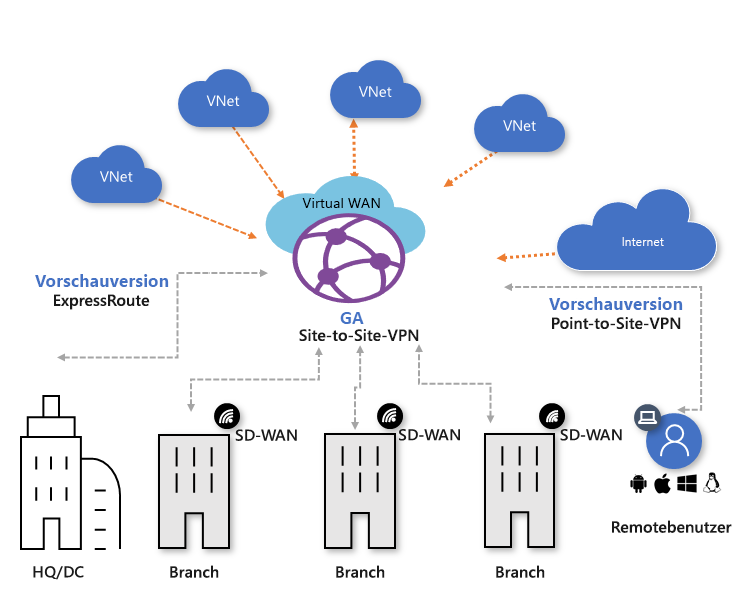

# Was ist Azure Virtual WAN?

Der Netzwerkdienst Azure Virtual WAN bietet optimierte und automatisierte Branch-Konnektivität mit und durch Azure. Azure-Regionen dienen als Hubs, die Sie auswählen können, um Branches mit ihnen zu verbinden. Sobald die Branches verbunden sind, können Sie den Azure-Backbone nutzen, um Branch-zu-VNet- und Branch-zu-Branch-Konnektivität herzustellen. Eine Liste der Partner und Standorte, die Virtual WAN-VPN unterstützen, finden Sie in dem Artikel [Virtual WAN-Partner und -Standorte](virtual-wan-locations-partners.md).

Azure Virtual WAN vereint zahlreiche Azure-Cloudkonnektivitätsdienste, z. B. Site-to-Site-VPN (allgemein verfügbar), ExpressRoute (Vorschau), Point-to-Site-Benutzer-VPN (Vorschau), in einer einzigen Betriebsoberfläche. Die Konnektivität mit Azure-VNets wird mithilfe virtueller Netzwerkverbindungen hergestellt.

Dieser Artikel enthält eine kurze Übersicht über die Netzwerkkonnektivität in Azure Virtual WAN. Virtual WAN hat die folgenden Vorteile:

* **Integrierte Konnektivitätslösungen (Hub & Spoke):** Automatisieren Sie die Site-to-Site-Konfiguration und -Konnektivität zwischen lokalen Standorten und einem Azure-Hub.
* **Automatisierte Spoke-Einrichtung und -Konfiguration:**  Verbinden Sie Ihre virtuellen Netzwerke und Workloads nahtlos mit dem Azure-Hub.
* **Intuitive Problembehandlung:**  Sie können den gesamten Datenfluss in Azure anzeigen und diese Informationen nutzen, um erforderliche Aktionen durchzuführen.

## Virtual WAN-Ressourcen

Sie erstellen die folgenden Ressourcen, um ein End-to-End Virtual WAN zu konfigurieren:

* **virtualWAN:** Die Ressource „virtualWAN“ stellt eine virtuelle Überlagerung Ihres Azure-Netzwerks dar und ist eine Sammlung aus mehreren Ressourcen. Sie enthält Links zu allen virtuellen Hubs, die Teil des virtuellen WAN sein sollen. Virtual WAN-Ressourcen sind voneinander isoliert und können keinen gemeinsamen Hub enthalten. Virtuelle Hubs kommunizieren per Virtual WAN nicht miteinander. Die Eigenschaft „AllowBranchToBranchTraffic“ ermöglicht Datenverkehr zwischen VPN-Standorten sowie VPN zu ExpressRoute-fähigen Standorten (zurzeit in der Vorschauphase).

* **Hub:** Ein virtueller Hub ist ein von Microsoft verwaltetes virtuelles Netzwerk. Der Hub enthält verschiedene Dienstendpunkte zum Aktivieren der Konnektivität über Ihr lokales Netzwerk (vpnsite). Der Hub ist der Kern Ihres Netzwerks in einer Region. Es kann nur ein Hub pro Azure-Region vorhanden sein. Wenn Sie einen Hub im Azure-Portal erstellen, werden für den virtuellen Hub ein VNET und ein VPN-Gateway erstellt.

  Ein Hub-Gateway ist nicht das gleiche wie ein Gateway für virtuelle Netzwerke, das Sie für ExpressRoute und VPN Gateway verwenden. Bei der Verwendung von Virtual WAN erstellen Sie beispielsweise von Ihrer lokalen Site aus keine direkte Site-to-Site-Verbindung mit Ihrem VNET. Stattdessen erstellen Sie eine Site-to-Site-Verbindung mit dem Hub. Der Datenverkehr verläuft immer über das Hub-Gateway. Dies bedeutet, dass Ihre VNETs kein eigenes Gateway für virtuelle Netzwerke benötigen. Mit Virtual WAN können Sie für Ihre VNETs über den virtuellen Hub und das virtuelle Hub-Gateway leicht eine Skalierung durchführen.

* **Virtuelle Netzwerkverbindung für Hub:**  Die Ressource für die virtuelle Netzwerkverbindung für den Hub wird verwendet, um den Hub nahtlos mit Ihrem virtuellen Netzwerk zu verbinden. Derzeit können Sie nur eine Verbindung mit virtuellen Netzwerken herstellen, die sich in derselben Hub-Region befinden.

* **Hubroutingtabelle:**   Sie können eine virtuelle Hubroute erstellen und die Route der Routingtabelle des virtuellen Hubs zuweisen. Sie können der Routingtabelle des virtuellen Hubs mehrere Routen zuweisen.

**Zusätzliche Virtual WAN-Ressourcen**

  * **Site:** Diese Ressource wird ausschließlich für Site-to-Site-Verbindungen verwendet. Die Ressource „site“ ist **vpnsite**. Sie stellt Ihr lokales VPN-Gerät und die zugehörigen Einstellungen dar. Durch die Zusammenarbeit mit einem Virtual WAN-Partner verfügen Sie über eine integrierte Lösung zum automatischen Exportieren dieser Informationen nach Azure.

## Konnektivität

Virtual WAN gestattet drei Arten von Konnektivität: Site-to-Site, Point-to-Site (Vorschau) und ExpressRoute (Vorschau).

### Site-to-Site-VPN-Verbindungen

Wenn Sie eine Virtual WAN-Site-to-Site-Verbindung erstellen, können Sie mit einem verfügbaren Partner arbeiten. Wenn Sie keinen Partner verwenden möchten, können Sie die Verbindung manuell konfigurieren. Weitere Informationen finden Sie unter [Erstellen einer Site-to-Site-Verbindung per Virtual WAN](virtual-wan-site-to-site-portal.md).

#### Workflow für Virtual WAN-Partner

Wenn Sie mit einem Virtual WAN-Partner arbeiten, ist der Workflow wie folgt:

1. Der Controller des Zweigstellengeräts (VPN/SDWAN) wird authentifiziert, um standortbezogene Informationen mithilfe eines [Azure-Dienstprinzipals](../active-directory/develop/howto-create-service-principal-portal.md) zu exportieren.
2. Der Controller des Branchgeräts (VPN/SDWAN) ruft die Azure-Konnektivitätskonfiguration ab und aktualisiert das lokale Gerät. So werden für das lokale VPN-Gerät der Konfigurationsdownload und die Bearbeitung und die Aktualisierung automatisiert.
3. Nachdem das Gerät über die richtige Azure-Konfiguration verfügt, wird eine Site-to-Site-Verbindung (zwei aktive Tunnel) mit dem Azure WAN eingerichtet. Azure unterstützt IKEv1 und IKEv2. BGP ist optional.

#### Partner für Site-to-Site-Virtual WAN-Verbindungen

Eine Liste der verfügbaren Partner und Standorte finden Sie in dem Artikel [Virtual WAN-Partner und -Standorte](virtual-wan-locations-partners.md).

### Point-to-Site-VPN-Verbindungen (Vorschau)

Mit einer P2S-Verbindung (Point-to-Site) können Sie von einem einzelnen Clientcomputer aus eine sichere Verbindung mit Ihrem virtuellen Hub herstellen. Eine P2S-Verbindung wird hergestellt, indem Sie die Verbindung vom Clientcomputer aus starten. Diese Lösung ist nützlich für Telearbeiter, die an einem Remotestandort (beispielsweise zu Hause oder in einer Konferenz) eine Verbindung herstellen möchten. Wenn nur einige wenige Clients eine Verbindung herstellen müssen, ist ein P2S-VPN (und nicht ein S2S-VPN) ebenfalls eine nützliche Lösung.

Informationen zum Erstellen der Verbindung finden Sie unter [Erstellen einer Point-to-Site-Verbindung per Virtual WAN](virtual-wan-point-to-site-portal.md).

### ExpressRoute-Verbindungen (Vorschau)

Mit ExpressRoute können Sie Ihr lokales Netzwerk über eine private Verbindung mit Azure verbinden. Informationen zum Erstellen der Verbindung finden Sie unter [Erstellen einer ExpressRoute-Verbindung per Virtual WAN](virtual-wan-expressroute-portal.md).

## Standorte

Informationen zu Standorten finden Sie in dem Artikel [Virtual WAN-Partner und -Standorte](virtual-wan-locations-partners.md).

## Häufig gestellte Fragen

[!INCLUDE [Virtual WAN FAQ](../../includes/virtual-wan-faq-include.md)]

## Nächste Schritte

[Erstellen einer Site-to-Site-Verbindung per Azure Virtual WAN](virtual-wan-site-to-site-portal.md)
