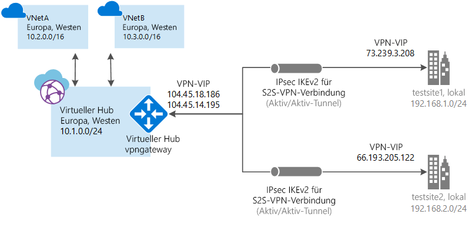

# <a name="tutorial-create-a-site-to-site-connection-using-azure-virtual-wan"></a>Tutorial: Erstellen einer Site-to-Site-Verbindung per Azure Virtual WAN

In diesem Tutorial wird beschrieben, wie Sie Virtual WAN zum Verbinden Ihrer Ressourcen in Azure über eine IPsec/IKE-VPN-Verbindung (IKEv1 und IKEv2) nutzen. Für diese Art von Verbindung wird ein lokales VPN-Gerät benötigt, dem eine extern zugängliche, öffentliche IP-Adresse zugewiesen ist. Weitere Informationen zu Virtual WAN finden Sie auf der Seite mit der [Übersicht über Virtual WAN](virtual-wan-about.md).

> [!NOTE]
> Falls Sie über viele Sites verfügen, verwenden Sie normalerweise einen [Virtual WAN-Partner](https://aka.ms/virtualwan), um diese Konfiguration zu erstellen. Sie können diese Konfiguration aber auch selbst erstellen, wenn Sie mit Netzwerken vertraut sind und sich mit der Konfiguration Ihres eigenen VPN-Geräts auskennen.
>



In diesem Tutorial lernen Sie Folgendes:

> [!div class="checklist"]
> * Erstellen eines WAN
> * Erstellen einer Site
> * Erstellen eines Hubs
> * Verbinden eines Hubs mit einer Site
> * Erstellen eines kompatiblen VNets (falls Sie noch keines besitzen)
> * Verbinden eines VNET mit einem Hub
> * Herunterladen und Anwenden der VPN-Gerätekonfiguration
> * Anzeigen Ihrer Virtual WAN-Instanz
> * Anzeigen der Ressourcenintegrität
> * Überwachen einer Verbindung

## <a name="before-you-begin"></a>Voraussetzungen

[!INCLUDE [Before you begin](../../includes/virtual-wan-tutorial-vwan-before-include.md)]

## <a name="openvwan"></a>1. Erstellen eines virtuellen WAN

Navigieren Sie in einem Browser zum [Azure-Portal](https://aka.ms/azurevirtualwanpreviewfeatures) , und melden Sie sich mit Ihrem Azure-Konto an.

[!INCLUDE [Create a virtual WAN](../../includes/virtual-wan-tutorial-vwan-include.md)]

## <a name="site"></a>2. Erstellen einer Site

Erstellen Sie beliebig viele Sites, die Ihren physischen Standorten entsprechen. Erstellen Sie beispielsweise drei separate Sites, wenn Sie jeweils über eine Filiale in New York, London und Los Angeles verfügen. Diese Sites enthalten Ihre lokalen VPN-Geräteendpunkte. Derzeit können Sie für Ihre Site nur eine private Adresse angeben.

1. Klicken Sie auf das von Ihnen erstellte WAN. Klicken Sie auf der WAN-Seite unter **WAN Architecture** (WAN-Architektur) auf **VPN sites** (VPN-Standorte), um die entsprechende Seite zu öffnen.
2. Klicken Sie auf der Seite **VPN sites** (VPN-Standorte) auf **+Create site** (+ Standort erstellen).
3. Füllen Sie auf der Seite **Create site** (Standort erstellen) die folgenden Felder aus:

   * **Name**: Der Name, den Sie Ihrer lokalen Site geben möchten.
   * **Öffentliche IP-Adresse**: Die öffentliche IP-Adresse des VPN-Geräts, das sich in Ihrer lokalen Site befindet.
   * **Privater Adressraum**: Dies ist der IP-Adressraum Ihrer lokalen Site. Der Datenverkehr, der für diesen Adressraum bestimmt ist, wird an Ihre lokale Site geleitet.
   * **Abonnement**: Überprüfen Sie das Abonnement.
   * **Ressourcengruppe**: Die Ressourcengruppe, die Sie verwenden möchten.
   * **Location**
4. Klicken Sie auf **Show advanced** (Erweiterte anzeigen), um die zusätzlichen Einstellungen anzuzeigen. Sie können **BGP** wählen, um BGP zu aktivieren, wodurch BGP-Funktionen für alle Verbindungen aktiviert werden, die für diese Site in Azure erstellt werden. Sie können auch unter **Geräteinformationen** (optionale Felder) eingeben. Diese Vorgehensweise kann dem Azure-Team helfen, Ihre Umgebung besser zu verstehen, um in Zukunft weitere Optimierungsmöglichkeiten hinzuzufügen oder Sie bei der Problembehandlung zu unterstützen.
5. Klicken Sie auf **Confirm** (Bestätigen).
6. Nach dem Klicken auf **Confirm** (Bestätigen) können Sie den Status auf der Seite „VPN sites“ (VPN-Standorte) anzeigen. Für den Standort ändert sich der Status von **Wird bereitgestellt** in **Bereitgestellt**.

## <a name="hub"></a>3. Erstellen eines Hubs

[!INCLUDE [Create a hub](../../includes/virtual-wan-tutorial-hub-include.md)]

## <a name="associate"></a>4. Zuordnen der Standorte zum Hub

Hubs sollten normalerweise Standorten zugeordnet werden, die sich in derselben Region wie das VNet befinden.

1. Wählen Sie auf der Seite **VPN sites** (VPN-Standorte) die Standorte aus, die Sie dem Hub zuordnen möchten, und klicken Sie dann auf **+New hub association** (+ Neue Hubzuordnung).
2. Wählen Sie auf der Seite **Associate sites with one or more hubs** (Standorten einen oder mehrere Hubs zuordnen) in der Dropdownliste einen Hub aus. Sie können einem Standort zusätzliche Hubs zuordnen, indem Sie auf **+ Zuordnung hinzufügen** klicken.
3. Sie können hier auch einen bestimmten **PSK** hinzufügen oder den Standardwert verwenden.
4. Klicken Sie auf **Confirm** (Bestätigen).
5. Sie können den Verbindungsstatus auf der Seite **VPN sites** (VPN-Standorte) anzeigen.

## <a name="vnet"></a>5. Erstellen eines virtuellen Netzwerks

Falls Sie noch nicht über ein VNET verfügen, können Sie mit PowerShell oder im Azure-Portal schnell eins erstellen. Wenn Sie bereits über ein VNET verfügen, sollten Sie sich vergewissern, dass es die erforderlichen Kriterien erfüllt und dass kein Gateway für virtuelle Netzwerke verwendet wird.

[!INCLUDE [Create a virtual network](../../includes/virtual-wan-tutorial-vnet-include.md)]

## <a name="vnet"></a>6. Verbinden Ihres VNET mit einem Hub

In diesem Schritt erstellen Sie die Peeringverbindung zwischen Ihrem Hub und einem VNET. Wiederholen Sie diese Schritte für jedes VNET, mit dem Sie eine Verbindung herstellen möchten.

1. Klicken Sie auf der Seite für Ihr virtuelles WAN auf **Virtuelle Netzwerkverbindungen**.
2. Klicken Sie auf der Seite für die VNET-Verbindung auf **+Add connection** (+Verbindung hinzufügen).
3. Füllen Sie auf der Seite **Add connection** (Verbindung hinzufügen) die folgenden Felder aus:

    * **Verbindungsname**: Dies ist der Name Ihrer Verbindung.
    * **Hubs**: Wählen Sie den Hub aus, den Sie dieser Verbindung zuordnen möchten.
    * **Abonnement**: Überprüfen Sie das Abonnement.
    * **Virtuelles Netzwerk**: Wählen Sie das virtuelle Netzwerk aus, das Sie mit diesem Hub verbinden möchten. Für das virtuelle Netzwerk kann nicht bereits ein Gateway für virtuelle Netzwerke vorhanden sein.
4. Klicken Sie auf **OK**, um die Peeringverbindung zu erstellen.

## <a name="device"></a>7. Herunterladen der VPN-Konfiguration

Verwenden Sie die VPN-Gerätekonfiguration, um Ihr lokales VPN-Gerät zu konfigurieren.

1. Klicken Sie auf der Seite für Ihr virtuelles WAN auf **Übersicht**.
2. Klicken Sie oben auf der Seite „Übersicht“ auf **VPN-Konfiguration herunterladen**. Azure erstellt ein Speicherkonto in der Ressourcengruppe „microsoft-network-[location]“, wobei „location“ für den WAN-Standort steht. Nachdem Sie die Konfiguration auf Ihre VPN-Geräte angewendet haben, können Sie dieses Speicherkonto löschen.
3. Nachdem die Erstellung der Datei abgeschlossen wurde, können Sie auf den Link klicken, um sie herunterzuladen.
4. Wenden Sie die Konfiguration auf Ihr VPN-Gerät an.

### <a name="understanding-the-vpn-device-configuration-file"></a>Grundlegendes zur Konfigurationsdatei für VPN-Geräte

Die Gerätekonfigurationsdatei enthält die Einstellungen, die beim Konfigurieren Ihrer lokalen VPN-Geräte verwendet werden. Beachten Sie beim Anzeigen dieser Datei die folgenden Informationen:

* **vpnSiteConfiguration**: In diesem Abschnitt sind die Gerätedetails für die Einrichtung einer Site angegeben, für die eine Verbindung mit dem virtuellen WAN hergestellt wird. Sie enthält den Namen und die öffentliche IP-Adresse des Zweigstellengeräts.
* **vpnSiteConnections**: Dieser Abschnitt enthält die folgenden Einstellungen:

    * **Adressraum** des virtuellen Hub-VNET<br>Beispiel:
 
        ```
        "AddressSpace":"10.1.0.0/24"
        ```
    * **Adressraum** der VNETs, die mit dem Hub verbunden sind<br>Beispiel:

         ```
        "ConnectedSubnets":["10.2.0.0/16","10.30.0.0/16"]
         ```
    * **IP-Adressen** des vpngateway für den virtuellen Hub. Da jede Verbindung des vpngateway aus zwei Tunneln mit Aktiv-Aktiv-Konfiguration besteht, werden in dieser Datei beide IP-Adressen aufgelistet. In diesem Beispiel werden für jede Site „Instance0“ und „Instance1“ angezeigt.<br>Beispiel:

        ``` 
        "Instance0":"104.45.18.186"
        "Instance1":"104.45.13.195"
        ```
    * **Details zur Konfiguration der vpngateway-Verbindung**, z.B. BGP, vorinstallierter Schlüssel usw. Der vorinstallierte Schlüssel (Pre-Shared Key, PSK) wird automatisch für Sie erstellt. Sie können die Verbindung für einen benutzerdefinierten PSK auf der Seite „Übersicht“ jederzeit bearbeiten.
  
### <a name="example-device-configuration-file"></a>Beispiel für Gerätekonfigurationsdatei

  ```
  { 
      "configurationVersion":{ 
         "LastUpdatedTime":"2018-07-03T18:29:49.8405161Z",
         "Version":"r403583d-9c82-4cb8-8570-1cbbcd9983b5"
      },
      "vpnSiteConfiguration":{ 
         "Name":"testsite1",
         "IPAddress":"73.239.3.208"
      },
      "vpnSiteConnections":[ 
         { 
            "hubConfiguration":{ 
               "AddressSpace":"10.1.0.0/24",
               "Region":"West Europe",
               "ConnectedSubnets":[ 
                  "10.2.0.0/16",
                  "10.30.0.0/16"
               ]
            },
            "gatewayConfiguration":{ 
               "IpAddresses":{ 
                  "Instance0":"104.45.18.186",
                  "Instance1":"104.45.13.195"
               }
            },
            "connectionConfiguration":{ 
               "IsBgpEnabled":false,
               "PSK":"bkOWe5dPPqkx0DfFE3tyuP7y3oYqAEbI",
               "IPsecParameters":{ 
                  "SADataSizeInKilobytes":102400000,
                  "SALifeTimeInSeconds":3600
               }
            }
         }
      ]
   },
   { 
      "configurationVersion":{ 
         "LastUpdatedTime":"2018-07-03T18:29:49.8405161Z",
         "Version":"1f33f891-e1ab-42b8-8d8c-c024d337bcac"
      },
      "vpnSiteConfiguration":{ 
         "Name":" testsite2",
         "IPAddress":"66.193.205.122"
      },
      "vpnSiteConnections":[ 
         { 
            "hubConfiguration":{ 
               "AddressSpace":"10.1.0.0/24",
               "Region":"West Europe"
            },
            "gatewayConfiguration":{ 
               "IpAddresses":{ 
                  "Instance0":"104.45.18.187",
                  "Instance1":"104.45.13.195"
               }
            },
            "connectionConfiguration":{ 
               "IsBgpEnabled":false,
               "PSK":"XzODPyAYQqFs4ai9WzrJour0qLzeg7Qg",
               "IPsecParameters":{ 
                  "SADataSizeInKilobytes":102400000,
                  "SALifeTimeInSeconds":3600
               }
            }
         }
      ]
   },
   { 
      "configurationVersion":{ 
         "LastUpdatedTime":"2018-07-03T18:29:49.8405161Z",
         "Version":"cd1e4a23-96bd-43a9-93b5-b51c2a945c7"
      },
      "vpnSiteConfiguration":{ 
         "Name":" testsite3",
         "IPAddress":"182.71.123.228"
      },
      "vpnSiteConnections":[ 
         { 
            "hubConfiguration":{ 
               "AddressSpace":"10.1.0.0/24",
               "Region":"West Europe"
            },
            "gatewayConfiguration":{ 
               "IpAddresses":{ 
                  "Instance0":"104.45.18.187",
                  "Instance1":"104.45.13.195"
               }
            },
            "connectionConfiguration":{ 
               "IsBgpEnabled":false,
               "PSK":"YLkSdSYd4wjjEThR3aIxaXaqNdxUwSo9",
               "IPsecParameters":{ 
                  "SADataSizeInKilobytes":102400000,
                  "SALifeTimeInSeconds":3600
               }
            }
         }
      ]
   }
  ```

### <a name="configuring-your-vpn-device"></a>Konfigurieren Ihres VPN-Geräts

>[!NOTE]
> Wenn Sie mit einer Virtual WAN-Partnerlösung arbeiten, wird die VPN-Gerätekonfiguration automatisch durchgeführt. Der Gerätecontroller ruft die Konfigurationsdatei aus Azure ab und wendet sie auf das Gerät an, um die Verbindung mit Azure einzurichten. Dies bedeutet, dass Sie nicht wissen müssen, wie Sie Ihr VPN-Gerät manuell konfigurieren.
>

Falls Sie eine Anleitung für die Konfiguration Ihres Geräts benötigen, können Sie die Anleitung auf der [Seite mit den Schritten für die VPN-Gerätekonfiguration](~/articles/vpn-gateway/vpn-gateway-about-vpn-devices.md#configscripts) verwenden. Beachten Sie hierbei aber die folgenden Einschränkungen:

* Die Anleitung auf der Seite für die VPN-Geräte wurde nicht für Virtual WAN geschrieben, aber Sie können die Virtual WAN-Werte aus der Konfigurationsdatei verwenden, um Ihr VPN-Gerät manuell zu konfigurieren. 
* Die herunterladbaren Skripts für die Gerätekonfiguration, die für VPN Gateway bestimmt sind, funktionieren nicht für Virtual WAN, da sich die Konfiguration unterscheidet.
* Für eine neue Virtual WAN-Instanz können IKEv1 und IKEv2 unterstützt werden.
* Für Virtual WAN können nur routenbasierte VPN-Geräte und die entsprechenden Geräteanweisungen verwendet werden.

## <a name="viewwan"></a>8. Anzeigen Ihrer Virtual WAN-Instanz

1. Navigieren Sie zum virtuellen WAN.
2. Auf der Seite „Übersicht“ steht jeder Punkt auf der Karte für einen Hub. Bewegen Sie den Mauszeiger jeweils auf einen dieser Punkte, um die Zusammenfassung zur Integrität des Hubs anzuzeigen.
3. Im Abschnitt mit den Hubs und Verbindungen können Sie den Hubstatus, die Site, die Region, den VPN-Verbindungsstatus und die Anzahl von ein- und ausgehenden Byte anzeigen.

## <a name="viewhealth"></a>9. Anzeigen der Ressourcenintegrität

1. Navigieren Sie zu Ihrem WAN.
2. Klicken Sie auf der Seite für Ihr WAN im Abschnitt **Support + Problembehandlung** auf **Integrität**, und zeigen Sie Ihre Ressource an.

## <a name="connectmon"></a>10. Überwachen einer Verbindung

Erstellen Sie eine Verbindung, um die Kommunikation zwischen einer Azure-VM und einem Remotestandort zu überwachen. Weitere Informationen zum Einrichten einer Verbindungsüberwachung finden Sie unter [Überwachen der Netzwerkkommunikation](~/articles/network-watcher/connection-monitor.md). Das Quellfeld ist die VM-IP in Azure, und die Ziel-IP ist die Site-IP.

## <a name="cleanup"></a>11. Bereinigen von Ressourcen

Wenn Sie diese Ressourcen nicht mehr benötigen, können Sie den Befehl [Remove-AzResourceGroup](/powershell/module/az.resources/remove-azresourcegroup) verwenden, um die Ressourcengruppe und alle darin enthaltenen Ressourcen zu entfernen. Ersetzen Sie „myResourceGroup“ durch den Namen Ihrer Ressourcengruppe, und führen Sie den folgenden PowerShell-Befehl aus:

```azurepowershell-interactive
Remove-AzResourceGroup -Name myResourceGroup -Force
```

## <a name="next-steps"></a>Nächste Schritte

In diesem Tutorial haben Sie Folgendes gelernt:

> [!div class="checklist"]
> * Erstellen eines WAN
> * Erstellen einer Site
> * Erstellen eines Hubs
> * Verbinden eines Hubs mit einer Site
> * Verbinden eines VNET mit einem Hub
> * Herunterladen und Anwenden der VPN-Gerätekonfiguration
> * Anzeigen Ihrer Virtual WAN-Instanz
> * Anzeigen der Ressourcenintegrität
> * Überwachen einer Verbindung

Weitere Informationen zu Virtual WAN finden Sie auf der Seite mit der [Übersicht über Virtual WAN](virtual-wan-about.md).
