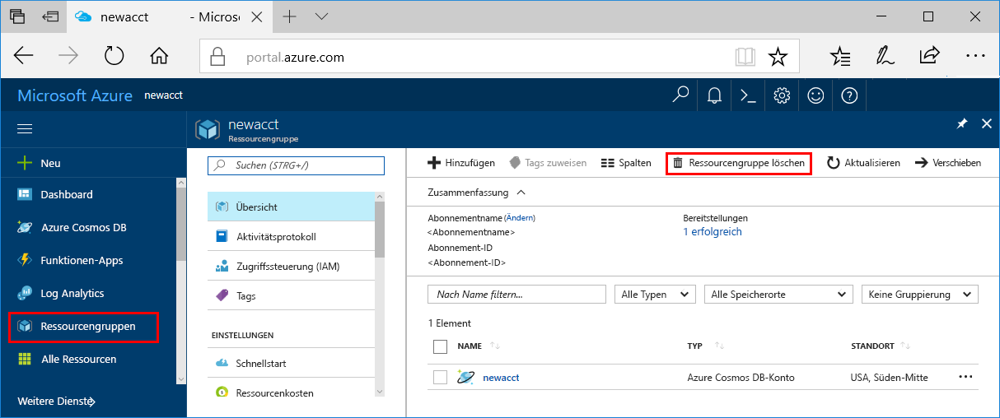

>[!IMPORTANT]
>Die von Ihnen erstellten Ressourcen können ggf. auch in anderen Tutorials und Anleitungen für den Azure Machine Learning-Dienst verwendet werden. 

Wenn Sie die hier erstellten Ressourcen nicht mehr benötigen, löschen Sie sie, damit Ihnen keine Kosten entstehen.

1. Wählen Sie ganz links im Azure-Portal **Ressourcengruppen** aus.
 
   

1. Wählen Sie in der Liste die Ressourcengruppe aus, die Sie erstellt haben.

1. Wählen Sie die Option **Ressourcengruppe löschen**.

1. Geben Sie den Ressourcengruppennamen ein, und klicken Sie auf **Löschen**.
