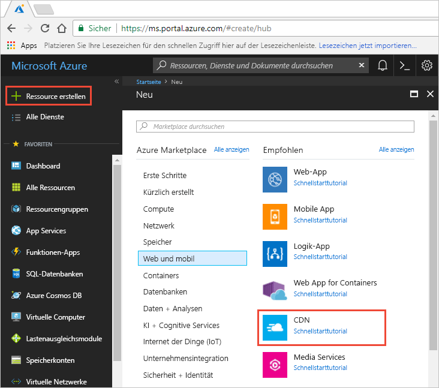
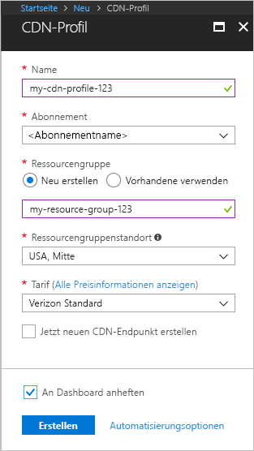

## Erstellen eines neuen CDN-Profils

Ein CDN-Profil ist ein Container für CDN-Endpunkte und gibt einen Tarif an.

1. Klicken Sie links oben im Azure-Portal auf **Ressource erstellen**.
    
    Der Bereich **Neu** wird angezeigt.
   
2. Klicken Sie auf **Web + Mobil** und anschließend auf **CDN**.
   
    

    Der Bereich **CDN-Profil** wird angezeigt.

    Verwenden Sie die Einstellungen aus der Tabelle unter der folgenden Abbildung.
   
    

    | Einstellung  | Wert |
    | -------- | ----- |
    | **Name** | Geben Sie *my-cdn-profile-123* als Profilname ein. Dieser Name muss global eindeutig sein. Sollte er bereits verwendet werden, können Sie einen anderen Namen eingeben. |
    | **Abonnement** | Wählen Sie in der Dropdownliste ein Azure-Abonnement aus.|
    | **Ressourcengruppe** | Klicken Sie auf **Neu erstellen**, und geben Sie *my-resource-group-123* als Ressourcengruppennamen ein. Dieser Name muss global eindeutig sein. Sollte er bereits verwendet werden, können Sie einen anderen Namen eingeben. | 
    | **Ressourcengruppenstandort** | Wählen Sie in der Dropdownliste die Option **USA, Mitte** aus. |
    | **Preisstufe** | Wählen Sie in der Dropdownliste die Option **Verizon Standard** aus. |
    | **Jetzt neuen CDN-Endpunkt erstellen** | Lassen Sie das Kontrollkästchen deaktiviert. |  
   
3. Aktivieren Sie das Kontrollkästchen **An Dashboard anheften**, um das erstellte Profil in Ihrem Dashboard zu speichern.
    
4. Wählen Sie **Erstellen**, um das Profil zu erstellen. 

    Bei **Azure CDN Standard von Microsoft** ist die Profilerstellung in der Regel in zwei Stunden abgeschlossen. 

