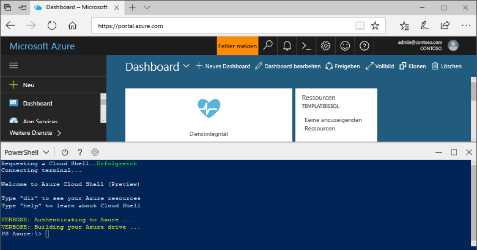

## Starten von Azure Cloud Shell

Azure Cloud Shell ist eine kostenlose Shell, die Sie direkt im Azure-Portal ausführen können. Sie verfügt über allgemeine vorinstallierte Tools und ist für die Verwendung mit Ihrem Konto konfiguriert. Klicken Sie auf die Schaltfläche **Cloud Shell** im Menü oben rechts im [Azure-Portal](https://portal.azure.com).

Die Schaltfläche öffnet eine interaktive Shell, die Sie verwenden können, um alle Schritte in diesem Thema auszuführen:

