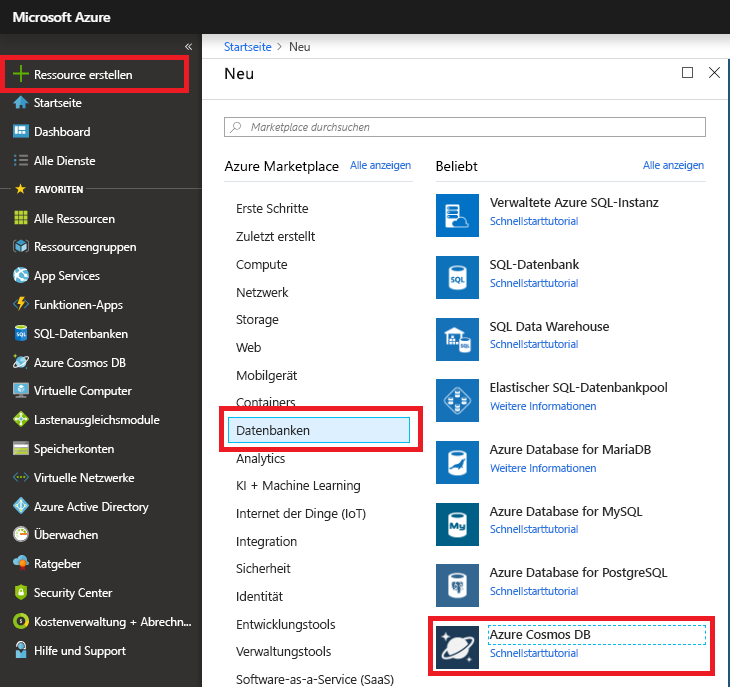

1. Melden Sie sich in einem neuen Browserfenster beim [Azure-Portal](https://portal.azure.com/) an.

2. Klicken Sie auf **Neu** > **Datenbanken** > **Azure Cosmos DB**.
   
   

3. Geben Sie auf der Seite **Neues Konto** die Einstellungen für das neue Azure Cosmos DB-Konto ein. 

    Einstellung|Empfohlener Wert|Beschreibung
    ---|---|---
    ID|*Ein eindeutiger Name*|Geben Sie einen eindeutigen Namen ein, der das Azure Cosmos DB-Konto identifiziert. Da *documents.azure.com* an die ID angefügt wird, die Sie bereitstellen, um Ihren URI zu erstellen, sollten Sie eine eindeutige, aber identifizierbare ID verwenden.  Die ID darf nur Kleinbuchstaben, Zahlen und den Bindestrich (-) enthalten, und sie muss zwischen 3 und 50 Zeichen lang sein.
    API|Gremlin (Graph)|Die API bestimmt den Typ des zu erstellenden Kontos. Azure Cosmos DB stellt vier APIs bereit, die Sie für Ihre Anwendung auswählen können: Gremlin (Graph), MongoDB, SQL (DocumentDB) und Table (Schlüssel/Wert). Für jede ist derzeit ein separates Konto erforderlich.   Wählen Sie **Gremlin (Graph)** aus, da Sie in diesem Schnellstart einen Graphen erstellen, der mit Gremlin-Syntax abgefragt werden kann.  [Erfahren Sie mehr über die Graph-API.](../articles/cosmos-db/graph-introduction.md)
    Abonnement|*Ihr Abonnement*|Wählen Sie das Azure-Abonnement, das Sie für dieses Azure Cosmos DB-Konto verwenden möchten, aus. 
    Ressourcengruppe|*Derselbe eindeutige Name wie oben für die ID*|Geben Sie einen neuen Ressourcengruppenname für Ihr Konto ein. Der Einfachheit halber können Sie denselben Namen wie bei Ihrer ID verwenden. 
    Standort|*Die Region, die Ihren Benutzern am nächsten liegt*|Wählen Sie den geografischen Standort, an dem Ihr Azure Cosmos DB-Konto gehostet werden soll, aus. Verwenden Sie einen Standort, der Ihren Benutzern am nächsten liegt, um ihnen einen schnellen Zugriff auf die Daten zu gewähren.
    Georedundanz aktivieren| Nicht ausfüllen | Dadurch wird eine replizierte Version Ihrer Datenbank in einer zweiten (zugeordneten) Region erstellt. Lassen Sie diese Einstellung leer.  
    An Dashboard anheften | Select | Aktivieren Sie dieses Kontrollkästchen, damit Ihr neues Datenbankkonto für den einfacheren Zugriff Ihrem Portaldashboard hinzugefügt wird.

    Klicken Sie dann auf **Erstellen**.

    

4. Die Kontoerstellung dauert einige Minuten. Während der Kontoerstellung zeigt das Portal die Kachel **Azure Cosmos DB wird bereitgestellt** an.

    

    Nach der Erstellung des Kontos wird die Seite **Herzlichen Glückwunsch! Ihr Azure Cosmos DB-Konto wurde erstellt** angezeigt. 