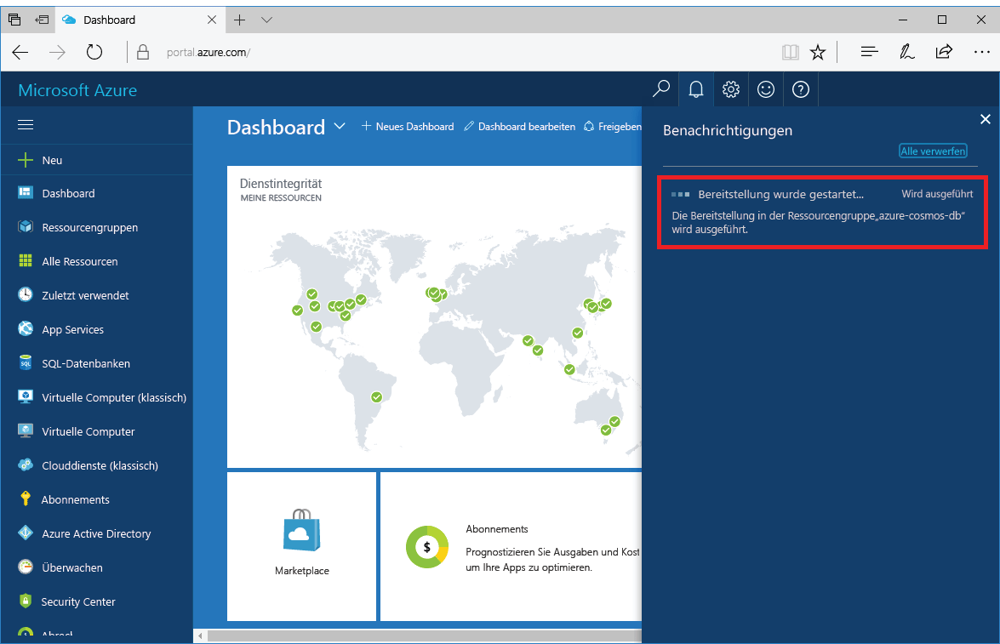
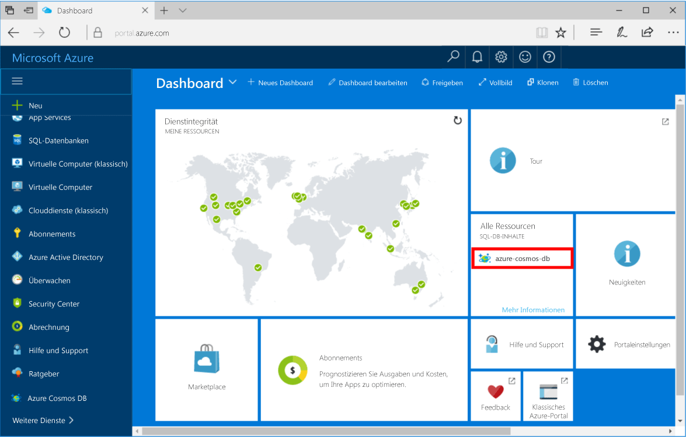

1. Melden Sie sich in einem neuen Fenster beim [Azure-Portal](https://portal.azure.com/) an.
2. Klicken Sie im linken Menü auf **Ressource erstellen** > **Datenbanken** > **Azure Cosmos DB** > **Erstellen**.
   
   

3. Legen Sie im Bereich **Neues Konto** die gewünschte Konfiguration für das Azure Cosmos DB-Konto fest. 

    Mit Azure Cosmos DB können Sie zwischen vier Programmiermodellen wählen: Gremlin (Graph), MongoDB, SQL und Table (Schlüssel-Wert). 
       
    In diesem Schnellstart werden wir mit der MongoDB-API programmieren, sodass Sie **MongoDB** auswählen, wenn Sie das Formular ausfüllen. Beachten Sie, dass Azure Cosmos DB eine hoch verfügbare, weltweit verteilte Datenbank-Dienstplattform für Ihre unternehmenskritischen Anwendungen bereitstellen kann, wenn Sie über Diagrammdaten aus einer Social Media-App, Dokumentdaten aus einer Katalog-App oder Schlüssel-/Wertdaten (Tabelle) verfügen.

    Füllen Sie den Bereich **Neues Konto** aus. Orientieren Sie sich dabei an den Informationen in der Tabelle.
 
    
   
    Einstellung|Empfohlener Wert|BESCHREIBUNG
    ---|---|---
    ID|*Eindeutiger Wert*|Ein eindeutiger Name, den Sie auswählen, um das Azure Cosmos DB-Konto zu identifizieren. *documents.azure.com* wird an die ID angefügt, die Sie bereitstellen, um Ihren URI zu erstellen, sodass Sie eine eindeutige aber identifizierbare ID verwenden sollten. Die ID darf nur Kleinbuchstaben, Ziffern und den Bindestrich „-“ enthalten und muss zwischen 3 und 50 Zeichen lang sein.
    API|MongoDB|Die API bestimmt den Typ des zu erstellenden Kontos. Azure Cosmos DB stellt fünf APIs bereit, die Sie für Ihre Anwendung auswählen können: SQL (Dokumentendatenbank), Gremlin (Diagrammdatenbank), MongoDB (Dokumentendatenbank), Azure Table und Cassandra. Für jede ist derzeit ein separates Konto erforderlich.   Wählen Sie **MongoDB** aus, da Sie in diesem Schnellstart eine Dokumentdatenbank erstellen, die mit MongoDB abgefragt werden kann.  [Weitere Informationen zur MongoDB-API](../articles/cosmos-db/mongodb-introduction.md)|
    Abonnement|*Ihr Abonnement*|Das Azure-Abonnement, das Sie für das Azure Cosmos DB-Konto verwenden möchten. 
    Ressourcengruppe|*Derselbe Wert wie die ID*|Der neue Ressourcengruppenname für Ihr Konto. Der Einfachheit halber können Sie denselben Namen wie bei Ihrer ID verwenden. 
    Speicherort|*Die Region, die Ihren Benutzern am nächsten liegt*|Der geografische Standort, an dem Ihr Azure Cosmos DB-Konto gehostet werden soll. Wählen Sie den Speicherort, der Ihren Benutzern am nächsten liegt, um ihnen einen schnellen Zugriff auf die Daten zu gewähren.

4. Klicken Sie auf **Erstellen** , um das Konto zu erstellen.
5. Klicken Sie in der Symbolleiste auf **Benachrichtigungen**, um den Bereitstellungsprozess zu überwachen.

    

6.  Wenn die Bereitstellung abgeschlossen wurde, öffnen Sie das neue Konto über die Kachel „Alle Ressourcen“. 

    
