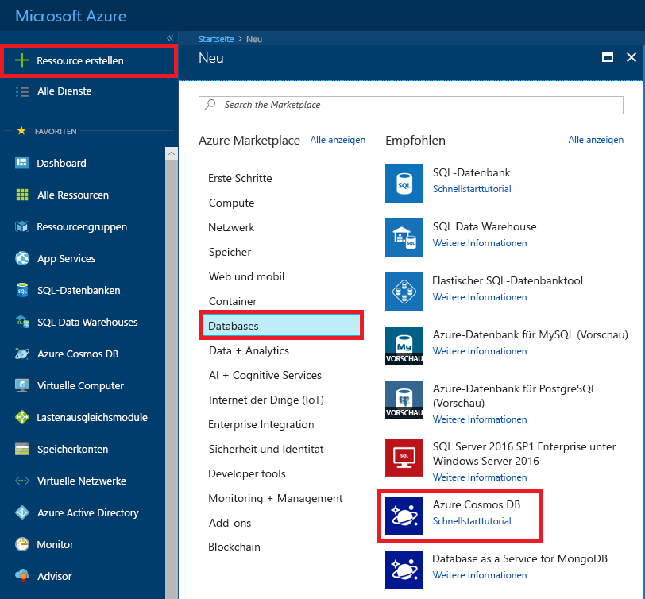
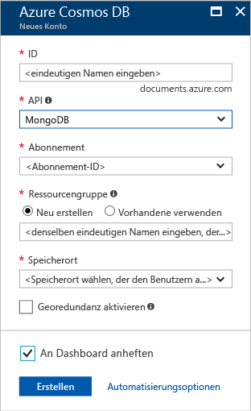
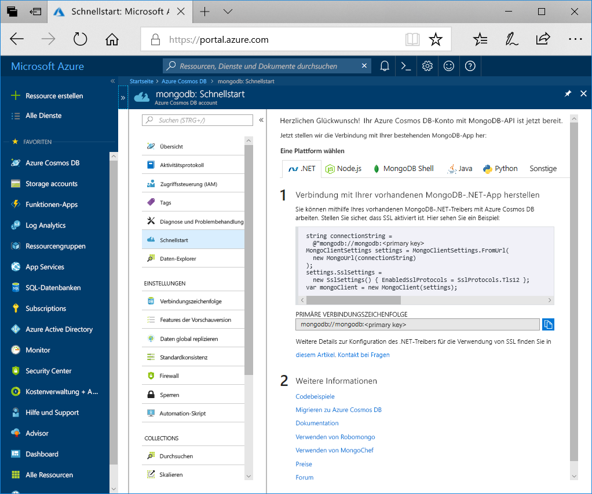

1. Melden Sie sich in einem neuen Fenster beim [Azure-Portal](https://portal.azure.com/) an.
2. Klicken Sie im linken Menü auf **Ressource erstellen** > **Datenbanken** und anschließend unter **Azure Cosmos DB** auf **Erstellen**.
   
   

3. Geben Sie auf der Seite **Azure Cosmos DB-Konto erstellen** die Einstellungen für das neue Azure Cosmos DB-Konto ein. 
 
    Einstellung|Wert|BESCHREIBUNG
    ---|---|---
    Abonnement|Ihr Abonnement|Wählen Sie das Azure-Abonnement aus, das Sie für dieses Azure Cosmos DB-Konto verwenden möchten. 
    Ressourcengruppe|Neu erstellen  Derselbe eindeutige Name wie für die ID|Wählen Sie **Neu erstellen**. Geben Sie dann einen neuen Ressourcengruppenname für Ihr Konto ein. Verwenden Sie der Einfachheit halber denselben Namen wie bei Ihrer ID. 
    Kontoname|Geben Sie einen eindeutigen Namen ein.|Geben Sie einen eindeutigen Namen ein, der Ihr Azure Cosmos DB-Konto identifiziert. Da *documents.azure.com* an die ID angefügt wird, die Sie für die URI-Erstellung angeben, muss die ID eindeutig sein.  Die ID darf nur Kleinbuchstaben, Zahlen und den Bindestrich (-) enthalten. Sie muss zwischen 3 und 31 Zeichen lang sein.
    API|Azure Cosmos DB-API für MongoDB|Die API bestimmt den Typ des zu erstellenden Kontos. Azure Cosmos DB stellt fünf APIs bereit: Kern-API (SQL) für Dokumentdatenbanken, Gremlin-API für Graphdatenbanken, API für MongoDB von Azure Cosmos DB für Dokumentdatenbanken, Azure Table und Cassandra. Derzeit müssen Sie ein separates Konto für jede API erstellen.   Wählen Sie **MongoDB** aus, da Sie mit dieser Schnellstartanleitung eine Tabelle erstellen, die mit MongoDB verwendet werden kann.|
    Location|Wählen Sie die Region aus, die Ihren Benutzern am nächsten liegt.|Wählen Sie einen geografischen Standort aus, an dem Ihr Azure Cosmos DB-Konto gehostet werden soll. Verwenden Sie einen Standort, der Ihren Benutzern am nächsten liegt, um ihnen einen schnellen Zugriff auf die Daten zu gewähren.

    Wählen Sie **Bewerten + erstellen** aus. Sie können die Abschnitte **Netzwerk** und **Tags** überspringen. 

    

4. Die Kontoerstellung dauert einige Minuten. Warten Sie, bis das Portal die Seite **Herzlichen Glückwunsch! Ihr Cosmos-Konto mit Wire Protocol-Kompatibilität für MongoDB ist bereit** anzeigt.

    
