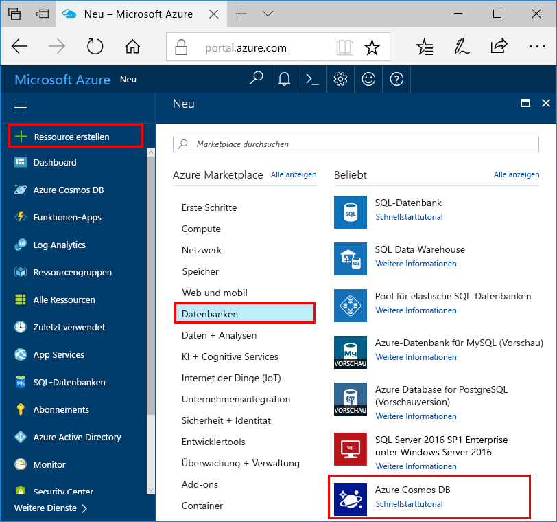
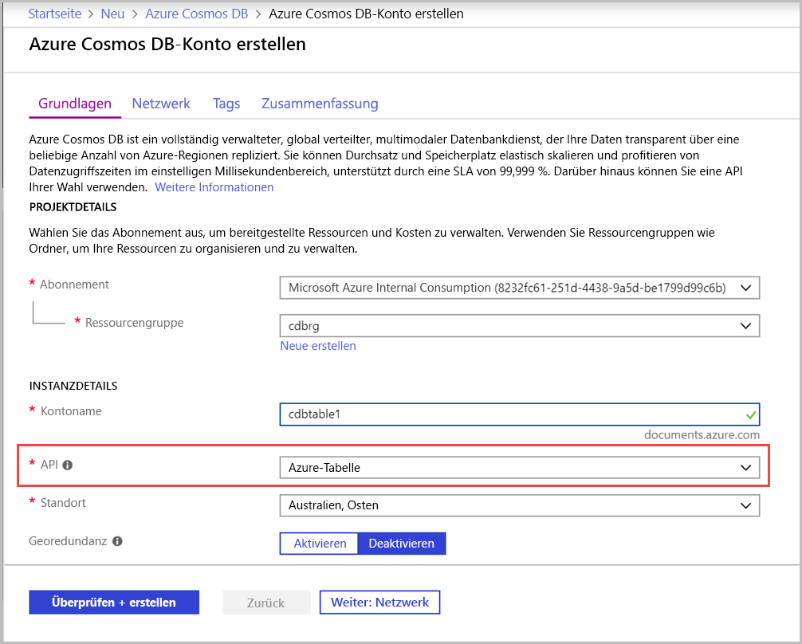
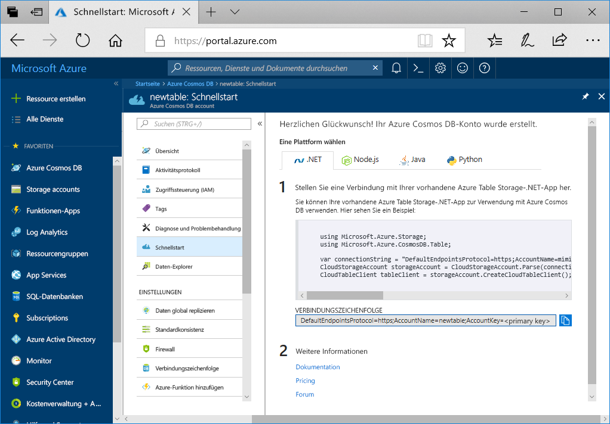

1. Melden Sie sich in einem neuen Browserfenster beim [Azure-Portal](https://portal.azure.com/) an.
2. Wählen Sie im linken Navigationsbereich die Option **Ressource erstellen** aus. Wählen Sie **Datenbanken** und dann **Azure Cosmos DB** aus.
   
   

3. Geben Sie auf der Seite **Azure Cosmos DB-Konto erstellen** die Einstellungen für das neue Azure Cosmos DB-Konto ein:
 
    Einstellung|Wert|BESCHREIBUNG
    ---|---|---
    Abonnement|Ihr Abonnement|Wählen Sie das Azure-Abonnement aus, das Sie für dieses Azure Cosmos DB-Konto verwenden möchten. 
    Ressourcengruppe|Neu erstellen  Derselbe eindeutige Name wie für die ID|Wählen Sie **Neu erstellen**. Geben Sie dann einen neuen Ressourcengruppenname für Ihr Konto ein. Verwenden Sie der Einfachheit halber denselben Namen wie bei Ihrer ID. 
    Kontoname|Geben Sie einen eindeutigen Namen ein.|Geben Sie einen eindeutigen Namen ein, der Ihr Azure Cosmos DB-Konto identifiziert.  Die ID darf nur Kleinbuchstaben, Zahlen und den Bindestrich (-) enthalten. Sie muss zwischen 3 und 31 Zeichen umfassen.
    API|Azure Table|Die API bestimmt den Typ des zu erstellenden Kontos. Azure Cosmos DB stellt fünf APIs bereit: Core (SQL)-API für Dokumentdatenbanken, Gremlin-API für Graphdatenbanken, MongoDB-API für Dokumentdatenbanken, Azure Table und Cassandra. Derzeit müssen Sie ein separates Konto für jede API erstellen.   Wählen Sie **Azure Table** aus, da Sie mit diesem Schnellstart eine Tabelle erstellen, die mit der Tabellen-API verwendet werden kann.   [Weitere Informationen zur Tabellen-API](../articles/cosmos-db/table-introduction.md)|
    Location|Wählen Sie die Region aus, die Ihren Benutzern am nächsten liegt.|Wählen Sie einen geografischen Standort aus, an dem Ihr Azure Cosmos DB-Konto gehostet werden soll. Verwenden Sie einen Standort, der Ihren Benutzern am nächsten liegt, um ihnen einen schnellen Zugriff auf die Daten zu ermöglichen.

    Sie können für die Optionen **Georedundanz** und **Schreibvorgänge in mehreren Regionen** die Standardwerte beibehalten (**deaktiviert**), um zusätzliche Gebühren für Anforderungseinheiten zu vermeiden. Sie können die Abschnitte **Netzwerk** und **Tags** überspringen.

5. Wählen Sie **Bewerten + erstellen** aus. Wählen Sie nach Abschluss der Validierung **Erstellen** aus, um das Konto zu erstellen. 
 
   

6. Die Erstellung des Kontos dauert einige Minuten. Es wird folgende Meldung angezeigt: **Ihre Bereitstellung wird ausgeführt**. Warten Sie, bis die Bereitstellung abgeschlossen ist, und wählen Sie dann **Zu Ressource wechseln** aus.

    
