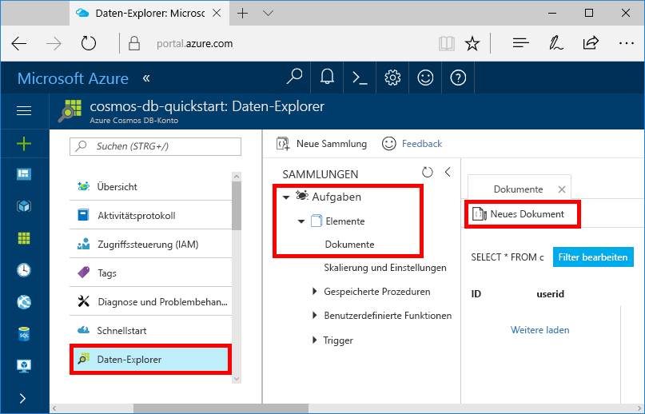
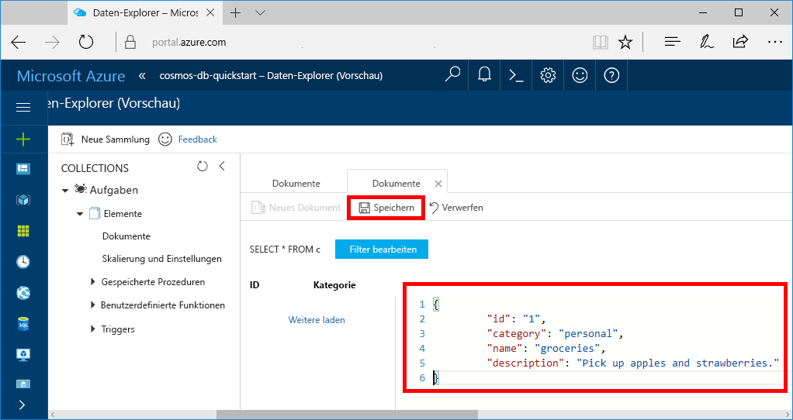

Sie können nun mithilfe des Daten-Explorers Daten zu einer neuen Sammlung hinzufügen.

1. Im Daten-Explorer wird die neue Datenbank im Bereich „Sammlungen“ angezeigt. Erweitern Sie die Datenbank **Aufgaben** und die Sammlung **Elemente**, und klicken Sie auf **Dokumente** und anschließend auf **Neue Dokumente**. 

   
  
2. Fügen Sie nun der Sammlung ein Dokument mit folgender Struktur hinzu.

     ```json
     {
         "id": "1",
         "category": "personal",
         "name": "groceries",
         "description": "Pick up apples and strawberries.",
         "isComplete": false
     }
     ```

3. Nachdem Sie den JSON-Code auf der Registerkarte **Dokumente** hinzugefügt haben, klicken Sie auf **Speichern**.

    

4.  Erstellen und speichern Sie ein weiteres Dokument, in das Sie einen eindeutigen Wert für die Eigenschaft `id` einfügen, und ändern Sie die anderen Eigenschaften nach Bedarf. Ihre neuen Dokumente können jede gewünschte Struktur aufweisen, da Azure Cosmos DB kein Schema für Ihre Daten vorgibt.