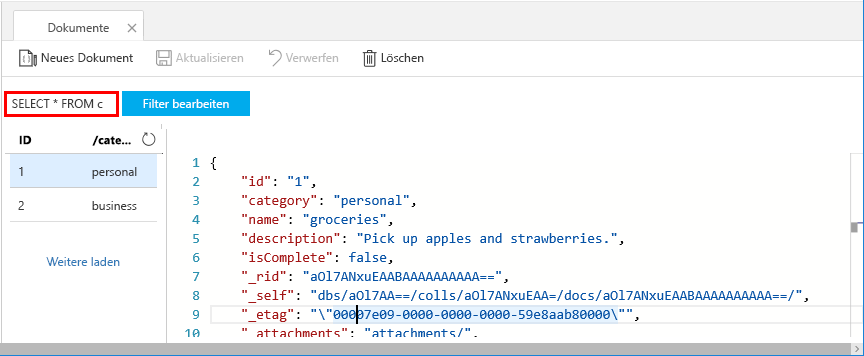
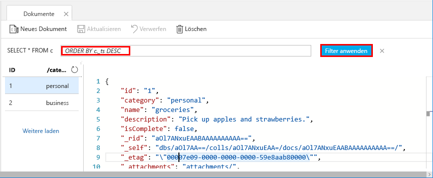

Sie können jetzt zum Abrufen und Filtern Ihrer Daten Abfragen im Daten-Explorer verwenden.

1. Beachten Sie, dass die Abfrage standardmäßig auf `SELECT * FROM c` festgelegt ist. Dieser Standardabfrage ruft alle Dokumente in der Sammlung ab und zeigt sie an. 

    

2. Bleiben Sie auf der Registerkarte **Dokumente**, und ändern Sie die Abfrage, indem Sie auf die Schaltfläche **Filter bearbeiten** klicken, `ORDER BY c._ts DESC` dem Abfrageprädikatfeld hinzufügen und anschließend auf **Filter anwenden** klicken.

    

Mithilfe dieser geänderten Abfrage werden die Dokumente auf Basis ihrer Zeitstempel in absteigender Reihenfolge sortiert, damit Ihr zweites Dokument zuerst aufgeführt wird. Wenn Sie mit der SQL-Syntax vertraut sind, können Sie eine der unterstützten [SQL-Abfragen](../articles/cosmos-db/sql-api-sql-query.md) in dieses Feld eingeben. 

Damit ist unsere Arbeit im Daten-Explorer abgeschlossen. Bevor wir mit der Arbeit mit Code fortfahren, beachten Sie, dass der Daten-Explorer auch zum Erstellen von gespeicherten Prozeduren, UDFs und Triggern verwendet werden kann, um sowohl serverseitige Geschäftslogik als auch einen Skalierungsdurchsatz auszuführen. Der Daten-Explorer stellt den gesamten integrierten programmgesteuerten Datenzugriff in den APIs zur Verfügung, bietet jedoch einfachen Zugriff auf Ihre Daten im Azure-Portal.