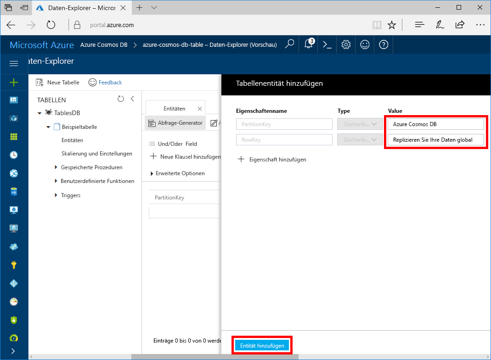

Sie können nun mithilfe des Daten-Explorers Daten zu einer neuen Tabelle hinzufügen.

1. Erweitern Sie im Daten-Explorer **sample-database**, klicken Sie auf **Entitäten**, und klicken Sie anschließend auf **Entität hinzufügen**.

   

2. Geben Sie nun Daten in das Wertfeld „PartitionKey“ und „RowKey“ ein, und klicken Sie auf **Entität hinzufügen**.

   
  
    Jetzt können Sie weitere Entitäten in Ihre Tabelle hinzufügen, diese Entitäten bearbeiten und Ihre Daten im Daten-Explorer abfragen. Im Daten-Explorer können Sie zudem Ihren Durchsatz skalieren und der Tabelle gespeicherte Prozeduren, benutzerdefinierte Funktionen und Trigger hinzufügen.