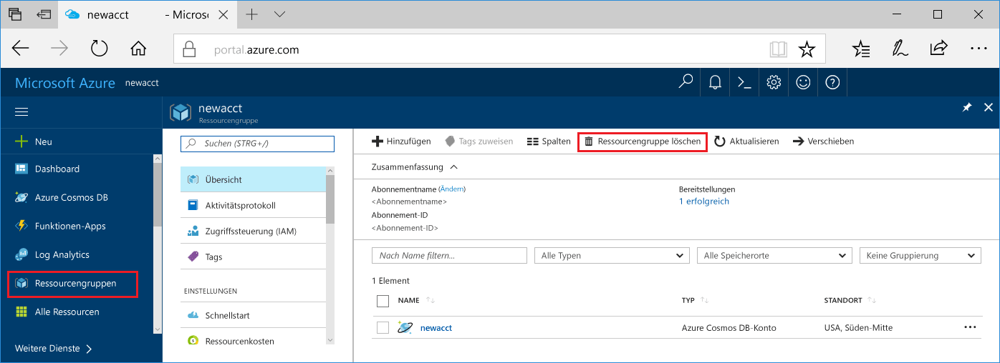

Wenn Sie diese App nicht weiter verwenden möchten, löschen Sie alle von diesem Schnellstart erstellten Ressourcen. Führen Sie dazu folgende Schritte durch, damit keine Gebühren anfallen:

1. Wählen Sie **Ressourcengruppen** aus, und klicken Sie dann auf **Ressourcengruppe löschen**. 

   

2. Geben Sie den Namen der zu löschenden Ressourcengruppe ein, und klicken Sie dann auf **Löschen**.

