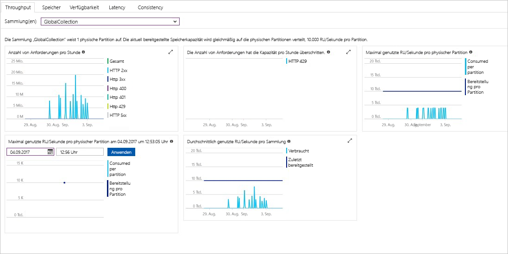

Im Azure-Portal werden Durchsatz, Speicher, Verfügbarkeit, Wartezeit und Konsistenz Ihres Cosmos DB-Kontos überwacht. Diagramme für Metriken einer [Azure Cosmos DB-SLA (Service Level Agreement, Vereinbarung zum Servicelevel)](https://azure.microsoft.com/support/legal/sla/cosmos-db/) zeigen den SLA-Wert im Vergleich zur tatsächlichen Leistung. Diese Sammlung von Metriken macht die Überwachung Ihrer SLAs transparent.

So überprüfen Sie Metriken und SLAs: 

1. Wählen Sie im Navigationsmenü Ihres Cosmos DB-Kontos die Option **Metrik** aus.
   
2. Wählen Sie eine Registerkarte (etwa **Wartezeit**) und auf der rechten Seite einen Zeitraum aus. Vergleichen Sie Zeilen **Tatsächlich** und **SLA** in den Diagrammen.
   
   
   
3. Überprüfen Sie die Metriken auf den anderen Registerkarten. 

