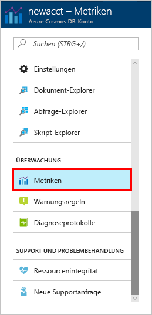

Durchsatz, Speicher, Verfügbarkeit, Latenz und Konsistenz der Ressourcen in Ihrem Konto werden im Azure-Portal überwacht. Werfen Sie einen kurzen Blick auf diese Metriken. 

1. Klicken Sie im Navigationsmenü auf **Metriken**.

   

2. Klicken Sie auf die einzelnen Registerkarten, damit Sie die Metriken kennen, die Azure Cosmos DB bereitstellt. 

    Jedes Diagramm, das den [Vereinbarungen zum Servicelevel (SLAs) von Azure Cosmos DB](https://azure.microsoft.com/support/legal/sla/cosmos-db/) zugeordnet ist, enthält eine Zeile mit möglichen Verletzungen der SLAs. Azure Cosmos DB macht die Überwachung Ihrer SLAs mit dieser Sammlung von Metriken transparent. 

   