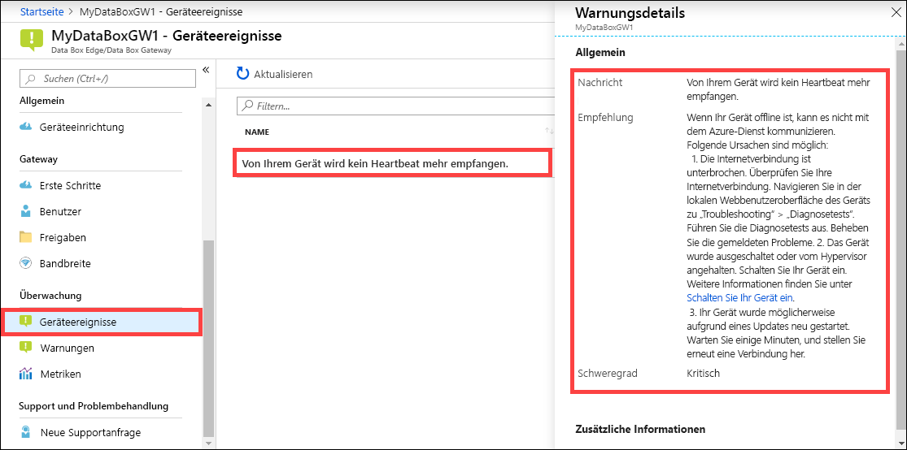

Führen Sie die folgenden Schritte im Azure-Portal aus, um ein Geräteereignis anzuzeigen.

1. Navigieren Sie im Azure-Portal zu Ihrer Data Box Edge-/Data Box Gateway-Ressource und anschließend zu **Überwachung > Geräteereignisse**.
2. Wählen Sie ein Ereignis aus, und sehen Sie sich die Details der Warnung an. Führen Sie die entsprechende Maßnahme zum Beheben der Warnungsbedingung aus.

    