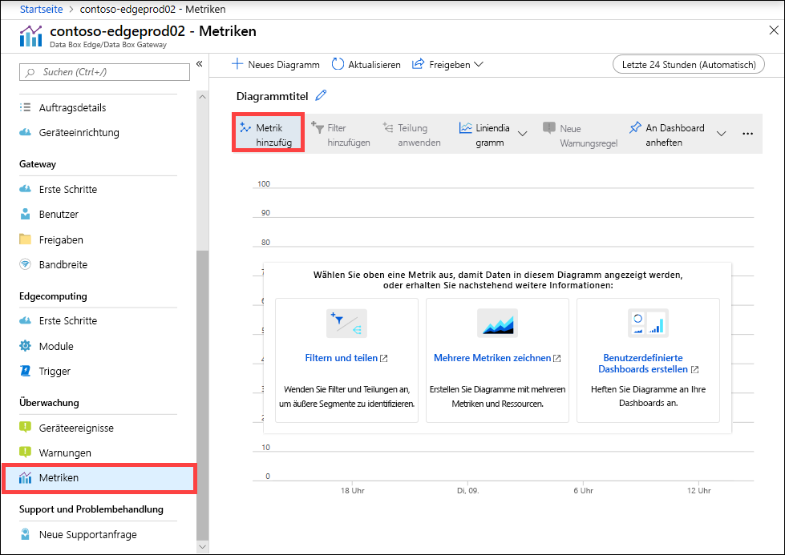
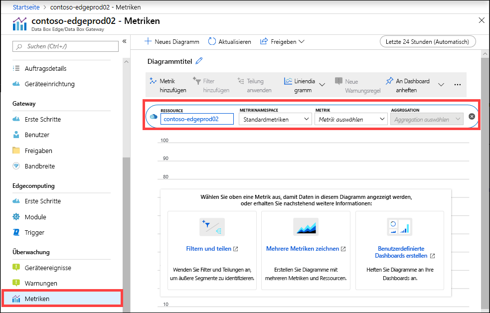
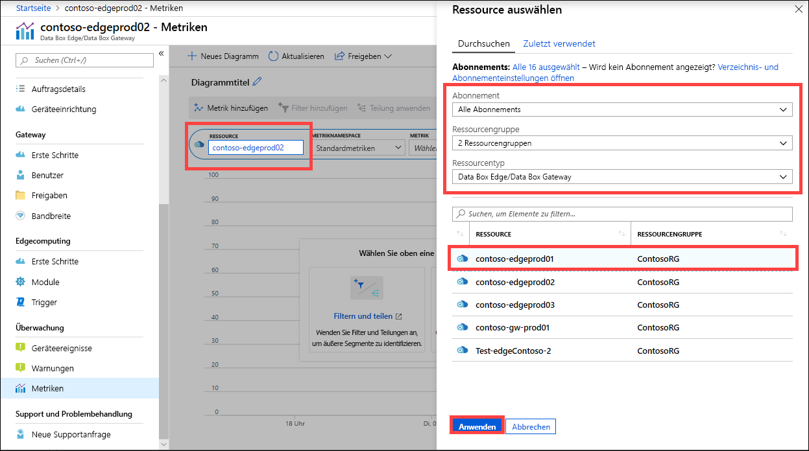
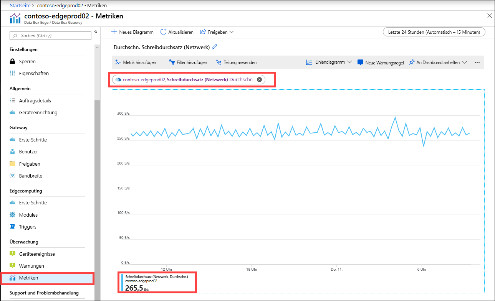
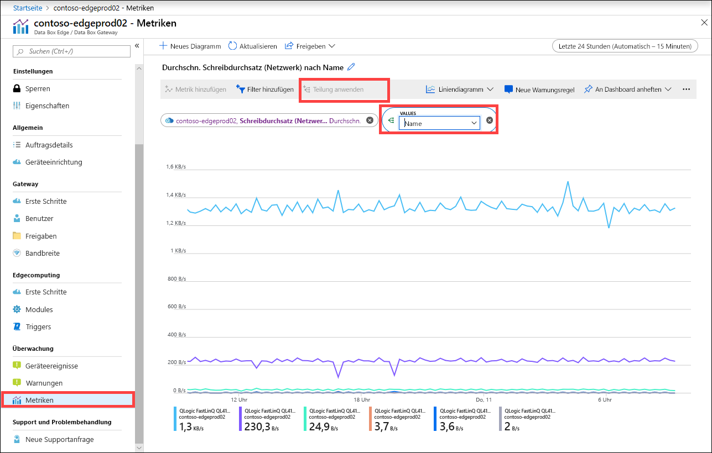
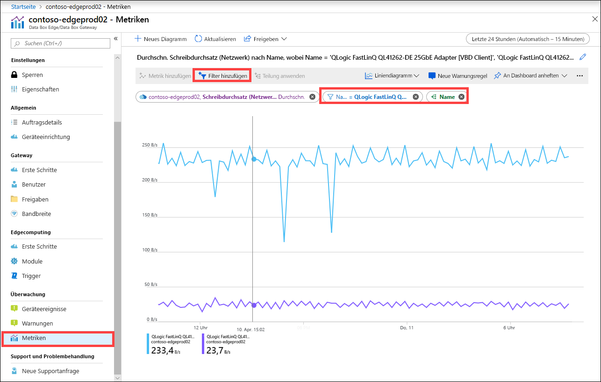
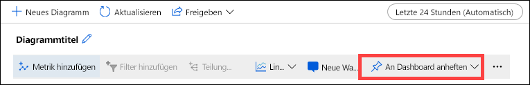
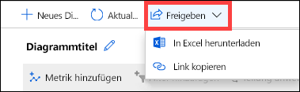

Sie können auch die Metriken zur Überwachung der Leistung des Geräts und in einigen Fällen zur Problembehandlung bei Geräteproblemen anzeigen.

Führen Sie die folgenden Schritte im Azure-Portal aus, um ein Diagramm für ausgewählte Gerätemetriken zu erstellen.

1. Wechseln Sie für Ihre Ressource im Azure-Portal zu **Überwachung > Metriken**, und wählen Sie **Metrik hinzufügen** aus.

    

2. Die Ressource wird automatisch aufgefüllt.  

    

    Um eine andere Ressource anzugeben, wählen Sie die Ressource aus. Wählen Sie auf dem Blatt **Ressource auswählen** das Abonnement, die Ressourcengruppe, den Ressourcentyp und die bestimmte Ressource aus, für die Sie die Metriken anzeigen möchten, und wählen Sie dann **Anwenden** aus.

    

3. Wählen Sie aus der Dropdownliste eine Metrik aus, um Ihr Gerät zu überwachen. Die Metriken können **Kapazitätsmetriken** oder **Transaktionsmetriken** sein. Die Kapazitätsmetriken beziehen sich auf die Kapazität des Geräts. Die Transaktionsmetriken beziehen sich auf die Lese- und Schreibvorgänge in Azure Storage.

    |Kapazitätsmetriken                     |BESCHREIBUNG  |
    |-------------------------------------|-------------|
    |**Verfügbare Kapazität**               | Bezieht sich auf die Menge der Daten, die auf das Gerät geschrieben werden können. Das bedeutet, dass dies die Kapazität ist, die auf dem Gerät zur Verfügung gestellt werden kann.   Sie können die Gerätekapazität freigeben, indem Sie die lokale Kopie von Dateien löschen, die sowohl auf dem Gerät als auch in der Cloud über eine Kopie verfügen.        |
    |**Gesamtkapazität**                   | Bezieht sich auf die Gesamtzahl der Bytes auf dem Gerät, auf das Daten geschrieben werden sollen. Dies wird auch als Gesamtgröße des lokalen Caches bezeichnet.    Sie können jetzt die Kapazität eines vorhandenen virtuellen Geräts erhöhen, indem Sie einen Datenträger hinzufügen. Fügen Sie einen Datenträger über die Hypervisor-Verwaltung für den virtuellen Computer hinzu, und starten Sie den virtuellen Computer neu. Der lokale Speicherpool des Gatewaygeräts wird erweitert, um den neu hinzugefügten Datenträger aufzunehmen.   Weitere Informationen finden Sie unter [Hinzufügen einer Festplatte für virtuelle Hyper-V-Computer](https://www.youtube.com/watch?v=EWdqUw9tTe4). |
    
    |Transaktionsmetriken              | BESCHREIBUNG         |
    |-------------------------------------|---------|
    |**Hochgeladene Cloudbytes (Gerät)**    | Summe aller Bytes, die über alle Freigaben auf Ihrem Gerät hochgeladen wurden        |
    |**Hochgeladene Cloudbytes (Freigabe)**     | Hochgeladene Bytes pro Freigabe Infrage kommt:    Avg, d. h. (Summe aller hochgeladenen Bytes pro Freigabe/Anzahl der Freigaben)    Max, d. h. die maximale Anzahl von Bytes, die von einer Freigabe hochgeladen wurden   Min, d. h. die minimale Anzahl von Bytes, die von einer Freigabe hochgeladen wurden      |
    |**Clouddownloaddurchsatz (Freigabe)**| Heruntergeladene Bytes pro Freigabe Infrage kommt:    Avg, d. h. (Summe aller von einer Freigabe gelesenen oder heruntergeladenen Bytes/Anzahl der Freigaben)    Max, d. h. die maximale Anzahl von Bytes, die von einer Freigabe heruntergeladen wurden   Min, d. h. die minimale Anzahl von Bytes, die von einer Freigabe heruntergeladen wurden  |
    |**Cloudlesedurchsatz**            | Summe aller Bytes, die über alle Freigaben auf Ihrem Gerät aus der Cloud gelesen wurden     |
    |**Clouduploaddurchsatz**          | Summe aller Bytes, die über alle Freigaben auf Ihrem Gerät in die Cloud geschrieben wurden     |
    |**Clouduploaddurchsatz (Freigabe)**  | Summe aller Bytes, die von einer Freigabe in die Cloud geschrieben wurden/Anzahl der Freigaben ist durchschnittlich, maximal und minimal pro Freigabe      |
    |**Lesedurchsatz (Netzwerk)**           | Enthält den Systemnetzwerkdurchsatz für alle aus der Cloud gelesenen Bytes Diese Ansicht kann Daten enthalten, die nicht auf Freigaben beschränkt sind.   Die Aufteilung zeigt den Datenverkehr über alle Netzwerkadapter auf dem Gerät an. Dazu gehören auch Adapter, die nicht verbunden oder aktiviert sind.      |
    |**Schreibdurchsatz (Netzwerk)**       | Enthält den Systemnetzwerkdurchsatz für alle in die Cloud geschriebenen Bytes Diese Ansicht kann Daten enthalten, die nicht auf Freigaben beschränkt sind.   Die Aufteilung zeigt den Datenverkehr über alle Netzwerkadapter auf dem Gerät an. Dazu gehören auch Adapter, die nicht verbunden oder aktiviert sind.          |
    |**Edgecomputing – Arbeitsspeichernutzung**      | Diese Metrik gilt nicht für das Data Box Gateway und ist daher nicht aufgefüllt.          |
    |**Edgecomputing – CPU in Prozent**    | Diese Metrik gilt nicht für das Data Box Gateway und ist daher nicht aufgefüllt.         |

4. Wenn eine Metrik aus der Dropdownliste ausgewählt wird, kann auch eine Aggregation definiert werden. „Aggregation“ bezeichnet den tatsächlichen Wert, der über einen bestimmten Zeitraum aggregiert wird. Die aggregierten Werte können durchschnittlich, minimal oder maximal sein. Wählen Sie die Aggregation aus „Avg“, „Max“ oder „Min“ aus.

    

5. Wenn die von Ihnen ausgewählte Metrik mehrere Instanzen aufweist, haben Sie die Möglichkeit zur Aufteilung. Wählen Sie **Teilen anwenden** und dann den Wert aus, der für die Aufschlüsselung verwendet werden soll.

    

6. Wenn Sie jetzt die Aufschlüsselung nur noch für einige wenige Instanzen anzeigen möchten, können Sie die Daten filtern. Wenn Sie in diesem Fall z. B. den Netzwerkdurchsatz nur für die beiden angeschlossenen Netzwerkschnittstellen auf Ihrem Gerät anzeigen möchten, können Sie diese Schnittstellen filtern. Wählen Sie **Filter hinzufügen** aus, und geben Sie den Namen der Netzwerkschnittstelle für die Filterung an.

    

7. Sie können das Diagramm auch für den einfachen Zugriff an das Dashboard anheften.

    

8. Um Diagrammdaten in eine Excel-Tabelle zu exportieren oder einen Link zum Diagramm abzurufen, den Sie freigeben können, wählen Sie die Freigabeoption auf der Befehlsleiste aus.

    