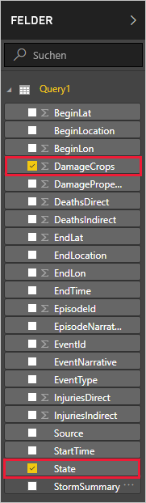
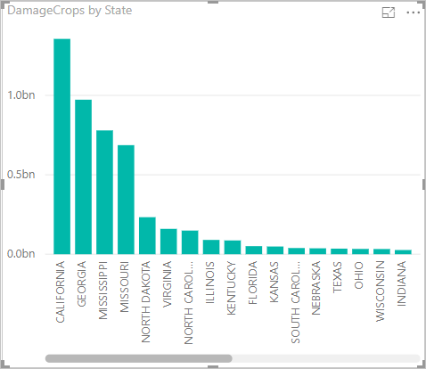

Da Sie nun über Daten in Power BI Desktop verfügen, können Sie Berichte auf der Grundlage dieser Daten erstellen. Sie erstellen einen einfachen Bericht mit einem Säulendiagramm, das die Ernteschäden nach Bundesstaat zeigt.

1. Wählen Sie auf der linken Seite des Power BI-Fensters die Berichtsansicht aus.

    

1. Wählen Sie im Bereich **VISUALISIERUNGEN** das gruppierte Säulendiagramm aus.

    

    Ein leeres Diagramm wird der Canvas hinzugefügt.

    

1. Wählen Sie in der Liste **FELDER** die Einträge **DamageCrops** und **State** aus.

    

    Sie haben nun ein Diagramm, das die Ernteschäden für die ersten 1.000 Zeilen in der Tabelle zeigt.

    

1. Speichern Sie den Bericht.