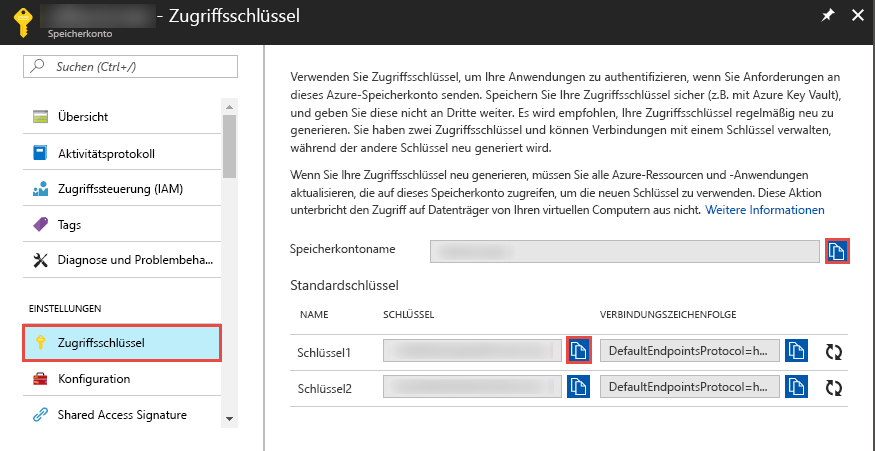
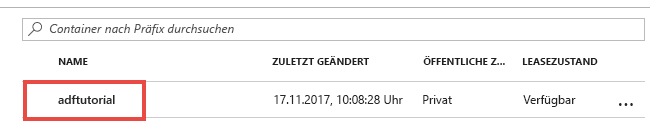

## <a name="prerequisites"></a>Voraussetzungen

### <a name="azure-subscription"></a>Azure-Abonnement
Wenn Sie kein Azure-Abonnement besitzen, können Sie ein [kostenloses Konto](https://azure.microsoft.com/free/) erstellen, bevor Sie beginnen.

### <a name="azure-roles"></a>Azure-Rollen
Damit Sie Data Factory-Instanzen erstellen können, muss das Benutzerkonto, mit dem Sie sich bei Azure anmelden, ein Mitglied der Rolle *Mitwirkender* oder *Besitzer* oder ein *Administrator* des Azure-Abonnements sein. Klicken Sie im Azure-Portal in der oberen rechten Ecke auf Ihren Benutzernamen und dann auf **Berechtigungen**, um Ihre Berechtigungen im Abonnement anzuzeigen. Wenn Sie Zugriff auf mehrere Abonnements besitzen, wählen Sie das entsprechende Abonnement aus. 

Für das Erstellen und Verwalten von untergeordneten Ressourcen für Data Factory – z.B. Datasets, verknüpfte Dienste, Pipelines, Trigger und Integration Runtimes – gelten die folgenden Anforderungen:
- Für das Erstellen und Verwalten von untergeordneten Ressourcen im Azure-Portal müssen Sie auf Ressourcengruppenebene oder höher Mitglied der Rolle **Mitwirkender von Data Factory** sein.
- Zum Erstellen und Verwalten von untergeordneten Ressourcen mit PowerShell oder dem SDK auf Ressourcenebene oder höher ist die Rolle **Mitwirkender** ausreichend.

Eine Beispielanleitung zum Hinzufügen eines Benutzers zu einer Rolle finden Sie im Artikel [Hinzufügen oder Ändern von Azure-Administratorrollen, die das Abonnement oder die Dienste verwalten](../articles/billing/billing-add-change-azure-subscription-administrator.md).

Weitere Informationen finden Sie in den folgenden Artikeln:
- [Rolle „Mitwirkender von Data Factory“](../articles/role-based-access-control/built-in-roles.md#data-factory-contributor)
- [Roles and permissions for Azure Data Factory](../articles/data-factory/concepts-roles-permissions.md) (Rollen und Berechtigungen für Azure Data Factory)

### <a name="azure-storage-account"></a>Azure-Speicherkonto
Sie verwenden in diesem Schnellstart ein allgemeines Azure-Speicherkonto (Blobspeicher) als Datenspeicher vom Typ *Quelle* und vom Typ *Ziel*. Falls Sie noch nicht über ein allgemeines Azure-Speicherkonto verfügen, lesen Sie zum Erstellen die Informationen unter [Erstellen Sie ein Speicherkonto](../articles/storage/common/storage-quickstart-create-account.md). 

#### <a name="get-the-storage-account-name-and-account-key"></a>Abrufen des Speicherkontonamens und des Kontoschlüssels
In dieser Schnellstartanleitung benötigen Sie den Namen und Schlüssel Ihres Azure-Speicherkontos. Das folgende Verfahren enthält die Schritte zum Abrufen des Namens und Schlüssels für Ihr Speicherkonto: 

1. Wechseln Sie in einem Webbrowser zum [Azure-Portal](https://portal.azure.com). Melden Sie sich mit Ihrem Azure-Benutzernamen und -Kennwort an. 
2. Klicken Sie im Menü auf der linken Seite auf **Alle Dienste**, filtern Sie nach dem Schlüsselwort **Speicher**, und wählen Sie **Speicherkonten**.

   
3. Filtern Sie in der Liste mit den Speicherkonten nach Ihrem Speicherkonto (falls erforderlich), und wählen Sie Ihr Speicherkonto aus. 
4. Wählen Sie auf der Seite **Speicherkonto** im Menü die Option **Zugriffsschlüssel**.

   
5. Kopieren Sie die Werte für die Felder **Speicherkontoname** und **key1** in die Zwischenablage. Fügen Sie sie in einen Editor ein, und speichern Sie sie. Sie benötigen sie später in dieser Schnellstartanleitung noch.   

#### <a name="create-the-input-folder-and-files"></a>Erstellen des Eingabeordners und der Dateien
In diesem Abschnitt erstellen Sie einen Blobcontainer mit dem Namen **adftutorial** in Azure Blob Storage. Erstellen Sie den Ordner **input** im Container, und laden Sie dann eine Beispieldatei in den Eingabeordner hoch. 

1. Wechseln Sie auf der Seite **Speicherkonto** zu **Übersicht**, und wählen Sie die Option **Blobs**. 

   
2. Klicken Sie auf der Seite **Blob-Dienst** auf der Symbolleiste auf **+ Container**. 

       
3. Geben Sie im Dialogfeld **Neuer Container** als Namen **adftutorial** ein, und klicken Sie auf **OK**. 

   
4. Wählen Sie in der Liste mit den Containern die Option **adftutorial**. 

   
5. Klicken Sie auf der Seite **Container** auf der Symbolleiste auf **Hochladen**.  

   
6. Klicken Sie auf der Seite **Blob hochladen** auf **Erweitert**.

   
7. Starten Sie **Editor**, und erstellen Sie eine Datei mit dem Namen **emp.txt** und folgendem Inhalt: Speichern Sie sie im Ordner **c:\ADFv2QuickStartPSH**. Erstellen Sie den Ordner **ADFv2QuickStartPSH**, falls er nicht bereits vorhanden ist.
    
   ```
   John, Doe
   Jane, Doe
   ```    
8. Navigieren Sie im Azure-Portal auf der Seite **Blob hochladen** für das Feld **Dateien** zur Datei **emp.txt**, und wählen Sie sie aus. 
9. Geben Sie für das Feld **In Ordner hochladen** den Wert **input** ein. 

        
10. Vergewissern Sie sich, dass als Ordner **input** und als Datei **emp.txt** ausgewählt ist, und klicken Sie auf **Hochladen**.
    
    Daraufhin sollten in der Liste die Datei **emp.txt** und der Status des Uploads angezeigt werden. 
12. Schließen Sie die Seite **Blob hochladen**, indem Sie in der Ecke auf **X** klicken. 

    
1. Lassen Sie die Seite **Container** geöffnet. Sie überprüfen darauf am Ende dieser Schnellstartanleitung die Ausgabe.