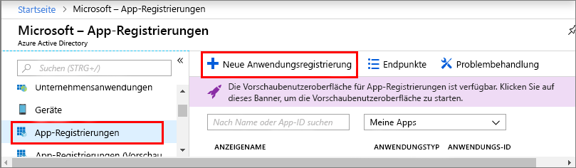
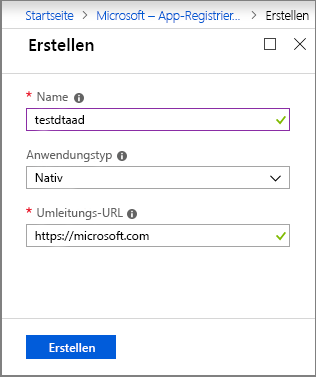

1. Öffnen Sie im [Azure-Portal](https://portal.azure.com) im linken Navigationsbereich **Azure Active Directory**, und öffnen Sie dann den Bereich **Eigenschaften**. Kopieren Sie **Verzeichnis-ID** in eine temporäre Datei. Mit diesem Wert konfigurieren Sie im folgenden Abschnitt die Beispielanwendung.

    

1. Öffnen Sie den im Bereich **App-Registrierungen**, und klicken Sie dann auf die Schaltfläche **Registrierung einer neuen Anwendung**.
    
    

1. Geben Sie im Feld **Name** einen Anzeigenamen für diese App-Registrierung ein. Wählen Sie den **_Nativ_** als **Anwendungstyp** und **_https://microsoft.com_** als **Umleitungs-URI**. Klicken Sie auf **Create**.

    

1. Öffnen Sie die registrierte App, und kopieren Sie den Wert im Feld **Anwendungs-ID** in eine temporäre Datei: Dieser Wert identifiziert Ihre Azure Active Directory-App. Mit der Anwendungs-ID konfigurieren Sie in den folgenden Abschnitten Ihre Beispielanwendung.

    

1. Öffnen Sie den Registrierungsbereich Ihrer App, und klicken Sie auf **Einstellungen** > **Erforderliche Berechtigungen**:
    - Klicken Sie links oben auf **Hinzufügen**, um den Bereich **API-Zugriff hinzufügen** zu öffnen.
    - Klicken Sie auf **API auswählen**, und suchen Sie nach **Azure Digital Twins**. Wenn die API damit nicht gefunden wird, suchen Sie stattdessen nach **Azure Smart Spaces**.
    - Wählen Sie die Option **Azure Digital Twins (Azure Smart Spaces Service)**, und klicken Sie auf **Auswählen**.
    - Klicken Sie auf **Berechtigungen auswählen**. Aktivieren Sie das Kontrollkästchen **Lese-/Schreibzugriff** für delegierte Berechtigungen, und klicken Sie auf **Auswählen**.
    - Klicken Sie auf der Seite **API-Zugriff hinzufügen** auf **Fertig**.
    - Klicken Sie im Bereich **Erforderliche Berechtigungen** auf die Schaltfläche **Berechtigungen erteilen**, und akzeptieren Sie die angezeigte Bestätigung.

       
