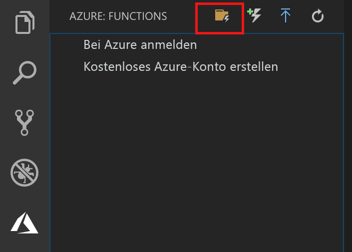
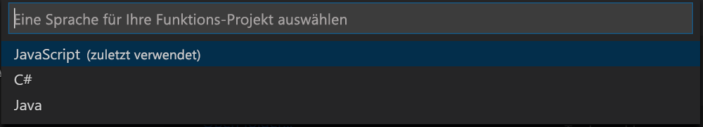

## Erstellen eines Azure Functions-Projekts

Mit der Azure Functions-Projektvorlage in Visual Studio Code wird ein Projekt erstellt, das in einer Funktions-App in Azure veröffentlicht werden kann. Sie können mit einer Funktionen-App Funktionen zu logischen Einheiten gruppieren, um die Verwaltung, Bereitstellung und Freigabe von Ressourcen zu ermöglichen.

1. Wählen Sie in Visual Studio Code das Azure-Logo aus, um den Bereich **Azure: Funktionen** anzuzeigen, und wählen Sie dann das Symbol „Neues Projekt erstellen“ aus.

    

1. Wählen Sie einen Speicherort für Ihren Projektarbeitsbereich und anschließend **Auswählen** aus.

    > [!NOTE]
    > Die Schritte in diesem Artikel sollten außerhalb eines Arbeitsbereichs ausgeführt werden. Wählen Sie in diesem Fall keinen Projektordner aus, der Teil eines Arbeitsbereichs ist.

1. Wählen Sie die Sprache für Ihr Funktions-App-Projekt aus. In diesem Artikel wird JavaScript verwendet.
    

1. Wählen Sie bei entsprechender Aufforderung die Option **Zu Arbeitsbereich hinzufügen** aus.

Visual Studio Code erstellt das Funktions-App-Projekt in einem neuen Arbeitsbereich. Dieses Projekt enthält die Konfigurationsdateien [host.json](../articles/azure-functions/functions-host-json.md) und [local.settings.json](../articles/azure-functions/functions-run-local.md#local-settings-file) sowie sprachspezifische Projektdateien. Der Projektordner enthält darüber hinaus ein neues Git-Repository.