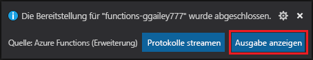
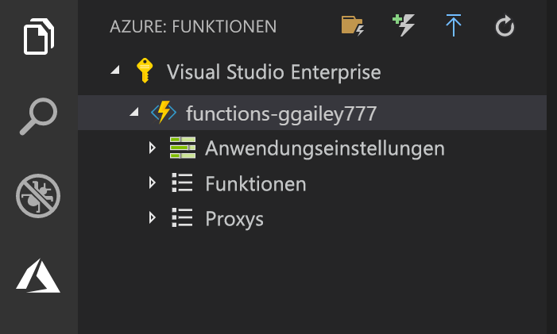

## Veröffentlichen des Projekts in Azure

Visual Studio Code ermöglicht die Veröffentlichung Ihres Funktionsprojekts direkt in Azure. Bei diesem Vorgang erstellen Sie eine Funktions-App und zugehörige Ressourcen in Ihrem Azure-Abonnement. Die Funktions-App bietet einen Ausführungskontext für Ihre Funktionen. Das Projekt wird verpackt und in der neuen Funktions-App in Ihrem Azure-Abonnement bereitgestellt. 

In diesem Artikel wird davon ausgegangen, dass Sie eine neue Funktions-App erstellen. Beim Veröffentlichen in einer vorhandenen Funktions-App wird der Inhalt dieser App in Azure überschrieben.

1. Wählen Sie im Bereich **Azure: Funktionen** das Symbol für die Bereitstellung in der Funktions-App aus.

    

1. Wählen Sie den Projektordner aus, bei dem es sich um Ihren aktuellen Arbeitsbereich handelt.

1. Wählen Sie bei mehreren Abonnements das aus, in dem Ihre Funktions-App gehostet werden soll. Wählen Sie anschließend **+ Create New Function App** (+ Neue Funktions-App erstellen) aus.

1. Geben Sie einen global eindeutigen Namen ein, der Ihre Funktions-App identifiziert, und drücken Sie die EINGABETASTE. Gültige Zeichen für den Namen einer Funktions-App sind `a-z`, `0-9` und `-`.

1. Wählen Sie **+ Neue Ressourcengruppe erstellen** aus, geben Sie einen Ressourcengruppennamen wie `myResourceGroup` ein, und drücken Sie die EINGABETASTE. Sie können auch eine vorhandene Ressourcengruppe verwenden.

1. Wählen Sie **+ Neues Speicherkonto erstellen** aus, geben Sie einen global eindeutigen Namen für das neue Speicherkonto ein, das von Ihrer Funktions-App verwendet wird, und drücken Sie die EINGABETASTE. Speicherkontonamen müssen zwischen 3 und 24 Zeichen lang sein und dürfen nur Zahlen und Kleinbuchstaben enthalten. Sie können außerdem ein vorhandenes Konto verwenden.

1. Wählen Sie einen Standort in einer [Region](https://azure.microsoft.com/regions/) in Ihrer Nähe oder in der Nähe anderer Dienste aus, auf die Ihre Funktionen zugreifen.

    Mit der Erstellung der Funktions-App wird nach dem Festlegen des Standorts begonnen. Nach der Erstellung der Funktions-App wird eine Benachrichtigung angezeigt, und das Bereitstellungspaket wird angewendet.

1. Wählen Sie in den Benachrichtigungen die Option **View Output** (Ausgabe anzeigen) aus, um die Erstellungs- und Bereitstellungsergebnisse (auch für die von Ihnen erstellten Azure-Ressourcen) anzuzeigen.

    

1. Notieren Sie sich die URL der neuen Funktions-App in Azure. Sie verwenden sie zum Testen der Funktion nach der Veröffentlichung des Projekts in Azure.

    

1. Im Bereich **Azure: Funktionen** wird die neue Funktions-App unter Ihrem Abonnement angezeigt. Erweitern Sie diese Knoten, sehen Sie die Funktionen in der Funktions-App sowie Anwendungseinstellungen und Funktionsproxys.

    

    Halten Sie im Knoten der Funktions-App STRG gedrückt, und klicken Sie (mit der rechten Maustaste), um verschiedene Verwaltungs- und Konfigurationsaufgaben für die Funktions-App in Azure auszuführen. Sie können die Funktions-App auch im Azure-Portal anzeigen.
