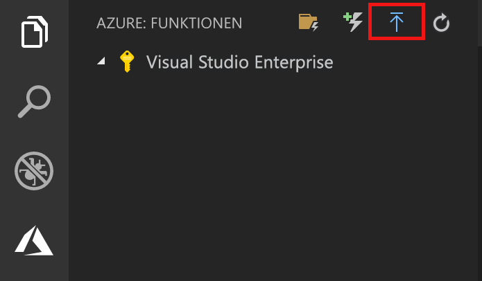

## Veröffentlichen des Projekts in Azure

Visual Studio Code ermöglicht die Veröffentlichung Ihres Funktionsprojekts direkt in Azure. Bei diesem Vorgang erstellen Sie eine Funktions-App und zugehörige Ressourcen in Ihrem Azure-Abonnement. Die Funktions-App bietet einen Ausführungskontext für Ihre Funktionen. Das Projekt wird verpackt und in der neuen Funktions-App in Ihrem Azure-Abonnement bereitgestellt.

In diesem Artikel wird davon ausgegangen, dass Sie eine neue Funktions-App erstellen. 

> [!IMPORTANT]
> Beim Veröffentlichen in einer vorhandenen Funktions-App wird der Inhalt dieser App in Azure überschrieben.

1. Wählen Sie im Bereich **Azure:  Funktionen** das Symbol für die Bereitstellung in der Funktions-App aus.

    

1. Wenn Sie nicht angemeldet sind, werden Sie aufgefordert, **sich bei Azure anzumelden**. Sie können auch ein **kostenloses Azure-Konto erstellen**. Nach der erfolgreichen Anmeldung aus dem Browser wechseln Sie zurück zu Visual Studio Code. 

1. Wenn Sie mehrere Abonnements besitzen, **wählen Sie ein Abonnement für die Funktions-App aus**, und wählen Sie dann **+ Neue Funktions-App erstellen** aus.

1. Geben Sie einen global eindeutigen Namen ein, der Ihre Funktions-App identifiziert, und drücken Sie die EINGABETASTE. Gültige Zeichen für den Namen einer Funktions-App sind `a-z`, `0-9` und `-`.

1. Wählen Sie **+ Neue Ressourcengruppe erstellen** aus, geben Sie einen Ressourcengruppennamen wie `myResourceGroup` ein, und drücken Sie die EINGABETASTE. Sie können auch eine vorhandene Ressourcengruppe verwenden.

1. Wählen Sie **+ Neues Speicherkonto erstellen** aus, geben Sie einen global eindeutigen Namen für das neue Speicherkonto ein, das von Ihrer Funktions-App verwendet wird, und drücken Sie die EINGABETASTE. Speicherkontonamen müssen zwischen 3 und 24 Zeichen lang sein und dürfen nur Zahlen und Kleinbuchstaben enthalten. Sie können außerdem ein vorhandenes Konto verwenden.

1. Wählen Sie einen Standort in einer [Region](https://azure.microsoft.com/regions/) in Ihrer Nähe oder in der Nähe anderer Dienste aus, auf die Ihre Funktionen zugreifen.

    Wenn Sie die EINGABETASTE drücken, werden die folgenden Azure-Ressourcen in Ihrem Abonnement erstellt:

    * **[Ressourcengruppe](../articles/azure-resource-manager/resource-group-overview.md)** : Enthält alle erstellten Azure-Ressourcen. Der Name basiert auf dem Namen Ihrer Funktions-App.
    * **[Speicherkonto](../articles/storage/common/storage-quickstart-create-account.md)** : Ein Standardspeicherkonto wird mit einem eindeutigen Namen erstellt, der auf dem Namen Ihrer Funktions-App basiert.
    * **[Hostingplan](../articles/azure-functions/functions-scale.md)** : Ein Verbrauchsplan wird in der Region „USA, Westen“ erstellt, um Ihre serverlose Funktions-App zu hosten.
    * **Funktions-App**: Ihr Projekt wird in dieser neuen Funktions-App bereitgestellt, wo es auch ausgeführt wird.

    Nach der Erstellung der Funktions-App wird eine Benachrichtigung angezeigt, und das Bereitstellungspaket wird angewendet. Wählen Sie in dieser Benachrichtigungen **Ausgabe anzeigen** aus, um die Erstellungs- und Bereitstellungsergebnisse (auch für die von Ihnen erstellten Azure-Ressourcen) anzuzeigen.

1. Zurück im Bereich **Azure:  Funktionen** erweitern Sie die neue Funktions-App unter Ihrem Abonnement. Erweitern Sie **Funktionen**, klicken Sie mit der rechten Maustaste auf **HttpTrigger**, und wählen Sie dann **Funktions-URL kopieren** aus.

    
