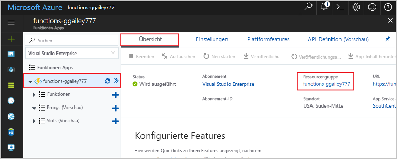

Andere Schnellstarts in dieser Auflistung bauen auf diesem Schnellstart. Wenn Sie weiterhin auf nachfolgende Schnellstarts oder die Lernprogramme verwenden möchten, führen Sie Bereinigen von Ressourcen erstellt, die in diesem Schnellstart nicht gestartet werden. 

Wenn Sie nicht beabsichtigen, um den Vorgang fortzusetzen, klicken Sie auf die **Ressourcengruppe** für die Funktion-app in das Portal, und klicken Sie dann auf **löschen**. 

