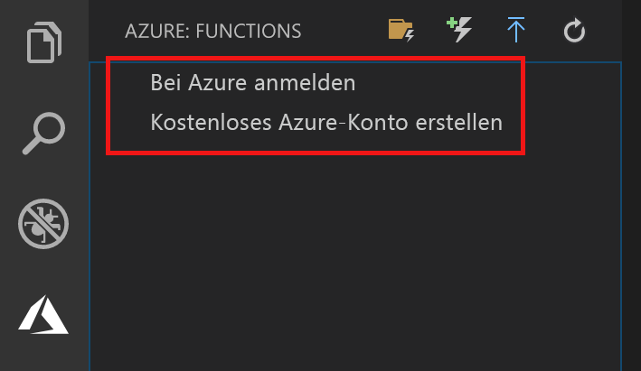

## Anmelden bei Azure

Bevor Sie Ihre App veröffentlichen können, müssen Sie sich bei Azure anmelden.

1. Wählen Sie im Bereich **Azure: Funktionen** die Option **Sign in to Azure...** (Bei Azure anmelden...) aus. Falls Sie über kein Konto verfügen, können Sie ein **kostenloses Azure-Konto erstellen**.

    

1. Wählen Sie bei entsprechender Aufforderung **Kopieren und öffnen** aus, oder kopieren Sie den angezeigten Code, und öffnen Sie <https://aka.ms/devicelogin> im Browser.

1. Fügen Sie den kopierten Code auf der Seite **Device Login** (Geräteanmeldung) ein, überprüfen Sie die Anmeldung für Visual Studio Code, und wählen Sie dann **Weiter** aus.  

1. Melden Sie sich mit den Anmeldeinformationen für Ihr Azure-Konto an. Wenn Sie sich erfolgreich angemeldet haben, können Sie den Browser schließen.
