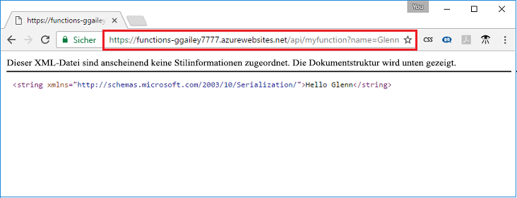

## <a name="test"></a>Testen der Funktion

Verwenden Sie cURL, um die bereitgestellte Funktion auf einem Mac oder Linux-Computer oder mithilfe von Bash unter Windows zu testen. Führen Sie den folgenden cURL-Befehl aus, und ersetzen Sie dabei den Platzhalter `<app_name>` mit dem Namen der Funktionen-App. Fügen Sie die Abfragezeichenfolge `&name=<yourname>` an die URL an.

```bash
curl https://<app_name>.azurewebsites.net/api/MyHttpTrigger?name=<yourname>
```  

  

Wenn cURL in der Befehlszeile nicht zur Verfügung steht, geben Sie dieselbe URL in die Adresse des Webbrowsers ein. Ersetzen Sie erneut den Platzhalter `<app_name>` durch den Namen der Funktionen-App, fügen Sie die Abfragezeichenfolge `&name=<yourname>` an die URL an, und führen Sie die Anforderung aus.

    https://<app_name>.azurewebsites.net/api/MyHttpTrigger?name=<yourname>
   
  
