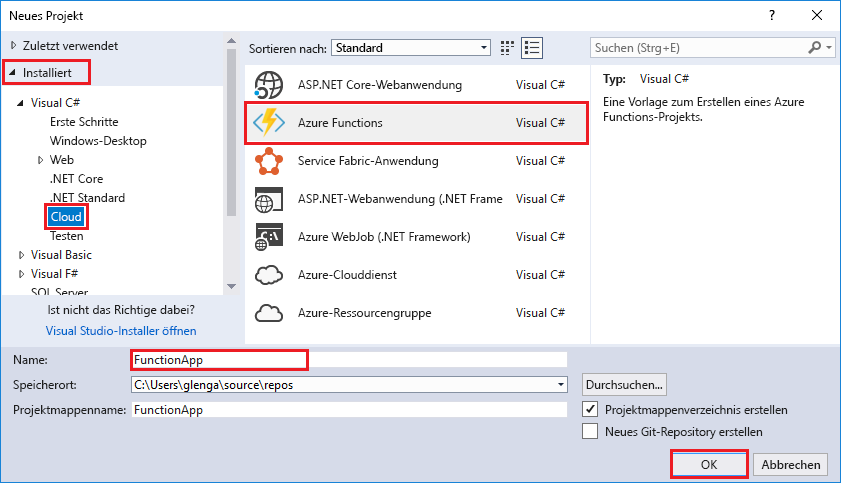
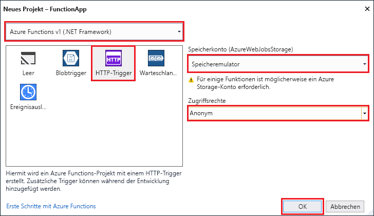

Mit der Azure Functions-Projektvorlage in Visual Studio wird ein Projekt erstellt, das in einer Funktions-App in Azure veröffentlicht werden kann. Sie können mit einer Funktionen-App Funktionen zu logischen Einheiten gruppieren, um die Verwaltung, Bereitstellung und Freigabe von Ressourcen zu ermöglichen.

1. Wählen Sie in Visual Studio im Menü **Datei** die Optionen **Neu** > **Projekt**.

2. Wählen Sie im Dialogfeld **Neues Projekt** die Option **Installiert**, erweitern Sie **Visual C#** > **Cloud**, und wählen Sie **Azure Functions** aus. Geben Sie unter **Name** einen Namen für Ihr Projekt ein, und klicken Sie auf **OK**. Der Name der Funktions-App muss als C#-Namespace gültig sein, verwenden Sie daher keine Unterstriche, Bindestriche oder andere nicht alphanumerische Zeichen.

    

3. Verwenden Sie die Einstellungen, die in der Tabelle unter der Abbildung angegeben sind.

     

    | Einstellung      | Empfohlener Wert  | BESCHREIBUNG                      |
    | ------------ |  ------- |----------------------------------------- |
    | **Version** | Azure Functions v1  (.NET Framework) | Es wird ein Funktionsprojekt erstellt, für das Version 1 der Runtime von Azure Functions verwendet wird. Version 2 der Runtime, für die .NET Core unterstützt wird, befindet sich derzeit in der Vorschauphase. Weitere Informationen finden Sie unter [Einstellen von Runtimeversionen von Azure Functions als Ziel](../articles/azure-functions/functions-versions.md).   |
    | **Vorlage** | HTTP-Trigger | Es wird eine Funktion erstellt, die mit einer HTTP-Anforderung ausgelöst wird. |
    | **Speicherkonto**  | Speicheremulator | Für einen HTTP-Trigger wird die Storage-Kontoverbindung nicht verwendet. Für alle anderen Triggertypen ist eine gültige Speicherkonto-Verbindungszeichenfolge erforderlich. |
    | **Zugriffsrechte** | Anonym | Die erstellte Funktion kann von jedem Client ausgelöst werden, ohne dass ein Schlüssel angegeben werden muss. Diese Autorisierungseinstellung erleichtert Ihnen das Testen Ihrer neuen Funktion. Weitere Informationen zu Schlüsseln und zur Autorisierung finden Sie unter [Autorisierungsschlüssel](../articles/azure-functions/functions-bindings-http-webhook.md#authorization-keys) im Artikel [HTTP- und Webhookbindungen in Azure Functions](../articles/azure-functions/functions-bindings-http-webhook.md). |
4. Klicken Sie auf **OK**, um das Funktionsprojekt und die per HTTP ausgelöste Funktion zu erstellen.

