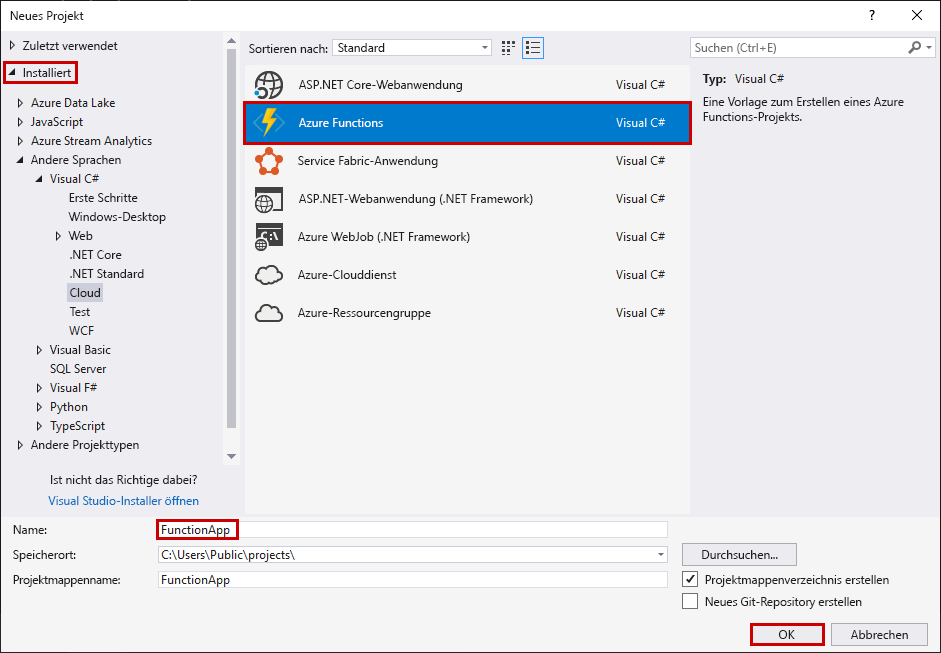
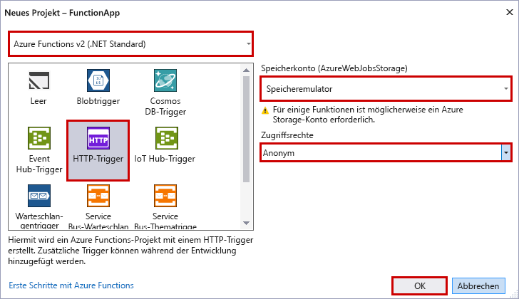

Mit der Azure Functions-Projektvorlage in Visual Studio wird ein Projekt erstellt, das in einer Funktions-App in Azure veröffentlicht werden kann. Sie können mit einer Funktions-App Funktionen zu logischen Einheiten gruppieren, um die Verwaltung, Bereitstellung und Freigabe von Ressourcen zu ermöglichen.

1. Wählen Sie in Visual Studio im Menü **Datei** die Optionen **Neu** > **Projekt** aus.

2. Wählen Sie im Dialogfeld **Neues Projekt** die Optionen **Installiert** > **Visual C#** > **Cloud** > **Azure Functions** aus. Geben Sie einen Namen für Ihr Projekt ein, und wählen Sie **OK** aus. Der Name der Funktions-App muss als C#-Namespace gültig sein, verwenden Sie daher keine Unterstriche, Bindestriche oder andere nicht alphanumerische Zeichen.

    

3. Verwenden Sie die Einstellungen, die in der Tabelle unter der Abbildung angegeben sind.

     

    | Einstellung      | Empfohlener Wert  | BESCHREIBUNG                      |
    | ------------ |  ------- |----------------------------------------- |
    | **Version** | Azure Functions 2.x  (.NET Core) | Mit dieser Einstellung wird ein Funktionsprojekt mit Version 2.x der Runtime von Azure Functions erstellt, die .NET Core unterstützt. Azure Functions 1.x unterstützt .NET Framework. Weitere Informationen finden Sie unter [Einstellen von Runtimeversionen von Azure Functions als Ziel](../articles/azure-functions/functions-versions.md).   |
    | **Vorlage** | HTTP-Trigger | Mit dieser Einstellung wird eine Funktion erstellt, die mit einer HTTP-Anforderung ausgelöst wird. |
    | **Speicherkonto**  | Speicheremulator | Für einen HTTP-Trigger wird die Azure Storage-Kontoverbindung nicht verwendet. Für alle anderen Triggertypen ist eine gültige Speicherkonto-Verbindungszeichenfolge erforderlich. |
    | **Zugriffsrechte** | Anonym | Die erstellte Funktion kann von jedem Client ausgelöst werden, ohne dass ein Schlüssel angegeben werden muss. Diese Autorisierungseinstellung erleichtert Ihnen das Testen Ihrer neuen Funktion. Weitere Informationen zu Schlüsseln und zur Autorisierung finden Sie unter [Autorisierungsschlüssel](../articles/azure-functions/functions-bindings-http-webhook.md#authorization-keys) im Artikel [HTTP- und Webhookbindungen in Azure Functions](../articles/azure-functions/functions-bindings-http-webhook.md). |
    
    > [!NOTE]
    > Stellen Sie sicher, dass Sie die **Zugriffsrechte** auf `Anonymous` festlegen. Bei Auswahl der Standardebene `Function` müssen Sie in Anforderungen für den Zugriff auf den Funktionsendpunkt den [Funktionsschlüssel](../articles/azure-functions/functions-bindings-http-webhook.md#authorization-keys) angeben.
    
4. Wählen Sie **OK** aus, um das Funktionsprojekt und die per HTTP ausgelöste Funktion zu erstellen.
