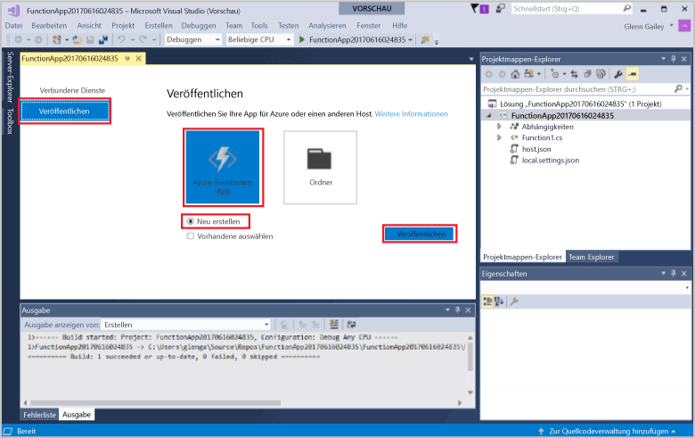
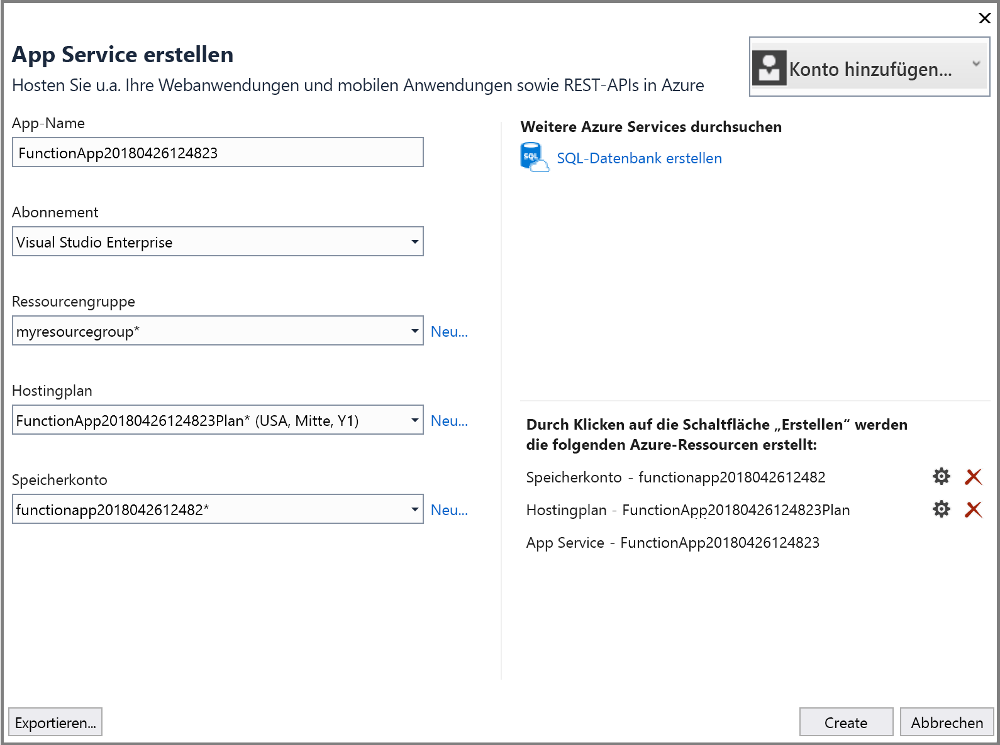
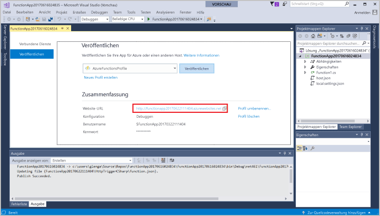

1. Klicken Sie im **Projektmappen-Explorer** mit der rechten Maustaste auf das Projekt, und wählen Sie **Veröffentlichen** aus. Wählen Sie **Neu erstellen** und dann **Veröffentlichen** aus. 

    

2. Wenn Sie Visual Studio noch nicht mit Ihrem Azure-Konto verbunden haben, wählen Sie **Konto hinzufügen** aus.  

3. Verwenden Sie im Dialogfeld **App Service erstellen** die in der folgenden Tabelle angegebenen **Hostingeinstellungen**: 

    

    | Einstellung      | Empfohlener Wert  | BESCHREIBUNG                                |
    | ------------ |  ------- | -------------------------------------------------- |
    | **App-Name** | Global eindeutiger Name | Name, der Ihre neue Funktions-App eindeutig identifiziert. |
    | **Abonnement** | Auswählen Ihres Abonnements | Das zu verwendende Azure-Abonnement. |
    | **[Ressourcengruppe](../articles/azure-resource-manager/resource-group-overview.md)** | myResourceGroup |  Name der Ressourcengruppe, in der die Funktions-App erstellt wird. Wählen Sie **Neu** aus, um eine neue Ressourcengruppe zu erstellen.|
    | **[App Service-Plan](../articles/azure-functions/functions-scale.md)** | Verbrauchsplan | Achten Sie darauf, den **Verbrauch** unter **Größe** auszuwählen, nachdem Sie auf **Neu** klicken, um einen neuen Tarif zu erstellen. Wählen Sie einen **Standort** in einer [Region](https://azure.microsoft.com/regions/) in Ihrer Nähe oder in der Nähe anderer Dienste aus, auf die Ihre Funktionen zugreifen.  |

    >[!NOTE]
    >Für die Functions-Runtime wird ein Azure Storage-Konto benötigt. Aus diesem Grund wird ein neues Azure Storage-Konto für Sie erstellt, wenn Sie eine Funktions-App erstellen.

4. Klicken Sie auf **Erstellen**, um eine Funktions-App und zugehörige Ressourcen in Azure mit diesen Einstellungen zu erstellen und Ihren Funktionsprojektcode bereitzustellen. 

5. Notieren Sie sich nach Abschluss der Bereitstellung den Wert der **Website-URL**, da es sich dabei um die Adresse Ihrer Funktions-App in Azure handelt.

    
