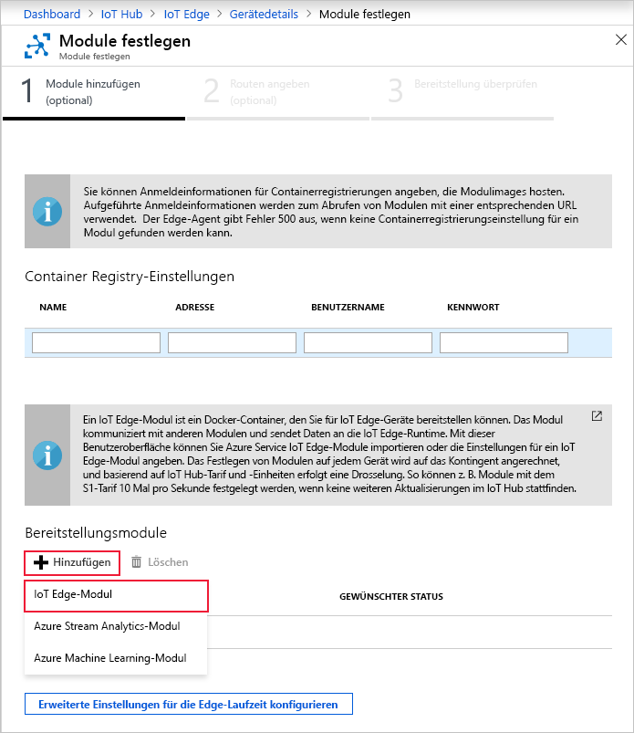

Eine der wichtigen Funktionen von Azure IoT Edge ist die Möglichkeit, Module aus der Cloud auf IoT Edge-Geräten bereitzustellen. Ein IoT-Edge-Modul ist ein ausführbares Paket, das als Container implementiert wird. In diesem Abschnitt stellen Sie ein Modul bereit, das Telemetrie für das simulierte Gerät generiert.

1. Navigieren Sie im Azure-Portal zu Ihrem IoT Hub.

2. Navigieren Sie zu **IoT Edge** (unter **Automatische Geräteverwaltung**), und wählen Sie Ihr IoT Edge-Gerät aus.

3. Wählen Sie **Module festlegen** aus. Im Portal wird ein Assistent mit drei Schritten geöffnet, der Sie durch das Hinzufügen von Modulen, Festlegen von Routen und Überprüfen der Bereitstellung führt. 

4. Suchen Sie im Schritt **Module hinzufügen** des Assistenten nach dem Abschnitt **Bereitstellungsmodule**. Klicken Sie auf **Hinzufügen** und anschließend auf **IoT Edge-Modul**.

   

5. Geben Sie im Feld **Name** die Zeichenfolge `tempSensor` ein.

6. Geben Sie im Feld **Image-URI** die Zeichenfolge `mcr.microsoft.com/azureiotedge-simulated-temperature-sensor:1.0` ein.

7. Behalten Sie die restlichen Einstellungen unverändert bei, und wählen Sie **Speichern** aus.

   

8. Sie befinden sich nun wieder im ersten Schritt des Assistenten. Klicken Sie auf **Weiter**.

9. Im Schritt **Routen angeben** des Assistenten sollten Sie über eine Standardroute verfügen, über die alle Nachrichten von allen Modulen an IoT Hub gesendet werden. Ist das nicht der Fall, können Sie den folgenden Code eingeben und dann **Weiter** auswählen.

   ```json
   {
       "routes": {
           "route": "FROM /messages/* INTO $upstream"
       }
   }
   ```

10. Klicken Sie im Schritt **Bereitstellung überprüfen** des Assistenten auf **Senden**.

11. Kehren Sie zur Seite mit Gerätedetails zurück, und wählen Sie **Aktualisieren** aus. Zusätzlich zum edgeAgent-Modul, das beim ersten Starten des Diensts erstellt wurde, sollte ein weiteres Runtimemodul mit dem Namen **edgeHub** angezeigt werden, und das Modul **tempSensor** sollte aufgeführt sein.

   Es kann einige Minuten dauern, bis die neuen Module angezeigt werden. Das IoT Edge-Gerät muss die neuen Bereitstellungsinformationen aus der Cloud abrufen, die Container starten und dann seinen neuen Status an IoT Hub zurückmelden. 

   
